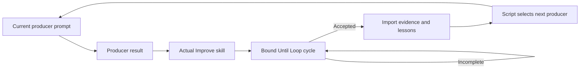
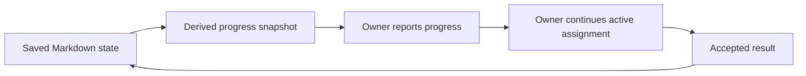
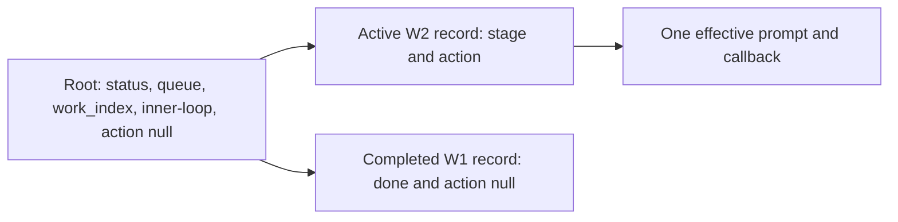

# Navigator execution mode

Navigator protocol 3 is the default for new ShipLoop runs. It is a small,
script-owned graph that returns exactly one current owner: a producer step or
the selected actual Improve skill for that producer. ShipLoop's `state.md`
persists SDLC traversal. Improve follows the Until Loop runtime bound by its
selected card and owns review iterations, child state, and convergence. The
script imports one matching child result before it selects another producer.

A fresh opt-in protocol 4 run uses the same stage graph and adds
[experiment-informed planning](planning-experiments.md). Its initial Plan Improve
child can return a stopped, evidenced upstream-reconciliation need. The parent
archives it through `improve-reconcile`, records a non-success result, and reruns
the fixed suffix from discovery, research, spec, or test strategy. This is the
only added pre-dispatch edge; successful Improve import keeps its normal gate.
V1–V3 saved states keep their existing shapes and behavior.



The 34 producer stages are fixed by the v3 catalog: prelude `intake`,
`discovery`, `research`, `spec`, `test-strategy`, `plan`, `prepare`; inner
`select-work`, `step-plan`, `test-spec`, `baseline`, `test-author`, `test-red`,
`implement`, `test-green`, `test-refine`, `regression`, `document`,
`skill-assess`, `skill-validate`, `static-checks`, `verify`, `integrate`,
`integration-verify`, `carry-forward`; and outer `system-test-author`,
`system-test`, `product-acceptance`, `release-plan`, `release-check`, `release`,
`release-verify`, `operations`, `handoff`. Every instantiated producer runs the
actual Improve skill afterward, including a justified N/A output. No v3 stage
contains a copied Improve policy or independently counts review passes.

The graph describes order, not a substitute for engineering judgment. The prompt
does not dictate exact prose, a check-manifest layout, a byte comparison, or a
specific command. It requires a substantive producer result and then an actual
Improve child before a success edge can release that output. A meaningful RED is
successful evidence for its test-control step; it never authorizes production
edits before `implement`. A blocked Improve child leaves its parent incomplete.

Apply the [stage readiness and completion map](testing-and-documentation.md#stage-readiness-and-completion)
to the current artifact. Definition fixes criteria; test planning allocates
surface/phase and prerequisites; test authoring supplies checks; verification
records actual outcomes. `product-acceptance` assesses due pre-release evidence
and retains pending release verification. `release-verify` observes the required
post-release consumer behavior. Carry the same clause/case locators through
Improve and recovery; these duties add neither graph nodes nor semantic counters.

Sections describing v1/v2, managed, and legacy execution are compatibility
references. Their `*-improve` graph nodes, embedded policy campaigns, and
protocol-2 defaults do not apply to v3. Shared recovery, domain duties and
authority rules still apply; this v3 handoff governs their execution.

## Run it

Resolve the installed or checkout-local `scripts/shiploop` path as `CLI`, and
use absolute repository and run-directory paths.

Before any stage duty, choose exactly one entry route: `workspace start` for
new Git-backed work, direct `init` for an explicitly selected in-place/non-Git
run, or `next` for an existing run. For an existing run, verify the
printed original goal and repository identity before acting. Do not replace a
missing or relocated run with a new one.

A later feature is a different request: preserve the earlier run, select a fresh
external `--workspace-root` (or empty `--run-dir` for direct mode), and initialize
with the new prompt verbatim against the existing product repo. Changed
prompt/repository re-entry is refused, while
matching retries do not reopen completed work. Every packet links the project
`SHIPLOOP.md` index and [cross-run knowledge policy](project-knowledge.md).
Reuse revalidated environment facts and decisions in discovery/planning, not
the old prompt, queue or action state. Maintain lasting knowledge in repository
documents at document/carry-forward/handoff. Shared knowledge is context, not
a second source of traversal state.

```sh
python3 "$CLI" workspace start --repo="$REPO" --workspace-root="$WORKSPACE_ROOT" --prompt='requested outcome'
# Explicit direct/non-Git mode, without automatic workspace-return protection:
python3 "$CLI" init --repo="$REPO" --run-dir="$RUN_DIR" --prompt='requested outcome'
# Optional explicit selected actual Improve card for a new v3 run:
python3 "$CLI" init --repo="$REPO" --run-dir="$RUN_DIR" --improve-skill="$IMPROVE_SKILL" --prompt='requested outcome'
# Opt a new v3/v4 run in to Ask-Agent delegation (the default is inline):
python3 "$CLI" workspace start --repo="$REPO" --workspace-root="$WORKSPACE_ROOT" --delegation=ask-agent --prompt='requested outcome'
# Change an existing v3/v4 run's delegation for its future assignments:
python3 "$CLI" delegation --run-dir="$RUN_DIR" --set=inline
# Compatibility only; normal new runs use v3 above.
python3 "$CLI" init --repo="$REPO" --run-dir="$RUN_DIR" --execution-mode=navigator-v2 --prompt='v2 fixture outcome'
python3 "$CLI" init --repo="$REPO" --run-dir="$RUN_DIR" --execution-mode=navigator-v1 --prompt='fixture outcome'
python3 "$CLI" next --run-dir="$RUN_DIR"
python3 "$CLI" done --run-dir="$RUN_DIR" --action="$ACTION" --result="$RESULT"
```

`workspace start` and direct `init` return a v3 `intake` producer packet for a
new run. `next` rereads the saved effective owner after a context reset; it does
not select or persist a successor. A v3 producer `done` records the result then
parks the parent at `active_improve`; it does not advance directly. When a skill
was not selected at initialization, the checkpoint's packet supplies the exact
`improve-bind --action ... --skill-card ...` command. Follow that command and
the selected card's bound runtime rather than guessing an adapter. Only an
accepted matching completion passed to `improve-complete` imports the child and
releases the next graph edge.
An explicit relative `--improve-skill` locator is made absolute at initialization,
so a later shell cwd cannot change which card the checkpoint selects.

A v3/v4 run records its execution `delegation`. `workspace start` and direct
`init` record `inline` for a new run unless `--delegation=ask-agent` is passed.
Under `inline`, this conversation executes every producer and the whole Improve
invocation itself, and `implement` runs reviewed steps directly without a chain.
Under the opt-in `ask-agent` route, INNER producers and Improve prefer native
fresh workers and `implement` can bind a [parallel or serial chain](parallel-chain.md#parallel-implementation-chains).
A saved run without the setting keeps its recorded ask-agent behaviour; it is
never silently migrated. V1/v2, managed and legacy runs refuse `--delegation`.
Retrying `init` or `workspace start` cannot change the setting. Use the
`delegation` command instead. It applies from the next issued action: the action pending when you switch, including its Improve checkpoint, keeps the route it was issued with
(the packet prints a `Delegation change:` line), and is refused only on a halted
or done run. Setting the recorded value is a no-op. The
setting selects packet text; no script verifies who executed an assignment, and
`improve-complete` imports a child the same way on both routes.

Every packet prints the shared
[reference handoff policy](project-knowledge.md#reference-handoffs-and-destinations).
Use its explicit package/repository/run/child roots for requirement and test
locators. Before invoking actual Improve, the host must retain relevant producer
and work-item references in the child's existing contract prose and review notes;
the parent packet alone does not populate that contract. Relevant planning
packets also select the [Backchain adaptation](backchain-planning.md#navigator-planning).

For the current ephemeral adapter, carry those constraints and locators into
frozen `context`, with the exact parent binding line in `context.request` and a
fresh `handoff` on each `done`. Save complete raw runtime responses at the
per-action `.shiploop-improve/<run-id>/<action>/packet.json` path printed by the
parent. An active receipt supplies the exact read-only `next_argv`; a complete
receipt survives temporary child state deletion and can be imported without
another review. Missing or stopped child receipts leave the parent incomplete.
The host never creates a replacement child to repair lost terminal output. A
known stopped receipt is different: the Improve packet prints a restart route
that archives it as `packet.stopped-<UTC timestamp>.json` (and `reviews/` as
`reviews.stopped-<same timestamp>`) and starts a new child with the same binding line once the blocker is resolved or the user authorizes
continuing. A pause keeps the child active and is never reported as `cancelled`.
See [the current runtime binding](../README.md#current-improve-and-until-loop-binding)
for the transition example, legacy boundary and validation limits.

The retained v2 result example below applies only to a v2 packet:

````markdown
```shiploop-state
{"outcome":"done","summary":"Current repository facts and scope are recorded.","evidence_refs":["notes/A-INTAKE-001.md"]}
```
````

The packet's Current node and Action identify the assignment. Its Last accepted
transition is historical context and does not replace the current action.

## Recover one existing run

Active v3/v4 INNER packets begin with a context prefix selected by the run's
delegation. Paused, blocked, halted and completed packets do not carry it.

Under `delegation: inline`, the default for new runs, the `select-work` producer
packet begins with **Clear and then execute the prompt.** then `Delegation: inline.`
It opens a work item and is that item's only INNER context boundary. Clear once
there: use an actual callable host reset with continuation if the host has one,
then run the Recovery command; otherwise follow the
[pause and manual handoff](#packet-only-context-boundary). A conversation that
began from that reset or recovery is already fresh and does not clear again
when the prefix repeats. Every other INNER producer packet of the item begins
with **Continue in this context and execute the prompt.** Execute it in this
conversation without clearing, pausing for a clear or delegating. This
conversation is the only writer and alone submits ShipLoop callbacks. After an
unplanned reset or lost context, run the Recovery command and continue from the
reprinted packet. `implement` executes a reviewed multi-step plan directly, one
step at a time in dependency order, in the execution checkout. It binds no
chain and uses no Ask Agent, native worker or Plan Dispatcher; `step-plan`
records ordered steps with dependencies, readiness, completion criteria and
checks rather than a dispatcher execution graph.

Under the opt-in `delegation: ask-agent` route, which also covers a saved run
without the setting, every active INNER producer packet begins with
**Clear and then execute the prompt.**
This is the serial execution instruction for the producer only.
For an `implement` producer, select the chain route first. During that producer,
its bound mode and executor take precedence: parallel chains keep their capacity and bypass this boundary;
explicit serial chains execute in the main context without spawning workers.
Do not wrap a chain in another worker. Both modes recover the existing attempt
rather than rerunning `start`. Serial chains use only a callable reset or the
manual handoff below; the [chain mode contract](parallel-chain.md#serial-execution-in-the-main-context)
remains authoritative. Chain precedence ends at producer completion. Improve follows
its own selected context and ownership policy even when the historical chain binding
remains. For other serial work where delegation is permitted,
save the recovery locators and prefer one native fresh worker at a time, without
inherited conversation. It needs the assignment's tools, the existing workspace
and a return route to the live parent. The parent supplies the current packet,
selected skill locators and necessary durable references, waits, verifies its
return and alone submits the ShipLoop callback. Keep one candidate writer and
collect or confirm an existing owner stopped before replacement. Apply the
boundary once per assignment; an already-fresh worker does not clear or delegate
again because the packet repeats.

Active INNER Improve packets never clear the invoking parent. Under
`delegation: inline` they begin with **Keep the invoking parent alive and run
this Improve invocation inline.** The parent conversation runs the selected
Improve card's ShipLoop v3/v4 whole-skill subcall itself, in the exact Child
workspace. It does not hand the invocation to Ask Agent, a native worker or an
extra worktree and writes no `host-owner.md`. It runs the reviews and checks in
this conversation too and starts no reviewer, test-runner or executor agent
unless the user asked for independent review.
Its review iterations share this context. Save each raw start, next and done
packet to the printed receipt, the start packet before any review work. Put the
binding line alone and first in frozen `context.request`. Only after the
terminal packet is saved, write the completion evidence and run the parent
return and `improve-complete`. A later user decision applies from the next
review iteration and is recorded in the review notes and handoff; the frozen
launch context stays unchanged. Recover an existing child from its receipt's
exact `next_argv`; start another runtime only through the stopped-child restart
route. PRELUDE and
OUTER Improve packets carry the same runtime lines without the prefix.

Under `delegation: ask-agent`, INNER Improve packets instead begin with **Keep
the invoking parent alive and follow Improve's selected context ownership.** The
fresh-context boundary belongs to the whole Improve executor invocation, not its
invoking parent or individual review iterations. The parent retains collection,
verification and its exact continuation. A parent reset or manual handoff does
not satisfy that executor boundary. Recover the existing child and establish its
owner's stopped status before replacement. If required fresh execution is
unavailable, keep the action pending; same-context execution is allowed only when
the selected policy permits it and separate context was not explicitly required.
Both routes follow [Improve context ownership](improve-context.md).

Every navigator packet includes absolute CLI, repository, and run-directory
locators. It also prints `Recovery command:` followed by an exact shell-quoted
`next` command. Copy those locators and that command to host-owned durable
handoff material before transferring work or discarding context. The handoff is
a locator only: do not copy the current node, action ID, result path, status,
or an expected successor as another source of graph state.

A fresh host starts with the recorded recovery command, reads the reprinted
packet and only its relevant references, then performs that one current action.
The owner of the run submits the action-bound callback and consumes the packet
it returns. Under `delegation: ask-agent`, a delegated worker may do bounded
work under that packet, but does not initialize another ShipLoop run or advance
its parent's graph. The selected Improve owner follows its separately bound
Until Loop runtime.

### Packet-only context boundary

A returned packet can instruct the host agent to use an available native tool;
it cannot execute a host command by printing its name. `/clear` embedded in tool
output is text, not a reset. In a
[live Claude Code ledger study](https://github.com/whichguy/skill-craft/blob/main/docs/shiploop-clear-ledger-experiments-2026-09-21.md),
packet text reset the context in 0/2 cases, while an external host clear did in
3/3 resets.

Under `delegation: inline`, the boundary is taken once per work item, at its
`select-work` packet, in the same conversation. Use a context clear only when a
real callable reset and continuation route are exposed. When none is usable,
use the existing pause command and display the saved operator handoff. The user
clears through the host or opens a fresh context, runs the exact Recovery
command, then follows the printed Resume command. Recovery with `next` only
reads state and does not unpause. Keep the action pending until this boundary is
satisfied; never simulate a reset or shell-launch another model. The same
callable-reset or pause-and-handoff route serves a serial chain, or any
ask-agent assignment that must stay in the conversation.

Under `delegation: ask-agent`, each INNER producer assignment takes the
boundary. Claude documents both
[sequential subagents](https://code.claude.com/docs/en/sub-agents#chain-subagents)
and [fresh context without parent history for non-fork subagents](https://code.claude.com/docs/en/sub-agents#what-loads-at-startup).
Where the assignment permits delegation, use a non-fork worker, such as a fresh
general-purpose agent, through the live tool schema. Select an equivalent
no-history mode on another host only when its
actual schema supports it. Wait for collection before advancing the serial run.
This keeps the worker's intermediate history out of the parent; it does not
erase the parent's conversation or guarantee lower total tokens. An inherited
conversation fork does not satisfy the boundary.

Packets keep long request/context fields, prior evidence lists and producer
results compact. An excerpt identifies the exact field in `state.md`; read the
complete required context there before acting or forming an Improve contract.
Saved values remain complete. An excerpt is neither a revised requirement nor
a structured result to submit. Short context remains inline. V3 packets also
name the existing reference sections relevant to the current stage; recover
applicable convention/decision locators and revalidate them for this item.

After an interruption, run `next`, inspect durable evidence and actual effects,
and reconcile work that may already have happened before deciding what remains.
If the reprinted packet is paused or blocked, resolve its stated condition and
use its printed `resume` command once. A halted or done packet remains stopped.
If the CLI, repository, or run path is unavailable or relocated, recover the
same run and verify its task/repository identity first; otherwise leave the
delivery incomplete. Never use `init` as a replacement for missing state.

The script neither preserves this host handoff nor launches/resets a model or
host process. The host must retain an accessible locator and run directory.

Every packet also links [early access readiness](research-loop.md#early-access-readiness),
including paused/blocked recovery. The host probes a concrete dependency safely,
raises a needed user sign-in promptly, and retains its non-secret request and
recheck condition in the existing notes. Follow the returned resume/callback
route after the response; do not count the response itself as verified access
or completed stage work. This adds guidance, not an authentication executor or
another graph/state schema.

The semantic result contract is small:

| Field | Meaning |
| --- | --- |
| `outcome` | `done`, `repeat`, or `blocked`; v3 outer steps also allow `replan` with new corrective work items. Planning results and the last carry-forward first wait for actual Improve; other results advance directly. The final disposition then determines the script-owned route. |
| `summary` | Concise statement of the current action’s real result. |
| `evidence_refs` | Optional safe references to source, test, note, or external-operation evidence. |
| `work_items` | Ordered `{id,title,context?}` items at `plan` before execution, at `carry-forward` for future-only work, or required new IDs for v3 outer `replan`. Legacy v1/v2 also accept them at `plan-improve`. |
| `choices.skill_required` | Legacy v1/v2 routing hint at `document`. V3 always visits `skill-assess` and `skill-validate`, including an evidence-backed N/A disposition. |
| `delivery_assessment` | Only for new v2 or v3 runs initialized with `--delivery-contract`: a full consumer-delivery contract/correction or bound observations, using the packet template. See [consumer delivery](consumer-delivery.md). |

After the v3 child has completed reviewing the attempt, `repeat` allocates another action at the same node, so the host can continue
with new information. `blocked` retains unfinished work; after the condition
is resolved, `resume` returns the same node. Neither is a successful advance.
Within the actual Improve child (or a legacy Improve node), normal review iterations continue internally. An explicit
`repeat` restarts the attempt; it never counts as a completed review or clean
pass. Each converged campaign submits one successful `done`.
Each new run begins with `W1`, titled from the original goal. A `plan` or
pre-execution `plan-improve` result can replace the pending plan with ordered
work items, while completed work-item records remain durable history; optional
`context` is host-written context, not script-inferred progress.

V3's plan template explicitly includes `work_items`. Return the complete ordered
queue when the plan has multiple implementation increments; a note alone does
not populate it. Omission remains compatible when the existing queue represents
the whole approved plan. The script visits queue order serially; `select-work`
revalidates the selected item's prerequisite evidence rather than selecting
among dependency-ready alternatives. Keep independent branches and file/resource
conflicts distinct from causal dependencies in the linked plan notes.

At `carry-forward`, omitting `work_items` preserves every future item. Supplying
it replaces the **entire future queue** after the current item; it does not append.
Read the full `state.md` field `work_items`, including pending contexts that the
packet's short queue summary omits. Include all still-required future work and
exclude current/completed items. An empty array removes all future work. Explain
removals, merges or approved supersession in the plan note; independent required
work cannot disappear just because no other item consumes it. During Improve,
`active_improve.seed_result.work_items` holds proposed changes, while `work_items`
still holds the accepted queue. Reconcile both against scope before revising the
producer's final result. These are guidance and existing replacement semantics,
not machine verification of semantic coverage or dependency readiness.

Results cannot set a successor, INNER stage, Improve phase, review count, or
another item's action. The one accepted action determines the next effective
cursor. A malformed duplicate owner or a stale/conflicting callback is rejected
without selecting another item.

## Progress reporting



Every packet, including paused, blocked, halted and done packets, includes a
read-only snapshot derived from the existing effective cursor, accepted history
and current work queue. It shows phase/run status, owner/current assignment,
recorded completed and pending stages for the current phase or item, completed
item counts/labels and queued items. Legacy v1/v2 also show conditional or skipped skill validation; v3 always visits its skill stages.
Only accepted `done` completes a stage; `repeat` and `blocked` do not. These
records are host declarations, not independent evidence of tests or external
effects. Workspace return/merge/push status still comes from the separate return
plan and receipt, not graph position.

The snapshot bounds item labels to three completed and three queued items with
omitted counts, short titles and a short blocking reason. Read `state.md` for
the full queue/history and actual evidence for execution claims. Before
`plan` and its child complete, the v3 queue is provisional. In legacy v1/v2,
this boundary is `plan-improve`, and the `document` result selects
skill validation: before it completes, validation is conditional; a result
without `skill_required: true` skips it. Skipped is not completed.

The owner gives a concise **Done / Current / Pending / Blocked** update at
start/recovery, each major completed step, queue changes or changed blockers.
Group adjacent short stages. During long actions or waits, follow the host's
update cadence with an actual observation, or the last known status and next
check. Avoid duplicate reports for every callback, unchanged poll or delegated
worker. This is communication guidance; the host chooses wording and timing.

Run to completion by default within the user's scope and existing authority.
Emit these reports as intermediate updates and immediately continue the active
packet's current owner without waiting for acknowledgement or asking whether to
continue. Do not end the turn merely because a milestone report was delivered.
Submit the exact callback and follow its returned packet, including a bound
Improve child; a producer's `done` or a child's completion does not finish the
whole run. Stop at run completion, an explicit user stop/pause, or a real blocker
that prevents further authorized work. Resolve recoverable conditions within
scope through the printed resume route; ask only for actually missing decisions,
authority, or access. Paused, blocked, halted and done packets retain their
existing boundaries. Reporting itself neither advances nor pauses the graph,
and ShipLoop cannot keep a host process alive or force another tool call.

For a legacy v2 example, after W1's accepted carry-forward and W2's accepted document result
with no skill validation selected, the next packet assigns W2 `verify`. A
synthetic user update could say: “Recorded done: W1 and W2 through documentation.
Current: W2 verification is assigned. Pending: W2 product review, integration,
carry-forward and six outer stages. Skill validation was skipped. No blocker
is recorded.” Add “The focused tests are running” only when the host has actually
started and observed that test process. A blocked packet instead reports the
condition and requires resume; a halted packet has unfinished work and no
runnable assignment.

Improve remains one host-owned campaign. Report observed findings, edits,
checks or review results within it as host-reported activity. Never infer its
internal phase, review count or convergence from the DAG. Likewise, do not infer
percent completion, elapsed execution or an ETA from a changing queue. Refresh
after acceptance; future stage labels are context, not additional prompts.

`report` uses the same escaped snapshot in its on-demand HTML output. Automatic
`report.html` persistence remains limited to done/halted runs; this change adds
no timer, dashboard refresh, state fields, progress file or traversal rules.

## One shared INNER graph and per-item records

The flat SDLC path from `select-work` (v3) or `step-plan` (v1/v2) through `carry-forward` is one shared INNER
graph, not a graph copy per work item. Root owns the run's global `status`,
`status_reason`, ordered queue, and `work_index`. While an item is active, root
is parked at `stage: inner-loop` with `action: null`; the active item's entry in
`inner_loops` exclusively owns the effective stage and action. Outside INNER
work, root exclusively owns both stage and action.



This compact state is illustrative rather than a complete persisted schema:

```json
{
  "navigator_protocol_version": 2,
  "execution_mode": "navigator",
  "status": "active",
  "stage": "inner-loop",
  "action": null,
  "work_index": 1,
  "work_items": [
    {"id": "W1", "title": "First approved change"},
    {"id": "W2", "title": "Second approved change"}
  ],
  "inner_loops": {
    "W1": {"stage": "done", "action": null},
    "W2": {
      "stage": "step-plan",
      "action": {"id": "W2-step-plan-1", "stage": "step-plan"}
    }
  }
}
```

No record exists for a future W3 until ShipLoop enters it. At an accepted W1
`carry-forward`, one locked transaction marks W1 `done`/`null`, advances the
selection, and creates W2 at `step-plan`; if W1 is final, it instead restores
root ownership at `system-test`. W1 remains retained after W2 becomes active.
Calling `next` after a context reset reprints W2's same effective action rather
than advancing it. An identical accepted W1 replay after W2 selection is
non-mutating; a conflicting or unknown old callback fails without changing W2.

`repeat` replaces only the active item's action while root remains active.
An accepted `blocked` result records the root blocker and a fresh pending action
for that item because its reported action is already accepted; no further
new completion is accepted until `resume`. An identical accepted replay remains
non-mutating. Pause/resume preserves the pending item action. Halt is terminal
at the root.

### Illustrative trace, not a recorded run

For a hypothetical request, “add an endpoint that returns the current account
balance,” `init` stores the request and sets the cursor to `intake`. The script
returns the `intake` prompt, which asks the host to establish scope, authority,
consumers, risks, and unknowns. The host might write a result whose outcome is
`done` and whose summary says that the target repository and unanswered account
authorization question were recorded. Only then does `done` move the cursor to
`discovery`; it does not accept a host-supplied `next_stage`. The prompt at
`discovery` then asks for current code, Git/worktree, instructions, consumers,
and local-skill facts. This is an example of the intended input → cursor →
prompt path, not evidence that any repository inspection occurred.

## Historical v2: embedded Improve nodes own their full campaign

This section applies only to retained v2 packets. V3 instead hands every
producer result to the selected actual Improve skill and never embeds this
campaign in the navigator prompt. `discovery`, `test-strategy`, `release-plan`,
`research-improve`, `spec-improve`, `plan-improve`, `step-plan-improve`,
`product-improve`, and `outer-improve` each invoke the packaged reusable
[Improve review policy](improve-review-policy.md). Each is one call-and-return
graph action. The campaign's work occurs under its assigned action; it does not
become DAG nodes, `inner_loops` records, child callbacks, or ShipLoop review
counters.

Discovery, test strategy, and release planning first produce their initial
candidate, then run their full Improve campaign **inside the same action before
its one completion**. Research, specification, overall planning, and step
planning retain their immediate dedicated Improve successor; do not wrap their
draft actions again. Intake remains scope/authority framing. These are prompt
duties on existing nodes, not new stages or a saved-run migration.

Review the actual stage artifact: discovery facts and consequential unknowns,
test cases and independent expected outcomes, or release prerequisites and
recovery/verification plans. A plan check need not execute future product tests,
and release-plan review must not perform the release. A justified non-applicable
release is itself a reviewable conclusion. An empty/new repo has no seven-commit
history to invent: disclose the absence and use current evidence. Discovery
review shares the existing investigation allowance; exhausting it with required
work unfinished is incomplete, not two clean passes.

The navigator’s binding is:

- Inspect the latest seven full Git commit messages in every cycle; inspect all
  available messages when fewer exist and state when no history exists.
- Keep a precise current candidate and adjacent-context scope. Materiality is
  semantic: a one-line bug can be material, while cosmetic work needs an impact
  assessment and is not automatically material.
- Write durable human-readable evidence under the run directory, such as
  `notes/<actionID>.md`, covering findings, classification, plan/no-change
  reason, checks, evidence, learnings, independent-review availability, and
  clean-review streak before and after. Candidate/source/baseline identity is a
  host-recorded descriptor, not a scripted hash gate.
- Commit authorized changes after their checks, without artificial empty
  commits. An explicit user no-commit direction overrides this default.
- Use a fresh independent reviewer when available; otherwise record that the
  pass was self-reviewed and its limitation. Schedule available independent
  review against the final candidate before convergence and record its actual
  scope. Later material edits invalidate affected review evidence; reconsider
  that scope and obtain another independent look when available.
- Execute review, history-informed planning, apply, checks, record, and assess
  cycles internally until the host judges two distinct consecutive
  trivial-only completed reviews with current checks and no open material
  finding. Then submit a single graph `done`. A blocker is incomplete.
- When failures or findings recur, record a testable diagnosis, a small check
  that distinguishes plausible causes, its observation, and the next action.
  Revisit the hypothesis or plan when retries add no evidence.

The reusable policy tells an owner that **splits** a review campaign into phases
to execute only its assigned phase and return to its owner. Navigator deliberately
assigns the complete campaign to one Improve node, so that split-phase
restriction does not divide this action. It preserves the existing
whole-campaign owner binding: it does not launch standalone Improve or
until-loop, make child-phase cursors, inspect ambient loop state, or add a
second convergence wrapper.

Any plan, code, test, documentation, or skill change made during an Improve
campaign refreshes the checks it affects. The result is still a host judgment;
the script neither counts reviews nor classifies materiality, runs Git/tests,
reads artifacts, verifies policy hashes, or issues certificates.

## SDLC responsibilities

Discovery and research use the [shared recursive-discovery policy](research-loop.md#recursive-discovery-and-experiments)
with its [navigator record and checkpoint binding](research-loop.md#navigator-execution-mode-adapter).
Product and outer Improve use it for consequential new environment findings.
Keep the eight-area evidence, reuse decisions, access/setup observations, and
remaining shared allowance in durable notes referenced by the generic result;
do not introduce compatibility schemas or child-phase callbacks.

The prelude establishes repository facts, research, specification, independent
expected outcomes, local test strategy, and prerequisite-aware planning before
implementation. `plan` uses Backchain-style reverse reasoning from outcomes to
suppliers and verification. `step-plan` preserves those prerequisites and test
cases at the local work-item boundary.

The [environment lifecycle policy](environment-lifecycle.md) supplies the
preparation/promotion binding. Discovery maps existing and intended workspace,
runtime and data boundaries. Planning places required preparation producers
before feature consumers, and any necessary staged-candidate producer before
its system tests. Each producer traverses the existing INNER graph; there is
no new outer-before navigator node or change to saved v1/v2 routing. The older
managed protocol retains its existing conditional `prepare` route.

Every packet links the policy and the canonical host-authored
`notes/environment-lifecycle.md`, including cold paused/blocked and outer
packets. The note is optional when irrelevant; it may reference adequate
existing repo documentation instead of copying it. Carry useful work-item
`context` and result `evidence_refs` too, but the canonical locator does not
depend on the last result retaining them. Inner work updates pending needs there;
system-test, outer Improve and release planning read it and reconcile actual
readiness with the remaining route. Script-enforced queue order is not proof
that the host included all prerequisites or actually prepared a remote target.

The inner path makes post-code quality visible: implementation is followed by
test-case refinement from the code actually written, executable test authoring,
documentation and reuse assessment, optional skill validation, then real
linters/tests with justified fixes and rechecks. `integrate` performs only
authorized Git/worktree work; it does not assert a merge, push, or deployment
from intent. `carry-forward` reviews broad scope, dependencies, future
system-test requirements, and skill obligations without pretending future work
is complete.

Delivery planning names the intended consumer and distinguishes source updates,
versioned releases, promotion, and access changes by their actual effects and
authority. A local-only decision must match the user's scope; missing access
does not turn a required update into N/A. Improve challenges the original user
outcome rather than treating the generated spec as its own authority.

`system-test` is for actual authorized integration, end-to-end, runtime, or
system-boundary checks, distinct from merely planning them. `outer-improve`
reviews the whole assembled product. `release-plan` establishes permission,
target, rollback, and checks; `release` may honestly be non-applicable;
`release-verify` examines the actual consumer/runtime boundary. `handoff`
reports source, test, integration, release, consumer status, and remaining
limits as facts.

For an opt-in delivery-contract run, the existing ledger also carries typed
requirements and separate source/update/identity/behavior observations. The
script checks declared coverage at the relevant boundary, while the host
executes and judges checks. Pre-update checks can be refreshed during outer
Improve/release planning. A material post-plan candidate or target change that
needs replanning blocks for direction; `repeat` does not jump backward.
An unchanged candidate with a completed update and blocked browser check resumes
verification without automatically re-uploading. See the [full contract and
recovery examples](consumer-delivery.md). No new stages or Improve counters apply.

| Owner | Duties |
| --- | --- |
| Script | Persist mode/cursor/action IDs, return the current prompt, validate the small result envelope, route `done`, retain `repeat`, and resume `blocked`. |
| Host agent | Inspect and interpret evidence; choose commands; plan and execute authorized work; write/refine tests; assess materiality, convergence, and applicability; record honest evidence. |
| User | Sets desired outcome, scope, permission, and overrides such as no commit or no release. |

### Agentic responsibilities inside existing stages

These are host-executed prompt duties within the existing graph. They add no
nodes, result fields, scripted evidence validators, or required subagents.

#### Project implementation conventions

Discover practices early, select them in planning, and revalidate the relevant
subset for each work item. These are ordinary host judgments within the existing
stages; no conventions schema, extra graph node or new Improve campaign applies.

- **Discovery/research:** identify product purpose and behavior to preserve,
  supported runtime/dependency versions, canonical code/test examples, relevant
  MCP/API contracts and reusable skills. Cite current sources and versions where
  material. Distinguish binding requirements from observed practice and proposals.
  Requirements come from current user/repository instructions and verified
  contracts; historical code and tool descriptions are not automatic authority.
- **Specification:** preserve applicable binding constraints, such as runtime
  compatibility and public interfaces, while defining the requested behavior.
  A discovered default does not become a new requirement merely by being noted.
- **Overall plan:** select applicable conventions, their scope/rationale, useful
  examples and verification commands. Retain one concise section in an appropriate
  existing project document or durable plan note. Include its locator in plan
  `evidence_refs` and applicable work-item `context`; keep context to a short
  locator/decision summary, not a copied manual. Preserve locators on queue edits.
- **Inner planning and implementation:** read that subset and check changed
  assumptions. If a locator is absent or inaccessible, recover it from accepted
  discovery/plan records and canonical sources. Use targeted discovery for stale
  or conflicting facts; block only an unresolved prerequisite for dependent work.
  Record justified departures, rationale and checks. Pass the relevant decisions
  and references to delegated workers; do not copy unsafe or obsolete precedent.
- **Existing Improve, documentation and carry-forward:** challenge unjustified
  drift and stale conventions within the current campaign. Retain validated
  decisions and references for later items; keep proposals and task-specific
  exceptions distinct. Create a focused project document only when authorized
  reuse needs it and no existing home fits. Do not duplicate a general coding guide.

An MCP interface or skill often governs how the agent obtains evidence or does
work; it does not automatically prescribe product architecture, authorize an
external operation, or require adding a dependency. Select only relevant tools
and practices. A docs-only item should not invent runtime conventions.

For example, this repository's `skills/` source and generated `plugins/` layout
means a prompt change belongs in the canonical skill followed by package sync
and parity checks. A work-item context can point to the layout rule and selected
commands. If a dependency change makes an older code example invalid, investigate
the affected API, record a justified exception and update the relevant checks;
do not repeat all discovery or blindly preserve the old pattern.

#### Implementation quality indicator

The planning and code-quality packets carry the explicit indicator
`Implementation quality: error checking + token-efficient code documentation`.
It is prompt guidance for the current assignment, not a result field or a
scripted pass/fail gate. It appears at `plan`, `plan-improve`, `step-plan`,
`step-plan-improve`, `implement`, `test-refine`, `test-author`, `document`,
`verify`, `product-improve`, `integrate`, and `outer-improve`.

Planning names relevant failure boundaries, expected handling, negative checks,
diagnostic actions/fields and code-contract locations. Implementation handles
those failures, adds the selected diagnostics and writes concise contracts
alongside code, including these criteria in any delegated task prompt.
Testing exercises meaningful error paths and observable diagnostics;
documentation and review check the contracts against the actual candidate.
Improve assesses these criteria within its own complete campaign; no new Improve
phase or DAG transition is introduced.

Reuse the project's logger and debug controls for **opt-in debug diagnostics**
before and after selected major actions (for example, external calls, writes,
batches or retries). Use bounded, redacted summaries of relevant IDs, counts,
decisions, state changes and timings, with operation/request correlation when
useful. Avoid whole-state dumps and expensive collection while debug is off.

At meaningful failure detection, **snapshot safe relevant context before cleanup
or mutation**; retain stable values rather than references to mutable state.
Include the operation/phase and expected versus observed conditions. Essential
failure context remains available with debug off. Keep messages concise and
appropriate to their audience; internal structured details can carry more context,
with a correlation ID connecting a public message to internal diagnostics when
needed. Redact sensitive fields and emitted exception details. Preserve the
original error type, cause and traceback for propagation, while redacting emitted
causes and stacks; logging or serialization failures must
not mask the original error. Record at the owning handling boundary, avoid
duplicate stacks on rethrow, and distinguish expected control-flow exceptions
from incidents. This guidance does not prescribe a logging framework.

When diagnostics change, select meaningful checks for debug on/off behavior,
pre-cleanup context surviving recovery, redaction, original cause preservation,
and diagnostic failure behavior. Reuse adequate tests and avoid mandatory
instrumentation on every function. For example, a failed reservation might retain
`requested=5, available=3, phase=reserved` even after recovery changes the live
phase to `rolled_back`; verbose tracing can be off while that safe failure context
remains available. This is an illustrative contract, not an implemented logger.

Error checking is proportional to changed boundaries: preserve actionable errors
and needed cleanup/recovery, without swallowing failures or adding speculative
defensive layers. Token-efficient documentation helps a fresh LLM or human
understand purpose, preconditions, outputs/errors, material side effects,
invariants, and rationale. Prefer clear names and concise colocated contracts
over narration or duplicate explanations. Reuse adequate checks/docs, preserve
material caveats and required API/user docs, and explain genuine non-applicability
in ordinary notes. This follows the existing
[code documentation guidance](testing-and-documentation.md#documentation).

For example, a work item that parses configuration should plan its invalid-input
behavior and a negative case, implement that behavior, and document the accepted
input and error contract near the parser. Verification runs the case and reviews
the contract. A docs-only correction need not invent a runtime guard. These are
illustrative expectations; the navigator records the host's completion judgment
and cannot prove that the host performed the checks or wrote good documentation.

| Responsibility | Stage | Expected evidence or decision |
| --- | --- | --- |
| Challenge acceptance and tests | `step-plan-improve`, `test-refine`, `test-author` | Resolve ambiguous meaning with positive and nearby negative examples; derive expected results from the specification. For important regressions where practical, show an adequate check rejects the known-bad behavior and passes the candidate. |
| Own delegated work | `step-plan`, `implement`, `integrate` | If delegating, identify bounded task/file ownership, shared interfaces, inputs, outputs/checks and the integrating owner. The owner inspects actual contributions and checks their combined behavior before its one completion. |
| Diagnose persistent failure | `verify`, all Improve campaigns | Distinguish product, test and environment explanations with a small observable experiment. Record the conclusion and why the next action follows; a repeated attempt alone is not progress. |
| Select relevant operational checks | `step-plan`, `product-improve` | Identify changed authorization/data boundaries, dependencies, recovery or diagnostic needs. Choose proportional checks and retain genuinely missing prerequisites as incomplete. |
| Review the resulting candidate | Improve campaigns, `integrate` | Available independent review covers the final candidate. Material later edits invalidate affected evidence; integration rechecks shared interfaces and re-reviews changed scope. Whole-product obligations continue to outer Improve. |
| Place validated learnings | `document`, `skill-validate`, `carry-forward`, `outer-improve` | Retain a run-specific lesson, add a repo-local regression/example, or propose a shared change with evidence and a target. Validate shared changes on triggering, failure and other representative cases before adoption within existing authority. |

For example, suppose two step contributions each pass their local tests, but
one emits milliseconds while its consumer interprets seconds. At `integrate`,
the owner checks the shared specification and runs the combined path. The
observed unit mismatch prompts a scoped repair, review and affected rechecks;
only then is an honest completion submitted. This hypothetical trace explains
the duty, not a claim that the script detects units or runs these tests.

Negative controls are proportional: an existing failing regression can be enough.
Keep deliberately broken variants in isolated experiments, and never change
the expected behavior merely to make a test pass. A missing required external
check remains incomplete even when an investigation allowance expires.

Prerequisites apply at the stage that needs them. A missing release-only staging
credential stays an open release condition, with its owner and earliest gating
stage recorded; it does not block otherwise-ready authorized local work.

## Implementation constitution

Keep scope ahead of abstraction: solve the approved problem before introducing
a framework, generalized scheduler, or speculative extension. Use meaningful
test oracles tied to observable outcomes and choose checks in proportion to the
change and its risk. Treat materiality semantically, preserve unrelated work,
and stop for user direction when permission, scope, external effects, or an
irreversible decision is not already authorized.

Make acceptance and test expectations independently challengeable. Keep the
owning agent accountable for delegated results. Let observed failures change
the investigation. Refresh affected test and review evidence after material
changes, including integration. Promote lessons only as far as their evidence
and the user's authority support; preserve unvalidated proposals as proposals.

Carry error checking and concise, accurate code documentation from planning
through implementation and review. Token efficiency means removing redundancy,
not omitting a material contract or safety caveat.

## Compatibility and limits

New v3 workspace/direct entries record their selected actual Improve binding and
use the 34-producer catalog. Their parent action is `active_improve` while the
bound child is active; ShipLoop does not duplicate the child's cursor or review
counter. New v3/v4 entries also record `delegation: inline` unless they opt in
to `ask-agent`. A saved run without that setting keeps its recorded ask-agent
route. The `delegation` command never re-owns a bound Improve child or switches
a bound chain's frozen mode. Direct `init --execution-mode=navigator-v2` retains protocol 2, and
`navigator-v1`, managed, and legacy states retain the protocol their established
records select. They are not converted, migrated, or reinterpreted merely because
the package has been updated. A malformed/missing selected card or child evidence
keeps a v3 parent incomplete rather than falling back to an embedded campaign.

Navigator prompts and graph-walk tests can show that the script returns the
expected stage and transitions only after accepted result envelopes. They cannot
prove source behavior, test adequacy, Git effects, external target identity,
consumer impact, authorization, or release success. Use the graph dry-run for
cheap routing and prompt inspection; it is simulation only and never delivery
evidence.
