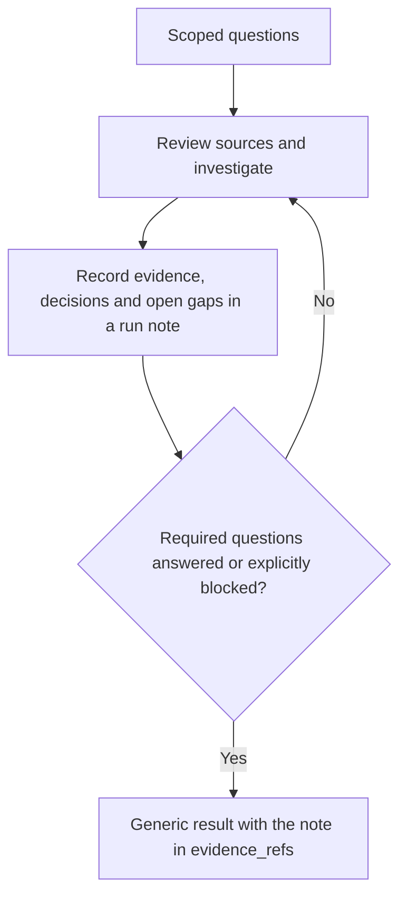

# Iterative environmental and best-practice research

Research is a delivery activity with its own evidence and stopping condition,
not a one-shot report or a request to repeat the same answer. Start from the
incoming prompt, surveyed environment, available spec and recorded discoveries.
Follow the printed action; retain everything needed by the next iteration in
Markdown. Read only the section the current packet selects.

For a later feature, consult the [cross-run knowledge policy](project-knowledge.md):
read persistent environment/decision documents and relevant prior-run evidence,
revalidate what affects this request, and retain useful updates in repository
documentation. The new incoming prompt defines scope; an old prompt or work queue
is historical context, not a request to execute it again.



## Draft

Identify the environmental conditions and best-practice decisions that could
change the approach, feasibility, behavior, tests or deployment. Convert them
into a bounded question inventory. Scope the inventory to this task; do not
research every technology, invent an unnecessary environment, or impose a stack.

For each question, distinguish:

- what the user requires, with a prompt/spec reference;
- what the environment currently does, with direct evidence;
- what a source recommends, with applicability and contrary evidence;
- what remains unknown or requires a user decision.

Keep the question inventory in a durable run note, as the
[navigator adapter](#navigator-execution-mode-adapter) describes, and submit the
packet's generic result with that note in `evidence_refs`. The structure below
illustrates the information worth retaining for each question and source; it is
not a result schema the script validates.

```json
{
  "questions": [
    {
      "id": "Q-1",
      "question": "Which invocation boundary must the client use?",
      "origin": "Prompt R-1 and survey invocation uncertainty",
      "status": "resolved",
      "answer": "Use the documented service-visible operation and error envelope.",
      "sources": ["SRC-1"],
      "revalidate": "Recheck if the deployed interface version or client changes.",
      "rationale": "The documented boundary matches the requested client and current service."
    }
  ],
  "sources": [
    {
      "id": "SRC-1",
      "reference": "Safe primary-document or repository reference",
      "authority": "primary",
      "version_or_observed_at": "Exact inspected version or observation timestamp",
      "supports": "The exposed operation, input shape and error envelope",
      "limitations": "Does not prove live credential availability or a deployed result"
    }
  ]
}
```

Use stable IDs. Question status is `resolved`, `open`, `blocked`, or
`not-applicable`; source authority is `primary`, `local`, `secondary`, or `probe`.
`origin` explicitly references the prompt, spec or discovery that raised the
question. Preserve prior question and source IDs across application; changing a
source reference/authority needs a new ID rather than repurposing the old one.
A resolved question needs source support. An irrelevant question needs a concrete
inapplicability rationale. An open/blocked question records the gap in `answer`;
it cannot be hidden by removing its ID or declaring the pass trivial. Local-only
work can use actual repository/runtime evidence; no external-search quota or
third-party tool is mandatory. No relevant uncertainty still requires an explicit
bounded applicability review, not a fabricated source or silent empty result.

### Interaction boundaries

Record roles with their permitted actions and isolation without forcing a
`dev`, `stage`, or `prod` taxonomy. Include observed or explicitly
blocked/not-applicable code, state, system, and environment-role observations;
unavailable evidence is not permission to call a boundary irrelevant.

Each relevant interaction records caller/callee interfaces, operation,
input/output shape, state and failure semantics, supported SDK/client idiom,
risk, depth rationale, sources, questions, and affected consumer steps. Follow
causal boundaries as far as risk requires: a simple local call may stop with a
reason, while retries, duplicate effects, cancellation, partial commit, or role
differences need the relevant downstream state/service boundary. A numeric depth
claim is never evidence. Required unresolved interactions or their open/blocked
questions keep the research incomplete; do not replace them with a future
consumer dependency or an invented probe.

Use the selected primary contract for an operation. The
[MCP tools specification](https://modelcontextprotocol.io/specification/2025-11-25/server/tools)
is an example of why operation/result/error envelopes need explicit evidence;
[MCP security guidance](https://modelcontextprotocol.io/docs/2025-11-25/tutorials/security/security_best_practices)
illustrates that an adapter boundary does not grant authority; and
[Google AIP-194](https://google.aip.dev/194) illustrates why retry ownership and
idempotency must come from the actual API contract. These are investigation
anchors, not a mandate to install an MCP server or adopt an RPC design.

## Recursive discovery and experiments

This is a generic discovery process for arbitrary referenced systems, whether
local or remote. Derive the concrete questions, access routes, libraries, patterns,
and experiments from the task and inspected contracts. Named technologies,
applications, transports, and example probes illustrate the method; they are not
required dependencies or a fixed discovery sequence. Do not assume an MCP server,
browser, client/server architecture, or remote deployment exists. Apply the same
method during environment investigation, inner-loop development, outer-loop
delivery, and test expansion when a consequential unknown arises; reuse existing
evidence instead of requiring a fresh investigation at every checkpoint.

Use [service discovery](service-discovery.md#select-scope) when affected flows
raise schema/state, query, caching, or asynchronous service choices behind an
MCP/API or local boundary. Assess existing owned observability for local systems
too; reuse event owners and sinks before adding coverage. Keep only relevant
decisions and current evidence in the existing durable notes and knowledge index.

### Scope, coverage, and frontier

For terminology, background, requirements and prior decisions beyond the
checkout, use [connected knowledge discovery](project-knowledge.md#connected-knowledge-discovery).
Act on relevant available MCP/internal knowledge readers, not only public web
search; an information source need not be part of the application's runtime.

Start with the task's affected flows, not a fixed number of hops. Read the repo
README and existing applicable AGENTS.md, architecture/design/environment notes,
and local skills before rediscovering their subject. Record absence or stale
claims explicitly. Recheck volatile facts; documentation is not live access proof.
Use the existing `body`, questions, sources, role/interface/interaction records,
and `depth_rationale`; do not add a recursive journal, schema, inventory, or
sidecar.

Before deep source or library research, make one cheap authorized read that
crosses the actual target boundary when it could settle access or target
uncertainty. A listed tool, credential-status response, local binding error, or
catalog does not establish account/project reachability. Do not create a target
solely to claim discovery access.

Apply [early access readiness](#early-access-readiness) at that first relevant
probe and whenever investigation exposes a new required access boundary.
Investigate the [environment lifecycle](environment-lifecycle.md) before planning
code: actual workspace/runtime/data isolation, setup prerequisites, automated
deployment triggers, and how the tested candidate reaches its intended consumer.
Retain preparation and promotion needs separately for their downstream owners.

Screen every affected flow and every consequential newly encountered boundary for
all eight areas below. Mark an area established, unresolved, or not applicable
with its reason and evidence. The screen is task-scoped: it does not authorize an
audit of every platform feature or private account.
These are analytical categories, not required components. Use the encountered
system's corresponding concepts; when an area has no counterpart, record why it
is not applicable rather than inventing a client, service, library, or cache.

| Area | Ask enough to choose or reuse safely |
| --- | --- |
| Message passing | Producers, consumers, operation/event contract, serialization, ordering, retries, duplicates, cancellation, errors, and the durable or user-visible effect. |
| Client connections | How a client reaches the actual callable boundary, including transport/session lifecycle, cleanup, and reconnect/offline behavior when relevant. |
| Service authentication | Discovery and runtime identities, delegation, credential-chain/refresh behavior, effective permissions, audience/scope, and proof limits without recording secrets. |
| Design | Existing architecture, ownership, state flow, code conventions, and relevant UI loading, error, accessibility, and interaction patterns. |
| Client-side libraries | Shipped dependencies and versions, initialization/wrappers, compatibility limits, and supported use before adding another dependency. |
| Storage | Source of truth, schema/access path, ownership, authorization, transaction/concurrency, failure, retention, and migration boundaries. |
| Caching | Relevant cache layers, scope/keys/TTL/invalidation, read-after-write and failure behavior, and separation from authoritative state. |
| Security considerations | Trust and tenant boundaries, input/output handling, authorization, transport/data protection, logging/secret exposure, and dependency provenance. |

For each relevant system, including the system behind an MCP gateway, identify the
actors, state owner, invocation convention, identities, permissions, and
downstream effects that could change implementation, tests, deployment, or reuse.
When a consequential unknown exposes another system or boundary, add its
unanswered contract to the same existing question frontier with parent/source and
interaction links. Reuse visited identities and sources when paths reconverge or
cycle. Reopen a branch only when changed or conflicting evidence could materially
change the plan; do not traverse unrelated integrations merely to be exhaustive.

Every explored branch needs a stopping reason in `depth_rationale` and the
existing report: the in-scope effect and relevant failure/security semantics are
supported, the branch is out of scope, it reconverges on inspected evidence, or an
explicit open/blocked question names the missing authorized route. A local call may
need one trace; a multi-service write can need several trust and persistence
boundaries. No route found is a recorded gap, not evidence that the system has no
behavior.

For interface decisions, apply the
[actors, channels, and state ownership guide](behavioral-requirements.md#actors-channels-and-state-ownership).
Trace the requested actor interactions before choosing transports or shared
state; retain the decision and its evidence in the existing notes for spec,
global planning, step planning, and affected Improve reviews to consume.

### Plan the investigation

After the initial repository baseline, choose investigation depth from the
decisions still at risk. First check the plan triggers below; revisit them when
new evidence creates a material conflict or dependency. If none applies and
direct inspection and the relevant checks can settle the decisions,
**omit an investigation-plan section and field table**; one sentence in the
existing note explaining the direct path is enough. A remote boundary alone does
not require a separate plan, and a simple deployed component can still need a
[runtime state decision](service-discovery.md#runtime-state-placement).

When evidence gathering has consequential dependencies, independent owners,
materially conflicting sources, expensive probes, or likely interruption, put a
compact investigation plan in the existing discovery/research note before further
dependent probes. Keep its outcome/stop record even when the investigation is
short; a retrospective list of gaps does not replace the plan. For this branch only,
name the question and affected decision, evidence already known, next evidence
route, prerequisites, owner, permitted effects, time/attempt bound, and sufficient
observation or stop condition. Reuse the current action's
[shared research allowance](#budget-stopping-and-convergence); delegation does not
multiply it. Split only investigations whose inputs and effects are independent.
When a read needs a target or identity from an earlier observation, obtain that
observation first. Revise the question frontier as evidence arrives, preserving
dated findings and why a decision changed rather than silently rewriting history.

End with the selected decision or unresolved question, its evidence and earliest
affected consumer. An unknown contract needs research; an owner or access
decision stays open; a known selected setup requirement can become prerequisite
work before its consumer. Leave independent investigation eligible within the
current action. Follow [decision boundaries](#decision-boundaries) and verify the
[discovery evidence handoff](project-knowledge.md#discovery-evidence-handoff).
This is organization within the existing action, not another stage, scheduler,
state file, callback or Improve campaign.

### Early access readiness

Notify early; block only work that needs the missing access. Start once a system,
target/environment role, and task-relevant need are concrete, normally during
`discovery` after the repository scan and before deeper dependent research. A
speculative technology or merely available connector is not a reason to sign in.
For a selected downstream test or delivery dependency, surface known access needs
now even if that later activity need not run yet.

Independent work stays within the current action and granted scope. Discovery
may continue local inspection, not future implementation; do not skip graph
stages or begin another action while this one is paused/blocked. When only a
downstream requirement remains and this action is genuinely complete, its
callback lets the script advance normally toward that later work.

First try one bounded, non-mutating read through the existing connection under
the current grant; ordinary supported credential refresh may suffice. Check the
intended target/role, not just tool availability. Reuse a sufficiently current
receipt for the same boundary instead of probing again on every Improve pass.
If no safe authorized probe exists, explain that limit and ask the necessary
scope/setup question; do not perform a write, create a resource, switch accounts,
or broaden access merely to test readiness.

For identity or access discovery, use supported non-mutating probes and
sanitized evidence. Normal supported tool-managed authentication and tool
configuration metadata without session material remain allowed. Builders and
reviewers must not read, decode, retain, or report local authentication,
session, or credential-store contents.

| Observation | Next action |
| --- | --- |
| Relevant read succeeds in the intended role | Record what that read establishes and continue without a login request. It does not prove write permission or consumer/browser access. |
| Missing/expired session remains after supported refresh | Prompt the user promptly for the required sign-in/reconnection, before more research that depends on it. |
| Wrong account/tenant, insufficient role, or consent required | Explain the specific selection/permission decision and ask the appropriate user or administrator; another login may not fix it. Never expand scopes automatically. |
| Missing tool/binding, network failure, or target not provisioned | Record a setup, connectivity, or provisioning gap. Do not diagnose authentication from a failed call alone; use bounded safe checks to distinguish causes. |
| Optional or unselected system | Defer access requests until the system becomes a concrete dependency. |

Give the user the system and non-secret environment/role alias, why access is
needed, the safe check attempted and its sanitized result, the smallest necessary
user action, the earliest activity it blocks, and what independent work can
continue. Use the supported host/provider authentication surface; never request
passwords, tokens, cookies, or credential-bearing links in chat or notes. A
request to authenticate is not permission to grant broader access or deploy.
Raise a known admin/approval lead time early, but do not front-load speculative
or unrelated privileges. Distinguish connector, downstream service, deployment,
and browser-consumer identities when they are separate boundaries.

Select the [lowest-overhead sufficient testing surface](testing-and-documentation.md#lightweight-and-browser-checks).
A curl/API probe may not share the browser's session or authentication flow.
Consider an existing authorized browser route for a real consumer-access need;
do not diagnose the destination as unavailable solely from a login redirect or
assume connector access establishes browser-user access.

Retain this request and its pending/declined/deferred/verified disposition in the
existing authored Markdown with the observed-at context, evidence locator,
affected work, owner, and safe recheck/resume condition. These are descriptive
notes, not new result fields or an authentication state machine. Reuse an existing
request for the same system/role/scope; do not repeatedly prompt on unchanged
blockers or after refusal. A changed need or new user direction can reopen it.
Before the plan's Improve review completes, check that each concrete external dependency
has relevant access evidence or a disclosed access/setup requirement, owner,
and earliest gating stage.
An undisclosed known requirement is a planning defect; a disclosed downstream
requirement need not block independent work. A prerequisite for the current
action remains incomplete and uses that packet's pause/blocked route.

After the user responds, recover the current packet if context was cleared and
follow its resume route if paused/blocked. Recheck the relevant safe operation;
the user's confirmation alone is not access evidence. Keep failed verification
unresolved. Once access and the current action's remaining duties, including
any assigned Improve campaign, are complete, submit its exact current callback
and consume the next packet. Do not stop at a question answer, mark the whole
phase done just because login succeeded, or replay a pre-block callback.
Revalidate stale evidence or changed target/role/scope before use, especially at
step and release planning; do not rediscover settled access at every node.

This is host-executed policy. The navigator returns its reference and preserves
ordinary notes/result locators and pause/resume state; it neither authenticates
nor proves that a probe or user prompt occurred. Contextual minimum-scope requests
follow [OAuth incremental-authorization guidance](https://developers.google.com/identity/protocols/oauth2/resources/best-practices#use-incremental-authorization);
apply the actual provider's error and permission contract, not a universal
HTTP-status-to-login rule.

### Acquire a reader and establish access only when authorized

If a consequential observation is unavailable, compare available access routes,
such as MCP/API/CLI/SDK/browser interfaces, using
[platform discovery](platform-discovery.md#discover-before-choosing-a-mechanism).
Prefer an existing authorized tool or native facility. A missing skill, MCP
server, SDK, client, or test environment is a setup question before it becomes a
final access blocker, but acquire one only for a named gap that could change
discovery, reuse, implementation, or verification.

When the user's request or current task context authorizes discovery setup, that
authorization covers a reversible, task-local acquisition in the stated account,
resource, cost, and change scope; do not ask again for the same bounded setup.
Before acquisition,
verify the publisher/source and package metadata, select a resolved version or
commit where available, and inspect install scripts and requested permissions.
Never execute an unexamined floating installer; disable unnecessary install
scripts. After fetching but before execution, record and verify the resolved
bytes' hash or package integrity and relevant support/compatibility evidence. Use
a task-owned temporary workspace, dependency store, cache, and configuration;
avoid global installation and unrelated host or repository changes. A skill
supplies guidance, not credentials or implicit tool access.

For an MCP server, inspect its startup requirements and relevant schemas, then
initialize, catalog, and invoke one task-relevant operation through a supported
host connection or temporary protocol client. Record whether it is a native host
tool or a client-invoked process. An initial catalog is not a ceiling: another
supported existing or newly acquired reader may be used within the same authorized
account/data scope and grant. Preserve an actual permission, policy, or target
denial as evidence; do not route around it. Readers and validators may differ
from the selected writer, but acquisition never changes the frozen selected
interface, writer, or inventory and never licenses a second mutation mechanism.

Reuse ordinary credential chains and refresh under an existing grant. Starting a
login, selecting a new account, granting scopes, accepting terms, copying secrets,
or broadening privileges needs authorization covering that change; do not ask
again when it is already granted. Distinguish a package/tool being ready from an
identity being authenticated, an operation being authorized, the intended target
being selected, and target behavior being observed.

Prefer an existing authorized sandbox, then a temporary project, official sample
or test harness, emulator, or local service. Provision a disposable remote dev/
test resource only when the user's authorization covers that account and resource
type, its cost/quota and isolation, and cleanup. A temporary name does not make a
production operation safe. Record acquired artifacts, non-secret command/config
references, observed capabilities/effects, unresolved access, and task-owned
process/resource cleanup in the existing authored Markdown.

### Run bounded, discriminating experiments

Use an experiment when it settles a consequential uncertainty better than another
read. Before each experiment, record in the existing question/source/role/
interface/interaction and report material: its hypothesis; plausible outcomes and
the observation that distinguishes them; inspected existing mechanism; source,
configuration, target, and identity; allowed effects; time/attempt limit; cleanup;
and how each outcome changes the plan or reuse decision. Prefer non-mutating
inspection, then an authorized isolated fixture. Stop on unexpected effects or
missing authority; never use production merely because it is the only target.

Select only the experiments needed from this ladder, adapting each to the
encountered contract. The specific probes below are conditional examples, not
universal acceptance criteria:

- **Access setup:** acquire/configure a reader, initialize/catalog it, and make
  one authorized relevant read; distinguish package, startup, identity,
  permission, target, and data-access failures.
- **Interaction contract:** exercise supported valid and invalid interactions to
  learn the applicable input/output, error, ordering, and completion semantics.
  For example, when asynchronous results can affect newer consumer state,
  identify the existing result-acceptance policy. In an authorized isolated
  fixture or existing safe test, force reversed completion of two relevant
  operations and check the affected state, such as rendered or client-held state
  in a UI; mark absent surfaces not applicable. Do not assume a successful result
  is still current or duplicate a live mutation to test it.
  Record whether an existing sequence/version/cancellation mechanism can be
  reused, or a small extension needs implementation.
  A local RPC mock proves only its adapter.
- **Library and design compatibility:** run representative existing code or an
  official example under the actual framework or a clearly labeled local harness.
- **State and concurrency:** compare valid, stale, repeated, or concurrent
  disposable operations to learn ownership, isolation, transaction/version, and
  idempotency behavior.
- **Caching and failure recovery:** compare hit/miss, read-after-write, expiry,
  and a bounded safe failure without equating a cache with durable state.
- **Authorization and exposure:** use approved test identities or harmless local
  fixtures for a relevant allow/deny, input/output, or tenant-scope boundary.
- **Reuse comparison:** compare an existing facility and the smallest extension
  under equivalent inputs and a predeclared correctness, UX, reliability, cost,
  or security criterion.

Record actual positive, negative, or unresolved outcomes, source versions,
artifacts, and cleanup. Preserve non-secret request/outcome evidence such as a
role alias, operation, response status, and state effect independently of prose.
Redact sensitive fields; if the remaining receipt cannot substantiate a claim,
keep that claim unresolved. Label fidelity precisely: source-only inference, local
mock, actual framework test, actual service read, deployed endpoint, or
intended-user test. A successful local test cannot become a claim about a
deployed endpoint or user behavior. A material result re-enters the existing
review/plan/apply loop and resets convergence.

The research stage exits on the same test. Its result's `assumptions` field
lists every load-bearing assumption as evidenced, probed or open; an open entry
names the check that would settle it, why it was not run, and its first affected
consumer. The model chooses which probes to run; the list makes each choice not to
probe visible to planning and review. ShipLoop refuses a done research result
without the list, with a missing evidence file, or with a probe that cites no
saved output. A recalled fact is not evidence.

### Reuse before a new mechanism

For each implementation choice, inspect the current mechanism, configuration,
platform/native capability, shared code, library/version, and representative
supported use. Prefer **reuse**, then **configure**, then the smallest compatible
**extension**. Record the requirement met, applicable evidence, and material
limits. Do not duplicate an existing cache, authentication flow, transport
wrapper, storage abstraction, or design component merely because it is easier to
demonstrate a new one.

Use **replace/new proposal** only when evidence shows that the best applicable
existing option has a concrete task-relevant defect or unmet requirement and the
change brings a substantial improvement in correctness, security, user
experience, reliability, maintainability, performance, or cost. Compare
equivalent conditions when measured; otherwise give a concrete causal explanation.
Account for the smallest change, migration/compatibility, maintenance,
operational, dependency, and security costs. If the improvement is unproven or
access is missing, keep the suitable existing option as the default and defer the
alternative or frame it as a bounded experiment.
Do not copy an evidenced obsolete, insecure, or incompatible mechanism unchanged.

### Budget, stopping, and convergence

Use a user-supplied exploration allowance when present. Otherwise, one
investigation has at most 15 active minutes and 64 observable host actions, up to
two capability candidates and three experiments. Reserve two active minutes and
eight actions for reconciling findings, writing the result, and cleanup. The
allowance is shared across every reader, tool, environment, context reset, and
same-investigation review phase; opening a new tool or environment never refills
it. Known sufficient evidence may finish without using the allowance.

The host must check elapsed active work, observable-action counters, remaining
capacity, and a per-command timeout before starting work. At the default bound,
once 13 active minutes or 56 observable actions have been used, stop launching
exploration and use the reserve only for reconciliation, writing, and cleanup.
Set each exploration command's timeout within the remaining exploration allowance,
not merely the full deadline. Do not charge inactive time waiting for the user as
investigation activity. If the host cannot measure a counter honestly, state that
limitation in the existing Markdown and use the available conservative bound.
ShipLoop does not observe native host tools or kill them; this guidance is not a
claim of a script watchdog.

Record the investigation scope, start, elapsed active work, observed counters,
remaining allowance, conclusions, and best next gap in the existing authored
Markdown. Use the closing reserve to checkpoint before pausing:

- If the current action's duties can be completed honestly within the reserve,
  submit its valid result through the exact callback, retaining open/blocked
  questions and budget accounting, then pause at the returned packet. Do not
  submit an incomplete review or manufacture passing checks merely to checkpoint.
- Otherwise, write the partial result to the current packet's existing inbox
  path. Pause with a non-secret reason that includes that path, labels it an
  **unaccepted draft**, and records the remaining allowance and next gap. The
  accepted candidate remains unchanged. If the draft could not be written, say
  what was not retained; do not claim the discoveries were checkpointed.

Use the existing `pause` command. A bound Improve child keeps its own unfinished
status; do not invent a `stopped` result or edit child state. `halt` is for deliberately ending the run unfinished, not the
default resumable budget checkpoint. On a later authorized resume, read the
recorded draft and accepted candidate, finish the current action's duties, and
use its current callback. Resuming does not replenish the exploration allowance.
At the allowance/deadline, do not autonomously renew, restart, or claim convergence.
An exhausted budget, failed probe, or repeated action never counts as a trivial
pass.

During each research review, challenge the most consequential conclusion with a
feasible independent source, counterexample, or safe probe; otherwise record that
limit. Unchanged blockers remain open. Two fully checked trivial passes can finish
only with no required unresolved questions. Carry durable reusable conclusions to
the existing plan, run notes, project knowledge and scoped product documentation
tasks; never hand-edit ShipLoop state or create a second investigation engine.

## Navigator execution mode adapter

Navigator packets select this adapter with the shared recursive-discovery
section above. Apply the same eight-area screen, consequential recursion,
authorized acquisition, experiments, reuse decisions, evidence fidelity, and
shared allowance in every version. This adapter supplies the current protocol's
record and owner binding; it does not replace the shared research evidence
guidance with a navigator-specific one.

At an Improve checkpoint, one valid generic producer submission parks the
parent and binds one Improve child; at other stages the accepted result advances
the graph directly. That producer checkpoint remains valid: it records the current source
view and its evidence, but does not claim that the child has completed its
reviews or that a tested condition holds. The bound child owns its review work,
applicable experiments, and the investigation's shared allowance. The parent
alone owns ShipLoop callbacks, including verified `improve-complete` after it
saves or collects the terminal child evidence and confirms every candidate
writer has stopped, including, under `delegation: ask-agent`, the actual worker
and its delegates.

For navigator, keep findings in a durable run note, such as
`notes/<actionID>.md`, and include its locator in the current generic result's
`evidence_refs`. Use ordinary Markdown to retain questions and parent/source
links, visited boundaries, access and acquisition stages, observations and
limitations, reuse choices, cleanup, active time/action accounting, remaining
allowance, conclusions, and required open gaps. Use the current packet's result
envelope. Do not add other fields to that envelope or create extra candidate
files. Named
questions/sources/`depth_rationale` in the shared section describe information to
retain, not a mandatory navigator schema or note layout.

For [access requests](#early-access-readiness), keep the probe, user-facing ask,
disposition, owner, earliest gating stage and recheck condition in that same
note. Carry its locator in dependent results' `evidence_refs` and applicable
planned work-item `context` so a cold host can find it without conversation
memory. Update the existing note rather than creating a duplicate request.

Record the selected mutation route and its authorization boundaries. Extra
readers do not grant authority to change that route or evade a real denial.
The navigator does not freeze an inventory or selected-interface identity. The
host must preserve the actual scope and decisions and disclose changes without
claiming script-enforced checks.

`discovery` and `research` use this policy for affected environment flows. Later
stages and their Improve reviews use it when a consequential newly encountered
boundary or conflicting evidence requires more investigation. Do not restart
settled research just because a later stage reads this guide. The same
investigation's allowance follows its notes across stages and context resets;
entering an Improve child never refills it.

For a bound child, apply the same policy to the producer
stage that bound it. The parked parent does not repeat those duties or receive a
second investigation allowance: the child owns the review/plan/apply/check/
record/assess campaign and its shared allowance. Perform those cycles internally
under the child binding and preserve their learnings. Do not submit a callback for
each child phase. In a bound invocation, a parent `pause` retains the child
binding; an unfinished, blocked, or runtime-`stopped` child route does not prove
that its native owner has stopped or release it for replacement. Collect or
confirm that owner before the parent accepts, completes, reconciles, or reassigns
the invocation. Required unresolved questions prevent a host declaration of
convergence; navigator validates the result envelope, not the truth or
completeness of those findings.

Only the navigator's initial `plan` Improve child, selected for the bundled
ephemeral runtime before preparation or dispatch, may use the packet-issued
`stopped` reconciliation route. Other children use their recorded
child-incomplete, pause, or parent-completion route. A generic producer checkpoint remains valid
in every case; a generic label such as “experiment completed” alone cannot
establish the observation, consumer readiness, or completion of the bound child.

### Reserve checkpoint

Before producer submission, unfinished duties may remain an unaccepted draft at
the parent's printed inbox path while the parent pauses. A substantiated
access/owner blocker may be submitted as a valid `outcome: blocked` result with
durable evidence references; that allocates a new action at the same stage and
is not a successful advance. At an Improve checkpoint a valid producer result
parks that action for its bound Improve child; it does not by itself import
child completion or advance the graph.

After binding, that single producer submission remains the parent checkpoint.
Do not submit another generic producer result to checkpoint unfinished child work.
Follow the child's actual runtime callback and handoff protocol, save its complete
raw packet at the printed receipt, and retain findings, remaining allowance and
cleanup in the notebook. The parent `pause` retains the same child and allowance.
Recover from those packets; only the parent imports verified terminal evidence.
An incomplete draft or review/check references alone cannot substitute for the
terminal runtime packet. `final_result` is an optional generic producer-result
revision for successor-relevant decisions or evidence, never the child terminal
packet or a completion requirement for every review.

## Decision boundaries

Classify the next useful action in the existing question's `answer`,
`rationale` and `revalidate` fields; these are not new status values or another
journal. Keep the distinction visible in the report and improvement plan:

- **Researchable unknown:** name the missing fact, the relevant repository or
  primary contract, a permitted probe and what observation would settle it.
  Investigate or independently recheck it, including consequential downstream
  behavior justified by the selected scope and risk.
- **Owner decision or authority:** name the precise policy, target, role or
  permission needed, and its consequence. Retain `open`/`blocked` status and
  request direction; use the existing pause route when progress depends on it.
  More public-document reading cannot establish account access or select the
  owner's policy. Do not invent a default or relabel the gap not-applicable.
- **Later-phase implementation:** when the underlying contract is established,
  record the known requirement and its downstream consumer (behavior/spec/test
  planning or an existing handoff route). Do not implement it during research.
  A genuinely unanswered prerequisite remains open; calling it future work
  does not resolve it or complete the research.

Derive safety expectations that hold independently of a missing policy. For
example, whatever identity or retention policy the owner selects, an unauthorized
state mutation must not be reported as accepted. Record that expectation and
its basis without claiming an identity scheme was selected or a security test
passed. Reserve the detailed test matrix for behavior/spec and the test phases.
Do not grow an unselected optional feature just to make its research exhaustive.

Each review distinguishes **new discoveries** from **unchanged blockers**.
Open/blocked questions still reset the current convergence streak even if this
pass found nothing new. Two quiet reviews with a missing owner decision are not
two successful trivial passes. Use the existing gates, result records and
carry-forward route; do not add a nested investigation engine.

## Evidence and freshness

Source identity and observation time serve different purposes. Prefer an exact
commit, release, document revision or other immutable identifier for stable
claims. Record when a volatile condition was observed and its safe point-of-use
revalidation trigger. The time a result was accepted is when the checkpoint was
recorded, not proof that every remote source was freshly inspected then.

Treat a new/changed conclusion, newly discovered material question, environment
constraint, incompatibility, or test/deploy feasibility gap as material. A small
text edit can change the entire decision. Non-semantic report cleanup or a source
observation/version refresh that changes no conclusion may be trivial. Treat
additions or edits to question records, source identities, support or
limitations as material. Unavailable evidence is not evidence that nothing material remains; record the
gap and pause as needed.

Test the asserted contract, not only file existence. Manual source
interpretation is host-reported evidence, not executable proof or a passed remote
acceptance test. Label historical/manual observations separately; a passing
subset does not validate the whole case map or excuse an unavailable required
check. A repeated action, failed probe or exhausted budget never counts as a
successful review pass.

Keep secret values, credential-bearing URLs, account addresses and raw sensitive
responses out of reports, results and logs. Research does not authorize a new
credential grant, persistent configuration, destructive experiment, or
publication. When the user's request or task context authorizes bounded discovery
setup, a temporary task-local investigation reader, SDK, skill, or test dependency
may be acquired under the recursive-discovery rules; that does not alter the
selected writer or interface. Missing user policy is not resolvable by
additional web citations.

## Later discoveries

Research records an as-of evidence baseline, not a permanent claim that
discovery is over. Every implementation stage and Improve review assesses
whether its current scope needs new investigation, and says why none is needed
when that is the decision.

| Discovery location | Required route |
|---|---|
| Within the current item's approved scope | Investigate under this policy during the current stage or its Improve review; unresolved required research keeps the stage incomplete. |
| Required by future pending items | Revise the future queue at `carry-forward` so a research item precedes every affected consumer. Scheduling it is not answering it. |
| Incompatible requirement, permission or completed-work assumption | Pause for direction, or report `blocked`. Research evidence is not authority to rewrite the approved baseline. |

Retain the answer, evidence and revalidation policy in the run note and link it
from the result's `evidence_refs`. Generic improvements to ShipLoop are
proposals, separate from product research and without permission to
self-modify the harness.

## Basis and limits

Adaptive investigation and persistent artifacts are supported by
[Anthropic's research-system engineering experience](https://www.anthropic.com/engineering/multi-agent-research-system).
It also reports coordination and token costs, so parallel investigation is a
choice for independent questions, not a requirement for every pass.
[Self-Refine](https://arxiv.org/abs/2303.17651) reports task-specific improvements
from revision, while [intrinsic self-correction research](https://arxiv.org/abs/2310.01798)
shows important limits without external feedback. These motivate evidence-backed
iteration, not a guarantee of completeness or this exact two-pass threshold.
The threshold is ShipLoop's explicit operational stopping rule; semantic
adequacy, source interpretation and live-source truth still require judgment.

## Plan-triggered experiments

The [planning experiment guide](planning-experiments.md) applies this
shared evidence and allowance policy to assumptions exposed by a provisional
plan. Only the initial bound Plan Improve child may run this planning-specific
path. It may validly choose zero experiments. A valid confirmation that leaves
the plan unchanged still exports its decision-note evidence through the existing
`final_result.evidence_refs`, which the parent verifies and imports through
`improve-complete`; an inconclusive result remains unresolved.

A finding that invalidates earlier research, requirements or testing uses that
selected child's packet-issued pre-dispatch reconciliation route. On return to
plan, the returned action's current source/action view is authoritative for
currentness only. Reports remain evidence, not user authority; the full current
work-item queue must be revalidated before preparation. The same investigation
notebook and host-accounted allowance follow that suffix; a new action is not a
refill.
