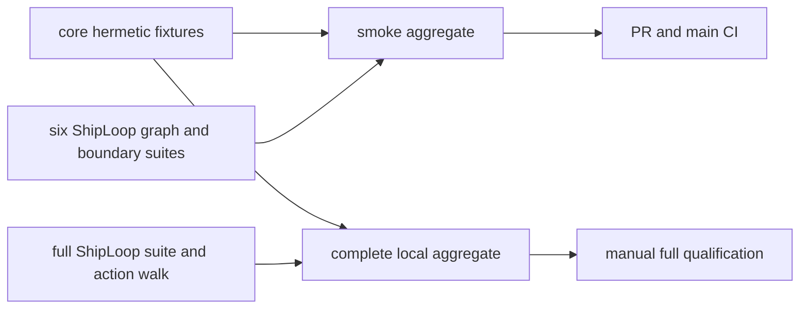

# Test runners

`bash test/run-all.sh` is the complete local hermetic aggregate. It needs no
network, installed host skill, live engine, credential, or environment-specific
test target. The group interface is deliberately small:



```sh
bash test/run-all.sh
bash test/run-all.sh --group smoke
bash test/run-all.sh --group core
bash test/run-all.sh --group shiploop
bash test/run-all.sh --group all
bash test/run-all.sh --list
bash test/shiploop.test.sh --list
bash test/shiploop.test.sh --smoke
bash test/shiploop.test.sh --smoke --list
bash test/shiploop.test.sh --shard 1/3 --list
```

The default is `--group all`. `core` covers packaging, installation, and
contract-fixture tests without an installed host. `smoke` runs that full core
group plus six selected ShipLoop suites: `no-model-launch`, `navigator-v3`,
`packet-bounds`, `navigator-dry-run`, `graph-driver`, and `graph-trace`.
It is a fast partial signal, not a replacement for the full suite. `shiploop`
runs the complete ShipLoop suite and exactly one action walk. `all` is the
stable complete hermetic aggregate of `core` and `shiploop`. The legacy direct
command remains available for compatibility:

```sh
bash test/shiploop-walk-journal.test.sh
```

It is not part of the aggregate; the `shiploop` group owns the action walk once.

`test/shiploop.test.sh` owns one ordered ShipLoop inventory. Its no-argument
form remains the complete serial runner. `--list` prints only the selected
inventory and does not run synchronization or a test. `--smoke` selects the
same six suites listed above from that canonical inventory; `--smoke --list` is
the fastest way to inspect the subset. `--smoke` and `--shard` are mutually
exclusive. `--shard 1/3`, `2/3`, or `3/3` selects every third suite from the
same order, so the three inventories are disjoint and contain the action walk
once in total. Full CI calls those shards through `shiploop-1`, `shiploop-2`,
and `shiploop-3`; they are scheduling aliases and are intentionally excluded
from `--group all`, which still runs the full serial ShipLoop runner exactly once.

`python3 test/shiploop-probe-decisions.test.py` checks the separate decision-driven
probe corpus and its thin frozen-study adapter without launching a model. It
calibrates evidence reuse, runtime drift, native/skill reuse, denied access, and
indeterminate outcomes; verifies candidate/arm identity and source integrity;
and checks blind evidence collection. Live prompt comparisons are explicit
experiments, not CI dependencies. See the
[probe-decision study](experiments/shiploop_probe_decisions/README.md).

`python3 test/shiploop-full-runtime.test.py` composes public ShipLoop and selected
bundled Until Loop CLIs across the protocol-3 graph, including cold recovery and
corrective outcomes. Its review judgments are synthetic: it proves local runtime
composition, not semantic Improve quality, live host execution, or deployment.
Copied-package cases exercise portable payloads from an unrelated CWD without a
marketplace installation. The v3-guidance and packet-bounds suites check relevant
reference routing and recovery of large context from complete durable records.

`python3 -B test/shiploop-local-skills.test.py` is in the ordinary ShipLoop/CI
inventory. It regrades the ten archived local-skill observations from disposable
relocated copies, including the preserved ambiguous incident result, then checks
negative controls for wrong decisions or JSON scalar types, changed skill resources,
compatibility, index/authority links and contract relocation. It also verifies
that preparing a fresh trial retains skills but strips prior task outputs. This
tests the experiment apparatus; saved-output replay is not a new model evaluation.
The actual-Improve CLI suite separately protects both the cold handoff instructions
and child-resource durability. Fresh model trials remain
[explicit experiments](experiments/shiploop_local_skills/README.md).

The ShipLoop group includes opt-in consumer-delivery declaration checks, public
CLI compatibility/relocation tests, synthetic prompt/fake-boundary fixtures, and
temporary loopback HTTP checks of the browser fixture's distinct served cases.
The guard tests check retained requirements and declared observations, not the
truth of remote evidence. Fresh-context interpretation responses are a separate
bounded study, not a deterministic LLM gate or proof of Improve convergence.
See [consumer-delivery experiments](experiments/shiploop_delivery/README.md).

`python3 test/shiploop-auth-readiness.test.py` exercises the shared access-policy
locator and cold authentication-blocker recovery using synthetic host reports.
The navigator dry-run suite also checks that the policy remains reachable across
the real graph and pause/blocked routes. These tests prove packet wiring and
state continuity, not that an LLM asks promptly or that a live account is usable.
The [bounded interpretation check](experiments/shiploop_auth/README.md) records
ten fictional access scenarios and the stage-skipping ambiguity they exposed.

`python3 test/shiploop-environment-lifecycle.test.py` checks the existing
navigator's preparation → feature → staged-candidate work-item ordering,
blocked/cold recovery, local-only path, and selected-package policy locators.
It uses synthetic declarations: queue traversal does not prove that a host
selected all prerequisites, created a sandbox, or promoted a live candidate.
The [environment interpretation study](experiments/shiploop_environment/README.md)
records three fictional topology cases and the planning-versus-execution
ambiguity corrected through a fresh-reader follow-up.

`python3 test/experiments/shiploop_ui_allocation/test_evidence.py` checks the
UI-planning study's evidence reader with hermetic corruption controls. It
distinguishes explicitly synthetic predecessors from archived Improve imports,
validates archive identities, and reports the current inner action. These checks
do not run a model/browser or establish the truth of review judgments. See the
[UI allocation study](../docs/shiploop-ui-planning-allocation-2026-09-18.md).

`python3 test/shiploop-cross-run.test.py` checks new-request versus repeated-init
identity across protocols, terminal-run preservation, fresh-run isolation, and
cold packets' persistent knowledge locators. The navigator dry-run suite covers
those locators across stage/recovery routes. These are routing tests, not proof
that an LLM read or correctly reused a historical environment document.
The [cross-run interpretation check](experiments/shiploop_cross_run/README.md)
records four fresh-reader scenarios and the boundaries actually observed.

`python3 test/shiploop-workspace.test.py` uses disposable real-Git repositories
to check dirty-baseline capture, source-index preservation, candidate-bound path
review, transient-history rejection, guarded clean/dirty return, and the
workspace-mode handoff gate. It never merges the source checkout running the
test. [Workspace experiments](experiments/shiploop_workspace/README.md) explain
why starting at HEAD and deleting transient files at the tip were insufficient.

## Skill and script execution boundary

`shiploop-no-model-launch.test.py` exercises the packaged CLI with model-binary
tripwires. Ordinary initialization and recovery stay in the invoking conversation,
and the removed `drive` command must fail without launching a model. The package
must not contain the retired controller or host transports. This boundary test
belongs to the required ShipLoop aggregate.

The retained context-reset experiment records describe historical trials of the
removed controller; they are not current invocation instructions. Real model
launches for ShipLoop evaluation belong to the external E2E harness.

## Explicit integration targets

### Offline experiment apparatus versus live product verification

The [generalized-discovery study](experiments/shiploop_generalized_discovery/README.md)
has a hermetic wrapper, `python3 test/shiploop-generalized-discovery.test.py`,
registered once in the ShipLoop inventory. Its synthetic tests check apparatus
contracts; they do not reproduce the original model trials. Private raw study
evidence is not part of the published fixture set.

The [ShipLoop E2E harness](experiments/shiploop_e2e/README.md) separately supports
offline observer, receipt, game-oracle, and synthetic-host checks:

```sh
python3 test/experiments/shiploop_e2e/check_suite.py --suite regressions
python3 -m unittest discover -s test/experiments/shiploop_e2e -p 'test_*.py'
```

These no-model apparatus checks are independent of live Grok runs. Retained
external-product cases are explicitly opt-in and reported as skipped when their
fixtures are unavailable; those skips do not establish product behavior. The
aggregate full-runtime test also exercises one real protocol-3 intake prefix
through synthetic host-stream observations. Neither synthetic observations nor
an offline suite pass proves model compliance, a working hosted game, or a
deployment. Live host/browser/MCP tests remain explicit authorized experiments,
not default CI dependencies.

The core `installed-skill-invocation` check includes the bundled mock path from
an empty unrelated directory, covering marketplace-style audit binding without
launching a model. Live Grok audits remain separate opt-in E2E work: use the
audit harness's `xhigh` setting and its 7,200-second cap, then assess retained
stdout/stderr and product evidence independently of smoke or full hermetic CI.

### Host and environment targets

Integration checks never run as a default dependency of the hermetic aggregate.
Discover their names and requirements before selecting one:

```sh
bash test/run-integration.sh --help
bash test/run-integration.sh --list
bash test/run-integration.sh weather-offline
bash test/run-integration.sh weather-live
bash test/run-integration.sh cursor-imports
```

Weather checks require both explicit locators; do not infer them from an
installed engine or a surrounding checkout:

```sh
DEVLOOP_HOME=/absolute/path/to/devloop \
DEVLOOP_WEATHER_REPO=/absolute/path/to/weather-repository \
  bash test/run-integration.sh weather-offline

DEVLOOP_HOME=/absolute/path/to/devloop \
DEVLOOP_WEATHER_REPO=/absolute/path/to/weather-repository \
  bash test/run-integration.sh weather-live
```

The optional weather runner selects `offline` or `live` mode only for the
explicit target. `weather-offline` checks engine location/capability files and
the selected existing product; its non-executing probe is not a test of a live
host connection. It writes `tests/test_weather_contract.py` after preflight.

**Use a disposable project for `weather-live`.** It deletes/recreates
`common-js/weather.gs` and `appsscript.json`, overwrites `README.md` and the
generated test, and commits its tests-only baseline in the selected project
before invoking the live engine. It is a specialized experiment, not a generic
deployment test. Missing prerequisites fail; they are never a passing skip.
Do not put secret values in commands, CI configuration, output, or fixtures.

## Evidence boundaries and CI

Self-contained mocked Hermes-install tests establish installer behavior only.
They do not provide an actual Hermes runtime, engine availability, live-host
execution, or certification. A green hermetic aggregate has the same boundary.

CI runs the `smoke` aggregate for pull requests and pushes to `main`; it ignores
tag and feature-branch pushes. A manual dispatch accepts `tier=smoke` (the
default) or `tier=full`. Full dispatch runs `core` and the three deterministic
ShipLoop shards; use it for runtime, state, graph, or callback changes and for
release qualification. Start it against the candidate branch with:

```sh
gh workflow run ci.yml --ref <candidate-branch> -f tier=full
```

Before treating that run as qualification evidence, check that its tested SHA
and tree still match the final candidate. A manual full run is qualification
evidence; it does not replace the required pull-request smoke check. Metadata-only
changes may use smoke plus their affected checks. Do not repeat local full, PR
full, and post-merge full runs for an identical tested tree; a new tree needs
the checks appropriate to its changes.

A newer run for the same pull request cancels the superseded run; main-push and
manual runs use unique concurrency keys and are never cancelled by this policy.
CI sets Python 3.12 and Node 22 explicitly and preserves the existing `hermetic`
status as an aggregate gate. Failed, cancelled or skipped required groups cannot
make that gate pass. Package drift is reported even when another core check fails.
Each selected test job rejects staged or unstaged tracked-file changes left by tests,
even after a suite or package-parity failure. The worktree and index are checked
separately so restoring a working file cannot hide its staged changes.
Checkout-local bootstrap pins are generated in temporary directories, not
rewritten into source fixtures. This dirty-tree guard is not a sandbox: it does
not reject untracked/ignored artifacts or tests deliberately committing changes.
CI does not inject secret values or make any integration target mandatory.
The small Linux-only CI footprint is intentional; it is not macOS or live-host
certification. Local checks may use other Python/Node versions.

Explicit runtime setup follows [GitHub's Python guidance](https://docs.github.com/en/actions/tutorials/build-and-test-code/python#specifying-a-python-version)
and [setup-node's version guidance](https://github.com/actions/setup-node#usage).
This repository needs no pip/npm application dependencies for these tests.

The ShipLoop group also runs the capability-study fixture, runtime/collector and
local async-client regressions. They use synthetic data, temporary files and
loopback services without credentials or installed MCP servers. The actual
macOS sandbox/CLI preflight is an explicit experiment check; a hermetic pass does
not establish that host-specific boundary. See the
[capability apparatus](experiments/shiploop_capabilities/README.md).

Review Coverage now distinguishes residual-review convergence from final
delivery verification. Its [Finalization contract](../skills/review-coverage/SKILL.md#finalization-after-completedlanded-review)
requires current evidence after cleanup, with a concrete manual result when
automated tests are explicitly N/A. `test/review-coverage.test.sh` checks that
contract across source instructions and emitted goal/run packets; it does not
prove that every host or model executes the instructions correctly. This guide
does not claim that all documentation or quality debt is closed.

## Marketplace package and consumer gates

The core group runs `marketplace-package`, `installed-skill-invocation` and
`prompt-marketplace-contract`. These check all generated native payloads, execute
bundled helpers from copied read-only package trees (including paths with spaces),
and check prompt dependency/capability contracts. They do not run model benchmarks.
DevLoop's core suite separately proves that missing-engine invocation cannot
bootstrap; checksum/extraction/replacement tests target the repository-only
operator setup helper.

`bash test/run-integration.sh marketplace-claude|marketplace-grok|marketplace-codex`
means choose **one** named target. Each requires that real CLI and uses a temporary
local catalog and disposable profile with an allowlisted environment. The test
installs the Skill Interop helper, exercises it after installation, then installs,
runs and removes Review Coverage. No ambient provider credentials are inherited,
no model call is made, and no personal plugin state should change. These checks
prove local installed behavior only, not published-pin readiness or public review.

### Navigator protocol 3 and actual Improve

`shiploop-navigator-v3.test.py` and `graph-dry-run --protocol-version 3`
exercise universal child handoffs and correction routes with synthetic receipts.
`shiploop-standalone-improve.test.py` and `shiploop-actual-improve-cli.test.py`
exercise the real bundled Until Loop runtime and parent import/recovery boundary.
Their review judgments are fixtures; they do not prove a live model followed
Improve. The implementation validation report records separate live skill trials.
