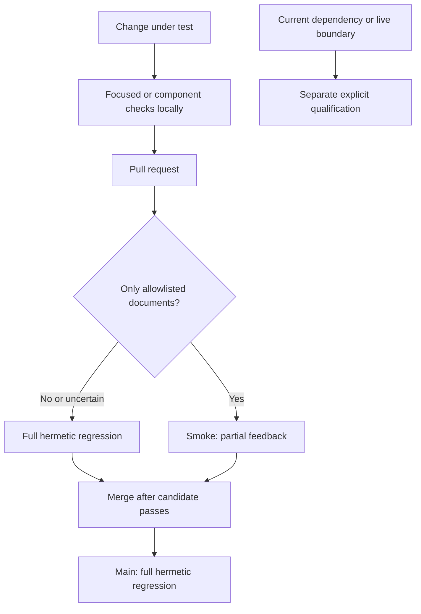

# Test runners

Use `bash test/run-all.sh --group smoke` for partial feedback and
`bash test/run-all.sh` for complete hermetic regression. Local runs and GitHub CI
use the same [suite catalog](suite_catalog.py). A pass means the selected checks
passed; offline fixtures do not establish live model or host behavior.

| Selection | Command | Scope |
|---|---|---|
| Focused | `python3 -B test/<name>.test.py` | One module; useful while changing its contract |
| Smoke | `bash test/run-all.sh --group smoke` | Core plus eight selected ShipLoop boundary suites |
| Ask-Agent component | `bash test/run-all.sh --group ask-agent` | Supported helper tests and ShipLoop consumers |
| Composition component | `bash test/run-all.sh --group shiploop-composition` | Chain and Improve integration boundaries |
| Full hermetic | `bash test/run-all.sh` | Core, all ShipLoop suites, source E2E apparatus and historical experiments |
| Current dependency | `bash test/run-integration.sh current-dispatcher --help` | Explicit external Dispatcher checkout; offline compatibility |
| Installed or live | `bash test/run-integration.sh --help` | Selected real host, engine, installed package or credentials; opt-in |



CI runs full regression for code, skill prompts, generated packages, tests,
scripts, workflow changes and unclassified paths. Only root/test README files
and Markdown/CSV documents under `docs/` qualify for automatic PR smoke. Renames
consider both paths; an unavailable diff selects full. Every `main` push selects
full. Manual dispatch still offers `smoke` or `full`. The `hermetic` aggregate
requires both the planner and all selected jobs to succeed; its summary states
the tier and tested SHA. Server-side merge protection is a separate repository
setting; this workflow does not enable it.

CI uses `ubuntu-latest`, latest stable Python 3 and latest stable Node, resolving
fresh versions through setup actions. Receipts record the versions actually used.
Historical Dispatcher/Until fixtures remain fixed test inputs for old state and
recovery contracts; they do not determine which current tool version to install.

## Inventory, union and evidence

```sh
bash test/run-all.sh --list
bash test/run-all.sh --group ask-agent --group shiploop-composition --list
bash test/run-all.sh --group smoke --output /tmp/skill-craft-smoke-unique
bash test/shiploop.test.sh --smoke --list
bash test/shiploop.test.sh --shard 1/3 --list
```

Repeated groups form a union: shared entries run once, in catalog order.
`--list` and help execute no suites. Root listing prints one
row per constituent entry, with family, ID and command; the ShipLoop wrapper
prints only paths. `core`, `shiploop`, `e2e-apparatus`, and `experiments` can also
run separately. The three `shiploop-1`/`2`/`3` groups partition ShipLoop using
checked-in duration estimates and a deterministic fallback. They are scheduling
slices of the same full inventory, not additional coverage.

The eight ShipLoop smoke suites are `no-model-launch`, `navigator-v3`,
`navigator-v4`, `stopped-improve`, `v4-consumers`, `packet-bounds`,
`navigator-dry-run`, and `chain-async`.
The historical U18/W1 Ask-Agent worktree harness belongs to full-only
`experiments`; supported Ask-Agent workspace, delivery and managed-harness
checks remain in core.

An optional `--output` directory must be new and outside the checkout. It retains
source identity, runtime versions, selected/completed suites, outcomes, durations
and per-suite logs. The runner continues remaining selected suites after a
failure and returns failure overall. CI uploads these artifacts even on failure,
checks generated-plugin parity in core/smoke, and rejects source drift or new
checkout artifacts except Python bytecode under `__pycache__`. Running the local
suite alone does not perform these additional CI parity and checkout checks.

Full regression runs the source E2E apparatus with `check_suite.py --suite all`
once. Its named diagnostic groups intentionally overlap; do not concatenate them
to claim full coverage. The copied-package mock in core remains separate because
it checks relocation and package binding. The apparatus uses synthetic evidence
and portable recorded source fixtures, with no model calls. The recorded GAS
products carry provenance and run everywhere; missing fixtures fail instead of
skipping a required regression case.

## Fixture ownership and intentional overlap

| Boundary | Why its tests remain separate |
|---|---|
| Ask-Agent workspace / delivery / managed harness | Helper preservation, caller integration and synthetic host-event validation have different assertions |
| ShipLoop chain / lifecycle / async / planning context | Binding, worker lifecycle, concurrent callbacks and planning provenance fail in different ways |
| Navigator / action walk / full runtime | Synthetic state transitions, protocol traversal and copied-package public CLI execution are distinct checks |
| Improve standalone / actual CLI / stopped completion | Direct import, process transport and incomplete-settlement rejection need independent evidence |

Reusable chain, lifecycle, planning-context and consumer-contract setup lives in
`test/shiploop_*_support.py` modules. Chain and navigator consumers import these
helpers directly; the dedicated actual-Improve-CLI fixture adapter remains in its
integration test. Each case still owns its disposable repositories and cleanup; expensive
setup is not shared across cases whose mutations could interfere. Pure convergence
predicates belong in the cheap contract suite. The audit found fixture coupling,
not accidental nested execution of whole suites; assertions were retained.

## Qualify the current Dispatcher

The default hermetic suites intentionally use recorded compatibility fixtures.
For an external checkout of the current Dispatcher, use its explicit card:

```sh
bash test/run-integration.sh current-dispatcher \
  --dispatcher-skill /absolute/plan-orchestrator/skills/plan-dispatcher/SKILL.md \
  --output /tmp/dispatcher-qualification-unique
```

Both skill-craft and the selected dependency must be clean Git checkouts. Select
a freshly resolved upstream commit for the dependency. The command records
that commit and package identity and runs the offline native-pilot composition
checks against it. It requires a new output directory outside both repositories;
missing inputs and package drift fail. It does not fetch an upstream revision or
launch a native/model agent, so the caller must select the current revision and
retain how it was resolved.

The upstream `whichguy/plan-orchestrator` repository is private. This repository's
credential-free GitHub jobs therefore retain frozen hermetic fixtures; current
Dispatcher qualification is a separate local release check until an authorized
CI credential is available. This is an explicit coverage boundary, not a skipped
green CI job.

`python3 test/shiploop-probe-decisions.test.py` checks the separate decision-driven
probe corpus and its thin frozen-study adapter without launching a model. It
calibrates evidence reuse, runtime drift, native/skill reuse, denied access, and
indeterminate outcomes; verifies candidate/arm identity and source integrity;
and checks blind evidence collection. Live prompt comparisons are explicit
experiments, not CI dependencies. See the
[probe-decision study](experiments/shiploop_probe_decisions/README.md).

`python3 -B test/shiploop-chain-lifecycle.test.py` repeats the code-producing
parallel/dependent chain in a disposable Git repository. Independent worker
processes generate and test Python code; A/B overlap, C starts after A while B
still runs, and J waits for B+C. The parent verifies each combination, integrates
it into the invoking linked checkout and removes accepted worker worktrees.
The same suite checks serial execution, A-first/B-first/burst completion delivery,
and an old B result arriving after its retry has been accepted. Required output
files must exist; checks cannot silently skip missing contributions. Target
updates must form one contiguous history containing every accepted source.
Worker processes are deterministic
fixtures, not native/model agents. `shiploop-chain-handoff.test.py` covers local
result preservation and hostile-path/replay controls. Both are in the full
ShipLoop inventory. Use the [native pilot](experiments/shiploop_chain/README.md)
for separate qualification with actual Ask-Agent contexts and completion events.

New execution cases use the source Ask-Agent 0.6+ managed helper with real sibling
worktrees and immutable receipts. They exercise both return orders, stale combined
verification after target movement, successor launch before accepted-worker
cleanup, replay/retry fencing, and cleanup recovery with late worker changes.
Serial execution uses that same preparation and cleanup contract in the main
context, without a native handle. Retired 0.4 and final-return fixtures are only
used to check rejection or read-only historical inspection. Capability and
identity checks establish compatibility; package version and Markdown wording
alone do not.
Managed `done` returns acceptance and ready actions first; the parent then uses
the existing cleanup callback. `shiploop-chain-git.test.py` separately checks that
an integrated-worker inspection rejects a newer HEAD, dirty or ignored files, and
replacement worktree identities without removing them. Each case owns and tears
down its disposable repositories; these are full-suite members, not live-host
notification evidence.

`python3 -B test/shiploop-chain-async.test.py` adds concurrent public-CLI
callbacks to those real-Git fixtures: competing completions, duplicate import,
acceptance and cleanup, wrong-attempt results, and callbacks invoked from a
different working directory. Each case owns its repositories, worker processes,
callback processes and pipe barriers; teardown stops remaining children before
removing fixture directories. It verifies the initiating linked checkout, source
commit ancestry, immutable event history, and both filesystem and Git worktree
cleanup. The suite belongs to **smoke and full/sharded** inventories, so routine
PR CI exercises this boundary. Native host completion delivery remains a separate
opt-in qualification. See the [asynchronous test plan](../docs/async-orchestrator-test-plan-2026-09-20.md).

Planning-material transport has two focused suites:

```sh
python3 -B test/shiploop-planning-context.test.py
python3 -B test/shiploop-chain-planning-context.test.py
```

The collector suite checks accepted planning records, reference resolution,
immutable inputs, and exclusion of the original user prompt. The composed suite
uses the pinned `plan-dispatcher-v3` package and controlled worker processes to
check invalid-graph rejection before binding with no parent mutation, corrected
retry, cold recovery, parallel/serial code generation from references, dependency
joins, import recovery, and worktree cleanup. Its failure-path check stops
workers before removing their workspaces. Both suites run in the ordinary
ShipLoop inventory; they do not establish model understanding or native-host
delivery. The fixture's `PROVENANCE.json` identifies the upstream commit and
every copied file hash, independently of the author's local checkout path; it is
a copied fixture, not a released package, installed-package qualification, or
native-execution proof.

`python3 -B test/experiments/shiploop_chain/test_native_pilot.py` checks the
pilot's actual inline prompt adapter and current planning-context preparation
without launching a model. It verifies complete worker-packet transport,
including guidance instructions, and keeps recovery separate from a fresh
launch. It is part of the full inventory; it does not qualify model adherence.

The lifecycle suite also verifies the script-owned `navigation` response:
script-selected fan-out, exact continuation from an unrelated directory, no
relaunch on recovery, capacity boundaries, serial execution, and cleanup/final
verification before `navigation.complete`. The skill supplies facts and follows
these packets; it does not recompute the dependency frontier.

The [compound coverage matrix](../docs/shiploop-chain-compound-coverage-2026-09-19.md)
adds interactions between retry, integration recovery, dependency readiness and
pending cleanup. The Git suite checks that a stale cleanup cannot remove a
replacement worktree recreated at the same path. Native-trace controls reject
contradictory terminal outcomes and cross-step handle sources while preserving
valid pending observations and identical completion replay. These remain local
tests; prompt-driven Ask-Agent worktree creation and native recovery need their
separate live qualification.

The [parallel integration test plan](../docs/parallel-integration-test-plan-2026-09-20.md)
separates these real-Git fixtures from the native trace observer's strict A/B
and B/C interval checks. The opt-in native runner holds B at a disclosed test
barrier until C is launched; it proves overlapping task lifetimes and integrated
code behavior, not simultaneous code-writing or other hosts' behavior.
Grok qualification uses the host's root-session transcript to distinguish
parent actions from interleaved worker events. Whole-second task event times
must still overlap after conservative one-second bounds are applied at each
end; receipt order cannot substitute for overlap evidence.

The [interaction audit](../docs/shiploop-chain-interaction-audit-2026-09-19.md)
maps every supported chain operation to state, Git effects, context requirements
and existing tests. It separates dispatcher snapshot authority from bridge audit
history, and host-owned review judgments from mechanical checks. Selected gaps
reuse these suites instead of adding another orchestration or test framework.
The chain suite also checks that new runs have one `plan-dispatcher-state.json`,
legacy runs keep their one existing file, status views save no completion copy,
and ambiguous or missing state cannot silently select or reconstruct authority.

`python3 test/shiploop-full-runtime.test.py` composes public ShipLoop and selected
bundled Until Loop CLIs across the protocol-3 graph, including cold recovery and
corrective outcomes. Its review judgments are synthetic: it proves local runtime
composition, not semantic Improve quality, live host execution, or deployment.
Copied-package cases exercise portable payloads from an unrelated CWD without a
marketplace installation. The v3-guidance and packet-bounds suites check relevant
reference routing and recovery of large context from complete durable records.

`python3 -B test/shiploop-local-skills.test.py` is in the ordinary ShipLoop/CI
inventory. It regrades the ten archived local-skill observations from disposable
relocated copies, including the preserved ambiguous incident result, then checks
negative controls for wrong decisions or JSON scalar types, changed skill resources,
compatibility, index/authority links and contract relocation. It also verifies
that preparing a fresh trial retains skills but strips prior task outputs. This
tests the experiment apparatus; saved-output replay is not a new model evaluation.
The actual-Improve CLI suite separately protects both the cold handoff instructions
and child-resource durability. Fresh model trials remain
[explicit experiments](experiments/shiploop_local_skills/README.md).

The ShipLoop group includes opt-in consumer-delivery declaration checks, public
CLI compatibility/relocation tests, synthetic prompt/fake-boundary fixtures, and
temporary loopback HTTP checks of the browser fixture's distinct served cases.
The guard tests check retained requirements and declared observations, not the
truth of remote evidence. Fresh-context interpretation responses are a separate
bounded study, not a deterministic LLM gate or proof of Improve convergence.
See [consumer-delivery experiments](experiments/shiploop_delivery/README.md).

`python3 test/shiploop-auth-readiness.test.py` exercises the shared access-policy
locator and cold authentication-blocker recovery using synthetic host reports.
The navigator dry-run suite also checks that the policy remains reachable across
the real graph and pause/blocked routes. These tests prove packet wiring and
state continuity, not that an LLM asks promptly or that a live account is usable.
The [bounded interpretation check](experiments/shiploop_auth/README.md) records
ten fictional access scenarios and the stage-skipping ambiguity they exposed.

`test/shiploop-auth-readiness.test.py` also checks that v3 packets carry the
selected package's Environment lifecycle policy and this run's lifecycle note
locator. It uses synthetic declarations: it does not prove that a host selected
all prerequisites, created a sandbox, or promoted a live candidate.
The [environment interpretation study](experiments/shiploop_environment/README.md)
records three fictional topology cases and the planning-versus-execution
ambiguity corrected through a fresh-reader follow-up.

`python3 test/experiments/shiploop_ui_allocation/test_evidence.py` checks the
UI-planning study's evidence reader with hermetic corruption controls. It
distinguishes explicitly synthetic predecessors from archived Improve imports,
validates archive identities, and reports the current inner action. These checks
do not run a model/browser or establish the truth of review judgments. See the
[UI allocation study](../docs/shiploop-ui-planning-allocation-2026-09-18.md).

`python3 test/shiploop-cross-run.test.py` checks new-request versus repeated-init
identity across protocols, terminal-run preservation, fresh-run isolation, and
cold packets' persistent knowledge locators. The navigator dry-run suite covers
those locators across stage/recovery routes. These are routing tests, not proof
that an LLM read or correctly reused a historical environment document.
The [cross-run interpretation check](experiments/shiploop_cross_run/README.md)
records four fresh-reader scenarios and the boundaries actually observed.

`python3 test/shiploop-workspace.test.py` uses disposable real-Git repositories
to check dirty-baseline capture, source-index preservation, candidate-bound path
review, transient-history rejection, guarded clean/dirty return, and the
workspace-mode handoff gate. It never merges the source checkout running the
test. [Workspace experiments](experiments/shiploop_workspace/README.md) explain
why starting at HEAD and deleting transient files at the tip were insufficient.

The three `shiploop-chain{,-git,-ledger}.test.py` suites belong to the ordinary
ShipLoop aggregate. They exercise the public bridge with a pinned Plan Dispatcher
v1 fixture, disposable real Git worktrees, eager fan-out and joins, guarded return,
and append-only event records under process contention. A separate v2 fixture
pins the uncommitted executor-aware dispatcher candidate for serial cases: one
main-context task at a time, no native launch/handle, dependency-respecting
completion through final return, stale attempts, unsupported old packages and
exact terminal replay after other steps progress. The state/ledger bytes must
remain unchanged on identical terminal retries; a crash between child acceptance
and bridge recording is reconciled once. Native handles, worker
reports, and prerequisite Improve judgments are synthetic in these tests; these
passes prove local composition, not live host delivery or semantic verification.
The same public-CLI suite covers read-only `chain history` and `chain pending`:
ready/waiting/claimed/running/reported/rejected states, retries, empty completion,
serial capacity, past indexed actions, child drift, corrupt ledgers and explicit
recovery boundaries. Queries must preserve every run file's bytes, avoid creating
locks and leave pending transactions and interrupted event hardlinks untouched.
The fixture's `PROVENANCE.json` records its upstream source and exact hashes.
The separate [native pilot](experiments/shiploop_chain/README.md) runs the same
public bridge with actual host-native workers and an independent code oracle.
It is opt-in and must report observed results separately from synthetic setup.
The [2026-09-18 pilot report](../docs/shiploop-chain-native-pilot-2026-09-18.md)
records the actual local fan-out, rejected report, retry, join and feature return.

## Skill and script execution boundary

`shiploop-no-model-launch.test.py` exercises the packaged CLI with model-binary
tripwires. Ordinary initialization and recovery stay in the invoking conversation,
and the removed `drive` command must fail without launching a model. The package
must not contain the retired controller or host transports. This boundary test
belongs to the required ShipLoop aggregate.

The retained context-reset experiment records describe historical trials of the
removed controller; they are not current invocation instructions. Real model
launches for ShipLoop evaluation belong to the external E2E harness.

## Explicit integration targets

### Offline experiment apparatus versus live product verification

The [generalized-discovery study](experiments/shiploop_generalized_discovery/README.md)
has a hermetic wrapper, `python3 test/shiploop-generalized-discovery.test.py`,
registered once in the ShipLoop inventory. Its synthetic tests check apparatus
contracts; they do not reproduce the original model trials. Private raw study
evidence is not part of the published fixture set.

The [ShipLoop E2E harness](experiments/shiploop_e2e/README.md) separately supports
offline observer, receipt, game-oracle, and synthetic-host checks:

```sh
python3 test/experiments/shiploop_e2e/check_suite.py --suite regressions
python3 -m unittest discover -s test/experiments/shiploop_e2e -p 'test_*.py'
```

These no-model apparatus checks are independent of live Grok runs. Retained
external-product cases are explicitly opt-in and reported as skipped when their
fixtures are unavailable; those skips do not establish product behavior. The
aggregate full-runtime test also exercises one real protocol-3 intake prefix
through synthetic host-stream observations. Neither synthetic observations nor
an offline suite pass proves model compliance, a working hosted game, or a
deployment. Live host/browser/MCP tests remain explicit authorized experiments,
not default CI dependencies.

The core `installed-skill-invocation` check includes the bundled mock path from
an empty unrelated directory, covering marketplace-style audit binding without
launching a model. Live Grok audits remain separate opt-in E2E work: use the
audit harness's `xhigh` setting and its 7,200-second cap, then assess retained
stdout/stderr and product evidence independently of smoke or full hermetic CI.

### Host and environment targets

Integration checks never run as a default dependency of the hermetic aggregate.
Discover their names and requirements before selecting one:

```sh
bash test/run-integration.sh --help
bash test/run-integration.sh --list
bash test/run-integration.sh weather-offline
bash test/run-integration.sh weather-live
bash test/run-integration.sh cursor-imports
```

Weather checks require both explicit locators; do not infer them from an
installed engine or a surrounding checkout:

```sh
DEVLOOP_HOME=/absolute/path/to/devloop \
DEVLOOP_WEATHER_REPO=/absolute/path/to/weather-repository \
  bash test/run-integration.sh weather-offline

DEVLOOP_HOME=/absolute/path/to/devloop \
DEVLOOP_WEATHER_REPO=/absolute/path/to/weather-repository \
  bash test/run-integration.sh weather-live
```

The optional weather runner selects `offline` or `live` mode only for the
explicit target. `weather-offline` checks engine location/capability files and
the selected existing product; its non-executing probe is not a test of a live
host connection. It writes `tests/test_weather_contract.py` after preflight.

**Use a disposable project for `weather-live`.** It deletes/recreates
`common-js/weather.gs` and `appsscript.json`, overwrites `README.md` and the
generated test, and commits its tests-only baseline in the selected project
before invoking the live engine. It is a specialized experiment, not a generic
deployment test. Missing prerequisites fail; they are never a passing skip.
Do not put secret values in commands, CI configuration, output, or fixtures.

## Evidence boundaries and CI

Self-contained mocked Hermes-install tests establish installer behavior only.
They do not provide an actual Hermes runtime, engine availability, live-host
execution, or certification. A green hermetic aggregate has the same boundary.

CI runs the `smoke` aggregate for pull requests and pushes to `main`; it ignores
tag and feature-branch pushes. A manual dispatch accepts `tier=smoke` (the
default) or `tier=full`. Full dispatch runs `core` and the three deterministic
ShipLoop shards. Select qualification by changed behavior and dependencies:
runtime, state, graph, callback and recovery changes need their affected suites.
Use full dispatch only when a concrete cross-subsystem risk cannot be covered by
narrower checks, and record that reason. Start it against the candidate branch with:

```sh
gh workflow run ci.yml --ref <candidate-branch> -f tier=full
```

Before treating that run as qualification evidence, check that its tested SHA
and tree still match the final candidate. A manual full run is qualification
evidence; it does not replace the required pull-request smoke check. Delegate
established-suite execution through **test-runner**, supplying exact source/run
identity, commands, expected evidence, deadline and retry policy; the parent owns
selection and diagnosis. Do not repeat local full, PR full, and post-merge full
runs for an identical tested tree. Preserve the tested SHA/tree and select checks
for changed bytes instead of invalidating unrelated evidence.

`release-push.test.py` uses disposable Git repositories and a bare remote to
prove that failed preconditions, changed candidates, dirty files and remote races
cannot publish a divergent release through the guarded push command. These are
publication-control tests; they do not establish GitHub branch-policy compliance.

A newer run for the same pull request cancels the superseded run; main-push and
manual runs use unique concurrency keys and are never cancelled by this policy.
CI sets Python 3.12 and Node 22 explicitly and preserves the existing `hermetic`
status as an aggregate gate. Failed, cancelled or skipped required groups cannot
make that gate pass. Package drift is reported even when another core check fails.
Each selected test job rejects staged or unstaged tracked-file changes left by tests,
even after a suite or package-parity failure. The worktree and index are checked
separately so restoring a working file cannot hide its staged changes.
Checkout-local bootstrap pins are generated in temporary directories, not
rewritten into source fixtures. This dirty-tree guard is not a sandbox: it does
not reject untracked/ignored artifacts or tests deliberately committing changes.
CI does not inject secret values or make any integration target mandatory.
The small Linux-only CI footprint is intentional; it is not macOS or live-host
certification. Local checks may use other Python/Node versions.

Explicit runtime setup follows [GitHub's Python guidance](https://docs.github.com/en/actions/tutorials/build-and-test-code/python#specifying-a-python-version)
and [setup-node's version guidance](https://github.com/actions/setup-node#usage).
This repository needs no pip/npm application dependencies for these tests.

The ShipLoop group also runs the capability-study fixture, runtime/collector and
local async-client regressions. They use synthetic data, temporary files and
loopback services without credentials or installed MCP servers. The actual
macOS sandbox/CLI preflight is an explicit experiment check; a hermetic pass does
not establish that host-specific boundary. See the
[capability apparatus](experiments/shiploop_capabilities/README.md).

Review Coverage now distinguishes residual-review convergence from final
delivery verification. Its [Finalization contract](../skills/review-coverage/SKILL.md#finalization-after-completedlanded-review)
requires current evidence after cleanup, with a concrete manual result when
automated tests are explicitly N/A. `test/review-coverage.test.sh` checks that
contract across source instructions and emitted goal/run packets; it does not
prove that every host or model executes the instructions correctly. This guide
does not claim that all documentation or quality debt is closed.

## Marketplace package and consumer gates

The core group runs `marketplace-package`, `installed-skill-invocation` and
`prompt-marketplace-contract`. These check all generated native payloads, execute
bundled helpers from copied read-only package trees (including paths with spaces),
and check prompt dependency/capability contracts. They do not run model benchmarks.
DevLoop's core suite separately proves that missing-engine invocation cannot
bootstrap; checksum/extraction/replacement tests target the repository-only
operator setup helper.

The core `vendored-bundles` suite hash-checks each plugin bundle
(`bundles/<plugin>/`) offline against its `PROVENANCE.json` and applies the
publication lint; it proves consistency with that record, not equality with the
private upstream. Its refresh cases use a synthetic upstream git repository only.
`installed-skill-invocation` also runs the bundled Plan Dispatcher
(`plugins/backchain/skills/plan-dispatcher`) from a read-only copy. The
current-Dispatcher qualification below is unchanged: it still takes an explicit
external checkout.

`bash test/run-integration.sh marketplace-claude|marketplace-grok|marketplace-codex`
means choose **one** named target. Each requires that real CLI and uses a temporary
local catalog and disposable profile with an allowlisted environment. The test
installs the Skill Interop helper, exercises it after installation, then installs,
runs and removes Review Coverage. No ambient provider credentials are inherited,
no model call is made, and no personal plugin state should change. These checks
prove local installed behavior only, not published-pin readiness or public review.

`bash test/run-integration.sh marketplace-bundle-claude|marketplace-bundle-grok|marketplace-bundle-codex BUNDLE`
installs one multi-skill bundle view the same way and requires every declared
member card (for Backchain: `backchain` and `plan-dispatcher`) to materialize
once with bytes identical to the view. Run it on each shipped host before the
catalog selects a new or changed bundle. `bash test/run-integration.sh vendored-bundle-lag BUNDLE /path/to/checkout`
dry-runs a refresh against that checkout's fetched `origin/main`; it never
writes. Exit 0 alone means in sync. Exit 1 is lag a `--write` refresh would
apply; a lagging upstream can also exit 2 (description or membership drift, or
an invalid upstream), 3 (lint refusal) or 4 (release-policy refusal such as
changed bytes without a version increase), and 5 means the provenance record
is wrong. See `scripts/sync-vendored-bundles.py --help`.

`bash test/run-integration.sh marketplace-codex-ask-agent` exercises the complete
local Ask Agent plugin in a disposable Codex profile. It compares every package
file, verifies the selected card/helper identity, captures staged, unstaged and
untracked inputs from a linked caller worktree, archives a report, closes and
replays cleanup, and verifies that caller HEAD, index bytes and files survive
unchanged. Helper calls retain the disposable profile while removing Git-context
overrides that the workspace helper correctly rejects. The plugin is then removed
and its installed inventory checked; cache deletion is not required.

The core `marketplace-host-isolation` suite covers that same consumer flow with
a fake Codex CLI that materializes a real package copy. It is hermetic coverage of
the test apparatus and installed helper boundary. The opt-in target uses the real
CLI; neither target invokes a model or proves native task return or published
marketplace pins. Verify published pins separately at their immutable source SHA.

### Navigator protocol 3 and actual Improve

`shiploop-navigator-v3.test.py` and `graph-dry-run --protocol-version 3`
exercise universal child handoffs and correction routes with synthetic receipts.
`shiploop-standalone-improve.test.py` and `shiploop-actual-improve-cli.test.py`
exercise the real bundled Until Loop runtime and parent import/recovery boundary.
Their review judgments are fixtures; they do not prove a live model followed
Improve. The implementation validation report records separate live skill trials.

The consumer-owned regression also checks that real child completion leaves the
parent pending and the candidate edits in place until parent import. Its
judgments remain synthetic. The opt-in
[`ask_agent_improve_native` fixture](experiments/ask_agent_improve_native/README.md)
requires an actual fresh worker, real reviews/checks, native stop/collection and
guarded final caller delivery; it does not launch models from a shell.

## Ask Agent live handoff experiments

The managed-workspace helper and delivery contract have focused hermetic suites:

```sh
python3 -B test/ask-agent-workspace.test.py
python3 -B test/ask-agent-delivery.test.py
python3 -B test/ask-agent-managed-harness.test.py
```

These run in `core`. They exercise real Git preservation and contribution
delivery, plus synthetic adversarial native-event records. A synthetic callback
does not establish live host behavior. The
[managed-workspace apparatus](experiments/ask_agent_managed_workspaces/README.md)
qualifies current native hosts separately with frozen packages, actual worker
identities, helper receipts, operation roots, terminal outcomes, parent work,
acceptance, and retained artifacts. OpenCode's persistent TUI, one-shot lifecycle,
and process-local experimental flag are distinct qualification cases.
The [cross-harness conformance cases](experiments/ask_agent_managed_workspaces/CONFORMANCE.md)
specify shared outcomes, host-specific negative controls, activation/profile
boundaries, cancellation, live parent steering, and setup/teardown. The managed
suite parameterizes normalized lifecycle and rejection cases across all five
hosts, executes the generated inspection arguments against the real helper,
and reports parent final-response evidence separately from Task completion.
Raw native dispatch/freshness and actual child-tool provenance remain live
qualification responsibilities; synthetic events do not validate those APIs.

The [W1 worktree fixture](experiments/portable_delegation/usability/worktree-handoff/README.md)
now has a test-only operator helper for repeatable setup, launch preflight,
public evidence projection and completion checks. Its offline regression suite
runs in the full-only `experiments` hermetic group, or directly:

```sh
PYTHONDONTWRITEBYTECODE=1 python3 test/ask-agent-worktree-harness.test.py
```

It uses disposable Git repositories and synthetic public host records, makes no
model calls and does not prove live skill compliance. The
[U18 results](experiments/portable_delegation/usability/WORKTREE-RESULTS.md) retain
native successes, behavior failures and invalid/interrupted attempts separately.

The [Git integration plan](experiments/portable_delegation/usability/INTEGRATION-PLAN.md)
and [native integration fixtures](experiments/portable_delegation/usability/integration/README.md)
exercise parent-owned integration, worker synchronization/conflict repair,
fresh-parent recovery from a self-contained handoff, and shared-checkout
preservation. They are opt-in prompt/fixture recipes, not a custom dispatcher
or deterministic claim that every host follows the skill.
The [monitoring case](experiments/portable_delegation/usability/monitoring/README.md)
checks multiple pending jobs, visible launch/return notices, waiting status and
broad general-purpose worker selection. Timing is measured only when it occurs
naturally; full parent-child tool parity is a separate, host-dependent claim.
The [follow-up case](experiments/portable_delegation/usability/monitoring-followup/README.md)
checks the explicit pre-idle native status choice and unsupported-route disclosure.

The [Ask Agent protocol - native handoff: cases and candidate-specific criteria](experiments/portable_delegation/usability/HANDOFF-CASES.md)
covers background continuation, parallel success/blocker returns, inline results
when writes are forbidden, and simulated report failures. The
[replay fixtures - exact prompts: opt-in native harness runs](experiments/portable_delegation/usability/handoff/README.md)
need no custom dispatcher. These live experiments are separate from hermetic CI;
the [results - host evidence: outcomes and retained limitations](experiments/portable_delegation/usability/HANDOFF-RESULTS.md)
distinguish native behavior, correctness, context volume and cleanup.
