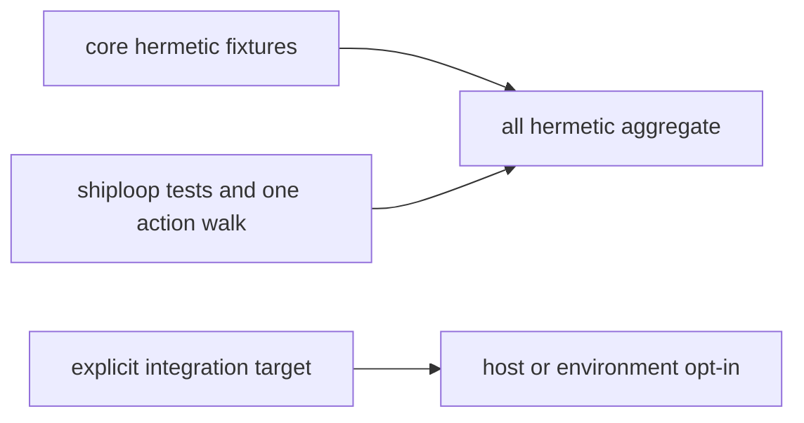

# Test runners

`bash test/run-all.sh` is the required hermetic aggregate. It needs no network,
installed host skill, live engine, credential, or environment-specific test
target. The group interface is deliberately small:



```sh
bash test/run-all.sh
bash test/run-all.sh --group core
bash test/run-all.sh --group shiploop
bash test/run-all.sh --group all
bash test/run-all.sh --list
bash test/shiploop.test.sh --list
bash test/shiploop.test.sh --shard 1/3 --list
```

The default is `--group all`. `core` covers packaging, installation, and
contract-fixture tests without an installed host. `shiploop` runs the ShipLoop
suite and exactly one action walk. `all` is the stable hermetic aggregate of
those two groups. The legacy direct command remains available for compatibility:

```sh
bash test/shiploop-walk-journal.test.sh
```

It is not part of the aggregate; the `shiploop` group owns the action walk once.

`test/shiploop.test.sh` owns one ordered 63-suite inventory. Its no-argument
form remains the complete serial runner. `--list` prints only the selected
inventory and does not run synchronization or a test. `--shard 1/3`, `2/3`, or
`3/3` selects every third suite from that same order, so the three inventories
are disjoint and contain the action walk once in total. CI calls those shards
through `shiploop-1`, `shiploop-2`, and `shiploop-3`; they are scheduling
aliases and are intentionally excluded from `--group all`, which still runs
the full serial ShipLoop runner exactly once.

## Explicit integration targets

Integration checks never run as a default dependency of the hermetic aggregate.
Discover their names and requirements before selecting one:

```sh
bash test/run-integration.sh --help
bash test/run-integration.sh --list
bash test/run-integration.sh weather-offline
bash test/run-integration.sh weather-live
bash test/run-integration.sh cursor-imports
```

Weather checks require both explicit locators; do not infer them from an
installed engine or a surrounding checkout:

```sh
DEVLOOP_HOME=/absolute/path/to/devloop \
DEVLOOP_WEATHER_REPO=/absolute/path/to/weather-repository \
  bash test/run-integration.sh weather-offline

DEVLOOP_HOME=/absolute/path/to/devloop \
DEVLOOP_WEATHER_REPO=/absolute/path/to/weather-repository \
  bash test/run-integration.sh weather-live
```

The optional weather runner selects `offline` or `live` mode only for the
explicit target. `weather-offline` checks engine location/capability files and
the selected existing product; its non-executing probe is not a test of a live
host connection. It writes `tests/test_weather_contract.py` after preflight.

**Use a disposable project for `weather-live`.** It deletes/recreates
`common-js/weather.gs` and `appsscript.json`, overwrites `README.md` and the
generated test, and commits its tests-only baseline in the selected project
before invoking the live engine. It is a specialized experiment, not a generic
deployment test. Missing prerequisites fail; they are never a passing skip.
Do not put secret values in commands, CI configuration, output, or fixtures.

## Evidence boundaries and CI

Self-contained mocked Hermes-install tests establish installer behavior only.
They do not provide an actual Hermes runtime, engine availability, live-host
execution, or certification. A green hermetic aggregate has the same boundary.

CI sets Python 3.12 and Node 22 explicitly, runs `core` and the three
deterministic ShipLoop shards as independent groups on Ubuntu 24.04, and
preserves the existing `hermetic` status as an aggregate gate. Failed, cancelled
or skipped required groups cannot make that gate pass. Package drift is reported
even when another core check fails.
Both CI jobs reject staged or unstaged tracked-file changes left by tests,
even after a suite or package-parity failure. The worktree and index are checked
separately so restoring a working file cannot hide its staged changes.
Checkout-local bootstrap pins are generated in temporary directories, not
rewritten into source fixtures. This dirty-tree guard is not a sandbox: it does
not reject untracked/ignored artifacts or tests deliberately committing changes.
CI does not inject secret values or make any integration target mandatory.
The small Linux-only CI footprint is intentional; it is not macOS or live-host
certification. Local checks may use other Python/Node versions.

Explicit runtime setup follows [GitHub's Python guidance](https://docs.github.com/en/actions/tutorials/build-and-test-code/python#specifying-a-python-version)
and [setup-node's version guidance](https://github.com/actions/setup-node#usage).
This repository needs no pip/npm application dependencies for these tests.

Review Coverage now distinguishes residual-review convergence from final
delivery verification. Its [Finalization contract](../skills/review-coverage/SKILL.md#finalization-after-completedlanded-review)
requires current evidence after cleanup, with a concrete manual result when
automated tests are explicitly N/A. `test/review-coverage.test.sh` checks that
contract across source instructions and emitted goal/run packets; it does not
prove that every host or model executes the instructions correctly. This guide
does not claim that all documentation or quality debt is closed.

## Marketplace package and consumer gates

The core group runs `marketplace-package`, `installed-skill-invocation` and
`prompt-marketplace-contract`. These check all generated native payloads, execute
bundled helpers from copied read-only package trees (including paths with spaces),
and check prompt dependency/capability contracts. They do not run model benchmarks.
DevLoop's core suite separately proves that missing-engine invocation cannot
bootstrap; checksum/extraction/replacement tests target the repository-only
operator setup helper.

`bash test/run-integration.sh marketplace-claude|marketplace-grok|marketplace-codex`
means choose **one** named target. Each requires that real CLI and uses a temporary
local catalog and disposable profile with an allowlisted environment. The test
installs the Skill Interop helper, exercises it after installation, then installs,
runs and removes Review Coverage. No ambient provider credentials are inherited,
no model call is made, and no personal plugin state should change. These checks
prove local installed behavior only, not published-pin readiness or public review.
