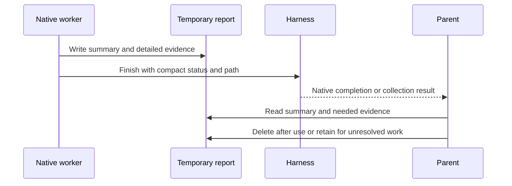

# Compact result handoff: implementation and live evidence

## Candidate and changes

Campaign candidate: version 0.2.0, U14, SHA-256
`a7fd14ba19cb00bd011980ac00334ab2a719040b0ca7b6d9034a074cdfe191d3`.
The [current source](../../../../skills/ask-agent/SKILL.md) has subsequently changed;
see the [integration plan](INTEGRATION-PLAN.md) for U15. Results here apply only
to the frozen candidates named below.

The parent passes the handoff contract into each worker's task. Substantial
results go to a uniquely assigned, accessible temporary report; the worker
finishes normally with a concise receipt containing task, status, outcome/blocker,
path and temporary designation. It does not need a custom notifier. The parent
starts with the summary, reads the evidence needed for its next
decision, verifies material claims, and cleans up after confirmed worker stop
and use. Blocked/recovery reports and durable deliverables are retained when
needed. Tiny answers or tasks forbidding writes use a concise inline/native
artifact fallback. Missing or inconsistent files are collection problems, not
successful results. No dispatcher, scheduler or session-driver script was added.
Following explicit user direction, U13 imposes no fixed word, line, duration,
concurrency or delegation-depth caps. Workers may delegate further through native
facilities when useful and supported. Large responses and full report reads remain
available when needed; compactness is a preference. Host limits and actual user
constraints still apply.

The handoff report is task output/evidence; it is not a transcript or private
reasoning dump. A file reference controls what is returned but cannot enforce
how much a model later reads. Deletion does not remove already-read context.

## Registered experiments

The [HANDOFF-CASES.md - protocol: four cases, oracles, setup and cleanup](HANDOFF-CASES.md)
and durable invoice fixtures define the repeatable opt-in experiments. The local
campaign is `/Users/dadleet/Documents/Codex/experiments/ask-agent-handoff-20260918T171044Z/`.
Original [PLAN.json - U11 registration: prompts and 348 input hashes](/Users/dadleet/Documents/Codex/experiments/ask-agent-handoff-20260918T171044Z/operator/PLAN.json)
registered four cases on each of four hosts: 16 rows, including four explicitly
simulated receiving-policy controls. Each model-executed attempt is retained,
with an eight-minute participant bound and one participant per host at a time.

U11 SHA-256 was `800f053adeb3b6d3b5827fdbf0a270b9bfb31687da6c3bf8a1ef79c0cb40da19`.
In OpenCode F1, native background execution, the actual $306 follow-up, a compact
receipt, correct $4176.90/17-clean/19-discrepant result and cleanup all worked.
However, the parent read 80 lines, loading all 36 invoice rows, then read the
remainder. That is a retained **selective-consumption failure**, not a full pass.

U12 therefore makes the worker summary and initial parent read explicitly ten
lines and prohibits whole-report pagination to verify an aggregate. The separate
[PLAN-U12.json - correction trials: eight fresh F1/F2 rows and 324 input hashes](/Users/dadleet/Documents/Codex/experiments/ask-agent-handoff-20260918T171044Z/operator/PLAN-U12.json)
was registered before U12 execution. It uses the same prompts, inputs, oracles
and outcome rules. U11 failures are not replaced. F3/F4 remain U11 evidence;
they were not rerun under U12.

The user then clarified that flexibility takes priority over agent limits. U13
removes the fixed word/line caps and blanket ban on further delegation. The
[PLAN-U13.json - flexibility trials: four separately registered F2 rows](/Users/dadleet/Documents/Codex/experiments/ask-agent-handoff-20260918T171044Z/operator/PLAN-U13.json)
registers one new parallel mixed-result trial per host before execution. It
measures return/read volume descriptively, with no fixed cap. Earlier failures
remain earlier-candidate failures; they are not retroactively regraded. The
eight-minute participant budget is an operator experiment control, not a skill
runtime limit. U13 F1/F3/F4, nested delegation and long-duration work were not
separately exercised.

U13 SHA-256 was `b0c96e4b71579ecde1519ae5b68960d1664b7506ed2a367c5f690a0e1bc21128`.
Repeated OpenCode task-ID errors prompted one narrow U14 host hint: omit
`task_id` for fresh workers because it is a resume handle. The
[PLAN-U14.json - OpenCode confirmation: one separately registered F2 row](/Users/dadleet/Documents/Codex/experiments/ask-agent-handoff-20260918T171044Z/operator/PLAN-U14.json)
keeps U13's common flexible policy unchanged apart from line wrapping. The hint
was observably loaded, but the trial still made six rejected UUID calls, then
used invented session IDs that the harness replaced with fresh IDs. Correct
eventual results do not make this a clean launch. The
[opencode-task-id-audit.md - native argument contract: optional resume ID and origin limits](/Users/dadleet/Documents/Codex/experiments/ask-agent-handoff-20260918T171044Z/operator/opencode-task-id-audit.md)
found no core/provider-wrapper injection; model versus configured plugin origin
was not isolated. No further replacement attempts were run.

The campaign contains 29 registered rows: 25 native parent trials and four
explicitly simulated receiver controls. Non-executed launcher failures are
recorded separately. Three hosts exercise the common flexible policy at U13;
the OpenCode-only hint is additionally tested there at U14. No claim is made
that all 29 rows passed or that every case ran against the final candidate.

## Host outcomes

Native asynchronous work and file-based return were observed on all four hosts.
That is narrower than uniform compliance or correct answers on every trial.

| Host | Flexible-policy trial | Material qualification |
| --- | --- | --- |
| Claude Code | U13 F2: two native background workers; parent $300 before delivery; North $2482.20/SUCCEEDED; South missing-rate/BLOCKED; North deleted and South retained. | Full report reads were recorded, not capped. This campaign's F1 live follow-up window was missed in both U11/U12, so responsiveness is UNOBSERVED here. |
| Grok Build | U13 F2: fresh native background workers, useful parent work, native join, correct mixed results and cleanup/retention. | Parent read complete detail tables; no U13 cap failure applies. The separately labelled declared total $2490.20 is correctly $8 above the recomputed $2482.20, not a conflicting answer. |
| Codex CLI | U13 F2 returned the correct $300 parent budget, North $2482.20 total and South blocker through native agents. | North misclassified INV-03 as clean despite a declared extension of $28 versus computed $21. Worker and parent reported 12 clean / 12 discrepant; the oracle is 11 / 13. This is a retained result-quality failure. |
| OpenCode | U13/U14 F2: native workers, parent work, automatic callbacks, correct mixed results and report cleanup/retention. | Both trials made six invalid task-ID calls before recovery. U14 loaded the new hint and still failed the fresh-launch criterion. OpenCode remains experimental. |

The tested parents were Claude Code 2.1.276 / `claude-sonnet-5`, Grok
1.0.34 (`3736acbc8658`) / `grok-4.6-build`, Codex CLI 0.155.0 / `gpt-6-astra` (`ultra`),
and OpenCode 1.18.31 / `xai/grok-4.6`. Native locators and mode-specific records
are retained in each lane; a model default is not inferred from a CLI name.
OpenCode's background trials used the persistent normal TUI with
`OPENCODE_EXPERIMENTAL_BACKGROUND_SUBAGENTS=true` only for those processes.
Its one-shot `run` lifetime limitation is recorded in the
[OPENCODE-RESULTS.md - prior native pilot: session lifetime boundary](OPENCODE-RESULTS.md).

As a concrete native-delivery trace, Claude U13 launched North at 17:48:28Z
and South at 17:48:36Z, wrote the independent $300 budget at 17:48:44Z, then
received South's blocker at 17:49:48Z and North's result at 17:50:12Z. It read
North's report at 17:50:14Z and deleted that completed temporary file at
17:50:19Z. South's report remains for the missing rate. The final response
incorporated both actual outcomes at 17:50:27Z. These are observed events, not
an inference from process exit.

Earlier strict-policy findings remain visible: U11 parents repeatedly loaded
entire reports despite compact worker receipts; U12's strict consumption rules
still failed in Claude, Grok and Codex F2. Codex U12 F1 passed: internal parsing
read the report but returned only bounded evidence to the parent. Independent
review corrected the initial operator grade, which had confused filesystem reads
with model-context output; the original provisional receipt remains saved.
Claude F1 also retained completed temporary
reports without a remaining use. OpenCode U12's targeted reads passed, while
its F2 launches still failed. Grok, Codex and OpenCode F1 captured actual $306
responses while their original children remained live. F3/F4 cover inline
write-forbidden results and simulated missing/inconsistent report handling on
U11; they are not new-candidate executions.

Receipts and independent checks:

- [Claude RESULTS.md - U11/U12: retained failures and controls](/Users/dadleet/Documents/Codex/experiments/ask-agent-handoff-20260918T171044Z/claude/RESULTS.md), [U13-RESULTS.md - flexible trial: native outcomes and cleanup](/Users/dadleet/Documents/Codex/experiments/ask-agent-handoff-20260918T171044Z/claude/U13-RESULTS.md), [claude-U13-independent.md - independent audit: public evidence](/Users/dadleet/Documents/Codex/experiments/ask-agent-handoff-20260918T171044Z/operator/claude-U13-independent.md).
- [Grok RESULTS.md - all candidates: native locators and grades](/Users/dadleet/Documents/Codex/experiments/ask-agent-handoff-20260918T171044Z/grok/RESULTS.md), [grok-U13-independent.md - independent audit: native join and correct totals](/Users/dadleet/Documents/Codex/experiments/ask-agent-handoff-20260918T171044Z/operator/grok-U13-independent.md).
- [Codex RESULTS.md - all candidates: actual context grades and count failure](/Users/dadleet/Documents/Codex/experiments/ask-agent-handoff-20260918T171044Z/codex/RESULTS.md), [codex-U13-independent.md - independent audit: INV-03 classification error](/Users/dadleet/Documents/Codex/experiments/ask-agent-handoff-20260918T171044Z/operator/codex-U13-independent.md), [codex-context-independent.md - context adjudication: outputs versus private file reads](/Users/dadleet/Documents/Codex/experiments/ask-agent-handoff-20260918T171044Z/operator/codex-context-independent.md).
- [OpenCode RESULTS.md - all candidates: callbacks and retained launch defects](/Users/dadleet/Documents/Codex/experiments/ask-agent-handoff-20260918T171044Z/opencode/RESULTS.md), [opencode-U14-independent.md - independent audit: loaded hint and remaining failure](/Users/dadleet/Documents/Codex/experiments/ask-agent-handoff-20260918T171044Z/operator/opencode-U14-independent.md).

## Checks and boundaries

The [FINAL-INTEGRITY.json - frozen inputs: 877 hashes and 29 sentinels](/Users/dadleet/Documents/Codex/experiments/ask-agent-handoff-20260918T171044Z/operator/FINAL-INTEGRITY.json)
confirms every registered input and sentinel is unchanged, all four frozen
candidate hashes match registration, and current source/generated U14 bodies
match. The original registered U11 protocol snapshot also matches its hash.
All owned participant sessions are terminal; transient discovery bindings and
exact test trust entries were removed. Blocked reports, durable outputs and
native experiment evidence are retained intentionally.

Two Claude U13 streaming parser starts ran no model and are separate launcher
failures. Codex U12 F2 completed its native model turn, then shell bookkeeping
failed; it was not rerun or treated as a model failure. These operational errors
remain in the lane receipts rather than being replaced by clean-looking runs.

The ask-agent generated package was synchronized from source and its scoped
parity check passed. Catalogs/inventory were derived with the repository's full
sync in an isolated staging directory; only generated ask-agent entries were
transferred back, preserving other entries. The current marketplace check passed.

The first shared core run found ShipLoop/shiploop-e2e-audit source/view drift,
an Improve `__pycache__` artifact, and the then-stale ask-agent catalog before
that catalog transfer. A later full parity check passed all 20 views/catalogs.
The final core rerun still failed only at Improve's forbidden `__pycache__`
artifact check; the other core suites passed. That aggregate is not reported green.
The standalone skill-creator validator could not start because its Python lacked
PyYAML; repository schema/packaging checks are recorded separately. No unrelated
source/view or cache cleanup was performed to conceal these failures.

This campaign evaluates prompt behavior through native harnesses. It does not
prove deterministic enforcement, a reliability percentage, full absence of
hidden inherited context, or survival across session exit. Report byte/word
counts exclude harness wrappers where stated and are not total-token savings.
