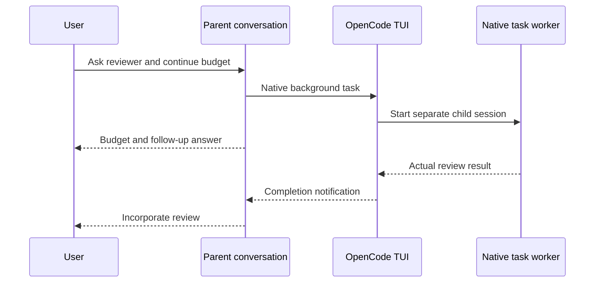

# OpenCode native delegation pilot



## Decision and scope

**Pilot OpenCode as a conditional native host.** The existing prompt-only U10
card works with the installed OpenCode 1.18.31 native background facility in a
persistent TUI. No OpenCode-specific dispatcher or skill fork is needed. The
feature is experimental and disabled by default in the tested version. A
one-shot `opencode run` exited before collecting its background worker.

The model was the existing `xai/grok-4.6`; the harness was OpenCode, not Grok Build.
This historical pilot tested source and generated skill version 0.1.0, exact U10 SHA-256
`4ee179b83bddf4cce8ce3765fc4928a6d8dc8f69199a961ca698e646ce001a27`.
Capability selection already follows exposed tools rather than model identity.
See [SKILL.md - native capability contract: generic host routing](../../../../skills/ask-agent/SKILL.md).
The current source has since advanced; [HANDOFF-RESULTS.md - U11–U14: compact handoff validation](HANDOFF-RESULTS.md)
records that separate campaign.

This is four fixed pilot rows, one model execution per row, on September 18,
2026. It is not the full repeated Claude/Grok/Codex campaign or a reliability
estimate. Complete absence of inherited context and native cancellation were
not tested here. No claim is made about V2 execution or installer integration.

## Protocol and entry points

The campaign retains its original
[PLAN.json - registered rows: prompts, bounds, oracles and input hashes](/Users/dadleet/Documents/Codex/experiments/ask-agent-opencode-20260918T164700Z/operator/PLAN.json)
and pre-execution
[PLAN-AMENDMENT-1.json - transport correction: persistent TUI and CLI negative control](/Users/dadleet/Documents/Codex/experiments/ask-agent-opencode-20260918T164700Z/operator/PLAN-AMENDMENT-1.json).
Source inspection established the one-shot lifetime boundary before O1–O3
started, so O1 became a lifetime negative control and O2/O3 used the normal TUI.
Each row had a six-minute bound. Failed model outcomes were not replaced.

Each disposable project contained the exact card at
`.opencode/skills/ask-agent/SKILL.md`. The common conversation request was:

> Use the ask-agent skill to ask an invoice reviewer to audit worker-task.md.
> Meanwhile, independently complete parent-task.md and save your result to
> parent-result.md. Report the actual parent result as soon as it is ready.
> When the reviewer returns, incorporate its actual findings into your response.
> Keep our conversation available for additional user messages while the reviewer works.

For O2/O3, the operator started the parent harness directly:

```sh
TERM=xterm-256color OPENCODE_EXPERIMENTAL_BACKGROUND_SUBAGENTS=true \
  opencode /absolute/path/to/disposable-project --auto --prompt 'the registered request'
```

`--auto` was used only for the already-authorized disposable tests. This command
starts the parent; delegation inside it uses native `task`, not another CLI.
O0/O1 used `opencode run --format json --auto --dir ...` with the flag false/true.
No scripts, plugins, SDK sessions, output watchers, or custom session drivers
implemented delegation. Inline operator calculations only checked saved evidence.
The O2 worker also used inline Python for invoice arithmetic; that shell use did
not launch an agent or implement waiting.

O2's actual follow-up was “Add a $6 delivery fee to the budget and tell me the
revised amount now.” This shortened the registered wording while preserving the
$6/$306 predicate. It was sent through ordinary TUI Return after the $300 report;
the original review continued. No operator “continue” message triggered delivery.

## Observed results

| Row | Native lifecycle result | Task result or retained limitation |
| --- | --- | --- |
| O0, background disabled | Native foreground `task`; background UNSUPPORTED. It blocked before parent work. | Audit $2482.20 and parent $300 correct. Limitation was disclosed only after the foreground fallback; this did not fulfill the requested async behavior. |
| O1, background enabled, one-shot CLI | Native `background: true`; parent work/report before child terminal. No callback was collected. | Parent $300, then exit 0 while reviewer RUNNING. Child records `MessageAbortedError` 14 ms after the parent's final response. Source supports teardown as the cause; this was not an explicit cancellation test. |
| O2, background enabled, persistent TUI | Native separate child; parent $300; actual new-input response $306 before child terminal; automatic notification and same-parent incorporation. | Correct audit total $4176.90. Child and parent incorrectly said 18 clean / 18 discrepant; the actual split is 17 / 19. Async lifecycle passes; full result accuracy does not. |
| O3, two reviewers, persistent TUI | Two distinct background children launched before parent work; $300 reported before either terminal; both results automatically incorporated. | North SUCCEEDED/$2482.20; South BLOCKED for missing INV-08 rate, no combined total. South arrived first while North stayed pending. Final roles, blocker and native collection notes retained. |

## Exact interactive trace

O2 parent `ses_f4a90ee2effeikmzYJUhdf12Ts` launched child
`ses_f4a90b033ffeOapmjUMgIsyDTJ` using native `task`, `subagent_type: general`,
`background: true`, and no resume `task_id`. Times below are native UTC events:

| Event | Time |
| --- | --- |
| Native background launch receipt | 16:52:46.167 |
| Parent result file written | 16:52:51.549 |
| Parent $300 response complete | 16:52:56.382 |
| Actual new user message accepted | 16:53:10.189 |
| Parent $306 response complete | 16:53:17.023 |
| Original child $4176.90 review complete | 16:55:30.229 |
| Synthetic completion delivered into same parent | 16:55:30.232 |
| Parent incorporates actual review | 16:55:38.010 |

This establishes the requested interaction in this trial: both useful parent
responses precede the original child's terminal event, then native delivery
causes a new parent response without operator continuation. Merely having a
different child ID would not establish that sequence or complete history isolation.
The parent preserved the worker's incorrect 18/18 summary, so delivery success
must remain separate from result correctness.

O3 used parent `ses_f4a8c84bdffevigazXwVHm7kYP`, North child
`ses_f4a8c14fdffew50gGhzC4YaDiB`, and South child
`ses_f4a8c14f0ffezglgOQz9zYPEkY`. Both launch receipts completed by
16:57:48.054; the parent reported $300 at 16:58:10.480. South completed at
16:58:45.282 and North at 16:59:38.831. Each generated its own same-parent
notification and response. The final response at 16:59:46.631 retained South's
missing-rate blocker and explicitly declined to claim that all work succeeded.

## Native mechanism and boundaries

The matching installed-tag [task.ts - background task: schema, native child and callback](https://raw.githubusercontent.com/anomalyco/opencode/v1.18.31/packages/opencode/src/tool/task.ts)
exposes `background` only under the experimental flag, creates a child session,
returns its running handle, and inserts the completion into its parent. O2's
native exports demonstrate that route rather than relying on documentation alone.
The matching [run.ts - one-shot lifetime: exit on parent idle](https://raw.githubusercontent.com/anomalyco/opencode/v1.18.31/packages/opencode/src/cli/cmd/run.ts)
and [background-job.ts - owner scope: teardown interrupts jobs](https://raw.githubusercontent.com/anomalyco/opencode/v1.18.31/packages/core/src/background-job.ts)
explain O1's boundary. Prompt wording cannot keep a closed harness alive.

The official [skills documentation - project discovery: OpenCode skill directory](https://opencode.ai/docs/skills)
documents the project-local discovery used here. The separate
[V2 tools documentation - subagent: background support](https://opencode.ai/v2/docs/tools#subagent)
describes a different API; it is a candidate for later validation, not evidence
that installed V1 or this pilot tested V2.

Full hidden startup context, canary controls, cancellation, restart survival,
delivery during a particular parent tool call, and repeatability remain outside
this pilot. The two successful parent replies in O2 occurred while the child was
live; they do not imply parent and child have isolated filesystems. OpenCode is
not yet a host option in `install.sh`; these tests used disposable project-local
copies. No global skill installation or persistent flag was added.

## Evidence and cleanup

The [RESULTS.json - case receipts: native IDs, timing and qualified assessments](/Users/dadleet/Documents/Codex/experiments/ask-agent-opencode-20260918T164700Z/operator/RESULTS.json)
records all four outcomes and the independent review. Derived
[O2.parent.observable.json - native parent events: follow-up and automatic result](/Users/dadleet/Documents/Codex/experiments/ask-agent-opencode-20260918T164700Z/operator/O2.parent.observable.json)
and [O3.parent.observable.json - native parent events: two results and retained blocker](/Users/dadleet/Documents/Codex/experiments/ask-agent-opencode-20260918T164700Z/operator/O3.parent.observable.json)
exclude reasoning parts. Original native exports remain local; private reasoning
was not inspected or graded, and no opaque records were decrypted.

The [O2-result-quality.json - independent recomputation: 17 clean and 19 discrepant](/Users/dadleet/Documents/Codex/experiments/ask-agent-opencode-20260918T164700Z/operator/O2-result-quality.json)
checks the extra quality finding directly against fixture files. This does not
rewrite the registered total oracle. A read-only O3 session-list command returned
empty stdout once; a retry from the participant directory recovered its locator.
No model execution was rerun to replace a failed outcome.

The [INTEGRITY.json - final check: unchanged inputs and participant cleanup](/Users/dadleet/Documents/Codex/experiments/ask-agent-opencode-20260918T164700Z/operator/INTEGRITY.json)
matches all **134 registered input hashes**, confirms source/generated U10 parity,
and records zero owned OpenCode participant processes. O2/O3 exited normally only
after both required result collection and parent incorporation. O0/O1 also exited
0, which did not make their background interaction successful. Disposable inputs,
native sessions and evidence were retained; no global configuration, credentials,
installation, upgrade, commit, push or publication changed. This extension edits
usage/evidence documentation only; the tested skill bytes are unchanged.
