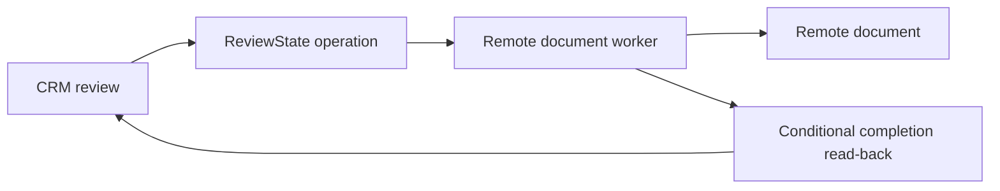

# CRM remote-document discovery

Status: bounded design discovery only. No product, remote-state, credential, or deployment change was made. All remote observations below are synthetic fixture evidence, not proof of a live tenant.

## Baseline and current-system evidence

The unchanged local fixture passed `python3 -B -m unittest discover -v`; [BASELINE.txt](BASELINE.txt) records its command and output. That single test only confirms the local `CRM_RUNTIME_ALIAS` value. The README supplies the requested outcome. `src/app.py` identifies `crm-review-service`; `docs/environment.md` is a dated account that named `tenant-blue` and said both writers were enabled. Current synthetic reads contradict that dated note: CRM resolves to `tenant-green`, and the document worker cannot write.

The read-only probe receipts are in `/Users/dadleet/tmp/shiploop-discovery-implementation-20260920/semantic-v1/cases/multi/tool-receipts/probes.jsonl`. CRM inventory pagination was completed: page 1 exposed `LegacyCache`; page 2 exposed `ReviewState`. Its inspected schema has `operation_id`, `status`, and `revision`; uniqueness, atomicity, and migration permission remain unverified. The CRM runtime principal is configured for `ReviewState` read/write, but that behavior was not exercised.

## Candidate design and boundary

The smallest compatible design to assess in later stages is an operation-oriented flow: a CRM review records a durable operation identity and revision in CRM-owned `ReviewState`; a separately executing document worker uses that identity to create the remote document; it records the document ID and terminal status through a conditional, revision-aware completion path; CRM then reads the authoritative terminal state. This preserves an independent runtime boundary: the developer workstation may initiate neither execution nor state retention after acceptance.

This is a proposal, not an approved implementation choice. `ReviewState` is only a candidate authority because its concurrent-write and idempotency semantics are unknown. The inspected document-side facility, `shared workflow-state.json`, has `operation_id`, `document_id`, and `status`, but its lock covers only its document project and excludes external writers; it cannot be treated as cross-system exclusion. Cache use is not justified by the evidence and should remain out of scope unless a later contract shows a freshness or load need.

## Material prerequisites and earliest consumers

1. **Document-worker authority is blocked.** The current `document-worker` runtime principal has write denied for target `folder-shared`; `metadata-reader` can only read. An owner must establish the minimum remote document-write permission and its target before implementation or an end-to-end test. A discovery metadata read does not prove unattended writer authority.
2. **Completion ownership is unresolved.** The document boundary reports only “queued, not completed”; processor, recovery owner, and lost-acknowledgement behavior are unspecified. Before a review can safely promise document generation, define the durable acceptance point, worker/recovery owner, terminal states, retry/duplicate/stale handling, and authoritative read-back.
3. **CRM concurrency contract is unresolved.** Establish `ReviewState` uniqueness, conditional-update/atomicity behavior, and schema-change permission. The eventual operation ID/revision path must prevent a stale worker from replacing a newer terminal result.
4. **Environment and delivery route are unknown.** This fixture has no Git repository, deployment configuration, CI, or documented consumer route. A later plan must identify the remote runtime target, deployment owner, promotion/rollback path, and the exact remote read-back surface. No source-return or deployment effect can be inferred here.

Due verification is therefore remote and target-specific: an authorized CRM review must create an operation, a remote worker must complete without the developer workstation, and CRM must read a stable document ID/terminal state. The local baseline does not satisfy those checks. The direct source-and-probe path was sufficient for this bounded discovery; no additional investigation mechanism was created.

## Revalidation

Before planning any implementation, reopen the current remote identities/targets and probe receipts; recheck that the worker has the selected write authority, that the CRM schema supports the chosen concurrency rule, and that a processor/recovery owner is known. Keep the dated `tenant-blue` statement as historical rather than overwriting it with the current synthetic observations.
