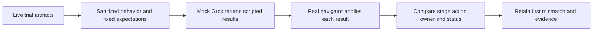

# Captured behavior and fast Grok/DAG replay



This suite checks ShipLoop's routing without waiting for a model to build an
application. The mock supplies deterministic agent results; the production
navigator still owns every state transition. Fixture expectations are fixed
independently of that routing implementation. A change to the DAG therefore
requires an explicit fixture review rather than silently changing the oracle.

## Run the short suite

From the skill-craft repository root:

```sh
python3 -B test/experiments/shiploop_e2e/check_suite.py --suite mock
python3 -B test/shiploop-full-runtime.test.py \
  FullRuntimeCompositionTests.test_v3_intake_host_observer_bridge
python3 -B test/experiments/shiploop_e2e/dag_replay.py \
  --output /tmp/shiploop-dag-replay-01
```

Choose a new output directory. The first command runs assertion and mutation
tests. The second runs the short real CLI/Improve-to-host-observer bridge. The
third retains an inspectable replay report and per-case evidence.
Use `dag_replay.py --help` for explicit case selection and source selection.
Neither command launches Grok or another model, contacts a service, or executes
commands from a captured transcript. The live runner's two-hour cap and `xhigh`
setting apply to live requests, not to these deterministic replays.

## Capture a behavior fixture

Future live trials write a derived `behavior.json` beside their original raw
capture and result. Interrupted or incomplete attempts retain explicit gaps.
Export a retained trial without changing its original records:

```sh
python3 -B test/experiments/shiploop_e2e/behavior_capture.py \
  --trial /absolute/retained/trial \
  --output /tmp/shiploop-behavior-01.json \
  --case-output /tmp/shiploop-derived-cases-01
```

The portable record retains source hashes, requested settings, process outcomes,
native-event counts, accepted action order, result outcomes, work-item ownership,
and original outcome qualifications. It replaces free-text summaries and work
item labels with synthetic labels. It does not copy prompts, model prose,
commands, product source, credentials, or user paths. Original raw logs remain
the audit authority; the compact record deliberately cannot answer every
semantic question about a run.

Only an unambiguous complete protocol-2 sequence of accepted `done` results is
currently eligible for automatic case derivation. Partial, blocked, unsupported,
or protocol-3 observations can still be captured, but the exporter must not
invent missing control calls or child receipts to make them replayable. Current
protocol-3 behavior is covered by independently authored synthetic cases.

Fixtures labeled `retained-trace` must carry the exporter's source hash records,
matching result identity, one accepted-result digest per step, original outcome
and isolation qualification, and verified initial-scope metadata. Validation
also checks the exported v2 result shape and contiguous recorded steps. Original
prompts remain omitted. The accepted-result digests identify the original
records, not the sanitized replacement text; these local schema checks do not
authenticate a fixture author or recheck unavailable original artifacts.
Hand-authored examples use `kind: synthetic`.

The checked-in replay cases come from the tic-tac-toe create (two work items)
and Checkers create (one item). The invalid tic-tac-toe feature is retained as
a behavior observation with its reused-run qualification; it is ineligible for
automatic replay-case derivation. Checkers' product failure travels with its
routing fixture. A successful replay of accepted stage order cannot rehabilitate
a live product result. Preexisting history is not relabeled as work performed by
a fresh one-shot request.

## Mock boundary and failure evidence

`mock_grok.py` implements a dedicated JSONL request/response protocol, not a
replacement for the installed Grok executable. It returns fixture responses
bound to the current action and request. Its native-shaped events are marked
synthetic. `dag_replay.py` consumes those values through the real navigator
state API and records expected versus actual transitions, source/fixture
identity, state and packet hashes, and transport output. Captured shell text is
never executable input to either component.

Operator-authored mock cases are trusted local test data, and their scripted
result text is retained in debug output. Keep those cases non-sensitive. The
allowlisted sanitization guarantee applies to the live-behavior exporter; the
mock transport is not a general secret scrubber for arbitrary custom fixtures.

For example, a protocol-3 `intake` producer response must leave the same action
waiting for Improve. A synthetic Improve completion can then advance to
`discovery`. An expectation that producer completion goes directly to
`discovery` fails at that first edge. Other controls exercise work-item order,
repetition, blocked/resumed work, cold state reload, corrective work, and stale
or conflicting callbacks. A replay mismatch is an apparatus/protocol result;
it is not an application-test result.

The report pins the ShipLoop and fixture inputs used. Changes during replay
invalidate that observation. Retained protocol-2 paths stay protocol 2; they
are never silently translated into the newer graph. Review an intentional DAG
change against the current contract and add a separately labeled case.

## Evidence limits

Every mock result is simulation-only with zero model calls. It does not prove
prompt comprehension, reviewer quality, game behavior, deployment, or one-shot
success. Direct navigator calls with synthetic Improve receipts test the parent
handoff; they do not certify the standalone Improve runtime's receipt checks.
The repository's existing `shiploop-actual-improve-cli.test.py` and
`shiploop-standalone-improve.test.py` cover that separate CLI/runtime boundary.

Existing host-shape fixtures test what the observer can attribute from real
shell shapes, including heredoc limitations and a masked failure. Existing
recovery-isolation fixtures reject old-run reuse. Keep those tests beside DAG
replay: a completed stage sequence alone cannot establish either transport
attribution or fresh-request identity. Separate observer regression tests check
protocol-aware smoke boundaries: the existing `plan-improve` selection means
v2 `plan-improve` or v3 accepted `plan` after Improve. A v3 producer callback alone
cannot satisfy lifecycle evidence. These fixture checks do not establish a new
live Grok smoke result.

## Real CLI to synthetic host events

`FullRuntimeCompositionTests.test_v3_intake_host_observer_bridge` runs one real
`init -> intake -> Improve import -> discovery` prefix with copied ShipLoop and
Improve packages. It captures the actual producer-pending state and accepted
state, then feeds the recorded CLI outputs through synthetic Grok events, the
process capture layer, and the live observer parser. The negative streams remove
completion evidence, duplicate a tool call, or omit the terminal event. They
reuse immutable records; they do not rerun or alter the accepted state.
Completed tool events with no reported exit code remain unattributed.

An accepted action, an attributed callback, and a complete host stream are
separate observations. A producer result alone leaves intake pending Improve;
a missing terminal event does not erase an already observed callback. This
bridge tests those boundaries, not Grok's interpretation of skill prose.

| Existing check | Contract |
| --- | --- |
| Short bridge method above | Real CLI/Improve result and state reach the host observer correctly |
| `python3 -B test/shiploop-full-runtime.test.py` | Full 34-stage route, real child runtime, worktree return, recovery and generated package selection |
| `check_suite.py --suite mock` | Fast routing, fixed fixture expectations and negative controls |
| `check_suite.py --suite workflow` | Recorded workflow evidence, v3 parent/child inventory and campaign qualifications |

Live `result.json` retains lifecycle counts and missing callback IDs; `audit.json`
retains stage counts. DAG replay `report.json` retains ordered transitions,
owners, action IDs, state hashes and packets. The CLI composition test reports
failing command outputs in its assertion diagnostics; its internal trace is
temporary and is removed during cleanup. Capture the unittest stdout/stderr when
retained diagnostics are needed. These checks do not claim exhaustive branch
coverage merely because all 34 stages were visited.
