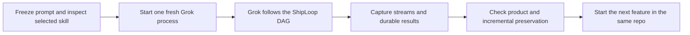

# ShipLoop one-shot Grok E2E campaign



This is an **opt-in live test harness for ShipLoop itself**. It launches the
normal Grok CLI with one literal `/shiploop …` prompt, observes the process and
the returned product, and records separate verdicts. It never completes a
ShipLoop callback, supplies a generated plan, sends a repair prompt, or silently
retries a failed request. The scenario catalog contains nine requests: create,
add a feature, and refine a feature for tic-tac-toe, checkers, and Battleship.
The first campaign is local only; hosted delivery is a later separate campaign.

The primary result is the audit of ShipLoop's behavior. Use
[WORKFLOW-REVIEW.md](WORKFLOW-REVIEW.md) and `workflow-review-template.json` to
review each run's durable state, scope decisions, selected versus executed
tests, Improve evidence, recovery, and performance. Report this beside product
and callback verdicts; a working game alone does not establish workflow quality.
The complete local-suite design, experiments, and live-claim gate are in
[the full-suite plan](../../../docs/shiploop-e2e-full-suite-plan-2026-09-17.md).

## Fast mock Grok and DAG checks

Use Python 3.10 or newer for this E2E apparatus; the game oracles use
`zip(..., strict=True)`. On macOS, keep that interpreter explicit when selecting
Command Line Tools Git: prepending its directory to `PATH` can also select
Apple's older Python 3.9. The September 17 fix validation used Python 3.14.7.

```sh
python3 -B test/experiments/shiploop_e2e/check_suite.py --suite mock
python3 -B test/experiments/shiploop_e2e/dag_replay.py --output /tmp/shiploop-dag-replay-01
```

These commands use scripted Grok responses with the real navigator transition
code, including current-protocol synthetic cases and sanitized paths retained
from real E2E runs. Future live trials also write `behavior.json` for repeatable
analysis and case derivation. Source drift, wrong edges, callback conflicts, and
missing evidence remain visible. Mock passes cannot establish live application
or model success. See
[MOCK-REPLAY.md — capture, replay, and evidence boundaries](MOCK-REPLAY.md).

## Short suites and selected cases

All model runs default to **`--reasoning-effort xhigh`**. The exact model and
requested effort are retained in each manifest. Use `suites` to list the current
case selections and budgets without calling a model:

```sh
python3 test/experiments/shiploop_e2e/run.py suites
python3 test/experiments/shiploop_e2e/run.py suite \
  --suite launch-smoke --output /tmp/shiploop-launch-01 --model grok-4.6
python3 test/experiments/shiploop_e2e/run.py suite \
  --suite launch-smoke --only checkers-create \
  --output /tmp/shiploop-checkers-01 --model grok-4.6
```

| Suite | Cases | Observation boundary |
| --- | --- | --- |
| `launch-smoke` | Tic-tac-toe and checkers create | Accepted `intake` and its real callback |
| `planning-smoke` | Tic-tac-toe create | Reviewed plan: v2 `plan-improve`; v3 accepted `plan` after Improve |
| `ttt-full` | Create, guidance, best-move refinement | Full verified product and predecessor chain |
| `checkers-full` | Create, guidance, hint-toggle refinement | Full verified product and predecessor chain |
| `battleship-full` | Create, status/history, history-filter refinement | Full verified product and predecessor chain |
| `games-full` | All nine requests | Three independent full product chains |

Initial live observations and retained failed attempts are recorded in
[SAMPLES-2026-09-17.md](SAMPLES-2026-09-17.md).

All suites default to a **two-hour (7200-second)** cap and a secondary cap of
1000 turns. Partial suites stop at their chosen stage when reached.
Historical runs retain their recorded 80-minute caps; compare future two-hour
runs as a distinct budget condition.
The manifest owns per-case time/turn caps; `--timeout` and `--max-turns` override
them for a campaign. Caps are not expected durations. `--only` accepts a case
ID or scenario step ID and may be repeated. A single feature can reuse its
retained, verified predecessor with `--repo` and `--baseline`. A failed or
unverified create blocks its dependent cases; all selected cases remain in
`suite-result.json`, including blocked cases. Other independent families can run.

Default suite products live in a separate, durable temporary parent with opaque
repo names, outside the campaign's `--output` tree. `suite-execution.json` records
the product-key-to-repo mapping so subsequent cases use the same physical repo.
Retain that parent for feature work and auditing; the suite does not automatically
delete it. An explicit `--repo` must not contain, or be contained by, campaign
controls. The suite does not resume an existing output directory; independent
feature invocations still use the verified `--repo` and `--baseline` contract.

A partial run sends exactly the same application prompt as its full case.
The observer waits for matching durable accepted results and captured successful
host-tool completions, then signals the private process group. It never submits
a callback or tells Grok to skip SDLC stages. `partial-smoke-passed` establishes
only that prefix, and cannot become a full product pass or predecessor. A missed
boundary, timeout, missing callback, changed skill, or truncated capture fails
the smoke; extra accepted stages are reported as `partial-smoke-overshot`.
Polling is not an atomic pause: work on the next action can begin before the
stop signal, and edits are not rolled back. Retain these disposable workspaces
for audit; do not use them as verified feature baselines.

For a shorter feature-prefix check against a verified product:

```sh
python3 test/experiments/shiploop_e2e/run.py run \
  --step ttt-guidance --repo /absolute/verified/tic-tac-toe \
  --baseline /absolute/previous-trial/result.json \
  --output /tmp/shiploop-feature-intake-01 --model grok-4.6 \
  --stop-after-stage intake --timeout 7200 --max-turns 1000
```

Choose any prelude boundary through `plan-improve`. The legacy review names
`research-improve`, `spec-improve`, and `plan-improve` remain selection aliases:
on protocol 3 they resolve to the corresponding accepted stage after its Improve
child completes. Callback auditing requires `improve-complete` for protocol 3;
its earlier producer `complete` call does not establish stage acceptance.
INNER boundaries are not exposed because the same stage recurs across work
items and needs a separate explicit selection contract.

**Implemented versus unproven:** the runner, capture/identity checks, scenario
catalog, receipt validation, composite game-oracle framework, source-closure
check, workflow-review validation, and fast fake-host tests are local apparatus.
No passing apparatus test establishes nine live Grok passes, a universal browser
adapter, or hosted Apps Script behavior. Independent UI verification still
requires a local consumer route and a reviewed mapping for the returned app.
There is deliberately no assumed universal Apps Script emulator or mandated
application framework. Missing verification remains `unverified` and does not
become a passing skip.

## Start with three tic-tac-toe requests

Run these commands from the repository root. Choose an actual model ID supported
by your installed Grok; the runner requires it rather than silently inheriting
a changing default. Each output directory must be new. All campaign artifacts
and generated games should live outside the skill-craft checkout.

```sh
python3 test/experiments/shiploop_e2e/run.py list
python3 -m unittest discover -s test/experiments/shiploop_e2e -p 'test_*.py'

python3 test/experiments/shiploop_e2e/run.py check --repo /absolute/disposable/repository
python3 test/experiments/shiploop_e2e/run.py run \
  --step ttt-create \
  --repo /tmp/shiploop-campaign/products/tic-tac-toe \
  --output /tmp/shiploop-campaign/trials/ttt-create-01 \
  --model YOUR_GROK_MODEL
```

The retained-product source-closure check is opt-in: it is skipped unless both
`SHIPLOOP_E2E_RETAINED_TTT` and `SHIPLOOP_E2E_RETAINED_CHECKERS` name local product
directories. `SHIPLOOP_E2E_GIT` can select an executable Git binary for the
evidence fixtures when the PATH-selected `git` is unusable. These variables are
read only for the process and are never persisted by the apparatus.

The runner creates a missing product folder for `create` and leaves Git
bootstrap to Grok/ShipLoop. New-app cases require a physically empty folder, with no preinitialized `.git`. Both the process CWD and Grok `--cwd` are that folder; feature cases use the existing original product root. It refuses
a nonempty new-app fixture, a product subdirectory inside another Git repo,
overwriting trial output, or storing evidence inside the product.

`--permission-mode` defaults to Grok's `default`; it is recorded. If the
installed host needs an approval, the unattended request may stop. Configure a
suitable **existing authorized** posture explicitly for a live campaign; the
runner does not turn approvals off automatically. `--timeout` (default 7200
seconds / 2 hours) and `--max-turns` (default 1000) are initial pilot caps, not measured
performance claims. Freeze the same caps for compared runs. A timeout retains
evidence and stops the process group; it is never success or an automatic retry.

Grok inherits its normal authenticated environment; no auth files or environment
dump are copied into the report. Memory is disabled for the child process and
auto-update is disabled in argv. The runner is **not a filesystem/network
sandbox**. Use disposable products and your existing tool permission boundaries.
The local-only product prompt constrains deployment, not ordinary documentation
reads or model/network access. Full effect isolation would require a separately
validated host sandbox; this harness does not claim it.

The full `run` command returns 0 only for a completely graded pass; 2 also covers an
otherwise completed build that still needs independent verification. Inspect
`result.json` and `REPORT.md` to distinguish those cases.
An explicitly partial run returns 0 for `partial-smoke-passed`, with product
verification still `unverified`. Suites return 0 only when every selected case
satisfies its declared scope.

On macOS, when the Git probe selects Command Line Tools, the child also receives
`DEVELOPER_DIR=/Library/Developer/CommandLineTools`. This prevents a login shell's
PATH reset from selecting an unusable Xcode Git; no system toolchain setting is
changed. The override is recorded. Default artifact roots cover the product and
`.shiploop-runs` under its parent and grandparent; pass `--artifact-root` for
another known workspace location. Missing capture is unverified, never inferred.

Live capture defaults to 256 MiB per stream/event file and 4 Mi characters per
native event (`--max-log-bytes`, `--max-event-line-chars`). Grok can represent one
tool result as both text and byte arrays, so ordinary source reads can exceed
128 KiB. Exceeding either limit is still explicit truncation and fails grading;
the harness never silently treats dropped evidence as complete.

## Skill changes are selected again for every request

Each request starts a fresh OS process and session; neither `--continue` nor
`--resume` is passed. Before launch and again after exit, `grok inspect --json`
runs with the product as cwd. Its selected `shiploop` source must resolve to
`--skill-root` (default: the configured Grok ShipLoop skill directory). The option is an **expected
identity assertion**, not a Grok option, installation, profile edit, or override.
A repo-local stale skill that shadows the expected one fails preflight.

The entire selected package is hashed, including prompt/reference/script files
and resolved symlink dependencies. The manifest retains both logical and
resolved locations; `package-inputs/` retains the observed source bytes by digest
for later diagnosis (credential-shaped content is omitted and reported).
Editing ShipLoop between requests therefore changes the
next manifest's digest. Changes during a request invalidate that trial. Keep
the source stable for the lifetime of a live run; do not fix ShipLoop while that
run is still sampling it.

`harness-inputs/` separately freezes the observer's Python and JSON sources,
including the suite catalog; its digest is in the trial manifest. This lets an
audit distinguish a ShipLoop revision change from a capture/grading change.
`observer-provenance.json` retains per-file hashes even when source bytes are
omitted. The runner fingerprints at trial entry, checks again after preflight
and immediately before model launch, and compares after observation/verifier
execution. A detected change prevents launch or invalidates the trial; later
grading cannot restore a pass. Keep observer sources stable for the entire
runner process, including between suite cases: these disk checks do not directly
attest already-imported Python bytecode or detect a change restored between checks.

Native stream command advertisements and successful ShipLoop tool invocations
are separate observations. Inspection and disk hashes prove which package was
selected on disk; they do not prove that a model obeyed every instruction or
reveal its hidden context. Actual script use must be observed in structured
tool events. A full pass additionally requires observed start, every accepted
action's `complete`/`done` callback, and the worktree return, bound to that new
run's paths/action IDs. An `init` call plus completed-looking files is insufficient.
For shell strings, only the final executable command can receive automatic
lifecycle credit. Earlier commands share a final status that does not establish
their individual success. Conditional/pipeline syntax, control flow, dynamic
assignments, and unsupported heredocs stay unattributed. The adapter supports a
narrow standalone quoted Python heredoc followed by one literal terminal
ShipLoop callback; it never evaluates shell code to interpret it.
Missing or truncated host telemetry is an evidence limitation.

Captured model tool inputs are also checked for absolute-path references to
campaign/trial controls and observer source. Observed references invalidate the
trial and cannot be cleared by a later passing verifier or grade. These are
conservative input-reference observations, not proof that every attempted read
succeeded. Model text and tool output are not treated as file access; the
observer's own launch argv is not a model tool call. This check does not establish
absence of relative traversal, encoded paths, shell indirection, or unreported
access. Moving controls away from product ancestors reduces accidental exposure;
neither the layout nor this detector is an OS sandbox.

Late grading re-fingerprints the running observer against the trial's frozen
identity. Editing the observer after capture invalidates that trial's grade;
it does not silently reinterpret the old run as a pass. Missing or conflicting
identity fields in observer-bound receipts also fail closed. Unbound historical
receipts retain an explicitly reported legacy compatibility path.

The September 17 inspection found `SKILL.md` at 0.11.1 and a legacy 0.9 entry
description in `commands/shiploop.md`. Both are part of the package fingerprint.
Keep the original baseline for the first campaign; investigate an observed
routing failure before changing production prompts.

## Independent verification and incremental feature runs

The runner saves read-only `product-before/` and `product-after/` source copies
plus hash manifests. Product files are hashed even when Git ignores them.
Credentials and external symlinks keep hash identities but are omitted from
copies. Git metadata and untracked conventional dependency/runtime cache trees
are excluded and reported in `skipped`; explicitly tracked inputs remain hashed.
Creating or removing an excluded cache does not itself change product identity.
The exclusion names are declared in `evidence.py`; they do not cover arbitrary
build/output directories. A copy with omissions may need a separately established
local test environment before replay. The runner writes
`verification-template.json` with every required assertion
unverified. Use an independent checker to populate it with real evidence, or
pass `--verifier '["/absolute/checker", "argument"]'`. This is structured argv,
never a shell string. The checker runs after Grok has exited, receives
`SHIPLOOP_E2E_TRIAL`, `SHIPLOOP_E2E_REPO`, `SHIPLOOP_E2E_BASELINE`, and `SHIPLOOP_E2E_EVIDENCE`, writes its
artifacts under that evidence directory, and emits one JSON receipt on stdout.
Its own stdout/stderr and exit status are captured separately. It must not edit
the product; the runner checks the candidate digest again afterward.
Both `pass` and `fail` declarations, including incremental reviews, require at
least one valid pinned evidence artifact. A bare failure declaration is an
invalid receipt, not evidence that the current product failed. Use `blocked` or
`unverified` when the observation is unavailable.

To validate an independently produced receipt later:

```sh
python3 test/experiments/shiploop_e2e/run.py grade \
  --trial /tmp/shiploop-campaign/trials/ttt-create-01 \
  --receipt /tmp/shiploop-campaign/trials/ttt-create-01/verification.json
```

Receipts bind the exact trial, candidate, baseline, required check IDs, and
nonempty evidence files by SHA-256. Receipt validation proves binding and
completeness; it cannot authenticate a checker's claim merely because an
artifact exists. Use executable browser/rules evidence for behavior and an
independent source/behavior review for lineage. Agent-authored tests are useful
evidence but cannot replace the independent checks. Review the artifacts before
treating a reported pass as credible.

`verify_suite.py` is the common independent verifier for all nine catalog
steps. It chooses an explicitly supplied bounded driver by step ID or game
family, replays predecessor behavior against the immutable pre-feature snapshot
and final candidate, performs local GAS entrypoint/resource closure checks, and
combines a separately supplied independent review for scope, return, and
incremental-integration claims. It emits the existing hash-bound receipt schema.
Use it through `run.py --verifier` so its own process capture and post-verifier
candidate-digest check remain in effect:

```sh
python3 test/experiments/shiploop_e2e/run.py run \
  --step ttt-create --repo /tmp/shiploop-campaign/products/tic-tac-toe \
  --output /tmp/shiploop-campaign/trials/ttt-create-01 --model grok-4.6 \
  --verifier '["python3","/absolute/skill-craft/test/experiments/shiploop_e2e/verify_suite.py","--drivers","/absolute/drivers.json","--review","/absolute/reviews.json"]'
```

`drivers.json` has schema `shiploop-e2e-drivers/1` and maps a step ID or family
ID to structured argv, optional timeout, output bound, and JSON configuration.
Relative adapter paths resolve from the registry's own directory. `--review` input
must be independently authored and hash-bound to the trial, candidate, and
baseline; it is not candidate-owned product evidence.
`--review` accepts one `shiploop-e2e-independent-review/1` record or a registry
keyed by step ID. The verifier accepts `--driver-timeout` and
`--max-driver-output-bytes` when the caller needs tighter bounds. It never
discovers selectors or invents a local server route.

This is an intentionally unconfigured shape; replace every placeholder with an
actual reviewed local adapter before using it. An absent driver must remain
unverified.

```json
{
  "schema": "shiploop-e2e-drivers/1",
  "drivers": {
    "tic-tac-toe": {
      "argv": ["node", "adapters/browser_driver.cjs", "--mapping", "adapters/REVIEWED_MAPPING.cjs", "--playwright", "/absolute/playwright", "--browser", "/absolute/chrome"],
      "timeout_seconds": 60,
      "max_output_bytes": 8388608,
      "config": {"mapping_scope": "replace-with-reviewed-candidate-identity"}
    }
  }
}
```

An independent-review placeholder is also deliberately unverified. The actual
record must bind the exact trial/candidate/baseline digests and materialized
external evidence; it cannot be written into the product under review.

```json
{
  "schema": "shiploop-e2e-independent-review/1",
  "step_id": "ttt-guidance",
  "trial_id": "REPLACE_WITH_TRIAL_ID",
  "candidate_digest": "REPLACE_WITH_CANDIDATE_DIGEST",
  "baseline_digest": "REPLACE_WITH_BASELINE_DIGEST",
  "rationale": "Placeholder only: no scope, return, or lineage conclusion.",
  "classification": "unverified",
  "prior_entry_reachable": false,
  "feature_integrated": false,
  "evidence": [],
  "review_owned_checks": [
    {"id": "local-only-scope", "status": "unverified", "evidence": [], "details": "Replace after independent review."},
    {"id": "run-returned-to-product", "status": "unverified", "evidence": [], "details": "Replace after independent review."}
  ]
}
```

The supplied `adapters/browser_driver.cjs` is a trusted external, read-only
browser observation boundary. It serves only the mapping's explicitly assembled
entrypoint; sibling assets and external requests are unavailable. It is not an
OS/network sandbox and does not autonomously generalize a mapping. Its response
binds the requested action payload and repository identity for the captured
trace. Before/after source hashes detect persistent drift, but cannot detect a
driver that changes source and restores it before returning, or prove that its
observations are truthful. Review the adapter and its mapping as trusted test
code; a matching digest is not enforced read-only execution.
`adapters/tictactoe_20260917.cjs` is pinned to the inspected September 17
TTT baseline source hashes and deliberately rejects a changed candidate. It
establishes only that known mapping, not a portable Tic-tac-toe adapter or a
mapping for later feature output. Checkers and Battleship behavior oracles are
implemented, but each returned app still needs its own reviewed external adapter
and driver-registry entry.

After independently grading the predecessor, run a fresh feature request:

```sh
python3 test/experiments/shiploop_e2e/run.py run \
  --step ttt-guidance \
  --repo /tmp/shiploop-campaign/products/tic-tac-toe \
  --output /tmp/shiploop-campaign/trials/ttt-guidance-01 \
  --baseline /tmp/shiploop-campaign/trials/ttt-create-01/result.json \
  --model YOUR_GROK_MODEL
```

The retained-product source-closure check is opt-in: it is skipped unless both
`SHIPLOOP_E2E_RETAINED_TTT` and `SHIPLOOP_E2E_RETAINED_CHECKERS` name local product
directories. `SHIPLOOP_E2E_GIT` can select an executable Git binary for the
evidence fixtures when the PATH-selected `git` is unusable. These variables are
read only for the process and are never persisted by the apparatus.

Then use `ttt-best-move` with the guidance result as predecessor. The original
product path and exact pre-feature content must match the predecessor. Each
feature uses a new Grok session and should create a fresh external ShipLoop run;
old completed runs are preserved, never resumed as the new request. Default
artifact scanning covers the product and sibling `.shiploop-runs`; use repeated
`--artifact-root` for other known external workspace locations. Missing capture
is unverified; the observer never invokes `next` to manufacture a packet.

`--diagnostic-unverified-baseline` permits exploratory continuation after an
unverified predecessor while preserving the same bytes and lineage. Such trials
are explicitly diagnostic and cannot be graded as full passes. It is not a
replacement-app fallback. A broken or changed predecessor is still rejected.

For each feature, use the saved read-only external copy of the pre-feature product
for regression and absent-before/present-after checks. A feature already present
in that baseline is a non-causal observation, not evidence that this request
implemented it. File retention, ancestry, renames and churn are diagnostic
signals; no arbitrary changed-line threshold proves or disproves a rewrite.
Review that the earlier reachable game and its behavior remain, with the new
feature integrated into it. A justified material refactor needs explicit review.

## Offline apparatus groups and workflow inventory

Run the complete no-model apparatus or a focused group without launching Grok:

```sh
python3 test/experiments/shiploop_e2e/check_suite.py --suite all
python3 test/experiments/shiploop_e2e/check_suite.py --suite games
python3 test/experiments/shiploop_e2e/check_suite.py --suite workflow
python3 test/experiments/shiploop_e2e/check_suite.py --suite regressions
```

The groups are fixture checks only: `harness` covers capture, source/receipt,
runner, suite, and audit contracts; `games` covers game oracles, closure,
composite verification, and driver transport; `workflow` covers review
inventory, campaign comparison, and recovery isolation; `regressions` is the
cross-cutting retained-failure set. `check_suite.py` writes an optional receipt
with `model_calls: 0`; it is not a live campaign result.

Use `shiploop-e2e-workflow-review/2` for a complete per-trial workflow review.
In addition to the eight dimensions, it inventories every selected test ID and
every Improve action ID, then gives each selected test an observed method and
disposition and each Improve action reviewer availability, scope, currency, and
fallback limitation when needed. Omitted inventory items, HTTP/DOM/engine
substituted for a selected interaction, or missing reviewer availability remain
gaps or unverified; they cannot become a product pass through the catalog grader.
Campaign comparison keeps planned-but-not-run cases, failures, interruptions,
missing reviews, observer versions, and changed settings in the denominator.

## Preregistered campaign accounting

`campaign.py` is read-only. It never launches, retries, grades around, or
selects away a model run. Give it a `shiploop-e2e-campaign/1` manifest before
launching an arm, then point each planned case at its retained trial only after
the trial exists:

```sh
python3 test/experiments/shiploop_e2e/campaign.py \
  --manifest /absolute/campaign.json --output /tmp/shiploop-campaign-report-01
```

Every arm needs an `id`, `expected_skill_digest`, complete `expected_settings`,
and planned cases with `step_id`, positive `repetition`, optional `trial`, and
optional `workflow_review`. `expected_settings` must contain the runner-derived
fields `prompt_sha256`, `model`, `reasoning_effort`, `timeout_seconds`,
`max_turns`, `permission_mode`, `partial`, `stop_after_stage`, `observer_digest`,
`baseline_digest`, `initial_source_digest`, `verifier_identity`, and
`verifier_inputs_sha256`. Values must be frozen before launch; a retrospective
manifest may describe history, but the report labels missing or changed settings
as comparability limits rather than calling it preregistered.

```json
{
  "schema": "shiploop-e2e-campaign/1",
  "arms": [
    {
      "id": "baseline",
      "expected_skill_digest": "REPLACE_WITH_FROZEN_SKILL_DIGEST",
      "expected_settings": {
        "prompt_sha256": "REPLACE_WITH_LITERAL_PROMPT_SHA256",
        "model": "grok-4.6",
        "reasoning_effort": "xhigh",
        "timeout_seconds": 7200,
        "max_turns": 1000,
        "permission_mode": "REPLACE_WITH_FIXED_PERMISSION_MODE",
        "partial": false,
        "stop_after_stage": null,
        "observer_digest": "REPLACE_WITH_FROZEN_OBSERVER_DIGEST",
        "baseline_digest": null,
        "initial_source_digest": "REPLACE_WITH_FROZEN_INITIAL_SOURCE_DIGEST",
        "verifier_identity": "REPLACE_WITH_VERIFIER_IDENTITY",
        "verifier_inputs_sha256": "REPLACE_WITH_FROZEN_VERIFIER_INPUT_DIGEST"
      },
      "cases": [
        {"step_id": "ttt-create", "repetition": 1, "trial": null, "workflow_review": null}
      ]
    }
  ]
}
```

The JSON is a template, not runnable evidence. For feature cases,
`baseline_digest` and `initial_source_digest` must describe the exact verified
predecessor snapshot. For a create case `baseline_digest` is `null`. Keep every
planned row, including `trial: null`, in the report denominator.

## Fresh requests versus recovery isolation

A later feature is a fresh one-shot request even when its words match a retained
earlier request. For a fresh request, `next` may not target a run present in the
trial's `initial-evidence.json`; a new matching run/workspace identity must be
observed and the old state must remain unchanged. Explicit recovery is a separate
experiment and is not a new feature claim.

The external/private retained validation-chain artifact at
`$CAMPAIGN_ROOT/trials/ttt-guidance` (not included in this repository)
is classified as this recovery-isolation experiment, not as a clean TTT E06
feature-chain trial. Its fresh Grok process found the active earlier
`tic-tac-toe-indicator` root and successfully invoked `next` on it rather than
starting a fresh workspace. Preserve that evidence as a failing cross-run-boundary
observation. It remains an originally selected feature attempt in all-attempt
accounting, while being excluded from claims of clean feature implementation or
causal feature comparison.

## What the audit keeps

| Artifact | What it establishes |
| --- | --- |
| `prompt.txt`, `manifest.json` | Literal request, requested model, limits, argv, selected package and hashes |
| `package-inputs/` | Captured version of selected prompt, reference and script bytes |
| `capture/stdout.log`, `capture/stderr.log` | Separate sanitized streams, preserving their received content |
| `capture/events.jsonl` | Timestamped per-stream receipt order and native JSON payloads when parseable |
| `before.json`, `after.json`, `change.json` | Product file hashes, Git state and descriptive change evidence |
| `initial-evidence.json`, `artifact-index.json`, `artifacts/` | Existing-run identities and sampled durable state/results/returns/report |
| `navigation.json`, `host-observations.json` | Derived timeline and host observations; not independent semantic proof |
| `audit.json` | Elapsed time, reported terminal usage, observed failed tools, tool timing, work-item and callback counts |
| `verification.json`, `grade.json`, `verification/` | Independently supplied assertions bound to the exact candidate |
| `result.json`, `REPORT.md` | Process, skill, protocol, product and incrementality outcomes separately |

Capture sanitizes common credential patterns before writing; it does not create
a raw secret-bearing backup. Credential-shaped durable state/results/reports
are rejected from the archive with a recorded reason rather than silently
rewriting authoritative state. Truncation, invalid JSON, dropped bytes and capture
errors are explicit. Stream timestamps represent observer receipt order, not an
invented total ordering of concurrent child writes. Sampled state can miss rapid
intermediate writes; accepted result records and native tool events supplement
it. Improve's internal reviews are not separate DAG nodes: assess their real
test/review evidence rather than inventing a count from navigator transitions.

## Use observations to improve ShipLoop

Pilot `ttt-create → ttt-guidance → ttt-best-move` once, then inspect bottlenecks
and incomplete evidence. Add the checkers and Battleship chains when capture
and grading are credible. Keep harness, environment, protocol/agent, product,
preservation, and verifier failures separate. No run is retried until it wins.

For a proposed ShipLoop change, retain the failing baseline, make one scoped
change, and run fresh trials with the changed package digest. A fair feature
comparison needs equivalent starting product snapshots, host/model, capability
availability, and budgets; independent greenfield generations are not the same
input. Replicate a promising fix with a preregistered holdout (for example,
Connect Four) before claiming general improvement. Compare all selected trials:

```sh
python3 test/experiments/shiploop_e2e/run.py compare \
  /tmp/shiploop-campaign/trials/ttt-create-01 \
  /tmp/shiploop-campaign/trials/ttt-create-candidate-01
```

The report is descriptive. Three sequential requests are a dependency chain,
not three independent reliability samples. Do not change prompts or increase
timeouts for one arm without recording a new study condition.

Known limits for the first live pilot: literal transport is verified against
Grok's documented CLI, while headless slash expansion still needs observation
in a real model run; only locally resolvable shell commands can be correlated
automatically. Dynamic command generation remains visible in the streams but
may require independent review. The harness does not quietly grant it a pass.

This design follows outcome-plus-transcript evaluation and calibration against
faulty fixtures ([Anthropic's agent evaluation guidance](https://www.anthropic.com/engineering/demystifying-evals-for-ai-agents)),
preserved tests alongside new passing behavior ([SWE-bench grading](https://www.swebench.com/SWE-bench/api/harness/)),
and explicit consistent budgets ([Terminal-Bench timeout guidance](https://www.tbench.ai/news/leaderboard-integrity-and-timeouts)).
Infrastructure changes can affect observed performance, so attribute failures
before adjusting ShipLoop ([Anthropic's infrastructure noise study](https://www.anthropic.com/engineering/infrastructure-noise)).

Hosted delivery is deliberately the next campaign: provision a disposable GAS
target, establish scoped authority, retain candidate-to-deployment identity,
and verify the live consumer's behavior. Local HTML, stubbed GAS services, an
HTTP 200, or a ShipLoop completion declaration cannot establish that result.
