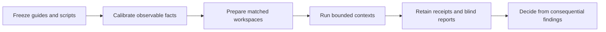

# Generalized discovery experiments

This directory is a test apparatus for comparing ShipLoop discovery instructions
across different system shapes. It is not part of the installed skill or a
production workflow runner. Named languages and local MCP transport are
fixture/host choices, not requirements imposed on systems being investigated.

The source study's raw trial reports, receipts, frozen guides, private mappings,
and machine-specific paths are intentionally not included in this portable
import. The accompanying results document is therefore a labeled historical
summary, not independently auditable empirical evidence. A new study must
create and retain its own evidence outside this source tree.



## Corpus and evidence boundary

| Family | Task | Discriminating boundary |
| --- | --- | --- |
| F1 | Add JSON output to an exporter | Declared dependency versus launcher-selected bundled version; preview versus committed write |
| F2 | Add a receipt field through an event flow | Host-selected component, payload projection, acknowledgement versus modeled effect |
| F3 | Add export to a referenced managed system | Metadata access versus denied task-data access; unrelated connector |
| F4 | Add a refresh indicator | Request ordering, component reuse, store/cache roles, and missing connections between supplied branches |

`fixtures.materialize(family, root, mutant=False)` builds one worker-visible
workspace. `mutant=True` changes one observable state for calibration without
changing the command interface. An altered state is not necessarily a software
defect: F1's alteration makes the active dependency agree with the manifest.
The [public contracts](PUBLIC_CONTRACTS.md) state what local probes establish.

`oracle.calibrate()` checks all reference probes and their altered observations.
`oracle.grade_arm()` checks input integrity, context outcome, and retained
observations. It does not search report keywords or select a better prompt.
Reads can support findings without running every probe. Unknown executable forms
remain unscored. A missing receipt, calibration, report, or execution result
cannot become a positive evidence-readiness result. See [the oracle
contract](ORACLE.md).

## Reproduce a fresh comparison

No-model initialization uses Python's standard library; the CI fixture check
also uses the repository's existing Node runtime to exercise generated
JavaScript. Actual model runs require a working Codex CLI and macOS
`/usr/bin/sandbox-exec`; no vendor account, package download, or permanent MCP
installation is required. The CLI uses its default model without a model
override. If the selected model is not observable, metadata records it as
unknown rather than claiming a pinned model.

Supply a reviewed candidate and a preregistered plan. Use a new study directory;
initialization refuses existing paths. It starts the study clock, freezes the
current guide/references and helper scripts, then calibrates those exact bytes.
Calibration failure leaves explicit evidence and does not authorize trials.

```sh
study_parent="$(mktemp -d)"
study_dir="$study_parent/study"
python3 test/experiments/shiploop_generalized_discovery/initialize.py \
  --study "$study_dir" --candidate /absolute/candidate.md --plan /absolute/plan.md
python3 "$study_dir/frozen/prepare.py" --study "$study_dir"
python3 "$study_dir/frozen/runner.py" --study "$study_dir" --preflight
```

Model contexts, grading, collection, and semantic review are explicit follow-up
steps; they are not part of CI. Keep trial reports, coordinator receipts, guide
variants, mapping, and calibration outside worker roots. Do not overwrite
existing bundles silently.

## Bounded operation and failure reporting

The study allows 12 contexts at most; an initial comparison uses eight. A
context has 480 seconds/32 workspace calls. At 360 seconds or 24 calls, the
gateway permits only reporting operations, preserving a closing reserve. A
shared launch ledger rejects repeated arm IDs and excess launches. New launches
stop at the 75-minute closeout boundary; contexts stop by the 90-minute wall
deadline. These controls reuse the earlier capability runner and gateway.

Study-wide aggregate time, reviewer deadlines, and combined trial/reviewer
concurrency require coordinator accounting; the runner does not implement a
global watchdog for native helper agents. Record overruns rather than claiming
perfect enforcement. A timeout, missing verdict, or exhausted budget is not
success.

An arm is `completed` only when its context exits successfully without a
termination reason, its report is valid, and its supplied files are unchanged.
The batch exits nonzero if any requested arm fails, is incomplete, or cannot
start. This establishes transport/integrity completion, not report correctness.
The oracle and semantic assessment remain separate checks.

## Verification and interpretation

```sh
python3 test/shiploop-generalized-discovery.test.py
```

This hermetic suite calibrates four reference and four altered workspaces,
checks matched preparation, protects evidence retention/blinding, and tests
runner failure paths without launching a model. The runtime regressions also
execute the generated JavaScript ordering guard and confirm that the exporter
preview can pass while a committed row without `id` fails. These are fixture
checks, not prompt-comparison outcomes.

The fixtures make observations easy to obtain. A passing comparison does not
prove arbitrary-system competence, skill/MCP acquisition, authentication,
developer-environment provisioning, live browser behavior, durability,
deployment, or another host/model's behavior. The event and ordering probes are
local models. The store is not persistent and cache expiry is not implemented.
Keep these limits attached to every conclusion.
