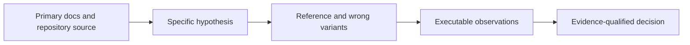

# Platform coding-guidance probes

This opt-in study supplements the September 18 coding-guidance experiment plan. It investigates UI, Google Apps Script, Salesforce, Python and Bash practices with bounded local probes. It does not replace the planned cold-context coding-agent A/B experiment.

## Evidence meaning

- Browser probes observe a real local browser against controlled data, not a deployed product or assistive-technology session.
- Python, Bash, Ruff and available static-checker probes execute the installed tools named in their receipts.
- Apps Script and Salesforce contract models expose specific algorithmic mistakes. They do not execute Google's hosted services, Apex, org permissions or governor limits unless explicitly recorded as such.
- A probe passes when it observes its expected outcome. Intentionally defective implementations are expected to fail an acceptance check; those rejections are calibration evidence, not product successes.
- No coding-agent treatment comparison was run. These fixtures and research support candidate wording and future trial design, not a measured improvement in LLM success, tokens or time.

## Contents

| Directory/file | Responsibility |
| --- | --- |
| `ui/` | Browser response ordering, semantic controls, and strong versus weak UI assertions. |
| `apps_script/` | RPC, service-operation and state/recovery contracts with local substitutes. |
| `salesforce/` | Permission/bulk/client-state contracts and explicit org-runtime limitations. |
| `python_bash/` | Real interpreter/shell behavior, subprocesses, resource/state isolation and error semantics. |
| `tooling/` | Installed Ruff fix semantics and behavior that selected lint rules cannot establish. |
| `github-inventory.json` | Read-only GitHub metadata snapshot for 15 discovery candidates; source-review evidence is in the domain reports. |
| `github-guidance-sources.json` | Two additional instruction repositories, with inspected text hashes. |
| `parent-verification*.json` | Independent reruns binding Apps Script, Salesforce, Python and Bash results to before/after source hashes. |

Each domain's `research.md` provides official sources, inspected repository examples, actual run instructions, outcomes, negative controls and applicability decisions. Historical receipts retain the actual host paths and runtime identities observed at execution; those paths are not installation requirements or portable links. For reproduction, resolve the fixture directory from this checkout and select equivalent available runtimes on the new host. Result receipts record runtime and observations. Reproduction must use a new output path or retain the previous receipt before a runner that rewrites its conventional `results.json` path. Do not overwrite historical observations to hide a failure.

## Isolation and limits

Fixtures are independent of product source and use local synthetic data. New subprocess/browser state is used where its lifecycle matters. No real notifications, deployments, Google authorization or Salesforce org operations belong to this study. Existing installed tools may be used without making them required project dependencies. Resource/performance claims require actual measurements in the relevant runtime; counting calls in a service double is not measuring remote latency.

This checkout was already extensively dirty. The work owns this new experiment directory and the named research/candidate documents only. It does not change ShipLoop stages, callbacks, result schemas, generated plugin views, installed skills or persistent tool configuration.

The protocol is exploratory mechanism testing with deliberately constructed cases. It is not blinded model evaluation, an estimate of production defect rate, or a survey proving that popular repositories are universally suitable. Before model-effectiveness trials, use the original plan's frozen allocation, worker/observer access boundary, independent grader, resource limits, fresh contexts and holdouts.
