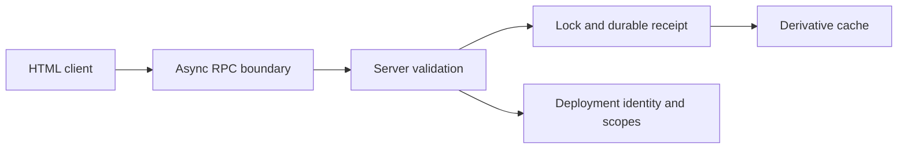

# Google Apps Script platform guidance — bounded research



**Decision: pilot platform-specific conditional guidance; defer any identity or
scope prescription; reject local-only evidence as a release claim.** This is
research for the draft coding-guidance experiment, not a ShipLoop policy
change. The candidate's State and Security cards require an explicit authority,
state scope, concurrency/retry decisions, and trusted-side authorization
checks; this research makes those prompts concrete for Apps Script without
claiming a hosted result.

## Scope and method

The companion [experiment plan — shared fixture contract](/Users/dadleet/src/skill-craft/docs/shiploop-coding-guidance-experiment-plan-2026-09-18.md:69)
requires real code paths, seed/reference/mutant calibration, and an explicit
real-boundary follow-up. The draft [candidate — State card](/Users/dadleet/src/skill-craft/docs/shiploop-coding-guidance-candidate-2026-09-18.md:55)
also says that a cache needs an invalidation rule and must not become a competing
authority. This experiment applies those two requirements to a deliberately
small non-hosted Node fixture.

No Google account, OAuth flow, `clasp` command, endpoint, deployment, Apps
Script project, spreadsheet, property store, cache, lock, e-mail, or persistent
installation was touched. The source research was read-only; the only new
files are in this experiment directory.

## Official platform evidence

| Area | Verified source | Implication for a ShipLoop work packet |
| --- | --- | --- |
| HTML RPC | [HTML Service communication](https://developers.google.com/apps-script/guides/html/communication) and [google.script.run reference](https://developers.google.com/apps-script/guides/html/reference/run) | Calls are asynchronous and independently scheduled; dependent work needs a success/failure continuation rather than a direct return. RPC values are restricted: `Date`, functions, non-form DOM nodes, and circular objects are not legal; undefined array members become `null`; passed objects are copies. |
| UI loading | [HTML Service best practices](https://developers.google.com/apps-script/guides/html/best-practices) | Load data asynchronously and render a loading/failure state. A local static page or synchronous helper does not exercise this boundary. |
| Shared state | [LockService reference](https://developers.google.com/apps-script/reference/lock) and [CacheService reference](https://developers.google.com/apps-script/reference/cache/cache-service) | Select a document/script/user lock to match the shared resource; acquiring a lock is a distinct action (`tryLock`/`waitLock`) and release is required. Cache reads can return `null` and cached data is not guaranteed to remain until expiration, so it cannot be the only durable state or idempotency record. |
| Service-call cost | [Apps Script best practices](https://developers.google.com/apps-script/guides/support/best-practices) and [service quotas](https://developers.google.com/apps-script/guides/services/quotas) | For spreadsheet-like operations, compute in memory, then make one contiguous read/write when semantics permit. Calls and quotas are account- and service-dependent, changeable, and can stop an execution; a local call-count model cannot establish a production quota budget. |
| Identity and authorization | [web apps guide](https://developers.google.com/apps-script/guides/web) and [web-app manifest resource](https://developers.google.com/apps-script/manifest/web-app-api-executable) | `executeAs` and `access` are deployment-level choices. A web app can run as the deploying user or the accessing user; the latter needs an actual missing-scope/denial path. These choices cannot be inferred from client code or a local test. |

## Concrete source inspection and identity checks

The following immutable source URLs were read after `git ls-remote` confirmed
that the named branch pointed to the recorded commit on September 18, 2026.
They are implementation examples or tooling evidence, not replacements for the
official platform contract.

| Repository and verified identity | Pinned file inspected | What it shows | Boundary |
| --- | --- | --- | --- |
| [`googleworkspace/apps-script-samples` at `1f297d16fdb72f819ae27eb1b07b9fa3bae9103e`](https://github.com/googleworkspace/apps-script-samples/tree/1f297d16fdb72f819ae27eb1b07b9fa3bae9103e) | [web-app `Code.gs`](https://github.com/googleworkspace/apps-script-samples/blob/1f297d16fdb72f819ae27eb1b07b9fa3bae9103e/templates/web-app/Code.gs) SHA-256 `6f0502d2…b74ed2a`; [client `JavaScript.html`](https://github.com/googleworkspace/apps-script-samples/blob/1f297d16fdb72f819ae27eb1b07b9fa3bae9103e/templates/web-app/JavaScript.html) SHA-256 `5c2b9ac9…0bdfe` | A `doGet` template plus client `google.script.run` success and failure handlers. | It is a source pattern. It does not establish that our local fixture, a deployed project, or a chosen account has the same scopes or behavior. |
| [`google/clasp` at `e9441e57b0ae398fdb8524dada9372c1ed8590e0`](https://github.com/google/clasp/tree/e9441e57b0ae398fdb8524dada9372c1ed8590e0) | [`docs/run.md`](https://github.com/google/clasp/blob/e9441e57b0ae398fdb8524dada9372c1ed8590e0/docs/run.md) SHA-256 `fae9bbf1…bef19`; [`push.ts`](https://github.com/google/clasp/blob/e9441e57b0ae398fdb8524dada9372c1ed8590e0/src/commands/push.ts) | Remote run needs project/OAuth/API-executable setup; push updates the remote project files. The repository's README labels clasp "not an officially supported Google product," despite the Google GitHub organization. | We did **not** install, log in, push, run, or infer a deployment from it. A source push is not an active web-app deployment or a consumer check. |
| [`googleworkspace/apps-script-oauth2` at `12b6d6b30a7c80e72ecb736f1318941323574a4c`](https://github.com/googleworkspace/apps-script-oauth2/tree/12b6d6b30a7c80e72ecb736f1318941323574a4c) | [`src/Service.js`](https://github.com/googleworkspace/apps-script-oauth2/blob/12b6d6b30a7c80e72ecb736f1318941323574a4c/src/Service.js) SHA-256 `599a73f4…0170d5` and [README cache/lock guidance](https://github.com/googleworkspace/apps-script-oauth2/blob/12b6d6b30a7c80e72ecb736f1318941323574a4c/README.md) | A concrete library separates a property store, cache, and lock, and advises matching their user/script/document scopes for token refresh. | This is a library-specific authentication pattern, not a universal persistence recipe or proof of an application transaction. |

## The three hypotheses and local calibration

### H1 — HTML RPC needs an explicit asynchronous, serializable boundary

**Prediction:** An implementation plan that names request DTOs, handler-owned
completion, and sequencing of dependent calls will avoid a class of local-only
mistakes.

The fixture's reference makes a copied, JSON-shaped request/response boundary;
it rejects `Date`, function, and circular values, turns an undefined array item
into `null`, returns `undefined` from a runner call, and calls success/failure
handlers later. The ordering probe starts both calls behind explicit deferred
gates, releases `fast`, observes it, then releases `slow`; it no longer relies
on elapsed-time ordering. The direct-call seed visibly returns immediately. The
unsafe mutant permits a `Date` through the boundary. Seven local tests include
both the reference and those controls.

**Guidance to pilot:** In an HtmlService packet, name each exposed server
function, restrict its input/output to serializable DTOs, and give the client a
success/failure owner. Chain calls only when one depends on the prior response;
otherwise tolerate completion order. Do not judge an HTML client by a direct
function return value or by a static-server page.

**What this proves:** the local tests detect those designed boundary violations.
**What it does not prove:** the actual Apps Script serializer, runner
concurrency, browser sandbox, exposed-global behavior, or error shape.

### H2 — a lock and durable receipt help only for a matching shared mutation

**Prediction:** State-changing shared operations need a state scope, lock scope,
and durable idempotency decision; cache-only state is unsound across an execution
boundary.

The reference holds an `AsyncMutex` around a read-modify-write and writes a
durable receipt. Two concurrent distinct commands preserve value `2`; two
concurrent retries with the same ID result in one commit and one replay; a fresh
service with an empty cache sees the durable result. The no-lock seed loses an
update deterministically. The cache-authority mutant forgets both state and
idempotency after a simulated restart. A separate blanket-lock mutant fails an
otherwise pure formatter when its unnecessary lock is unavailable.

**Guidance to pilot:** For a shared mutation, name the authoritative store,
resource scope, lock scope, idempotency key/receipt, timeout/retry result, and
reconciliation path before adding `LockService`. Use a cache only as a scoped,
reconstructable derivative with a null/eviction path. Do not add a global lock
to stateless reads or assume a lock alone supplies idempotency or crash recovery.

**What this proves:** the local test detects a lost update, cache-only restart
loss, and needless locking against deterministic in-memory collaborators.
**What it does not prove:** LockService fairness/timeout behavior,
PropertiesService consistency, real cache eviction, host retries, or exactly-once
external effects.

### H3 — batch homogeneous contiguous service work; do not batch by slogan

**Prediction:** A plan that measures service crossings and batches compatible
grid writes will reduce calls without losing output, while blanket batching can
change externally visible effects.

The reference uses one local `setBackgrounds`-shaped operation for a 2×2 grid;
the per-cell seed produces the same grid but consumes four synthetic service
calls and fails a budget of one. The negative-control mutant collapses two
notifications with different messages into one shared payload, which changes
the second recipient's result.

**Guidance to pilot:** Before making a Sheets-like batch change, state the
read/write region, required ordering, partial-failure semantics, expected number
of service crossings, and actual workload/quota budget. Batch contiguous,
homogeneous reads/writes after local computation; do not use it to collapse
different notifications, authorization decisions, or independently recoverable
effects.

**What this proves:** only a local output/call-count relationship.
**What it does not prove:** SpreadsheetApp write caching, measured latency,
current account quotas, quotas consumed by other services, or partial host
failures.

## Identity, scopes, deployment, and evidence boundary

The deployment's `access` and `executeAs` choices determine the actor and
authorized audience. They are security and product-contract choices. ShipLoop
should **defer** any default such as "execute as deploying user" until the
packet names the owner, audience, trusted-side authorization checks, required
manifest scopes, and missing-scope experience. For an accessing-user deployment,
the web-app guide specifically calls for an authorization-info check before
service calls when granular consent may be incomplete.

ShipLoop should **reject** the following conclusion: "local Node tests passed"
or "a source sync/push completed, therefore the web app is live and correct."
Neither establishes deployment identity, activation, authorization, or a
consumer-visible endpoint. This is consistent with the experiment plan's
requirement to retain real-boundary follow-up separately from synthetic
collaborators.

## Required disposable-project follow-up (not run)

Only an already-authorized, disposable Apps Script project can close these
remaining questions. A live follow-up should record the script ID, deployment
ID/version, `/dev` or `/exec` URL, `access`, `executeAs`, manifest scopes,
acting test account, cleanup owner, and exact observations.

1. Serve an HtmlService page and use a browser to issue overlapping permitted
   RPC calls, asserting handler completion/order, legal/illegal payload behavior,
   and a useful server failure path.
2. With two isolated test clients, issue distinct and duplicate state-changing
   commands against a disposable authoritative store. Validate the chosen
   LockService scope, wait/timeout result, durable idempotency receipt, and
   restart/cache-null recovery.
3. Use a disposable Sheet to compare a measured contiguous batch with the
   exact per-cell alternative at a stated workload. Capture service calls,
   timing, quota/error behavior, output, and cleanup.
4. Test both authorized and denied/missing-scope paths under the chosen web-app
   identity. Then verify the specific active deployment/version and a
   consumer-visible endpoint; do not substitute a source-push receipt.

Until those are run, retain this decision as a **pilot**, not adopted ShipLoop
policy.

## Recorded source and probe commands

These read-only commands were actually used for the source identity and local
calibration. The final test command is intentionally separate from the
existing-fixture baseline.

```sh
git ls-remote https://github.com/google/clasp.git HEAD refs/heads/master
git ls-remote https://github.com/googleworkspace/apps-script-samples.git HEAD refs/heads/main
git ls-remote https://github.com/googleworkspace/apps-script-oauth2.git HEAD refs/heads/main
node --version
python3 --version
git --version
python3 test/shiploop-repeatable-experiments.test.py
cd test/experiments/shiploop_platform_guidance_20260918/apps_script
npm test
```

The final local test run used Node `v25.9.0` and produced seven passing new
platform checks. Its concrete values and variant counts are recorded in
[results-final.json](/Users/dadleet/src/skill-craft/test/experiments/shiploop_platform_guidance_20260918/apps_script/results-final.json). [results.json](/Users/dadleet/src/skill-craft/test/experiments/shiploop_platform_guidance_20260918/apps_script/results.json) remains
the preserved pre-barrier receipt; it is not the final ordering evidence.
