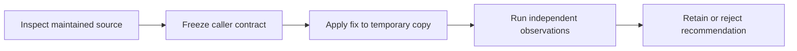

# Automated fixes and repository architecture



## Decision

**Adopt as candidate guidance:** inspect automated fixes against caller-visible behavior and side effects; keep static checks complementary to behavior/security checks. **Reject:** universal unsafe fixes, or interpreting a clean linter as proof of authorization. **Pilot:** a deliberately chosen Ruff rule set when the project's existing tooling has a real gap; this experiment does not require installing or replacing tooling.

The installed Ruff was already available. All modified Python samples lived in an automatically cleaned temporary directory. No product Python, lint configuration, credentials or external service was modified.

## Actual observations

The frozen sample returns the first item of an iterable using `list(values)[0]`. The first receipt tested ordinary and empty lists. The expanded receipt adds a deliberately stronger iterator-consumption requirement, preserving the earlier receipt rather than overwriting it.

| Check | Observed result | Meaning |
| --- | --- | --- |
| R0 | Original `[7, 9]` returns `7`; empty list raises `IndexError`. | Frozen initial expected behavior is executable. |
| R1 | Default `--fix` leaves RUF015 unapplied; source and observed behavior remain unchanged. | This unsafe rewrite is not silently applied by default in the installed version. |
| R2 | Explicit `--unsafe-fixes` rewrites the expression; empty input now raises `StopIteration`. | Ordinary success is insufficient to establish compatibility. |
| R3 | A manual exception adaptation retains the tested list value/error behavior. | Narrow list equivalence only. |
| R5 | Original consumes an iterator completely; unsafe and adapted versions leave `[9]`. | Even fixing the empty-input exception does not preserve all supported iterable effects. |
| R4 | A function ignoring its actor passes selected E/F rules and returns another actor's record. | A clean selected lint result is not an authorization oracle. |

**6/6 probe expectations matched**, including detection of intentionally wrong behavior. This is not six successful production changes, a performance benchmark, a universal Ruff audit or a model-guidance A/B result. Python 3.14.7 and Ruff 0.15.22 were executed.

Reproduce with an already installed Ruff and a new output path:

```sh
python3 /Users/dadleet/src/skill-craft/test/experiments/shiploop_platform_guidance_20260918/tooling/run_ruff_probe.py --output /tmp/shiploop-ruff-new-receipt.json
```

The runner rejects an existing receipt path. Each subprocess has a finite timeout; no installation or shell-built command is used.

## Primary sources and contrary evidence

[Ruff's linter documentation](https://docs.astral.sh/ruff/linter/#fix-safety) distinguishes safe and unsafe fixes and provides RUF015 as a concrete example. It also recommends deliberate rule selection and cautions that `ALL` changes with upgrades. This supported the probe; the local interpreter and tool supplied the recorded observations.

[Bulletproof React's project-structure guide](https://github.com/alan2207/bulletproof-react/blob/master/docs/project-structure.md) supports feature ownership and composition at the application boundary, while explicitly allowing only the folders a feature needs. Its [actual ESLint configuration](https://github.com/alan2207/bulletproof-react/blob/master/apps/react-vite/.eslintrc.cjs) implements restricted import zones and cycle checks. The observed Git blob identity for that configuration was `d14efd6a4455eec50e1902b08ef381930af050ff`. These are concrete examples to adapt after a local need is established, not a prescription to copy the entire architecture or its dependencies. Import direction has not been experimentally evaluated in this tooling probe.

The study's GitHub inventory records repository metadata as observed on September 18, 2026. Stars help discover examples; they do not establish suitability, maintenance guarantees, code quality or license compatibility. Source review and executable evidence remain separate.
