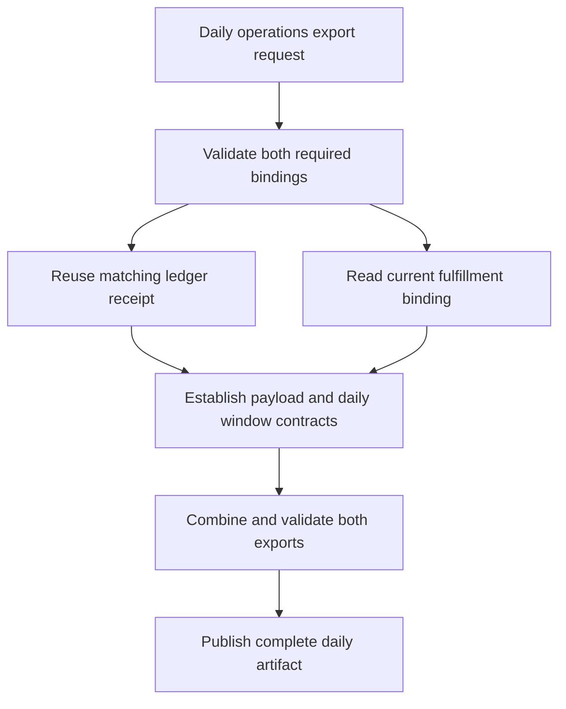

The plan should retain both required service exports, reuse the valid ledger receipt, and use the newly observed current fulfillment receipt. Local connection readiness is established under the supplied service receipt contract. An executable daily export plan remains conditional on payload, combination, scheduling, and delivery contracts; the receipts contain no business export data.

The flow after receipt validation is a recommendation, not implemented or observed behavior. A daily trigger would ask an export runner to fetch both services for one agreed window, validate and combine their data, and deliver one complete artifact to the agreed consumer. That design works only once the services' payload and consistency contracts establish how the datasets relate.

| Material premise | Source inspection | Observed behavior and limitation | Plan consequence |
| --- | --- | --- | --- |
| Both ledger and fulfillment are required, using current targets and `export.read`. | [connections.json - connections: required services and effective bindings](/private/var/folders/_n/cth41tgs171367b_gghs0kgm0000gn/T/shiploop-probe-strategy-pulxuyar/study/arms/trial-01/workspace/connections.json:3) | Configuration was read; no live service invocation occurred. | Keep both as mandatory inputs. A ledger-only artifact does not fulfill the request. |
| Valid planning receipts require schema v1, status ok, scope current, and exact effective target/role match; no separate expiry rule applies. | [service-receipt-v1.md - validity: exact binding and receipt conditions](/private/var/folders/_n/cth41tgs171367b_gghs0kgm0000gn/T/shiploop-probe-strategy-pulxuyar/study/arms/trial-01/workspace/contracts/service-receipt-v1.md:3) | Contract inspection establishes the acceptance rule, not remote authentication. | Validate every required connection independently. Revalidate when effective binding or contract changes; do not invent an expiry rule. |
| Ledger already has sufficient matching planning evidence. | [ledger-current.json - receipt: matching ledger-current and export.read](/private/var/folders/_n/cth41tgs171367b_gghs0kgm0000gn/T/shiploop-probe-strategy-pulxuyar/study/arms/trial-01/workspace/evidence/ledger-current.json:2) | Existing receipt inspection only; no new ledger probe was run. | Reuse it. Another ledger read would not resolve the actual fulfillment evidence gap. |
| Prior fulfillment evidence is for another binding. | [fulfillment-prior.json - binding: fulfillment-legacy and viewer](/private/var/folders/_n/cth41tgs171367b_gghs0kgm0000gn/T/shiploop-probe-strategy-pulxuyar/study/arms/trial-01/workspace/evidence/fulfillment-prior.json:3) | No failure of fulfillment-current was observed. The prior receipt's ok/current fields do not cure its binding mismatch. | Do not accept it for fulfillment-current or infer a login problem. Obtain matching evidence via the existing read route. |
| Existing local reader can produce a matching current fulfillment receipt. | [capability.py - main: configured target selection and receipt emission](/private/var/folders/_n/cth41tgs171367b_gghs0kgm0000gn/T/shiploop-probe-strategy-pulxuyar/study/arms/trial-01/workspace/capability.py:14) | `python3 capability.py read --target fulfillment-current` exited 0, with no stderr, in 0.052 seconds. Receipt has schema `service-read-receipt/v1`, binding fulfillment-current/export.read, current scope, and ok status. [probe-log.jsonl - recorded read: observed matching fulfillment receipt](/private/var/folders/_n/cth41tgs171367b_gghs0kgm0000gn/T/shiploop-probe-strategy-pulxuyar/study/arms/trial-01/workspace/scratch/probe-log.jsonl:1) | Accept this receipt for local planning. No sign-in, installation, account switch, or permission expansion is warranted by these results. |
| Probe is a deterministic model and writes only its local observation log; it does not export data or contact a service. | [README.md - fixture behavior: local data and documented observations](/private/var/folders/_n/cth41tgs171367b_gghs0kgm0000gn/T/shiploop-probe-strategy-pulxuyar/study/arms/trial-01/workspace/README.md:3); [fixture_support.py - emit: scratch logging and JSON output](/private/var/folders/_n/cth41tgs171367b_gghs0kgm0000gn/T/shiploop-probe-strategy-pulxuyar/study/arms/trial-01/workspace/fixture_support.py:8) | The persisted record explicitly says `simulation: local-read-only-fixture`; its content was read back after execution. | Do not promote modeled success to live access, export correctness, deployment compatibility, or consumer delivery evidence. |

Concrete trace: configured fulfillment-current/export.read → prior receipt fulfillment-legacy/viewer fails the exact-match rule → documented current read selects the configured connection → persisted current/ok v1 receipt with fulfillment-current/export.read satisfies that rule. Ledger takes the reuse branch. This establishes coverage of both required local bindings without redundant probing. A changed effective role or target would invalidate the corresponding receipt for the new binding.

The one experiment tested whether the existing documented reader could close the fulfillment mismatch. Its alternatives were a matching successful receipt, a failed invocation, or a nonmatching receipt. Only the first was observed. Source/configuration were capability.py and connections.json; selected identity was the modeled export.read role. The invocation had a 10-second timeout and one attempt. Allowed effects were JSON output and scratch log append. The shared recorder and emitted record corroborate those effects; no process or temporary dependency required cleanup. The log is retained as evidence. The experiment stops at the local modeled boundary because there is no authorized live-service route in this workspace.

Recommended implementation sequence:

1. Preserve the required connections and existing v1 receipt validator contract. Reuse the ledger receipt and the current fulfillment log receipt as planning inputs. Keep receipt validation separate from data export validation.
2. Establish the export interfaces before implementation: payload fields/types, date filtering, pagination, completeness indicators, error responses, and any snapshot or consistency guarantees for each required service.
3. Obtain the owner's daily window, timezone, cutoff, and late-arrival policy. Define the output schema and whether “combine” means separate sections in one artifact or a join. For a join, establish the common key, multiplicity, missing-match policy, and reconciliation rules. Do not infer these from service names.
4. Extend an existing export runner or scheduler if one is identified. This workspace exposes only the receipt reader and recorder, so their reuse is appropriate for readiness checks; they cannot serve as a business-data exporter. Defer a new scheduler, transport, authentication mechanism, or storage system until the existing operational runtime is identified.
5. Proposed safety behavior: stage both datasets for the same window, validate completeness and combination rules, then publish one complete artifact. If either required input fails, record an incomplete run and withhold a successful combined-export claim. Agree retry limits and duplicate/rerun handling from service and delivery contracts before selecting an implementation.
6. Verify receipt acceptance with matching receipts and rejection of the legacy fulfillment binding. Then verify actual export payloads, shared window boundaries, empty datasets, partial failure, reconciliation, reruns, and consumer delivery. Those are planned checks; none ran here. Establish the real deployment/runtime route and read permissions before target integration checks.

| Affected area | Established locally | Remaining prerequisite and consequence |
| --- | --- | --- |
| Message passing | CLI read emits one JSON receipt; durable log captures it. | Real export request/result, pagination, retry, cancellation, and completeness contracts are absent. Export orchestration cannot yet be specified fully. |
| Client connections | Local Python invocation is documented and one fulfillment invocation succeeded. | Live endpoint/transport/session and intended runtime are absent. Model success cannot establish target compatibility. |
| Authentication | Effective modeled role is export.read for both required targets; both have qualifying receipt evidence. | Actual runtime identity, grant, and credential lifecycle are untested. Runtime owner must supply the authorized route before live reads; no authentication failure was observed. |
| Design | Configuration owns bindings; receipt contract owns evidence acceptance; recorder owns probe-log persistence. | Scheduler, runner, consumer, and publication ownership are absent. Identify existing facilities before proposing replacements. UI design is inapplicable to the inspected CLI surface. |
| Libraries | Reader uses Python standard-library argparse/json/pathlib and the local recorder. | Exact intended Python/runtime version is not specified. Observed fixture execution proves only this local invocation; no new dependency is justified. |
| Storage | Checked-in JSON holds configuration and prior receipts; scratch JSONL holds observations. | Export storage, atomic publication, concurrent runs, retention, and migration requirements are absent. Select these with the artifact consumer/runtime owner. |
| Caching | Existing receipt evidence is reusable under the exact-match/no-expiry contract. No separate cache mechanism appears in the inspected reader/recorder. | Service data caching and freshness are unknown. Do not treat readiness receipts as exported data or add a cache without a demonstrated need. |
| Security | Reader restricts target selection to configured bindings; local probe model contacts no external service. | Real tenant isolation, data sensitivity, transport protection, output authorization, and logging policy are absent. Resolve before production data handling. |

The highest-priority unresolved prerequisite is the actual export interface contract for each service, followed by the combination and daily-window decisions. The operations owner should provide the maintained export specifications and output consumer requirements; the runtime owner should identify the existing scheduler/runner and authorized service route. These gaps block detailed implementation and live delivery verification, while the receipt-readiness portion of planning is complete.

Source locators refer to the current inspected workspace. Observed execution evidence is confined to scratch/probe-log.jsonl; supplied prior receipts remain source-inspection evidence. Exploration ended after workspace call 15, below the 24-call exploration cutoff; no further probes are needed for these local readiness findings. The report is the research deliverable, with unresolved prerequisites explicitly retained.
