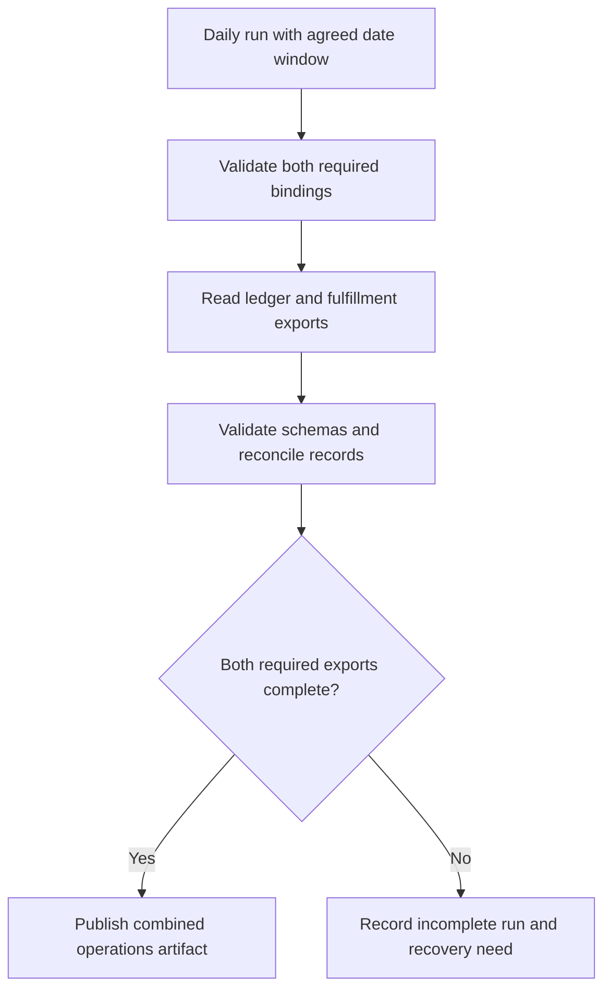

# Daily operations export: findings and recommendations

Recommend planning one daily export that requires both ledger and fulfillment inputs. Reuse the valid ledger receipt and the newly observed fulfillment receipt. Connection readiness is established for this local model under its receipt contract; actual export data, combination semantics, daily scheduling, and publication remain unresolved. The diagram describes proposed behavior, not an implemented or observed export pipeline.

## Evidence and material premises

| Premise | Source inspection | Observed behavior | Plan consequence |
| --- | --- | --- | --- |
| Both services are required. | [connections.json - connections: ledger required with effective binding](/private/var/folders/_n/cth41tgs171367b_gghs0kgm0000gn/T/shiploop-probe-strategy-pulxuyar/study/arms/trial-02/workspace/connections.json:5) and [connections.json - connections: fulfillment required with effective binding](/private/var/folders/_n/cth41tgs171367b_gghs0kgm0000gn/T/shiploop-probe-strategy-pulxuyar/study/arms/trial-02/workspace/connections.json:14) specify ledger-current/export.read and fulfillment-current/export.read. | No complete combined export was executed. | Include both inputs in the completion condition; one successful connection cannot substitute for the other. |
| Receipt validity depends on schema, status, scope, and exact target/role match. | [contracts/service-receipt-v1.md - validity: exact current binding required](/private/var/folders/_n/cth41tgs171367b_gghs0kgm0000gn/T/shiploop-probe-strategy-pulxuyar/study/arms/trial-02/workspace/contracts/service-receipt-v1.md:3) gives all four checks; [contracts/service-receipt-v1.md - expiry: no separate expiry rule](/private/var/folders/_n/cth41tgs171367b_gghs0kgm0000gn/T/shiploop-probe-strategy-pulxuyar/study/arms/trial-02/workspace/contracts/service-receipt-v1.md:8) rules out an invented age-based rejection. | The fulfillment probe emitted matching fields; the retained ledger receipt was inspected, not freshly re-executed. | Evaluate each receipt against its own effective connection. Revalidate on changes to binding, scope, or contract. |
| Ledger evidence is sufficient and reusable. | [evidence/ledger-current.json - receipt: matching ledger schema binding scope and status](/private/var/folders/_n/cth41tgs171367b_gghs0kgm0000gn/T/shiploop-probe-strategy-pulxuyar/study/arms/trial-02/workspace/evidence/ledger-current.json:2) satisfies the selected contract. | No new ledger read was run; this is supplied receipt evidence verified by inspection. | Reuse it. A redundant ledger probe would not change the current readiness decision. |
| Prior fulfillment evidence does not establish the required binding. | [evidence/fulfillment-prior.json - binding: legacy target and viewer role](/private/var/folders/_n/cth41tgs171367b_gghs0kgm0000gn/T/shiploop-probe-strategy-pulxuyar/study/arms/trial-02/workspace/evidence/fulfillment-prior.json:3) records fulfillment-legacy/viewer despite current scope and ok status. | No failure of the current fulfillment connection was observed. | Preserve the old receipt as evidence only for its recorded binding. Do not interpret it as proof of current access or as an authentication failure. |
| Current fulfillment planning evidence is now available. | [capability.py - main: selects configured effective target and emits modeled receipt](/private/var/folders/_n/cth41tgs171367b_gghs0kgm0000gn/T/shiploop-probe-strategy-pulxuyar/study/arms/trial-02/workspace/capability.py:13) identifies the supported mechanism. | `python3 capability.py read --target fulfillment-current` exited 0, without stderr, in 0.058 seconds. [scratch/probe-log.jsonl - probe record: current fulfillment binding returned ok](/private/var/folders/_n/cth41tgs171367b_gghs0kgm0000gn/T/shiploop-probe-strategy-pulxuyar/study/arms/trial-02/workspace/scratch/probe-log.jsonl:1) retains service-read-receipt/v1, current scope, fulfillment-current/export.read, and ok status. | Accept this receipt for local planning. No reconnection or broader role is justified by this result. |
| The capability command is a model, not an export implementation. | [README.md - fixture: deterministic local behavior with no network or credentials](/private/var/folders/_n/cth41tgs171367b_gghs0kgm0000gn/T/shiploop-probe-strategy-pulxuyar/study/arms/trial-02/workspace/README.md:3) and [fixture_support.py - emit: local JSON output and append-only receipt recording](/private/var/folders/_n/cth41tgs171367b_gghs0kgm0000gn/T/shiploop-probe-strategy-pulxuyar/study/arms/trial-02/workspace/fixture_support.py:8) establish its boundaries. [capability.py - main: emits receipt fields rather than export rows](/private/var/folders/_n/cth41tgs171367b_gghs0kgm0000gn/T/shiploop-probe-strategy-pulxuyar/study/arms/trial-02/workspace/capability.py:17) contains no export payload retrieval. | One modeled receipt was printed and retained; no service data, remote authentication, scheduler, or publication was exercised. | Do not claim deployed compatibility, live access, data completeness, or a working daily export. |

The smallest discriminating experiment addressed whether the current fulfillment binding could supply a valid modeled receipt. A matching ok result permits the local readiness plan; a nonmatching or failed result would leave fulfillment readiness unresolved. The inspected documented mechanism allowed only local receipt recording, with a 10-second timeout and one attempt. The matching result was observed. Its only documented persistent effect is the retained scratch receipt; no acquired tool or remote resource requires cleanup.

Concrete observed trace: input target `fulfillment-current` selects its effective configuration row, the command emits binding `fulfillment-current/export.read`, and the recorder prints and appends an ok current receipt. This works because the receipt binding comes from the selected configuration row. The decisive boundary case is the old fulfillment receipt: its ok status and current scope cannot overcome the wrong target and role. The ledger branch stops at sufficient existing receipt evidence; the fulfillment branch stops at the successful modeled observation. Both branches stop before live service behavior because this workspace exposes no actual service reader.

## Recommended plan

1. **Preserve connection requirements and reuse evidence.** Carry the contract and the three receipt locators above into downstream work. Validate every required connection independently. Keep export.read as the configured role; do not introduce a new connector, authentication flow, dependency, or wrapper to solve a gap already covered by the fixture.
2. **Resolve the export data contract before coding the combination.** Obtain repository-owned or authorized primary contracts for both actual exports: operation, request filters, date window, timezone, pagination, payload schema, stable keys, updates/deletions, completeness signal, errors, and read consistency. Decide whether “combines” means joining rows, aggregating measures, or packaging two complete exports. A receipt proves none of these choices.
3. **Agree daily operations policy.** Specify the run time, timezone, business-date boundaries, handling of late fulfillment changes, reruns, and expected completion deadline. Keep the scheduling policy separate from the receipt-validity contract, which has no separate expiry rule.
4. **Build the smallest compatible export producer after those prerequisites.** Reuse documented service readers if available in the intended runtime. Read both datasets for the agreed window; validate schema and completeness; apply the approved reconciliation rule. Proposed safety condition: if either required export is incomplete or fails, report an incomplete run rather than publish an artifact labeled complete. This is a recommendation derived from both inputs being required, not observed existing behavior.
5. **Define publication and recovery.** Identify the destination and consumer, format, access controls, retention, partial-artifact policy, and replacement/versioning semantics. Prefer a complete-artifact publication boundary with run identity and per-input provenance. Establish retry ownership and duplicate handling from actual service and destination contracts before selecting retry behavior.
6. **Verify the intended consumer path.** Plan checks for both binding matches, a wrong fulfillment binding, one missing input, agreed date boundaries, pagination, schema drift, unmatched records, and reruns. Execute payload and consumer checks against the selected real or explicitly modeled surface when authorized. The receipt probe is evidence only for its local receipt case.

## Unresolved prerequisites and consequences

| Question | Specific prerequisite and owner | Consequence / next check |
| --- | --- | --- |
| What data and merge rule produce the required operations result? | Product/operations owner must define the artifact and reconciliation semantics; service owners must supply both export payload contracts. No such definition was present in the inspected task files. | Block the detailed transformation design and correctness acceptance until schemas, keys, and expected example output are available. |
| Can the intended runtime read actual exports? | Runtime/service owner must identify the authorized service routes, effective identities, grants, and target environment. The supplied mechanism has only modeled local receipts. | Before real integration, perform authorized non-mutating reads at both intended boundaries; retain evidence separately from this local result. Do not infer a login problem or request secrets. |
| What does “daily” mean operationally? | Operations owner must choose timezone, schedule, date window, late-data policy, and deadline. | Block scheduling and freshness acceptance until those policies are explicit. |
| Where and how is the artifact delivered? | Consumer/storage owner must identify destination, format, permissions, retention, and publication semantics. | Block storage and delivery implementation and consumer acceptance; no destination can be inferred from the receipt log. |
| How should partial failure and reruns behave? | Service/destination contracts plus operations policy for recovery, retries, duplicate runs, and consistency. | Keep retry limits and publication implementation undecided; test the agreed recovery conditions once specified. |

## Task-scoped boundary review

| Area | Established facts and remaining limit |
| --- | --- |
| Message passing | Source inspection establishes a CLI read request and JSON receipt response; one fulfillment success was observed. Actual export events, paging, retries, ordering, and cancellation are unresolved. |
| Client connections | Local Python invocation is documented and observed. Remote transport, session lifecycle, and reconnect behavior are unresolved; the fixture does not model them. |
| Service authentication | Effective role aliases are configured and present in matching receipt evidence. No credentials or actual authorization checks are exercised, so real runtime identity and refresh remain unresolved. |
| Design | A receipt producer shares a local recorder. No daily export orchestrator or UI is present in the inspected source; UI work is outside this task. The proposed producer consumes two required inputs. |
| Client libraries | The inspected code uses Python argparse, json, and pathlib plus the supplied recorder. No additional dependency is needed for this research; service SDK selection remains contingent on real contracts. |
| Storage | Configuration and supplied receipts are files; the observed probe adds one scratch JSONL record. Operational export storage, consistency, retention, and publication are unresolved. |
| Caching | Existing receipts can be reused under the explicit contract. They are planning evidence, not cached export datasets. No dataset cache is established or justified. |
| Security | The model does not read credentials or contact a service. It does not demonstrate tenant enforcement, transport security, secret handling, or consumer access in the intended runtime; those require selected target contracts and authorized checks. |

Research completed its bounded local readiness question; the overall export plan remains conditional on the named prerequisites. No supplied source or configuration was edited. One documented modeled capability probe was used, and its scratch record is retained as evidence. At report drafting, 15 workspace calls had completed, below the 24-call exploration cutoff; writing and readback bring the expected total to 17 of 32. Exact active elapsed time was not instrumented; exploration was ended early using the conservative call bound, with no further probes planned.
