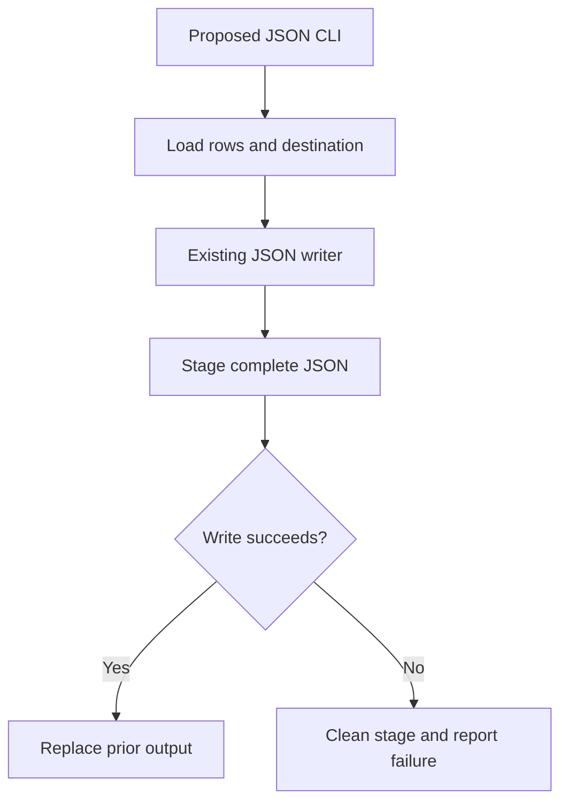

# Findings and plan recommendations

Recommend a thin local CLI extension that calls `exporter.write_json`. Reuse the existing staged replacement; do not implement direct destination writes or serialize preview output as the file export. No source or configuration changes were made.

## Evidence and material premises

| Premise | Source inspection | Observed behavior | Plan consequence |
| --- | --- | --- | --- |
| A reusable JSON writer already exists. | [exporter.py - write_json: stages an array and replaces destination after completion](/private/var/folders/_n/cth41tgs171367b_gghs0kgm0000gn/T/shiploop-probe-strategy-pulxuyar/study/arms/trial-03/workspace/exporter.py:7) writes a sibling `.<name>.next`, projects each row to `id` and `amount`, closes the stage, then replaces the destination. | `python3 -m unittest -q` exited 0; one test passed, exercising valid-row replacement and parsed output equality. [test_exporter.py - test_valid_rows_use_native_json_replacement: success assertions](/private/var/folders/_n/cth41tgs171367b_gghs0kgm0000gn/T/shiploop-probe-strategy-pulxuyar/study/arms/trial-03/workspace/test_exporter.py:8). | Call this writer rather than creating another storage abstraction. |
| Mid-export row failure preserves old output in the tested case. | [exporter.py - write_json: required fields and exception cleanup](/private/var/folders/_n/cth41tgs171367b_gghs0kgm0000gn/T/shiploop-probe-strategy-pulxuyar/study/arms/trial-03/workspace/exporter.py:16) raises on missing fields, cleans the stage, and rethrows. | `python3 probe.py write-preservation` reported `KeyError`, `previous_output_preserved: true`, `temporary_exists: false`. [scratch/probe-log.jsonl - write-preservation receipt: prior content retained and stage absent](/private/var/folders/_n/cth41tgs171367b_gghs0kgm0000gn/T/shiploop-probe-strategy-pulxuyar/study/arms/trial-03/workspace/scratch/probe-log.jsonl:3). | Keep the writer responsible for persistence; translate its exceptions at the CLI boundary into failure status. |
| Preview acceptance does not establish export success or matching schema. | [exporter.py - preview: wraps unvalidated rows in a format object](/private/var/folders/_n/cth41tgs171367b_gghs0kgm0000gn/T/shiploop-probe-strategy-pulxuyar/study/arms/trial-03/workspace/exporter.py:4) differs from the writer's array and field projection. [data/rows.json - fixture rows: second row lacks id](/private/var/folders/_n/cth41tgs171367b_gghs0kgm0000gn/T/shiploop-probe-strategy-pulxuyar/study/arms/trial-03/workspace/data/rows.json:1). | `python3 probe.py preview` accepted both fixture rows; the write probe failed on those same rows. [scratch/probe-log.jsonl - preview receipt: incomplete row accepted](/private/var/folders/_n/cth41tgs171367b_gghs0kgm0000gn/T/shiploop-probe-strategy-pulxuyar/study/arms/trial-03/workspace/scratch/probe-log.jsonl:2). | Separate preview from write acceptance. Do not treat preview as validation or as the writer's file format. |
| The advertised parser version is not the active imported version. | [manifest.json - parser declaration: version 3.1.0](/private/var/folders/_n/cth41tgs171367b_gghs0kgm0000gn/T/shiploop-probe-strategy-pulxuyar/study/arms/trial-03/workspace/manifest.json:2); [bin/launcher.py - active_parser_version: imports bundled VERSION](/private/var/folders/_n/cth41tgs171367b_gghs0kgm0000gn/T/shiploop-probe-strategy-pulxuyar/study/arms/trial-03/workspace/bin/launcher.py:1); [bundled/parser.py - VERSION: bundled value 2.6.4](/private/var/folders/_n/cth41tgs171367b_gghs0kgm0000gn/T/shiploop-probe-strategy-pulxuyar/study/arms/trial-03/workspace/bundled/parser.py:1). | `python3 probe.py version` reported active `2.6.4` and manifest `3.1.0`. [scratch/probe-log.jsonl - version receipt: manifest and active version disagree](/private/var/folders/_n/cth41tgs171367b_gghs0kgm0000gn/T/shiploop-probe-strategy-pulxuyar/study/arms/trial-03/workspace/scratch/probe-log.jsonl:1). | Do not assume version 3.1.0 features. Reuse standard-library argparse, already imported locally, unless a concrete required parser capability is established. |
| There is a local observation CLI, but no inspected export entrypoint accepting user input and destination. | [probe.py - main: only version, preview and preservation observations](/private/var/folders/_n/cth41tgs171367b_gghs0kgm0000gn/T/shiploop-probe-strategy-pulxuyar/study/arms/trial-03/workspace/probe.py:15) exposes three fixed operations; [bin/launcher.py - active_parser_version: version accessor only](/private/var/folders/_n/cth41tgs171367b_gghs0kgm0000gn/T/shiploop-probe-strategy-pulxuyar/study/arms/trial-03/workspace/bin/launcher.py:3) adds no export command. | The supported probes ran successfully; no proposed export CLI was executed because it does not yet exist in the inspected source. | Add a small production invocation boundary; keep observation commands distinct. This is an implementation gap, not completed delivery. |

The decisive trace is actual local behavior: the fixture supplies `{"id":"first","amount":4}` then `{"amount":9}`; the writer opens the sibling stage and serializes the first row, then required-field access for the second raises `KeyError`. The probe confirms the old destination text survives and the stage is absent. [probe.py - main preservation branch: isolated target and comparison](/private/var/folders/_n/cth41tgs171367b_gghs0kgm0000gn/T/shiploop-probe-strategy-pulxuyar/study/arms/trial-03/workspace/probe.py:25). This works because destination replacement occurs only after the staging stream finishes. It proves this ordinary exception path, not universal filesystem or crash safety.

## Recommended implementation sequence

1. Define the CLI contract before wiring: select command locator, input source, destination argument, stdout JSON envelope, stderr policy and exit codes. Proposed minimal contract: JSON rows file plus output path, one JSON status object, exit 0 on successful replacement and nonzero on parse, validation or write failure. These are proposals; the user requirement does not specify flag names or whether “JSON CLI” means JSON input, JSON output, or both.
2. Implement a thin boundary using existing Python standard-library facilities. Load rows without opening the destination, invoke `write_json(destination, rows)`, and emit success metadata only after replacement returns. Catch expected input and filesystem errors at this boundary. Avoid retries or rollback writes.
3. Preserve the existing exported array schema and Unicode behavior unless an accepted contract requires otherwise. Preview's wrapper is a separate interface. Return clear failure metadata without falsely marking partial staging as successful.
4. Add meaningful CLI acceptance checks alongside the existing writer test: valid input replaces old content with the expected array; the current malformed fixture fails with nonzero status while preserving old bytes and leaving no stage; malformed JSON and unavailable destination parent fail without destination changes; stdout is parseable JSON on the selected success/error paths.
5. Exercise write and replacement failures with controlled temporary targets or fault injection in later tests. Confirm prior bytes survive, cleanup is attempted, and errors remain visible. Run the existing unittest suite plus CLI checks after implementation.

## Limits, prerequisites and plan consequences

- **CLI invocation contract remains open.** Prerequisite: choose and document input/output semantics and executable locator. Consequence: downstream implementation and acceptance expectations must bind to that contract; proposed syntax is not an established requirement.
- **Parser capability is unverified.** Bundled parser source provides only a version constant. Prerequisite if parser-specific features are required: inspect a real supported callable interface and exercise the desired arguments. Consequence: prefer the evidenced standard-library route; defer dependency upgrades and manifest changes.
- **Concurrency is not established.** Source inspection shows a fixed stage name, which can collide for concurrent writers to the same destination; no concurrency probe was run. Consequence: document single-writer scope for the initial CLI, or require a concurrency contract and unique-stage/coordination change before claiming multiwriter preservation.
- **“Operation fails” must have a commit boundary.** Replacement is the commit. CLI result serialization or stdout failure after replacement cannot imply that the previous destination remains. Prerequisite: define failure semantics around commit and prevent avoidable fallible work after commit. Consequence: test/report committed-but-unreported outcomes separately; a blanket end-to-end preservation claim is unsupported.
- **Crash durability and hostile paths are unproven.** No fsync, unique stage creation or symlink defense appears in the inspected writer. Cleanup exceptions could also obscure the original error. Consequence: claim ordinary local single-writer exception preservation only; broaden implementation/tests if process interruption, power loss, or untrusted writable directories enter scope.

## Affected boundaries and verification scope

The caller owns arguments; the CLI owns loading and status/exit signaling; the exporter owns the staged file and replacement. Message serialization and storage are established at the function level, while the new CLI message contract remains open. Process invocation is local and synchronous; no connection/reconnect mechanism, service authentication or cache appears in the inspected path. Libraries are standard-library Python plus the local version accessor. Security is local file access under the invoking process; destination permissions and trusted-directory assumptions need documentation. No network, service account, deployment target or UI is required by this local scope.

Exploration stopped with sufficient evidence after 23 workspace calls, before the 24-call cutoff. Four documented commands ran with 20-second timeouts; all exited 0, including the preservation probe whose payload intentionally reports exporter failure. Its process exit is not a proposed CLI error-code check. Temporary probe/test targets were managed by their temporary-directory contexts; the persistent receipts are in `scratch/probe-log.jsonl`. Only local probes and report writing were performed. Further exploration is unnecessary for the reuse decision; the next useful work is contract selection and bounded CLI implementation with the checks above.
