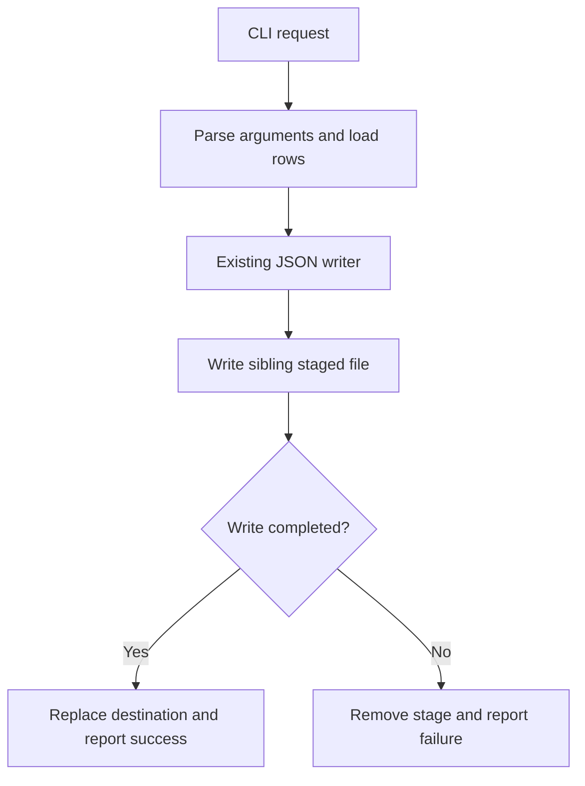

# JSON exporter CLI: findings and plan recommendations

Recommend a thin CLI adapter around `exporter.write_json`. The existing writer supplies the core preservation behavior; preview does not establish export validity. CLI implementation and its acceptance checks remain future work.

## Evidence and material premises

**F1 — Native JSON persistence is reusable. Source inspection:** `write_json` projects each row to `id` and `amount`, serializes into a sibling `.<target>.next`, closes the stream, then calls `Path.replace`. Its exception path removes the staged file and rethrows. The returned metadata identifies `native_json_atomic_replace`. This supports preservation for failures before replacement; it does not prove crash durability, concurrency safety, or all filesystem error cases. [exporter.py - write_json: stages JSON before replacing the destination](/private/var/folders/_n/cth41tgs171367b_gghs0kgm0000gn/T/shiploop-probe-strategy-pulxuyar/study/arms/trial-04/workspace/exporter.py:7)

**Observed behavior:** `python3 -m unittest -q` exited 0: one test passed. The test replaced an existing file with valid JSON for `[{"id":"ok","amount":7}]` and checked native replacement metadata. This is an actual local Python test of the writer, not CLI verification. [test_exporter.py - test_valid_rows_use_native_json_replacement: checks successful replacement and JSON contents](/private/var/folders/_n/cth41tgs171367b_gghs0kgm0000gn/T/shiploop-probe-strategy-pulxuyar/study/arms/trial-04/workspace/test_exporter.py:8)

**F2 — Mid-stream invalid input preserves prior output in the tested case. Source inspection:** checked-in rows contain a valid first row followed by a row missing `id`; the writer accesses that key after beginning the staged file. [data/rows.json - fixture rows: second row lacks the required id](/private/var/folders/_n/cth41tgs171367b_gghs0kgm0000gn/T/shiploop-probe-strategy-pulxuyar/study/arms/trial-04/workspace/data/rows.json:1) [exporter.py - write_json loop: missing id raises during staged serialization](/private/var/folders/_n/cth41tgs171367b_gghs0kgm0000gn/T/shiploop-probe-strategy-pulxuyar/study/arms/trial-04/workspace/exporter.py:13)

**Observed behavior:** `python3 probe.py write-preservation` exited 0 and returned `status:error`, `error:KeyError`, `previous_output_preserved:true`, `temporary_exists:false`. The probe uses a disposable temporary directory and a sentinel destination; its context manager removes that directory. The zero process exit belongs to the diagnostic probe and must not be adopted as the failure exit contract of the proposed CLI. The durable receipt is [scratch/probe-log.jsonl - write-preservation receipt: prior output preserved and stage absent](/private/var/folders/_n/cth41tgs171367b_gghs0kgm0000gn/T/shiploop-probe-strategy-pulxuyar/study/arms/trial-04/workspace/scratch/probe-log.jsonl:3). This challenges the assumption that JSON export requires a new transactional writer.

Concrete trace: first row writes `{"amount":4,"id":"first"}` into the staged array; the second row raises `KeyError` on `id`; cleanup removes the incomplete stage; the prior destination remains byte-for-byte equal to the sentinel. The successful test instead reaches replacement and publishes the complete array.

**F3 — Preview acceptance is insufficient. Source inspection:** `preview` dumps all rows into a `{"format":"json","rows":...}` envelope without the writer's row projection or required-key accesses. [exporter.py - preview: serializes an envelope without writer validation](/private/var/folders/_n/cth41tgs171367b_gghs0kgm0000gn/T/shiploop-probe-strategy-pulxuyar/study/arms/trial-04/workspace/exporter.py:4)

**Observed behavior:** `python3 probe.py preview` exited 0 and returned `status:accepted` with both rows, including the row missing `id`. Export then failed for that same input. [scratch/probe-log.jsonl - preview receipt: accepts the row missing id](/private/var/folders/_n/cth41tgs171367b_gghs0kgm0000gn/T/shiploop-probe-strategy-pulxuyar/study/arms/trial-04/workspace/scratch/probe-log.jsonl:2). Plan consequence: do not implement file export as preview plus a direct destination write; preserve the existing array output and writer validation unless a separate output-contract change is accepted.

**F4 — Manifest version does not describe the active launcher. Source inspection:** launcher imports `VERSION` from the bundled parser, whose value is `2.6.4`; manifest declares `3.1.0` and lists JSON among formats. [bin/launcher.py - VERSION import: launcher uses the bundled parser](/private/var/folders/_n/cth41tgs171367b_gghs0kgm0000gn/T/shiploop-probe-strategy-pulxuyar/study/arms/trial-04/workspace/bin/launcher.py:1) [bundled/parser.py - VERSION: active bundled value is 2.6.4](/private/var/folders/_n/cth41tgs171367b_gghs0kgm0000gn/T/shiploop-probe-strategy-pulxuyar/study/arms/trial-04/workspace/bundled/parser.py:1) [manifest.json - parser field: declares 3.1.0](/private/var/folders/_n/cth41tgs171367b_gghs0kgm0000gn/T/shiploop-probe-strategy-pulxuyar/study/arms/trial-04/workspace/manifest.json:2)

**Observed behavior:** `python3 probe.py version` exited 0 and reported active `2.6.4` versus manifest `3.1.0`. [scratch/probe-log.jsonl - version receipt: confirms active and declared version mismatch](/private/var/folders/_n/cth41tgs171367b_gghs0kgm0000gn/T/shiploop-probe-strategy-pulxuyar/study/arms/trial-04/workspace/scratch/probe-log.jsonl:1). Only a version constant and accessor are supplied, not parser feature APIs. JSON format advertisement cannot establish callable CLI support.

**F5 — Supplied invocation surface is diagnostic. Source inspection and observed help:** `python3 probe.py --help` exited 0 and listed only `version`, `preview`, and `write-preservation`. The launcher source exposes only a version accessor. No destination-taking production CLI was found in the visible root/bin files. Supported probes are documented at [README.md - Supported observations: lists safe local commands](/private/var/folders/_n/cth41tgs171367b_gghs0kgm0000gn/T/shiploop-probe-strategy-pulxuyar/study/arms/trial-04/workspace/README.md:8). No repository-owned product spec, architecture document, or local AGENTS.md appeared in the root listing; the request is the requirement basis.

## Implementation plan

1. **Define the smallest public invocation contract.** Document an executable Python entrypoint, row-input route, destination option, JSON output shape, success metadata, and nonzero failure exit. Proposed baseline: load JSON rows, call `write_json`, emit one JSON success/error response, and report success only after replacement. Exact flags, filename, and input route are proposals, not established requirements. Preserve the writer's existing array output rather than silently substituting the preview envelope.

2. **Reuse the writer and standard library.** Use existing Python JSON/file facilities and the demonstrated argparse pattern where appropriate. Add only the thin adapter. Do not introduce a second writer, shell redirection to the final destination, parser upgrade, or dependency. If integration requires bundled-parser features, first establish its real callable contract and test the shipped launcher path; the manifest alone is insufficient. An independent argparse adapter avoids an unproven parser-version requirement.

3. **Carry failure semantics across the process boundary.** Convert argument/input/export errors to truthful nonzero exits without modifying the prior destination. Keep serialization in the staged writer. Avoid post-replacement operations whose failure would turn a committed export into an apparent failed operation; explicitly distinguish commit success from response-delivery failure.

4. **Verify through the public CLI.** Add meaningful end-to-end checks for valid replacement and parsed contents, malformed input, a later row missing a key, and a serialization failure. For each failed export, assert nonzero exit, prior destination byte equality, and stage cleanup. Exercise staged-open and replacement failure through isolated test doubles or disposable filesystem targets. Also check initially absent output stays absent on precommit failure. Reuse the current success test; preview and the diagnostic probe cannot substitute for CLI acceptance.

## Boundaries, prerequisites, and plan consequences

| Area | Established facts or unresolved prerequisite | Consequence |
| --- | --- | --- |
| Message passing | Local Python calls and JSON serialization inspected; public CLI arguments, error envelope, and exits not implemented. | Freeze the adapter contract before CLI tests. |
| Client connections | One-shot local subprocesses observed; no remote session in supplied flow. | No reconnect mechanism required. |
| Service authentication | No service calls or credentials in inspected exporter/probe code. | No external identity setup needed for this task. |
| Design | Caller owns request; exporter owns staged file and replacement; process owns response. | Keep the adapter thin and distinguish persistence from reporting. |
| Libraries | Standard-library use observed; active bundled version differs from manifest. | Reuse local facilities; verify any parser-specific dependency before adopting it. |
| Storage | Same-directory staging and preservation observed for KeyError; fixed staging name is visible. | Concurrent same-target writes can interfere by inference; use a documented single-writer constraint or minimally extend to unique stages if concurrency is required. |
| Caching | No cache in inspected path. | No cache mechanism needed. |
| Security | Destination and row data cross a local file boundary; fixed stage name can collide with an existing file or symlink by inference. | Define trusted-directory/single-writer scope or require safe exclusive unique staging; do not claim hostile-directory safety. |

The specific unresolved prerequisites are the intended input/argument contract, whether simultaneous writers or untrusted destination directories must be supported, and whether “operation fails” includes interruption, crash, cleanup failure, or response delivery after commit. The current code catches ordinary `Exception`, uses a predictable stage name, and has no fsync; source inspection therefore cannot establish those stronger guarantees. Cleanup failure may also mask the original exception. Resolve these scope conditions during specification; extend staging only for an accepted requirement. These gaps do not prevent planning the ordinary single-process CLI, but prevent claiming universal failure preservation.

Exploration stops at these local process/file boundaries because the requested effect and representative success/failure are supported. No external deployment or consumer access is implied. Source/configuration remained unchanged; probes only recorded receipts and used temporary directories. Research used 21 workspace calls and five documented executions, each limited to 20 seconds; all completed without timeout. Exact elapsed active time was not independently measured. The remaining call reserve is sufficient to write and reread this report. No production CLI has been implemented or verified.
