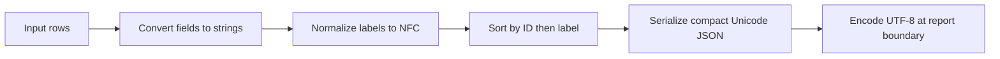

Reuse `src.native_format.normalize_rows` for the requested report output. The existing formatter already supplies Unicode-preserving NFC labels, ascending string-ID order, and deterministic JSON text for the inspected inputs. The smallest planned change is to connect its result to the report consumer and explicitly encode UTF-8. A new formatter, connector, or preview mechanism has no demonstrated task benefit.

The caller supplies rows; the formatter builds a fresh normalized list, sorts it, and returns a JSON string. Encoding and destination ownership belong to the report boundary. The inspected source proves the transformation and serializer options; local executions establish the outcomes below. Neither establishes an unimplemented report consumer.

| Material premise | Source inspection | Observed behavior and limits |
| --- | --- | --- |
| Labels use NFC and preserve non-ASCII characters. | [src/native_format.py - normalize_rows: NFC labels](/private/var/folders/_n/cth41tgs171367b_gghs0kgm0000gn/T/shiploop-probe-strategy-pulxuyar/study/arms/trial-05/workspace/src/native_format.py:8); [src/native_format.py - normalize_rows: Unicode-preserving serialization](/private/var/folders/_n/cth41tgs171367b_gghs0kgm0000gn/T/shiploop-probe-strategy-pulxuyar/study/arms/trial-05/workspace/src/native_format.py:9). | Representative execution returned “São Paulo” and “Café”; direct assertions confirmed NFC and exact Unicode text. [scratch/probe-log.jsonl - representative: normalized output](/private/var/folders/_n/cth41tgs171367b_gghs0kgm0000gn/T/shiploop-probe-strategy-pulxuyar/study/arms/trial-05/workspace/scratch/probe-log.jsonl:1); [scratch/probe-log.jsonl - direct-byte-contract: NFC and byte assertions](/private/var/folders/_n/cth41tgs171367b_gghs0kgm0000gn/T/shiploop-probe-strategy-pulxuyar/study/arms/trial-05/workspace/scratch/probe-log.jsonl:2). Only these local inputs were exercised. |
| Ordering is deterministic, including equal IDs. | [src/native_format.py - normalize_rows: ID and label sort keys](/private/var/folders/_n/cth41tgs171367b_gghs0kgm0000gn/T/shiploop-probe-strategy-pulxuyar/study/arms/trial-05/workspace/src/native_format.py:9). | Both fixture permutations produced identical output; reversing two equal-ID rows also produced identical output, ordered by label. Twenty repeated calls matched. [scratch/probe-log.jsonl - direct-byte-contract: permutation, repeat and tie checks](/private/var/folders/_n/cth41tgs171367b_gghs0kgm0000gn/T/shiploop-probe-strategy-pulxuyar/study/arms/trial-05/workspace/scratch/probe-log.jsonl:2). |
| Compact serialization fixes key order and whitespace. | [src/native_format.py - normalize_rows: compact separators and sorted object keys](/private/var/folders/_n/cth41tgs171367b_gghs0kgm0000gn/T/shiploop-probe-strategy-pulxuyar/study/arms/trial-05/workspace/src/native_format.py:9). | Direct comparison matched the expected string and its UTF-8 bytes. [scratch/probe-log.jsonl - direct-byte-contract: rendered text, byte hex and digest](/private/var/folders/_n/cth41tgs171367b_gghs0kgm0000gn/T/shiploop-probe-strategy-pulxuyar/study/arms/trial-05/workspace/scratch/probe-log.jsonl:2). This establishes local formatter bytes after explicit encoding, not an eventual file writer. |
| The representative probe cannot prove original serializer bytes. | [probe.py - main: parses formatter text before emitting](/private/var/folders/_n/cth41tgs171367b_gghs0kgm0000gn/T/shiploop-probe-strategy-pulxuyar/study/arms/trial-05/workspace/probe.py:14); [fixture_support.py - emit: reserializes the observation envelope](/private/var/folders/_n/cth41tgs171367b_gghs0kgm0000gn/T/shiploop-probe-strategy-pulxuyar/study/arms/trial-05/workspace/fixture_support.py:13). | The probe succeeded, but its printed envelope is a separately serialized representation. The direct formatter check independently established the compact output. |
| Existing regression coverage is insufficient for the full requested contract. | [test_native_format.py - test_order_is_deterministic: checks only parsed ID order](/private/var/folders/_n/cth41tgs171367b_gghs0kgm0000gn/T/shiploop-probe-strategy-pulxuyar/study/arms/trial-05/workspace/test_native_format.py:6). | `python3 -m unittest -q` exited 0 and ran one test. Unicode normalization, encoding, compact separators, canonical equivalence and exact bytes were verified by the separate local assertions, not by that existing test. |
| The native formatter is the applicable reuse choice. | [skills/native-format/SKILL.md - Native normalized export: supported function and representative invocation](/private/var/folders/_n/cth41tgs171367b_gghs0kgm0000gn/T/shiploop-probe-strategy-pulxuyar/study/arms/trial-05/workspace/skills/native-format/SKILL.md:3); [src/native_format.py - imports: standard-library serialization and normalization](/private/var/folders/_n/cth41tgs171367b_gghs0kgm0000gn/T/shiploop-probe-strategy-pulxuyar/study/arms/trial-05/workspace/src/native_format.py:1). | Its supported operation and direct contract checks succeeded locally. No additional dependency was needed. The preview helper documents a separate dashboard purpose and no normalized export capability: [skills/preview-accelerator/SKILL.md - Preview accelerator: separate preview-only purpose](/private/var/folders/_n/cth41tgs171367b_gghs0kgm0000gn/T/shiploop-probe-strategy-pulxuyar/study/arms/trial-05/workspace/skills/preview-accelerator/SKILL.md:3). That helper was not executed. |

Concrete observed trace: [data/rows.json - fixture rows: descending IDs and decomposed accent](/private/var/folders/_n/cth41tgs171367b_gghs0kgm0000gn/T/shiploop-probe-strategy-pulxuyar/study/arms/trial-05/workspace/data/rows.json:1) supplies `b / Cafe\u0301` followed by `a / São Paulo`. The formatter composes the combining acute accent into `é`, orders `a` before `b`, and returns exactly:

```json
[{"id":"a","label":"São Paulo"},{"id":"b","label":"Café"}]
```

The direct probe encoded that string as UTF-8, with no BOM or trailing newline. Its SHA-256 was `b7338311c2b9c4332918de19d5d12d99de122a9639746158f7f8f46f3e32bbd6`. NFC gives canonically equivalent label spellings the same text; fixed sort keys, object-key order and separators remove input-order and formatting variation for the supported row shape. The digest and byte hex are retained in [scratch/probe-log.jsonl - direct-byte-contract: exact UTF-8 evidence](/private/var/folders/_n/cth41tgs171367b_gghs0kgm0000gn/T/shiploop-probe-strategy-pulxuyar/study/arms/trial-05/workspace/scratch/probe-log.jsonl:2).

Plan recommendations:

1. Reuse the formatter unchanged as the serialization authority. Pass supported rows to it once and carry its returned string directly to the report output boundary. Avoid parsing and reserializing that string when exact bytes are part of acceptance.
2. Define the report destination and consumer contract before wiring output. Use explicit UTF-8 encoding and document whether a final newline is required; the evidenced formatter string contains none. If the consumer requires the exact bytes shown above, preserve that convention. The inspected entry point is a local observation command, not a report writer: [probe.py - main: representative command entry point](/private/var/folders/_n/cth41tgs171367b_gghs0kgm0000gn/T/shiploop-probe-strategy-pulxuyar/study/arms/trial-05/workspace/probe.py:9). No final report path, output flag, or delivery interface is established by the inspected product sources. The specific prerequisite is an identified report caller/destination and its byte framing contract; integration and end-to-end acceptance depend on it, while formatter reuse does not.
3. Extend regression coverage in the existing test module during implementation. Assert exact UTF-8 output for decomposed and precomposed accents, non-ASCII labels, input permutations, repeated calls, equal-ID tie ordering and empty input. Keep a separate end-to-end check that reads the produced report bytes; parsed JSON equality would miss whitespace, escaping and newline changes. The current source-only coverage gap and the direct local observations justify these checks.
4. Preserve ascending string-ID semantics unless accepted requirements explicitly call for numeric ordering. Source converts IDs with `str` before sorting: [src/native_format.py - normalize_rows: IDs converted to strings](/private/var/folders/_n/cth41tgs171367b_gghs0kgm0000gn/T/shiploop-probe-strategy-pulxuyar/study/arms/trial-05/workspace/src/native_format.py:8). The direct probe observed numeric inputs `2, 10` become ordered IDs `"10", "2"`. If numeric ordering is intended, the prerequisite is an explicit ID-domain/order decision; that would require a scoped formatter change and updated ordering tests. Do not silently substitute numeric sorting.

Other boundaries and stopping points:

| Area | Finding and plan consequence |
| --- | --- |
| Message passing and design | Established locally: rows enter a synchronous function and JSON text returns. Sorting and serialization are supported by the cited source and probes. The final report consumer remains unresolved as described above. |
| Connections and authentication | Not applicable to the inspected local formatter flow: it uses standard-library imports and has no service invocation. No remote access premise is needed for the reuse recommendation. |
| Libraries and compatibility | Standard-library `json` and `unicodedata` worked in the current Python environment. Cross-version normalization and unsupported input-object coercion were not tested. Base byte acceptance on the supported runtime and plain row values; revalidate if either changes. |
| Storage | The representative command reads checked-in rows and appends observation records to scratch: [probe.py - main: reads local rows](/private/var/folders/_n/cth41tgs171367b_gghs0kgm0000gn/T/shiploop-probe-strategy-pulxuyar/study/arms/trial-05/workspace/probe.py:13); [fixture_support.py - emit: appends local evidence log](/private/var/folders/_n/cth41tgs171367b_gghs0kgm0000gn/T/shiploop-probe-strategy-pulxuyar/study/arms/trial-05/workspace/fixture_support.py:12). Report persistence, atomic replacement and concurrent writer behavior are unverified until a destination is selected; do not infer those guarantees from formatter success. |
| Caching | No cache is present in the inspected formatter. Each invocation rebuilds its output. A new cache has no demonstrated need. |
| Input handling and security | The formatter directly indexes required fields and converts values to strings: [src/native_format.py - normalize_rows: required label access and coercion](/private/var/folders/_n/cth41tgs171367b_gghs0kgm0000gn/T/shiploop-probe-strategy-pulxuyar/study/arms/trial-05/workspace/src/native_format.py:7). A missing label produced `KeyError` locally, recorded in [scratch/probe-log.jsonl - direct-byte-contract: missing-label boundary](/private/var/folders/_n/cth41tgs171367b_gghs0kgm0000gn/T/shiploop-probe-strategy-pulxuyar/study/arms/trial-05/workspace/scratch/probe-log.jsonl:2). Preserve required-field expectations or explicitly define consumer validation and error behavior before exposing broader inputs. JSON escaping still applies to syntax/control characters; Unicode preservation does not mean every character is emitted literally. |

Exploration stops at the formatter and local observation boundary because their task-relevant behavior is supported. The report destination and any different ID ordering policy are explicit prerequisites for downstream integration. These findings do not claim report delivery, deployment compatibility, or complete acceptance of a future writer.
