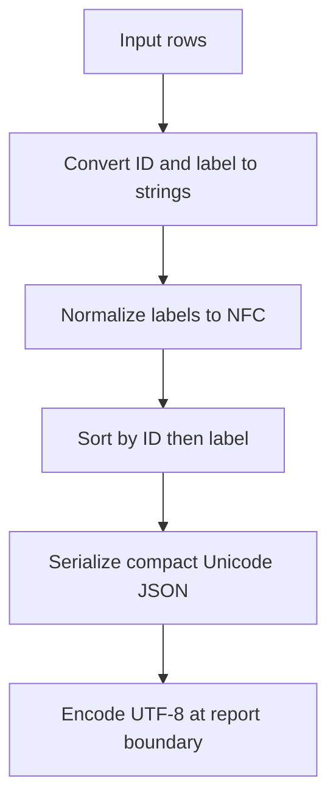

# Report output: findings and plan recommendations



Reuse `src.native_format.normalize_rows` for report serialization. The requested label normalization, Unicode preservation, and deterministic ordering already exist locally. Add only the smallest report-output integration; no connector or new serializer is justified.

## Evidence-backed findings

**F1 — Existing formatter meets the core serialization requirements.**
Source inspection: the function converts labels and IDs to strings, applies NFC to labels, sorts by the tuple `(id, label)`, and calls `json.dumps` with `ensure_ascii=False`, compact separators, and sorted object keys. It returns a string, not bytes. Source: [native_format.py - normalize_rows: NFC, ordering and serialization](/private/var/folders/_n/cth41tgs171367b_gghs0kgm0000gn/T/shiploop-probe-strategy-pulxuyar/study/arms/trial-06/workspace/src/native_format.py:4). Inspected source SHA-256: `7440c37d28d421f8b3a13c1945428e4e736395917ec61e8722505e919c2ef022`.

Observed behavior: the representative command exited 0 and produced IDs `a,b`, with labels `São Paulo` and `Café`. The input contains decomposed `Cafe\u0301`; source: [rows.json - fixture rows: decomposed accent and reversed IDs](/private/var/folders/_n/cth41tgs171367b_gghs0kgm0000gn/T/shiploop-probe-strategy-pulxuyar/study/arms/trial-06/workspace/data/rows.json:1). Observation receipt: [probe-log.jsonl - representative: normalized output](/private/var/folders/_n/cth41tgs171367b_gghs0kgm0000gn/T/shiploop-probe-strategy-pulxuyar/study/arms/trial-06/workspace/scratch/probe-log.jsonl:1).

Actual trace: input `{"id":"b","label":"Cafe\u0301"}` becomes the string label `Café` after NFC normalization, sorts after ID `a`, and appears in the compact JSON below. NFC combines the accent while Unicode-preserving serialization retains non-ASCII text.

**F2 — Exact bytes are supported by a focused local observation, with a separate output-boundary limitation.**
Source inspection: `probe.py` applies `json.loads` to the formatter result, and the recorder serializes a containing object with its own spacing and a newline. The representative command therefore demonstrates values rather than final report bytes. Sources: [probe.py - main: formatter result is parsed before emission](/private/var/folders/_n/cth41tgs171367b_gghs0kgm0000gn/T/shiploop-probe-strategy-pulxuyar/study/arms/trial-06/workspace/probe.py:13) and [fixture_support.py - emit: recorder serialization and newline](/private/var/folders/_n/cth41tgs171367b_gghs0kgm0000gn/T/shiploop-probe-strategy-pulxuyar/study/arms/trial-06/workspace/fixture_support.py:8).

Observed behavior: a focused call through the same formatter compared its return value against this exact string, encoded it as UTF-8, and compared repeated calls and reversed input. All four checks passed: expected string, repeat bytes, permutation bytes, and NFC labels. Receipt: [probe-log.jsonl - exact-byte-check: comparisons and UTF-8 hex](/private/var/folders/_n/cth41tgs171367b_gghs0kgm0000gn/T/shiploop-probe-strategy-pulxuyar/study/arms/trial-06/workspace/scratch/probe-log.jsonl:2). Observed Unicode database version: `16.0.0`.

```json
[{"id":"a","label":"São Paulo"},{"id":"b","label":"Café"}]
```

Exact observed UTF-8 hex:
```text
5b7b226964223a2261222c226c6162656c223a2253c3a36f205061756c6f227d2c7b226964223a2262222c226c6162656c223a22436166c3a9227d5d
```

Limits: this proves these inputs under the local Python runtime. It does not prove a report writer, deployed consumer, arbitrary malformed input, or stability across all future runtime versions.

**F3 — Existing automated coverage is narrower than the requested contract.**
Source inspection: the sole test parses the returned JSON and checks ascending ASCII IDs. It cannot detect whitespace, escaping, encoding, NFC, or exact-byte regressions. Source: [test_native_format.py - test_order_is_deterministic: parsed ID assertion only](/private/var/folders/_n/cth41tgs171367b_gghs0kgm0000gn/T/shiploop-probe-strategy-pulxuyar/study/arms/trial-06/workspace/test_native_format.py:6).
Observed behavior: `python3 -B -m unittest -q` exited 0; one test ran and passed. This is a passing existing baseline, not full acceptance coverage.

**F4 — Native reuse has direct support; the preview alternative does not.**
Source inspection: the native-format local documentation names the function and its representative operation. The preview helper is explicitly for a separate dashboard and lacks the normalized-export operation. The formatter imports only Python standard-library modules. Sources: [SKILL.md - Native normalized export: supported function and operation](/private/var/folders/_n/cth41tgs171367b_gghs0kgm0000gn/T/shiploop-probe-strategy-pulxuyar/study/arms/trial-06/workspace/skills/native-format/SKILL.md:3), [SKILL.md - Preview accelerator: separate dashboard scope](/private/var/folders/_n/cth41tgs171367b_gghs0kgm0000gn/T/shiploop-probe-strategy-pulxuyar/study/arms/trial-06/workspace/skills/preview-accelerator/SKILL.md:3), and [native_format.py - imports: standard-library dependencies](/private/var/folders/_n/cth41tgs171367b_gghs0kgm0000gn/T/shiploop-probe-strategy-pulxuyar/study/arms/trial-06/workspace/src/native_format.py:1).
Observed behavior: the native representative operation ran successfully. The preview alternative was not executed; there is no evidence it improves this task. Stop that branch because its documented scope does not implement the required operation.

## Recommended plan

1. **Reuse the existing formatter.** Route report rows through `normalize_rows`; retain NFC labels, ascending string IDs, label tie-breaking, sorted keys, and compact Unicode JSON. Avoid duplicating normalization or serialization in the report layer.
2. **Extend only the output boundary.** Take the returned string directly and encode as UTF-8 once. For a standalone JSON artifact, propose no BOM and no added newline, consistent with the formatter return value. Preserve the consumer's established framing contract if one is supplied; explicitly test the final artifact rather than relying on the recorder envelope.
3. **Add contract-focused acceptance checks during implementation.** Assert exact output bytes for decomposed accented text and non-Latin labels; compare canonical-equivalent labels, reversed input, repeated calls, duplicate IDs with different labels, and empty input. Verify input rows remain unchanged. Keep the existing ordering test as baseline.
4. **Verify the real report entry point after integration.** Read back the emitted artifact and compare UTF-8 bytes against the selected contract. A passing direct-function probe is insufficient for encoding, newline, or reserialization behavior in that entry point.
5. **Defer replacement, preview helpers, and connectors.** No observed defect warrants a new mechanism. Their dependency, maintenance, and compatibility costs would not address a demonstrated gap.

## Specific prerequisites and plan consequences

- **Report consumer and destination — unresolved.** The inspected workspace exposes a formatter and representative fixture, but no separate report-output entry point or destination contract. Required next evidence: the intended report consumer, writer location, and framing requirements. Consequence: formatter reuse is ready to plan; final integration scope and end-to-end byte acceptance remain open. Do not invent a remote target.
- **ID semantics — established locally, potentially unresolved for broader inputs.** Current sorting is lexicographic after string conversion; numeric ID `10` would sort before `2` by source inference. Existing fixture IDs are strings. Required prerequisite only if numeric ordering is intended: an explicit ID-domain/order contract. Consequence: preserve existing string ordering unless the accepted requirement calls for another domain.
- **Malformed input policy — unresolved outside the valid fixture contract.** Source inspection shows direct dictionary indexing and permissive string conversion; missing keys can raise errors, and coercion can collapse distinct input types. No invalid-input observation was performed. Required next evidence: accepted input schema and error policy. Consequence: do not promise validation or silent recovery; add validation only where that contract requires it.
- **Cross-runtime byte guarantee — not established.** The observed runtime uses Unicode database 16.0.0; no supported runtime matrix was supplied. Consequence: revalidate exact-byte cases when the deployment runtime is selected or upgraded. Avoid claiming universal canonical JSON beyond this fixed row schema.

## Boundary coverage and stopping reasons

| Area | Finding and evidence fidelity |
| --- | --- |
| Message passing | Source-established synchronous rows-to-JSON-string call; representative and exact-byte local observations support valid fixture behavior. Final consumer framing remains unresolved. |
| Client connections | No network connection in the inspected call path; transport lifecycle is inapplicable to this local formatter. |
| Service authentication | No service identity in the inspected path; no authentication prerequisite for the observed local operation. |
| Design | Reuse a pure formatting function and a thin writer boundary. No UI surface is present in the relevant inspected files. |
| Client-side libraries | Source-established standard-library JSON and Unicode modules; execution succeeded locally. No new dependency needed. |
| Storage | Input fixture is read locally; recorder appends receipts under scratch. Report destination, overwrite and persistence behavior await a consumer contract. |
| Caching | No cache mechanism in the inspected formatter or representative call path; no cache needed for this transformation. |
| Security | Source-established local data processing with no service calls in the relevant path. Output encoding and accepted input types belong at the consumer contract; no credential or connector use required. |

The formatter branch stops at direct source plus representative and byte observations: sufficient to recommend reuse. The writer branch stops at the missing consumer contract. The preview branch stops at documented mismatch. No unrelated integration research is needed.

## Investigation record

Work was confined to the workspace; supplied source and configuration were unchanged. Local observations were bounded to 10 seconds each and returned normally. The representative operation and byte check appended two retained receipts; no temporary service or installed dependency requires cleanup.

Exploration ended after 20 workspace calls, before the 24-call cutoff. This report write is call 21, leaving 11 calls of the 32-call allowance. Exact total active wall-clock duration was not independently measured; individual command elapsed times were observed (all under 0.06 seconds), and the call cutoff was conservatively used to limit exploration. No convergence or end-to-end report acceptance is claimed.
