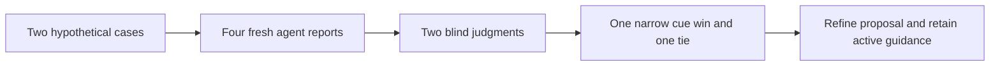

# Remote-service discovery pilot results

All four agents completed their assigned reports and both independent judges
completed. The added cue was preferred narrowly for the schema/cache case;
the record/polling case tied. **Continue a focused pilot; do not promote the cue
from this evidence.** Active ShipLoop prompts remain unchanged by this task.

## Measured comparison

| Case | Baseline / candidate | Blind decision | Main supported distinction |
| --- | --- | --- | --- |
| Remote schema, cached customer reads, risk worker | Arms 01 / 02 | B (candidate), narrowly | Candidate explicitly denied disclosure when current authority could not be established; baseline stated current authorization but left indeterminate/outage behavior implicit. Baseline had clearer prerequisite ordering. |
| Remote catalog and cooperating quote services | Arms 04 / 03 | Tie | Both reused durable records and polling, preserved remote authority and computed fields, and addressed stale completion and permission failure. Candidate articulated the polling timing budget; baseline more explicitly covered idempotency lifetime/retention. |

All four reports kept the local formatter control local. Neither arm required an
event bus for the polling case. Both variants already discovered much of the
needed structure from the supplied facts; the cue did not establish a broad
improvement over current guidance.

Retained judgments:
[schema-judgment.md - blind review: narrow candidate preference](review/schema-judgment.md),
[async-judgment.md - blind review: tie with complementary strengths](review/async-judgment.md).

## Coordinator adjudication

The useful common findings are the need for explicit cache-authority failure
behavior, downstream read-back rather than only deployment status, and an exact
guard against obsolete worker results. These should become requirements and
checks only on the affected boundaries.

Some judge criticism was broader than the facts supported. The async case had
no schema event channel or planned schema write, and the rubric made event-gap
coverage specific to the schema case. It does not follow that the async design
must add schema-event detection. Where caches are bypassed, demand only the
remaining applicable freshness checks. Similarly, unrelated risk-worker probes
need not all block an independent additive metadata change; each work item needs
its actual prerequisite gates. Preserve these original judgments as model outputs,
but do not adopt their extra mechanisms or blanket ordering requirements.

The candidate schema report also depicts a 30-second cache before performance
benefit has been established. Reusing an existing cache can be appropriate, but
the proposal should clearly leave caching conditional until both benefit and
the authorization/invalidation contract are justified. More checklist coverage
does not make a particular implementation the selected architecture.

An independent design review produced useful refinements beyond the comparison:

- Enforce cache isolation from trusted server-side context; current endpoint
  access alone does not authorize cached rows/fields. An internal shared data
  cache is permissible only with complete current enforcement before exposure.
- Choose async execution authority and revocation behavior explicitly; protect
  operation status and result locators as well as payloads; define retention.
- Treat v3 evidence/context strings as locators, not semantic enforcement.
  Require a cold-packet test proving downstream actors receive and read them.
- Use a compact entry cue plus conditionally loaded detailed guidance.

The resulting [proposed-entry-cue.md - short trigger: conditional guide loading](proposed-entry-cue.md)
and [proposed-reference.md - revised detail: isolation and async authority](proposed-reference.md)
are **post-study, untested revisions**. They must not be described as the winning
measured candidate. The original candidate and all frozen inputs remain intact.

## Verification and limits

- Existing-code initial baseline: 42 tests passed across discovery (27),
  research-template (7) and reference-routing (8). The retained
  [baseline-checks.json - coordinator receipt: actual commands and counts](coordinator/baseline-checks.json)
  is a summary of tool output, not a raw runner log.
- Four isolated native agent contexts; no parent conversation supplied. Actual
  report lengths were 1,040, 940, 1,042 and 983 whitespace-separated words.
- Two independent fresh judges saw neutral reports, facts and rubric, not the
  candidate cue or arm map; candidate position was reversed across cases.
- Baseline slice: 43,480 characters; added cue: 3,587 characters, approximately
  8.25%. No measured model-token or runtime-efficiency comparison was made.
- Frozen inputs and report hashes were checked. Selected production source
  hashes still matched after the study. Coordinator completion records attest
  actual native completions; they are not independent signed host receipts.
- The task created only the proposal and study artifacts. No active prompt,
  runtime, generated plugin, account, schema or deployed service was changed.

This study supplies the problematic facts explicitly. It measures synthesis and
coverage on two constructed cases, not autonomous detection in an unknown codebase.
It used a focused duty/reference slice rather than an assembled action packet.
There was no Until Loop or full ShipLoop execution, application-code execution,
real cache invalidation, remote permission change, Salesforce access, cold
development handoff or live consumer validation. The broader existing suite was
not run. One output per variant/case cannot establish general superiority.

The next useful evidence is an actual default-v3 packet-to-step-plan handoff with
hidden fixture defects and executable assertions for revoke-without-data-change,
late fill, lost notifications, accepted-but-undispatched work, duplicate/stale
completion, and metadata drift preservation. Include a local-only control and
confirm that failed prerequisites gate only their real dependents.
