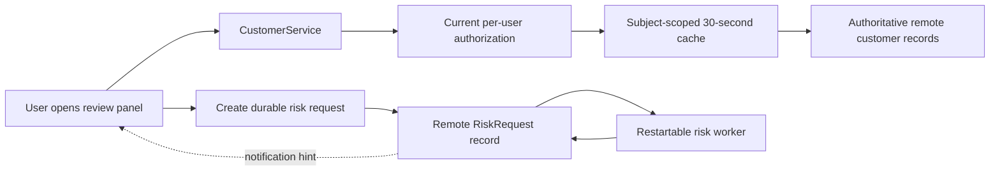

# Synthetic remote-backed customer workspace: discovery and handoff

This is a synthetic design only; no repository, remote system, baseline test, or deployment was inspected or run. The supplied successful sandbox `describe_objects` read establishes only that the developer role can describe one sandbox object. It does not establish metadata-write authority, runtime authorization, deployment access, or consumer behavior.

## Grounded architecture decision

Keep `Customer__c` remote-backed and authoritative. `ReviewStatus__c` should be an additive remote metadata change, while local XML is only a compatibility artifact; it must not overwrite the remotely present `Consent__c` or the automation that reads it. First retrieve and reconcile authoritative scoped metadata, including field permissions and dependencies, then make a non-destructive delta deployment. A deploy job ID is only submission evidence: release evidence requires a saved successful `deployment_status` receipt.

The review-panel read path must obtain a current effective user/tenant authorization decision before returning either a cache hit or a remote result. The existing broad integration identity is not sufficient evidence of this boundary. Subject to discovery, the service should use the platform's verified per-user enforcement point or a synchronous authorization service. Customer data cache entries must include tenant, subject, normalized query, and a current authorization/permission version; their data age may be at most 30 seconds. A browser cache must never be an authorization source: clear or isolate it on account change and require the server-side authorization gate for each subsequent application read. A revocation must advance or invalidate the relevant authorization state so the next read denies access even if no customer record changed.

Use the customer change feed only as a freshness accelerator after its semantics are proven; do not rely on it for revocation. Guard cache fills with a generation/version check so a slow pre-invalidation query cannot publish after an invalidation. The 5-minute tenant-plus-query cache and persistent cross-account browser cache do not meet these requirements without redesign.

Reuse remote `RiskRequest__c` as the durable assessment source of truth if its schema and concurrency contract support it. “Accepted” means an idempotent request record is durably committed with owner, request ID, status, and enough association to authorize later reads. A worker may claim and advance that record with a lease/version or equivalent proven mechanism, recover accepted/in-progress work after restart, and write the result back remotely. Panel reopening queries that durable record. Connected-only duplicate notifications are merely prompts to reread by record ID/request ID; they cannot prove completion or carry the result.

## Highest-value discovery reads and bounded probes

1. Record the designated repository, applicable instructions, current branch/deployment route, and established unchanged full or smoke baseline command; run that baseline before product edits. None was supplied here, so baseline health is presently unknown.
2. Use the existing developer connection for non-mutating `retrieve_metadata`/`describe_objects` reads of `Customer__c` and `RiskRequest__c`: fields, picklist/status rules, validation, field-level access, sharing model, `Consent__c` automation dependencies, and metadata target/version. Trace `CustomerService` through the existing REST adapter to identify its effective runtime identity and every candidate per-user enforcement point.
3. In an authorized isolated sandbox with two sanctioned users, exercise allowed and denied reads, then an administrator revocation with no record edit. Verify the next application read cannot return server or browser-cached protected data. This is the earliest security gate; do not infer it from the integration identity or change feed.
4. Reproduce a slow remote query crossing invalidation/permission change and verify the cache rejects its late fill. Separately establish change-feed coverage for sharing, field permission, policy changes, duplicates, gaps, and restart/replay; otherwise retain TTL plus synchronous authorization as the safety path.
5. Inspect `RiskRequest__c` uniqueness, transactional/locking, state transitions, owner visibility, worker trigger/scheduling, retry and external-risk-call idempotency. In a disposable fixture, submit equivalent concurrent requests, restart a worker after acceptance, close/reopen the tab, disconnect/reconnect notifications, and verify one recoverable durable outcome.
6. Measure representative sandbox read latency and quota only to size implementation behavior. Before any metadata write, verify target, developer role, deployment route/CI effect, and write authority; later poll `deployment_status` to the terminal receipt.

## Critical unresolved questions

- Which exact service enforces current per-user record and field access, and can the REST adapter carry that identity rather than expose broad-identity results?
- What authoritative revocation/version signal is available, and what happens to already-rendered data versus the required next application read?
- Does the change feed cover permission/policy changes and recover gaps, or is it record-data-only?
- What `ReviewStatus__c` values, default/backfill behavior, validation, permissions, and automation compatibility are required?
- Can `RiskRequest__c` enforce idempotent request IDs and safe worker claims, and what is the remote risk provider's retry/duplicate-effect contract?
- What sandbox/deployment target, write authority, latency/quota limits, and CI/promotion consequences apply?

## Ordered implementation handoff

The following are proposed roles, not claimed repository paths: (1) capture evidence and the decision in `docs/decisions/customer-review-panel.md`; (2) map actual service, adapter, UI, metadata, worker, and test locations and complete the unchanged baseline; (3) close the authorization, schema, cache, and request-lifecycle probes above; (4) add the compatible `ReviewStatus__c` metadata delta and retain its terminal deployment receipt; (5) implement the service authorization/cache gate and panel filter; (6) implement durable request creation, worker recovery, result reread, and notification-as-hint behavior; (7) add contract, integration, restart, revocation, stale-fill, and authorization tests; (8) immediately revalidate target, identity, metadata version, deployment route, and consumer access before promotion.

Acceptance requires: filtered lists contain only currently authorized fields/records and data no older than 30 seconds by the defined cache age; an admin revocation prevents the next read despite no record edit, a prior cache entry, or account switching; `Consent__c` and its automation remain intact; metadata has a saved successful status receipt; and an accepted risk request survives tab closure and worker restart, returns its durable result on reopen, and tolerates duplicate notifications and retries without duplicate assessment effects. A failed or unavailable access/baseline probe remains a prerequisite, not a green result.

The unrelated pure string-title capitalization edit needs only its designated local file, existing unit tests, and normal unchanged-baseline/targeted-test checks; it needs no remote customer, MCP, cache, authorization, risk-worker, or deployment discovery.
