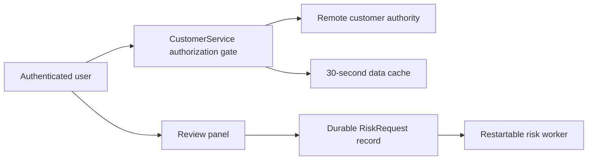

# Synthetic remote-service discovery and handoff

This is a design from the supplied hypothetical fact sheet only. No repository, remote system, MCP operation, product edit, or baseline test was run.

## Decision

Keep `Customer__c` and `RiskRequest__c` remote as the authoritative records. The runtime remains `CustomerService -> remote REST adapter`; the developer MCP is a discovery/deployment tool only. Do not create a customer replica, a browser customer cache, or a local job table.

The existing five-minute tenant-plus-query cache cannot meet the requirements: it is populated under a broad integration identity, omits a principal/permission context, and could return a slow pre-invalidation fill. Make authorization a live gate before every application read that can expose customer data. That gate must use a documented per-user remote/native authorization decision (or an equivalent synchronous revocation-aware authority), then permit a data-cache lookup scoped to the authorized principal and authorization version. Cached data may be at most 30 seconds old, but cache age is not revocation evidence. If the authority cannot establish current access, return no customer data. Browser storage must be cleared or made inaccessible on account change; safest is to retain panel data only in page memory. The change feed may improve freshness, but cannot be relied on for revocation until its permission-event, gap, ordering, and stale-fill semantics are proven. A generation/version check must discard a slow fill that began before invalidation.

Add `ReviewStatus__c` as a compatible, additive metadata change only after reading the current sandbox metadata and its dependencies. Preserve the remote `Consent__c` drift and the independent automation that consumes it. A deploy job ID is acceptance of work, not deployment success: retain a success receipt from the status endpoint after an authorized sandbox deployment.

For risk assessment, create or reuse one remote `RiskRequest__c` per authorized request identity. Its durable status/result is the recovery source. The worker must atomically claim/version work, make retries idempotent, and reconcile accepted unfinished records after restart. The panel writes/reads the durable request record; its notification is only a duplicate-tolerant wake-up hint. On open, reload/poll the record by request ID, so a closed initiating tab, missed notification, or worker restart does not lose an accepted assessment.

## Highest-value discovery reads and bounded probes

1. Establish the designated starting checkout, instructions, branch/worktree effects, and safe full or smoke test command; run that unchanged baseline before implementation and record its coverage and result.
2. Read the current `CustomerService`, REST adapter, session/auth middleware, cache implementation, browser storage use, worker, and all customer/risk callers. Map the actual application identity and each read/write boundary.
3. With the existing developer role, read sandbox object descriptions and retrieved metadata for `Customer__c`, `RiskRequest__c`, `Consent__c`, sharing, field permissions, validation/automation dependencies, and the proposed field type/list values. Read the deployment-status contract. This establishes neither metadata-write authority nor runtime user access.
4. Use approved isolated user roles to probe the real per-user authorization path, including an administrator revocation followed by the next application read. Separately exercise account switching and a slow query completing after invalidation. The discriminating result is that no stale cached payload is exposed after the authority denies access.
5. Inspect and then exercise `RiskRequest__c` in an isolated fixture: repeated request ID, concurrent worker claims, crash after acceptance/before completion, restart recovery, result visibility, and absent/duplicate notification. Record whether the remote object supplies transaction/version/lease behavior or needs a smallest compatible extension.
6. Measure representative list-query latency and quota only after correctness gates are known; those measurements inform feasibility, not the 30-second or revocation policy.

## Critical unresolved questions

- Which component enforces per-user authorization today, and can it make a current revocation-aware decision while the adapter uses its broad identity?
- Do native authorization/cache facilities provide an authorization epoch or synchronous revocation check? Does the change feed include sharing, field permission, and policy changes; how are gaps, reordering, and stale fills handled?
- What are `RiskRequest__c`'s ownership, requester-read, idempotency, state, concurrency, retry, and worker-recovery contracts?
- What exact `ReviewStatus__c` schema, validation, automation, compatibility, and migration effects apply, and does the developer role have approved sandbox metadata-write authority?
- What target, identity, deployment receipt retention, latency, quota, and browser-consumer constraints apply at promotion time?

## Ordered implementation handoff

Proposed paths below describe roles; they are not claims that the files exist.

1. Record discovery/access decisions in `docs/decisions/customer-review-remote-boundary.md`; stop if the per-user revocation gate is unavailable.
2. Prepare the additive field in `metadata/objects/Customer__c/fields/ReviewStatus__c.field-meta.xml`, compare it against current metadata, then make the separately authorized sandbox deployment and status read-back.
3. Change `src/services/CustomerService.*` and `src/adapters/RemoteCustomerAdapter.*` to gate every read, scope/limit the cache, clear account-switch exposure, and reject obsolete fills.
4. Implement the panel/filter in `src/ui/CustomerReviewPanel.*` only against the validated field contract. Implement durable request submission/recovery in `src/risk/RiskAssessmentService.*` and `src/workers/RiskRequestWorker.*`.
5. Add focused authorization, cache-race, metadata compatibility, durable request/restart, and notification-loss/duplication tests under `test/`, then run the established broader suite and authorized consumer check.

Acceptance requires: filtered lists are no older than 30 seconds; revocation causes the very next application read to disclose no cached customer data; account switching leaks none; the additive deployment preserves `Consent__c` and its automation with a saved successful status receipt; duplicate risk requests create one logical assessment; reopening after tab closure and worker restart shows the durable result even without a notification. Revalidate current metadata, target, identity, authorization behavior, cache/feed assumptions, and deployment status immediately before each authorized remote write or promotion.

The unrelated pure formatter-title capitalization edit needs only its local file and existing unit-test discovery/baseline; it needs no remote-service, metadata, cache, authorization, or worker investigation.
