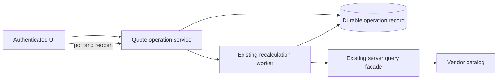

# Synthetic remote-catalog discovery and implementation handoff

## Evidence scope

This is a design based solely on the supplied hypothetical fact sheet; no repository, service, account, or vendor call was inspected or executed. The vendor MCP has developer-only read evidence, while the existing application facade, worker, conditional records, operation records, polling loop, cache weakness, and schema mismatch are supplied observations ([input.md - synthetic facts: existing capabilities and gaps](/Users/dadleet/src/skill-craft/test/experiments/shiploop_remote_services_20260919/arms/03/input.md:729)).

## Architecture decision

Keep the vendor catalog authoritative and reuse the existing server-side query facade, worker, durable operation record, conditional updates, and same-intent idempotency. A server-side quote-operation boundary accepts an input revision, tenant, requester, and idempotency key; it persists a new operation record before acknowledging the UI, then arranges worker execution. The UI immediately reads status after submit or reopen and polls through that boundary every 10 seconds while open. This supports reopen recovery without a catalog copy because the durable operation record owns workflow state, not catalog data ([input.md - operation record and polling: supplied durable state and cadence](/Users/dadleet/src/skill-craft/test/experiments/shiploop_remote_services_20260919/arms/03/input.md:741)).

Each completion must remain attached to its operation ID and input revision. The worker conditionally advances only that operation record; the UI accepts a result only when its operation ID, input revision, tenant/requester, and current account-session generation equal its active submission. For example, after quote A/r1 and quote B/r2 are submitted, A may finish last, but B remains displayed because A fails the UI match and cannot promote a shared “current quote” without a matching current revision. A retry uses the same intent key; a new user edit creates a new revision and operation. This uses the supplied conditional-update and idempotency facilities rather than adding a broker or websocket ([input.md - service facilities: conditional updates and idempotency](/Users/dadleet/src/skill-craft/test/experiments/shiploop_remote_services_20260919/arms/03/input.md:737)).

The worker reads catalog data only through the facade and never writes vendor schema or `QuoteTotal`; `QuoteTotal` is computed and `SpecialTerms` is a separately maintained read-only input to the calculation. No vendor `update_record` or schema API is selected for this increment ([input.md - metadata conflict: computed total and protected terms](/Users/dadleet/src/skill-craft/test/experiments/shiploop_remote_services_20260919/arms/03/input.md:752)).

Sensitive price output requires a fresh entitlement decision before every result/status read, including a cache hit. The present cache is unsafe because it lacks permission invalidation, allows late prior-account responses, and fails open during authorization outages. Until an existing authorization version/invalidation mechanism is verified, bypass cached sensitive prices and fail closed on authorization-service failure; also discard delayed responses after a session/account change ([input.md - cache behavior: revocation and stale-response defect](/Users/dadleet/src/skill-craft/test/experiments/shiploop_remote_services_20260919/arms/03/input.md:748)).

The 10-second cadence is compatible with a 15-second visibility target only if measured scheduling and status-read latency leave at most five seconds of worst-case additional delay. It is not proof of that target. No push system is needed unless measurement disproves polling ([input.md - current UI transport: polling, no push requirement](/Users/dadleet/src/skill-craft/test/experiments/shiploop_remote_services_20260919/arms/03/input.md:745)).

## Highest-value discovery reads and bounded probes

1. Read the existing facade, authorization adapter, cache wrapper, and their tests. Trace authorization relative to cache lookup, user/tenant/result-locator checks, account-session replacement, revocation signal, and outage behavior. In an authorized isolated harness, fill a price response, revoke entitlement, switch account, and deliver a delayed old response; the only acceptable observations are denial and no stale display.
2. Read the operation-record definition, dispatch code, worker lifecycle, conditional-update contract, and recovery tests. Use a disposable fault-injection fixture at acceptance-before-dispatch, dispatch-before-worker-start, and worker abandonment. Establish whether an accepted operation is atomically dispatched or is safely reclaimed; do not assume either from “accepted before response.”
3. Make only authorized, non-mutating vendor reads: `describe_model` plus bounded filtered `query_records` through the intended runtime identity and tenant scope. Confirm model/version, computed-field semantics, `SpecialTerms`, filtering, response shape, and runtime authorization. Developer-account query success is insufficient; request the smallest service-role/read-only access if it blocks this check.
4. Exercise conditional updates and idempotency in an isolated record fixture: duplicate r2 intent, r1/r2 concurrent submissions, and reversed completion. Verify tenant isolation, exact compare-and-set predicate, result visibility, and that no stale completion becomes current.
5. Measure end-to-end status-read latency, polling jitter, and rate/quota behavior at the expected population in an authorized test environment. This decides whether the 15-second contract holds and whether the existing filtered query is sufficient.

## Critical open questions

- What runtime identity and tenant/entitlement contract applies to catalog reads and operation/result retrieval? The only proven read is developer access.
- Is acceptance atomic with dispatch, and what lease, scan, or reconciliation recovers accepted abandoned work?
- Which revision is the conditional-update guard, and does any existing shared quote pointer require its own compare-and-set rule?
- Can authorization provide a current entitlement/version or invalidation receipt; if not, can sensitive cached data be safely bypassed at the required load?
- Do measured polling, worker completion, and quota limits meet the 15-second visibility target?

## Ordered handoff and acceptance

The following are proposed file roles, not claims that these paths exist:

1. `docs/decisions/catalog-quote-recalculation.md` — record the selected boundaries, evidence, access disposition, and no-schema-write decision.
2. `src/server/catalogQuoteFacade.ts` and `src/server/priceAuthorization.ts` — preserve facade ownership; enforce current authorization and safe cache policy.
3. `src/server/quoteOperations.ts` — accept/retry semantics, durable record creation, dispatch/recovery contract, and guarded status reads.
4. `src/workers/recalculateQuote.ts` — calculate from facade data and conditionally record completion/failure without catalog mutation.
5. `src/client/quoteProgress.ts` — immediate read, 10-second polling, reopen recovery, and operation/revision/session stale-result guard.
6. `test/contract/quoteOperations.test.ts`, `test/security/priceAuthorization.test.ts`, and `test/integration/quoteRecalculation.test.ts` — cover the checks below; add a load/latency test or operational measurement artifact for the timing target.

Acceptance requires: an authorized requester can resume a completed operation after reopen; an r1 completion after r2 never changes the visible r2 quote; duplicate same-intent submission is idempotent; accepted work is dispatched or recoverably reconciled; cross-tenant/result-locator reads are denied; revocation, account switch, and authorization outage never expose cached prices; `QuoteTotal` and `SpecialTerms` remain unmodified; and measured visibility is at most 15 seconds under the agreed population. Immediately before implementation and again before delivery, revalidate runtime identity/access, vendor metadata, facade/cache authorization order, operation recovery semantics, conditional-update predicate, polling metrics, and the target environment’s deployment/consumer route.

The unrelated title-capitalization formatter edit needs only its normal local baseline and existing formatter unit tests; remote-service discovery, authorization probes, and operation design are not applicable.
