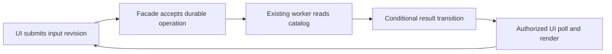

# Arm 04 — Synthetic discovery and handoff

**Evidence boundary.** This is a design draft from the supplied hypothetical only; no repository, target, account, code, or remote operation was inspected or changed. The request, existing facilities, and known gaps are from [input.md — Fact sheet: required quote behavior and observed constraints](/Users/dadleet/src/skill-craft/test/experiments/shiploop_remote_services_20260919/arms/04/input.md:670).

## Architecture decision

**Proposal, conditional on the discovery below:** retain the remote catalog as authoritative and reuse the server-side query facade, existing worker, durable operation records, conditional-revision updates, same-intent idempotency, bounded queries, and 10-second open-page polling. Do not add an event bus, websocket, catalog replica, schema change, or `update_record` path. The vendor's computed `QuoteTotal` is a read/calculation input or output, never a write target; preserve `SpecialTerms` as its separately maintained field. This follows the supplied capability and schema facts [input.md — Fact sheet: facade, worker, conditional updates, and catalog metadata](/Users/dadleet/src/skill-craft/test/experiments/shiploop_remote_services_20260919/arms/04/input.md:681).

The facade should authenticate the requester, create or reuse one operation for a tenant/requester/logical-quote/input-revision and same-intent key, durably record acceptance before replying, and return the operation ID and input revision. The worker reads through the established catalog boundary, writes a protected result locator, and conditionally transitions the operation only when its expected record revision and input revision still match. A current-quote pointer, or the UI's latest submitted revision, must also be conditionally advanced; an older operation may finish but cannot become the current rendered quote.

While open, the UI keeps its current account/session epoch and latest input revision, polls its operation every 10 seconds, and discards a response whose account/session or input revision no longer matches. On reopen it reads the durable operation by authorized ID, or a bounded tenant/requester/current-quote query, then resumes polling or renders the terminal result. This is sufficient only if measured end-to-end visibility stays within the permitted 15 seconds; the present facts establish neither latency nor capacity.

Sensitive results require a separate security correction: authorize every submit, operation read, and result dereference against current entitlement; scope the result locator to the operation service rather than expose it directly; invalidate or version cache entries on entitlement/account changes; clear client-held sensitive state on those changes; and fail closed during authorization-service outage. The current cached-last-result behavior cannot meet the revocation requirement [input.md — Fact sheet: cache and authorization failure behavior](/Users/dadleet/src/skill-craft/test/experiments/shiploop_remote_services_20260919/arms/04/input.md:695). A late formerly-authorized response must fail both server authorization and the client's epoch/revision checks.

## Highest-value first discovery reads and bounded probes

1. Read the facade, operation-repository, worker-dispatch/recovery, and deployment notes to establish the exact accept → dispatch atomicity, worker identity, retry/abandonment rule, operation retention, result-locator access path, and original-branch/consumer-test route.
2. Read the UI polling, account-switch, authorization, and cache implementations to locate request cancellation/epoch handling, browser persistence, invalidation hooks, and the unsafe outage fallback.
3. Use existing read authority only to inspect the vendor model metadata and representative allowed records: confirm `QuoteTotal` representation, `SpecialTerms` semantics, query limits, and no required catalog mutation. Developer-read success must remain labeled developer-only, not production or end-user proof.
4. In an authorized isolated test, interrupt after acceptance/before dispatch and after dispatch/before terminal write; verify deterministic requeue/recovery and no duplicate business effect under the documented idempotency lifetime.
5. In controlled tests, reverse two quote completions; close/reopen between statuses; revoke entitlement or switch account before a delayed response; simulate authorization outage; and load the 10-second polling path at expected population. These distinguish stale-write, recovery, revocation, and 15-second-budget claims.

## Critical unresolved questions

- Is acceptance atomically paired with dispatch (for example through an existing outbox), and how are accepted abandoned operations recovered without duplicate work?
- What identifies the logical quote and its monotonically newer input revision across retries, browser reopen, and idempotency-key expiry?
- Which worker/service and requester identities may read catalog data and stored results; what entitlement version or revocation signal exists; and must a pending result be suppressed or deleted when entitlement is revoked?
- Does remote computed `QuoteTotal` remain numeric and usable for the local v3 contract, what calculation belongs to the worker, and how do `SpecialTerms`, nulls, permissions, and vendor rate limits behave?
- Can the expected population meet 15-second visibility with polling, and what retention, tenant isolation, and authorization policy govern operation/result records?

## Ordered implementation handoff

The following are proposed roles and paths, not claims about the repository:

1. `docs/quotes/recalculation-discovery.md` — record validated interfaces, identities, measurements, decisions, and open gaps.
2. `server/quotes/recalculation-facade.ts` — authenticated acceptance, logical-quote revision handling, and protected operation reads.
3. `server/operations/quote-operation-repository.ts` — conditional transition predicates, idempotency, bounded reopen lookup, and result-locator authorization.
4. `workers/quote-recalculation.ts` — catalog reads, computed-field-safe calculation, conditional terminal write, and abandonment recovery integration.
5. `server/auth/price-access.ts` plus the existing cache adapter — entitlement-version checks, revocation invalidation, and fail-closed outage behavior.
6. `web/quotes/use-quote-operation.ts` — 10-second polling, reopen recovery, account/session epoch, stale-response discard, and sensitive-state clearing.
7. `test/quotes/recalculation.integration.test.ts` and `test/quotes/recalculation.ui.test.ts` — the acceptance cases below, using an isolated vendor/authorization fixture.

## Acceptance and revalidation

Accept only when: duplicate same-intent submits produce one durable operation/business effect; reversed completion never changes the current quote to an older input revision; reopen recovers pending or completed authorized work; measured visibility is at most 15 seconds at the stated load; no vendor schema or catalog write occurs; `SpecialTerms` survives; revoked or switched users cannot retrieve, render, or retain sensitive prices; authorization outage returns denial rather than cached authorization; and crash/restart yields a defined, tested recovery outcome.

Before implementation and again before consumer validation, re-read the selected facade/worker contracts, target-role permissions, vendor metadata, operation recovery semantics, cache/auth behavior, polling measurements, and deployment/branch route. Any conflict—especially schema shape, revocation timing, dispatch atomicity, or load—reopens this decision rather than being patched around.

The unrelated pure title-capitalization formatter edit needs only the normal unchanged baseline and its focused existing unit test; it has no remote-service, access, catalog, worker, or delivery discovery dependency.
