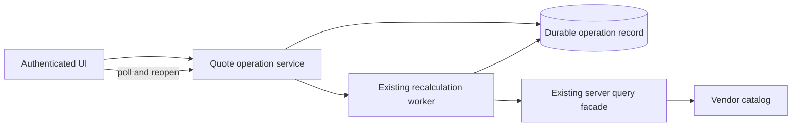
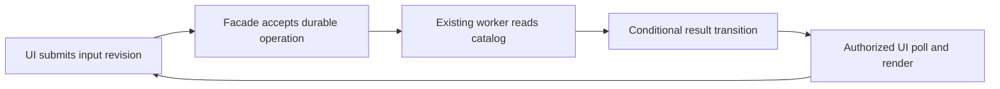

# Independent blind comparison
Both outputs are completed synthetic reports. Evaluate against the case and rubric, not prose length. Neither output proves real remote behavior. Do not read other study files or look for variant identities. Give each criterion supported/partial/missing/incorrect for A and B with passage evidence. Choose A/B/tie, flag critical omissions/regressions, and explain why.

Rubric (applicable case facts govern; omitted unneeded machinery is good):
1. Distinguish provision/development MCP from app runtime; map schema and data
   operation capabilities and authorization separately without guessing coverage.
2. Preserve remote source of truth; justify facade/cache/projection using unknown
   measurements; clarify copies and avoid declaring cache automatically required.
3. Separate freshness and authorization: tenant/user key alone is insufficient;
   current allow/deny on reads, independent permission invalidation/revocation,
   account switching, safe behavior on authority failure.
4. Cover invalidation races, data/schema/permission changes and read-after-write;
   schema case must address event gaps and late fills specifically.
5. Choose usable async mechanism: reuse record/polling when adequate; acceptance
   versus completion, idempotency/revision, stale completions, restart/dispatch
   gap, authorized result reads; notifications are not durable completion proof.
6. Reconcile prior intent/local/remote/requested delta without overwriting unrelated
   metadata or computed fields; recheck drift, capability and authority at write.
7. Handoff explicit affected files/roles, evidence locators, ordered prerequisites,
   independent acceptance checks and unresolved gating conditions to development.
8. Local control needs no remote discovery or new service prerequisite.

Report per criterion: supported / partial / missing / incorrect, with reasons.
Flag material regressions even if the longer candidate covers more topics.
Possible recommendation: refine, retain baseline, or continue a focused pilot.

# Case
# Synthetic case: remote catalog with background recalculation

Design first-part discovery and implementation handoff for this increment.
All facts below are a supplied hypothetical, not live observations.

Request: multiple business services must cooperate to recalculate a catalog quote.
The UI may see progress up to 15 seconds late and must recover completed work on
reopen. A stale completion must never replace a newer submitted quote. Sensitive
prices must not be readable after the user's entitlement is revoked. Avoid copying
the catalog into an application database unless evidence proves it necessary.

Observed facts:
- A vendor MCP exposes list_models, describe_model, query_records, update_record
  and get_operation. It has no observed schema-management tool. Its developer
  account has read access. A documented vendor schema API is a lead with unknown
  account authority. Successful query access has been verified only for developers.
- The application already has a server-side query facade. It reads the remote
  catalog and delegates recalculation to an existing worker. The worker is allowed
  to update durable operation records without a browser being present.
- The service already provides atomic conditional record updates on revision,
  documented same-intent idempotency within the operation's lifetime, and bounded
  filtered queries. These facilities are available for reuse. Rate/latency
  measurements for polling under the expected population remain unknown.
- A durable operation record stores tenant, requester, operation ID, input revision,
  status, result locator, revision and timestamps. get_operation reads it. Work
  acceptance is recorded before the response, but its atomic relationship to
  dispatch and the worker's abandoned-work recovery have not been inspected.
- No event bus, webhook subscription, or websocket endpoint is installed. There
  is no requirement for an instant push notification. Current UI polls every 10
  seconds while open and stops polling on close.
- A cache has tenant/user/query keys and 60-second TTL. Permission changes are
  not a documented invalidation source. An old authorized response can arrive
  after account switching or revocation. On an authorization-service outage the
  existing handler currently returns its last cached result.
- Local schema v3 expects numeric QuoteTotal. Remote metadata now marks it as a
  computed field and contains a separate manually maintained SpecialTerms field.
  Prior intent expected QuoteTotal to be writable. The change request requires
  calculation behavior, not permission to overwrite vendor schema.

Return a grounded architecture decision, highest-value discovery reads/probes,
critical unresolved questions, and an ordered handoff naming example file roles
(paths may be proposed, not claimed to exist), acceptance checks and revalidation.
No remote execution or product edits. Maximum 1100 words.

Independent local control: an unrelated requested edit changes a pure string
formatter's title capitalization in one file, with existing unit tests and no
remote data. State what discovery/service work that edit needs in one sentence.

# Report A
# Synthetic remote-catalog discovery and implementation handoff

## Evidence scope

This is a design based solely on the supplied hypothetical fact sheet; no repository, service, account, or vendor call was inspected or executed. The vendor MCP has developer-only read evidence, while the existing application facade, worker, conditional records, operation records, polling loop, cache weakness, and schema mismatch are supplied observations ([input.md - synthetic facts: existing capabilities and gaps](/Users/dadleet/src/skill-craft/test/experiments/shiploop_remote_services_20260919/arms/03/input.md:729)).

## Architecture decision

Keep the vendor catalog authoritative and reuse the existing server-side query facade, worker, durable operation record, conditional updates, and same-intent idempotency. A server-side quote-operation boundary accepts an input revision, tenant, requester, and idempotency key; it persists a new operation record before acknowledging the UI, then arranges worker execution. The UI immediately reads status after submit or reopen and polls through that boundary every 10 seconds while open. This supports reopen recovery without a catalog copy because the durable operation record owns workflow state, not catalog data ([input.md - operation record and polling: supplied durable state and cadence](/Users/dadleet/src/skill-craft/test/experiments/shiploop_remote_services_20260919/arms/03/input.md:741)).

Each completion must remain attached to its operation ID and input revision. The worker conditionally advances only that operation record; the UI accepts a result only when its operation ID, input revision, tenant/requester, and current account-session generation equal its active submission. For example, after quote A/r1 and quote B/r2 are submitted, A may finish last, but B remains displayed because A fails the UI match and cannot promote a shared “current quote” without a matching current revision. A retry uses the same intent key; a new user edit creates a new revision and operation. This uses the supplied conditional-update and idempotency facilities rather than adding a broker or websocket ([input.md - service facilities: conditional updates and idempotency](/Users/dadleet/src/skill-craft/test/experiments/shiploop_remote_services_20260919/arms/03/input.md:737)).

The worker reads catalog data only through the facade and never writes vendor schema or `QuoteTotal`; `QuoteTotal` is computed and `SpecialTerms` is a separately maintained read-only input to the calculation. No vendor `update_record` or schema API is selected for this increment ([input.md - metadata conflict: computed total and protected terms](/Users/dadleet/src/skill-craft/test/experiments/shiploop_remote_services_20260919/arms/03/input.md:752)).

Sensitive price output requires a fresh entitlement decision before every result/status read, including a cache hit. The present cache is unsafe because it lacks permission invalidation, allows late prior-account responses, and fails open during authorization outages. Until an existing authorization version/invalidation mechanism is verified, bypass cached sensitive prices and fail closed on authorization-service failure; also discard delayed responses after a session/account change ([input.md - cache behavior: revocation and stale-response defect](/Users/dadleet/src/skill-craft/test/experiments/shiploop_remote_services_20260919/arms/03/input.md:748)).

The 10-second cadence is compatible with a 15-second visibility target only if measured scheduling and status-read latency leave at most five seconds of worst-case additional delay. It is not proof of that target. No push system is needed unless measurement disproves polling ([input.md - current UI transport: polling, no push requirement](/Users/dadleet/src/skill-craft/test/experiments/shiploop_remote_services_20260919/arms/03/input.md:745)).

## Highest-value discovery reads and bounded probes

1. Read the existing facade, authorization adapter, cache wrapper, and their tests. Trace authorization relative to cache lookup, user/tenant/result-locator checks, account-session replacement, revocation signal, and outage behavior. In an authorized isolated harness, fill a price response, revoke entitlement, switch account, and deliver a delayed old response; the only acceptable observations are denial and no stale display.
2. Read the operation-record definition, dispatch code, worker lifecycle, conditional-update contract, and recovery tests. Use a disposable fault-injection fixture at acceptance-before-dispatch, dispatch-before-worker-start, and worker abandonment. Establish whether an accepted operation is atomically dispatched or is safely reclaimed; do not assume either from “accepted before response.”
3. Make only authorized, non-mutating vendor reads: `describe_model` plus bounded filtered `query_records` through the intended runtime identity and tenant scope. Confirm model/version, computed-field semantics, `SpecialTerms`, filtering, response shape, and runtime authorization. Developer-account query success is insufficient; request the smallest service-role/read-only access if it blocks this check.
4. Exercise conditional updates and idempotency in an isolated record fixture: duplicate r2 intent, r1/r2 concurrent submissions, and reversed completion. Verify tenant isolation, exact compare-and-set predicate, result visibility, and that no stale completion becomes current.
5. Measure end-to-end status-read latency, polling jitter, and rate/quota behavior at the expected population in an authorized test environment. This decides whether the 15-second contract holds and whether the existing filtered query is sufficient.

## Critical open questions

- What runtime identity and tenant/entitlement contract applies to catalog reads and operation/result retrieval? The only proven read is developer access.
- Is acceptance atomic with dispatch, and what lease, scan, or reconciliation recovers accepted abandoned work?
- Which revision is the conditional-update guard, and does any existing shared quote pointer require its own compare-and-set rule?
- Can authorization provide a current entitlement/version or invalidation receipt; if not, can sensitive cached data be safely bypassed at the required load?
- Do measured polling, worker completion, and quota limits meet the 15-second visibility target?

## Ordered handoff and acceptance

The following are proposed file roles, not claims that these paths exist:

1. `docs/decisions/catalog-quote-recalculation.md` — record the selected boundaries, evidence, access disposition, and no-schema-write decision.
2. `src/server/catalogQuoteFacade.ts` and `src/server/priceAuthorization.ts` — preserve facade ownership; enforce current authorization and safe cache policy.
3. `src/server/quoteOperations.ts` — accept/retry semantics, durable record creation, dispatch/recovery contract, and guarded status reads.
4. `src/workers/recalculateQuote.ts` — calculate from facade data and conditionally record completion/failure without catalog mutation.
5. `src/client/quoteProgress.ts` — immediate read, 10-second polling, reopen recovery, and operation/revision/session stale-result guard.
6. `test/contract/quoteOperations.test.ts`, `test/security/priceAuthorization.test.ts`, and `test/integration/quoteRecalculation.test.ts` — cover the checks below; add a load/latency test or operational measurement artifact for the timing target.

Acceptance requires: an authorized requester can resume a completed operation after reopen; an r1 completion after r2 never changes the visible r2 quote; duplicate same-intent submission is idempotent; accepted work is dispatched or recoverably reconciled; cross-tenant/result-locator reads are denied; revocation, account switch, and authorization outage never expose cached prices; `QuoteTotal` and `SpecialTerms` remain unmodified; and measured visibility is at most 15 seconds under the agreed population. Immediately before implementation and again before delivery, revalidate runtime identity/access, vendor metadata, facade/cache authorization order, operation recovery semantics, conditional-update predicate, polling metrics, and the target environment’s deployment/consumer route.

The unrelated title-capitalization formatter edit needs only its normal local baseline and existing formatter unit tests; remote-service discovery, authorization probes, and operation design are not applicable.

# Report B
# Arm 04 — Synthetic discovery and handoff

**Evidence boundary.** This is a design draft from the supplied hypothetical only; no repository, target, account, code, or remote operation was inspected or changed. The request, existing facilities, and known gaps are from [input.md — Fact sheet: required quote behavior and observed constraints](/Users/dadleet/src/skill-craft/test/experiments/shiploop_remote_services_20260919/arms/04/input.md:670).

## Architecture decision

**Proposal, conditional on the discovery below:** retain the remote catalog as authoritative and reuse the server-side query facade, existing worker, durable operation records, conditional-revision updates, same-intent idempotency, bounded queries, and 10-second open-page polling. Do not add an event bus, websocket, catalog replica, schema change, or `update_record` path. The vendor's computed `QuoteTotal` is a read/calculation input or output, never a write target; preserve `SpecialTerms` as its separately maintained field. This follows the supplied capability and schema facts [input.md — Fact sheet: facade, worker, conditional updates, and catalog metadata](/Users/dadleet/src/skill-craft/test/experiments/shiploop_remote_services_20260919/arms/04/input.md:681).

The facade should authenticate the requester, create or reuse one operation for a tenant/requester/logical-quote/input-revision and same-intent key, durably record acceptance before replying, and return the operation ID and input revision. The worker reads through the established catalog boundary, writes a protected result locator, and conditionally transitions the operation only when its expected record revision and input revision still match. A current-quote pointer, or the UI's latest submitted revision, must also be conditionally advanced; an older operation may finish but cannot become the current rendered quote.

While open, the UI keeps its current account/session epoch and latest input revision, polls its operation every 10 seconds, and discards a response whose account/session or input revision no longer matches. On reopen it reads the durable operation by authorized ID, or a bounded tenant/requester/current-quote query, then resumes polling or renders the terminal result. This is sufficient only if measured end-to-end visibility stays within the permitted 15 seconds; the present facts establish neither latency nor capacity.

Sensitive results require a separate security correction: authorize every submit, operation read, and result dereference against current entitlement; scope the result locator to the operation service rather than expose it directly; invalidate or version cache entries on entitlement/account changes; clear client-held sensitive state on those changes; and fail closed during authorization-service outage. The current cached-last-result behavior cannot meet the revocation requirement [input.md — Fact sheet: cache and authorization failure behavior](/Users/dadleet/src/skill-craft/test/experiments/shiploop_remote_services_20260919/arms/04/input.md:695). A late formerly-authorized response must fail both server authorization and the client's epoch/revision checks.

## Highest-value first discovery reads and bounded probes

1. Read the facade, operation-repository, worker-dispatch/recovery, and deployment notes to establish the exact accept → dispatch atomicity, worker identity, retry/abandonment rule, operation retention, result-locator access path, and original-branch/consumer-test route.
2. Read the UI polling, account-switch, authorization, and cache implementations to locate request cancellation/epoch handling, browser persistence, invalidation hooks, and the unsafe outage fallback.
3. Use existing read authority only to inspect the vendor model metadata and representative allowed records: confirm `QuoteTotal` representation, `SpecialTerms` semantics, query limits, and no required catalog mutation. Developer-read success must remain labeled developer-only, not production or end-user proof.
4. In an authorized isolated test, interrupt after acceptance/before dispatch and after dispatch/before terminal write; verify deterministic requeue/recovery and no duplicate business effect under the documented idempotency lifetime.
5. In controlled tests, reverse two quote completions; close/reopen between statuses; revoke entitlement or switch account before a delayed response; simulate authorization outage; and load the 10-second polling path at expected population. These distinguish stale-write, recovery, revocation, and 15-second-budget claims.

## Critical unresolved questions

- Is acceptance atomically paired with dispatch (for example through an existing outbox), and how are accepted abandoned operations recovered without duplicate work?
- What identifies the logical quote and its monotonically newer input revision across retries, browser reopen, and idempotency-key expiry?
- Which worker/service and requester identities may read catalog data and stored results; what entitlement version or revocation signal exists; and must a pending result be suppressed or deleted when entitlement is revoked?
- Does remote computed `QuoteTotal` remain numeric and usable for the local v3 contract, what calculation belongs to the worker, and how do `SpecialTerms`, nulls, permissions, and vendor rate limits behave?
- Can the expected population meet 15-second visibility with polling, and what retention, tenant isolation, and authorization policy govern operation/result records?

## Ordered implementation handoff

The following are proposed roles and paths, not claims about the repository:

1. `docs/quotes/recalculation-discovery.md` — record validated interfaces, identities, measurements, decisions, and open gaps.
2. `server/quotes/recalculation-facade.ts` — authenticated acceptance, logical-quote revision handling, and protected operation reads.
3. `server/operations/quote-operation-repository.ts` — conditional transition predicates, idempotency, bounded reopen lookup, and result-locator authorization.
4. `workers/quote-recalculation.ts` — catalog reads, computed-field-safe calculation, conditional terminal write, and abandonment recovery integration.
5. `server/auth/price-access.ts` plus the existing cache adapter — entitlement-version checks, revocation invalidation, and fail-closed outage behavior.
6. `web/quotes/use-quote-operation.ts` — 10-second polling, reopen recovery, account/session epoch, stale-response discard, and sensitive-state clearing.
7. `test/quotes/recalculation.integration.test.ts` and `test/quotes/recalculation.ui.test.ts` — the acceptance cases below, using an isolated vendor/authorization fixture.

## Acceptance and revalidation

Accept only when: duplicate same-intent submits produce one durable operation/business effect; reversed completion never changes the current quote to an older input revision; reopen recovers pending or completed authorized work; measured visibility is at most 15 seconds at the stated load; no vendor schema or catalog write occurs; `SpecialTerms` survives; revoked or switched users cannot retrieve, render, or retain sensitive prices; authorization outage returns denial rather than cached authorization; and crash/restart yields a defined, tested recovery outcome.

Before implementation and again before consumer validation, re-read the selected facade/worker contracts, target-role permissions, vendor metadata, operation recovery semantics, cache/auth behavior, polling measurements, and deployment/branch route. Any conflict—especially schema shape, revocation timing, dispatch atomicity, or load—reopens this decision rather than being patched around.

The unrelated pure title-capitalization formatter edit needs only the normal unchanged baseline and its focused existing unit test; it has no remote-service, access, catalog, worker, or delivery discovery dependency.
