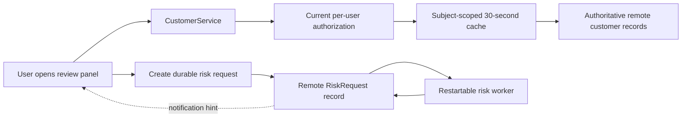
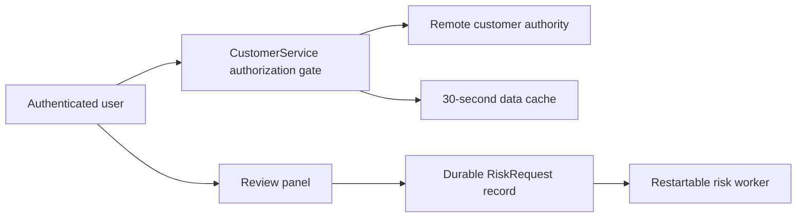

# Independent blind comparison
Both outputs are completed synthetic reports. Evaluate against the case and rubric, not prose length. Neither output proves real remote behavior. Do not read other study files or look for variant identities. Give each criterion supported/partial/missing/incorrect for A and B with passage evidence. Choose A/B/tie, flag critical omissions/regressions, and explain why.

Rubric (applicable case facts govern; omitted unneeded machinery is good):
1. Distinguish provision/development MCP from app runtime; map schema and data
   operation capabilities and authorization separately without guessing coverage.
2. Preserve remote source of truth; justify facade/cache/projection using unknown
   measurements; clarify copies and avoid declaring cache automatically required.
3. Separate freshness and authorization: tenant/user key alone is insufficient;
   current allow/deny on reads, independent permission invalidation/revocation,
   account switching, safe behavior on authority failure.
4. Cover invalidation races, data/schema/permission changes and read-after-write;
   schema case must address event gaps and late fills specifically.
5. Choose usable async mechanism: reuse record/polling when adequate; acceptance
   versus completion, idempotency/revision, stale completions, restart/dispatch
   gap, authorized result reads; notifications are not durable completion proof.
6. Reconcile prior intent/local/remote/requested delta without overwriting unrelated
   metadata or computed fields; recheck drift, capability and authority at write.
7. Handoff explicit affected files/roles, evidence locators, ordered prerequisites,
   independent acceptance checks and unresolved gating conditions to development.
8. Local control needs no remote discovery or new service prerequisite.

Report per criterion: supported / partial / missing / incorrect, with reasons.
Flag material regressions even if the longer candidate covers more topics.
Possible recommendation: refine, retain baseline, or continue a focused pilot.

# Case
# Synthetic case: remote-backed customer workspace

Design the first-part discovery and implementation handoff for this increment.
Use the supplied facts as a synthetic environment, not as a live Salesforce claim.

Request: add a customer review panel, filter by review status, and request a
background risk assessment. Keep remote customer records authoritative and avoid
a replicated customer database. List values may be 30 seconds old. Access revoked
by an administrator must not remain available through subsequent application reads.
Reopening the panel must recover an accepted assessment even after a worker restart.

Observed facts:
- The developer MCP catalog exposes describe_objects, query_records, retrieve_metadata,
  deploy_metadata, and deployment_status. The connected developer role successfully
  describes a sandbox object. Metadata-write authority has not been tested.
- The app currently uses CustomerService -> an existing remote REST adapter under
  a broad integration identity. It does not use MCP at runtime. The per-user
  authorization enforcement point has not been documented.
- Prior accepted local model has Customer__c(Name, Region__c). Current local XML
  matches it. Scoped remote metadata now also has Consent__c and an independent
  automation reading that field. The incoming feature needs ReviewStatus__c.
  An existing remote RiskRequest__c object stores owner, status, request ID and
  result, but restart/retry/concurrency behavior has not been inspected.
- The current service cache is keyed by tenant + serialized query, with a 5-minute
  TTL, filled by the integration identity. Browser cache survives account switching.
  There is a customer-data change feed; whether it reports sharing, field-permission,
  and policy changes is unknown. No event-gap or stale-fill behavior is documented.
- An in-flight slow query started before a write can finish after invalidation.
  A permission change can occur without any customer record being edited.
- Metadata deploy returns a job ID; a saved success receipt must come from the
  status endpoint. The risk worker may complete after the initiating tab closes.
  A notification channel exists but delivers only to connected subscribers, may
  duplicate notifications, and carries record ID + request ID, not a durable result.
- No latency or quota baseline has been measured. Native platform cache and
  authorization facilities are possible research leads, not established choices.

Return a grounded architecture decision, highest-value discovery reads/probes,
critical unresolved questions, and an ordered handoff naming example file roles
(paths may be proposed, not claimed to exist), acceptance checks and revalidation.
No remote execution or product edits. Maximum 1100 words.

Independent local control: an unrelated requested edit changes a pure string
formatter's title capitalization in one file, with existing unit tests and no
remote data. State what discovery/service work that edit needs in one sentence.

# Report A
# Synthetic remote-backed customer workspace: discovery and handoff

This is a synthetic design only; no repository, remote system, baseline test, or deployment was inspected or run. The supplied successful sandbox `describe_objects` read establishes only that the developer role can describe one sandbox object. It does not establish metadata-write authority, runtime authorization, deployment access, or consumer behavior.

## Grounded architecture decision

Keep `Customer__c` remote-backed and authoritative. `ReviewStatus__c` should be an additive remote metadata change, while local XML is only a compatibility artifact; it must not overwrite the remotely present `Consent__c` or the automation that reads it. First retrieve and reconcile authoritative scoped metadata, including field permissions and dependencies, then make a non-destructive delta deployment. A deploy job ID is only submission evidence: release evidence requires a saved successful `deployment_status` receipt.

The review-panel read path must obtain a current effective user/tenant authorization decision before returning either a cache hit or a remote result. The existing broad integration identity is not sufficient evidence of this boundary. Subject to discovery, the service should use the platform's verified per-user enforcement point or a synchronous authorization service. Customer data cache entries must include tenant, subject, normalized query, and a current authorization/permission version; their data age may be at most 30 seconds. A browser cache must never be an authorization source: clear or isolate it on account change and require the server-side authorization gate for each subsequent application read. A revocation must advance or invalidate the relevant authorization state so the next read denies access even if no customer record changed.

Use the customer change feed only as a freshness accelerator after its semantics are proven; do not rely on it for revocation. Guard cache fills with a generation/version check so a slow pre-invalidation query cannot publish after an invalidation. The 5-minute tenant-plus-query cache and persistent cross-account browser cache do not meet these requirements without redesign.

Reuse remote `RiskRequest__c` as the durable assessment source of truth if its schema and concurrency contract support it. “Accepted” means an idempotent request record is durably committed with owner, request ID, status, and enough association to authorize later reads. A worker may claim and advance that record with a lease/version or equivalent proven mechanism, recover accepted/in-progress work after restart, and write the result back remotely. Panel reopening queries that durable record. Connected-only duplicate notifications are merely prompts to reread by record ID/request ID; they cannot prove completion or carry the result.

## Highest-value discovery reads and bounded probes

1. Record the designated repository, applicable instructions, current branch/deployment route, and established unchanged full or smoke baseline command; run that baseline before product edits. None was supplied here, so baseline health is presently unknown.
2. Use the existing developer connection for non-mutating `retrieve_metadata`/`describe_objects` reads of `Customer__c` and `RiskRequest__c`: fields, picklist/status rules, validation, field-level access, sharing model, `Consent__c` automation dependencies, and metadata target/version. Trace `CustomerService` through the existing REST adapter to identify its effective runtime identity and every candidate per-user enforcement point.
3. In an authorized isolated sandbox with two sanctioned users, exercise allowed and denied reads, then an administrator revocation with no record edit. Verify the next application read cannot return server or browser-cached protected data. This is the earliest security gate; do not infer it from the integration identity or change feed.
4. Reproduce a slow remote query crossing invalidation/permission change and verify the cache rejects its late fill. Separately establish change-feed coverage for sharing, field permission, policy changes, duplicates, gaps, and restart/replay; otherwise retain TTL plus synchronous authorization as the safety path.
5. Inspect `RiskRequest__c` uniqueness, transactional/locking, state transitions, owner visibility, worker trigger/scheduling, retry and external-risk-call idempotency. In a disposable fixture, submit equivalent concurrent requests, restart a worker after acceptance, close/reopen the tab, disconnect/reconnect notifications, and verify one recoverable durable outcome.
6. Measure representative sandbox read latency and quota only to size implementation behavior. Before any metadata write, verify target, developer role, deployment route/CI effect, and write authority; later poll `deployment_status` to the terminal receipt.

## Critical unresolved questions

- Which exact service enforces current per-user record and field access, and can the REST adapter carry that identity rather than expose broad-identity results?
- What authoritative revocation/version signal is available, and what happens to already-rendered data versus the required next application read?
- Does the change feed cover permission/policy changes and recover gaps, or is it record-data-only?
- What `ReviewStatus__c` values, default/backfill behavior, validation, permissions, and automation compatibility are required?
- Can `RiskRequest__c` enforce idempotent request IDs and safe worker claims, and what is the remote risk provider's retry/duplicate-effect contract?
- What sandbox/deployment target, write authority, latency/quota limits, and CI/promotion consequences apply?

## Ordered implementation handoff

The following are proposed roles, not claimed repository paths: (1) capture evidence and the decision in `docs/decisions/customer-review-panel.md`; (2) map actual service, adapter, UI, metadata, worker, and test locations and complete the unchanged baseline; (3) close the authorization, schema, cache, and request-lifecycle probes above; (4) add the compatible `ReviewStatus__c` metadata delta and retain its terminal deployment receipt; (5) implement the service authorization/cache gate and panel filter; (6) implement durable request creation, worker recovery, result reread, and notification-as-hint behavior; (7) add contract, integration, restart, revocation, stale-fill, and authorization tests; (8) immediately revalidate target, identity, metadata version, deployment route, and consumer access before promotion.

Acceptance requires: filtered lists contain only currently authorized fields/records and data no older than 30 seconds by the defined cache age; an admin revocation prevents the next read despite no record edit, a prior cache entry, or account switching; `Consent__c` and its automation remain intact; metadata has a saved successful status receipt; and an accepted risk request survives tab closure and worker restart, returns its durable result on reopen, and tolerates duplicate notifications and retries without duplicate assessment effects. A failed or unavailable access/baseline probe remains a prerequisite, not a green result.

The unrelated pure string-title capitalization edit needs only its designated local file, existing unit tests, and normal unchanged-baseline/targeted-test checks; it needs no remote customer, MCP, cache, authorization, risk-worker, or deployment discovery.

# Report B
# Synthetic remote-service discovery and handoff

This is a design from the supplied hypothetical fact sheet only. No repository, remote system, MCP operation, product edit, or baseline test was run.

## Decision

Keep `Customer__c` and `RiskRequest__c` remote as the authoritative records. The runtime remains `CustomerService -> remote REST adapter`; the developer MCP is a discovery/deployment tool only. Do not create a customer replica, a browser customer cache, or a local job table.

The existing five-minute tenant-plus-query cache cannot meet the requirements: it is populated under a broad integration identity, omits a principal/permission context, and could return a slow pre-invalidation fill. Make authorization a live gate before every application read that can expose customer data. That gate must use a documented per-user remote/native authorization decision (or an equivalent synchronous revocation-aware authority), then permit a data-cache lookup scoped to the authorized principal and authorization version. Cached data may be at most 30 seconds old, but cache age is not revocation evidence. If the authority cannot establish current access, return no customer data. Browser storage must be cleared or made inaccessible on account change; safest is to retain panel data only in page memory. The change feed may improve freshness, but cannot be relied on for revocation until its permission-event, gap, ordering, and stale-fill semantics are proven. A generation/version check must discard a slow fill that began before invalidation.

Add `ReviewStatus__c` as a compatible, additive metadata change only after reading the current sandbox metadata and its dependencies. Preserve the remote `Consent__c` drift and the independent automation that consumes it. A deploy job ID is acceptance of work, not deployment success: retain a success receipt from the status endpoint after an authorized sandbox deployment.

For risk assessment, create or reuse one remote `RiskRequest__c` per authorized request identity. Its durable status/result is the recovery source. The worker must atomically claim/version work, make retries idempotent, and reconcile accepted unfinished records after restart. The panel writes/reads the durable request record; its notification is only a duplicate-tolerant wake-up hint. On open, reload/poll the record by request ID, so a closed initiating tab, missed notification, or worker restart does not lose an accepted assessment.

## Highest-value discovery reads and bounded probes

1. Establish the designated starting checkout, instructions, branch/worktree effects, and safe full or smoke test command; run that unchanged baseline before implementation and record its coverage and result.
2. Read the current `CustomerService`, REST adapter, session/auth middleware, cache implementation, browser storage use, worker, and all customer/risk callers. Map the actual application identity and each read/write boundary.
3. With the existing developer role, read sandbox object descriptions and retrieved metadata for `Customer__c`, `RiskRequest__c`, `Consent__c`, sharing, field permissions, validation/automation dependencies, and the proposed field type/list values. Read the deployment-status contract. This establishes neither metadata-write authority nor runtime user access.
4. Use approved isolated user roles to probe the real per-user authorization path, including an administrator revocation followed by the next application read. Separately exercise account switching and a slow query completing after invalidation. The discriminating result is that no stale cached payload is exposed after the authority denies access.
5. Inspect and then exercise `RiskRequest__c` in an isolated fixture: repeated request ID, concurrent worker claims, crash after acceptance/before completion, restart recovery, result visibility, and absent/duplicate notification. Record whether the remote object supplies transaction/version/lease behavior or needs a smallest compatible extension.
6. Measure representative list-query latency and quota only after correctness gates are known; those measurements inform feasibility, not the 30-second or revocation policy.

## Critical unresolved questions

- Which component enforces per-user authorization today, and can it make a current revocation-aware decision while the adapter uses its broad identity?
- Do native authorization/cache facilities provide an authorization epoch or synchronous revocation check? Does the change feed include sharing, field permission, and policy changes; how are gaps, reordering, and stale fills handled?
- What are `RiskRequest__c`'s ownership, requester-read, idempotency, state, concurrency, retry, and worker-recovery contracts?
- What exact `ReviewStatus__c` schema, validation, automation, compatibility, and migration effects apply, and does the developer role have approved sandbox metadata-write authority?
- What target, identity, deployment receipt retention, latency, quota, and browser-consumer constraints apply at promotion time?

## Ordered implementation handoff

Proposed paths below describe roles; they are not claims that the files exist.

1. Record discovery/access decisions in `docs/decisions/customer-review-remote-boundary.md`; stop if the per-user revocation gate is unavailable.
2. Prepare the additive field in `metadata/objects/Customer__c/fields/ReviewStatus__c.field-meta.xml`, compare it against current metadata, then make the separately authorized sandbox deployment and status read-back.
3. Change `src/services/CustomerService.*` and `src/adapters/RemoteCustomerAdapter.*` to gate every read, scope/limit the cache, clear account-switch exposure, and reject obsolete fills.
4. Implement the panel/filter in `src/ui/CustomerReviewPanel.*` only against the validated field contract. Implement durable request submission/recovery in `src/risk/RiskAssessmentService.*` and `src/workers/RiskRequestWorker.*`.
5. Add focused authorization, cache-race, metadata compatibility, durable request/restart, and notification-loss/duplication tests under `test/`, then run the established broader suite and authorized consumer check.

Acceptance requires: filtered lists are no older than 30 seconds; revocation causes the very next application read to disclose no cached customer data; account switching leaks none; the additive deployment preserves `Consent__c` and its automation with a saved successful status receipt; duplicate risk requests create one logical assessment; reopening after tab closure and worker restart shows the durable result even without a notification. Revalidate current metadata, target, identity, authorization behavior, cache/feed assumptions, and deployment status immediately before each authorized remote write or promotion.

The unrelated pure formatter-title capitalization edit needs only its local file and existing unit-test discovery/baseline; it needs no remote-service, metadata, cache, authorization, or worker investigation.
