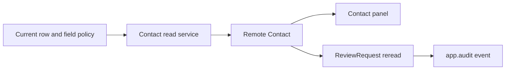

# W1 implementation step plan — controlled CRM review work

## Observed starting point

The accepted authority is [current-contact-review.md — accepted contract: remote authority, cache prohibition, metadata reconciliation, durable status, and audit requirements](/Users/dadleet/tmp/shiploop-service-implementation-objq14h9/semantic/cases/cold-step-plan/workspace/docs/decisions/current-contact-review.md:5). The older cache note is explicitly historical through [SHIPLOOP.md — project index identifies the current decision and supersedes the prototype](/Users/dadleet/tmp/shiploop-service-implementation-objq14h9/semantic/cases/cold-step-plan/workspace/SHIPLOOP.md:3).

The local read path is unsafe for the accepted contract: [contact_read_service.py — `list_contacts` serves a query-only raw cache and fills it from a service-account query](/Users/dadleet/tmp/shiploop-service-implementation-objq14h9/semantic/cases/cold-step-plan/workspace/src/contact_read_service.py:8). Its module note says that adapter always uses the CRM app service account, which is not evidence of current end-user row or field enforcement. The fixture has no local caller of that service. The panel currently returns only name and score ([contact_panel.py — current display mapping](/Users/dadleet/tmp/shiploop-service-implementation-objq14h9/semantic/cases/cold-step-plan/workspace/src/contact_panel.py:1)).

`ReviewRequest.status` is still reread directly by [review_status_poller.py — poller reads the remote durable status for each request](/Users/dadleet/tmp/shiploop-service-implementation-objq14h9/semantic/cases/cold-step-plan/workspace/workers/review_status_poller.py:4). The existing application logger is [app_audit.py — `app.audit` has only a contact-change helper](/Users/dadleet/tmp/shiploop-service-implementation-objq14h9/semantic/cases/cold-step-plan/workspace/src/app_audit.py:3). No notification path or second login logger exists in this fixture.

The metadata fixture is explicitly incomplete and approved only for the old panel ([contact-metadata.partial.json — incomplete field coverage](/Users/dadleet/tmp/shiploop-service-implementation-objq14h9/semantic/cases/cold-step-plan/workspace/remote/contact-metadata.partial.json:2)); its lack of a pending-review field proves nothing. The identity fixture distinguishes the app query identity from the read-only metadata identity ([identity-manifest.json — available fixture roles](/Users/dadleet/tmp/shiploop-service-implementation-objq14h9/semantic/cases/cold-step-plan/workspace/tools/identity-manifest.json:2)).

Baseline observation, before any product edit: in this workspace, `python3 -B -m unittest discover -v` ran with Python 3.14.7 and passed 1 test, `FixtureSmokeTest.test_panel_keeps_existing_display_fields`. The command is the repository-stated smoke route ([README.md — baseline command and narrow-coverage warning](/Users/dadleet/tmp/shiploop-service-implementation-objq14h9/semantic/cases/cold-step-plan/workspace/README.md:3)); it exercises only [test_fixture.py — existing display regression](/Users/dadleet/tmp/shiploop-service-implementation-objq14h9/semantic/cases/cold-step-plan/workspace/test_fixture.py:9). This non-Git fixture contains no remote account or target evidence, so the pass does not prove CRM schema, permission, cache safety, or delivery behavior.

## Chosen implementation shape and ordered work

1. **Revalidate the remote gate before code.** Against the approved target only, use the authorized metadata-read route to identify the current object, exact pending-review API field/type, its field visibility, and whether it is additive. Independently establish the runtime route that applies current, trusted row and field policy for the requesting principal. Inspect current consumers before changing the service constructor. Record the target, role, observation time, and the source of policy enforcement without storing records or credentials. The raw shared-cache invalidation, late-fill, and missed-change contract is *not* to be built in this item; because the selected read path has no cache, it is a revalidation condition for any future cache reintroduction.

2. **Make the Contact read path direct and fail closed.** In `src/contact_read_service.py`, remove both `cache.get` and `cache.put` from `list_contacts`; do not use the ten-minute cache as a fallback. Delegate only to the confirmed policy-enforcing runtime facade. If the discovered runtime cannot establish current row/field policy, propagate its established denial/unavailability outcome rather than querying the privileged service-account route or returning stale cached rows. Once actual callers are checked, remove the unused cache dependency; retain a compatibility adapter only if a real consumer requires it, and ensure it cannot read or write cached data. Do not invent a new cache abstraction, dependency, or configuration.

3. **Reconcile presentation only after metadata confirmation.** If the verified, policy-projected Contact payload contains the approved pending-review field, extend `src/contact_panel.py` additively using the confirmed name and defined absent/denied behavior. Preserve the existing `name` and `score` mapping, including `ComputedScore__c`, and do not modify `Consent__c`, `Lifecycle__c`, or unrelated automation. If the field is unavailable or its display semantics remain unspecified, leave this portion blocked rather than treating the partial snapshot as absence.

4. **Preserve durable review state while adding an owned audit observation.** Keep `workers/review_status_poller.py` as a remote reread; it must not cache, write, or become a competing status owner. Add a narrowly named helper in `src/app_audit.py` for an application-owned review-state observation, emitted after a successful durable status reread through the existing `app.audit` sink. The default plan is one event per successful reread with a bounded request identifier and permitted status/correlation fields; it deliberately reports an observation rather than claiming a locally detected transition. It must not emit provider login events or raw credentials/payloads. A remote read failure must remain the causal failure. Confirm whether operator policy instead requires transition-only auditing and whether audit-sink failure is fail-closed before implementation; transition-only auditing would need an existing authoritative comparison source, not a new local status cache.

5. **Document only changed, durable facts.** Keep `docs/decisions/current-contact-review.md` as the authority and update its implementation/evidence detail only after the permitted discovery establishes the selected facade, field contract, audit schema, and recovery limits. `SHIPLOOP.md` already points to this decision, so no second requirements document or workflow record is needed.

## Test and verification plan

Use the existing standard-library `unittest` discovery harness; add focused test modules beside `test_fixture.py` rather than a new framework. Planned cases are:

- **TC-READ-01:** an injected cache fake fails if touched; a policy-enforcing runtime fake returns the current allowed rows. Assert the service delegates once and neither reads nor writes cache.
- **TC-READ-02:** the runtime denies or is unavailable. Assert that the established error reaches the caller and no cached result is exposed.
- **TC-PANEL-01:** retain the current name/score result. After metadata discovery, add a separate approved-field case proving the pending-review rendering and its chosen absent/denied behavior.
- **TC-STATUS-01:** for each request ID, the poller rereads remote `ReviewRequest.status`; notification input is neither required nor authoritative.
- **TC-AUDIT-01:** a successful reread produces the one chosen `app.audit` review-state event with redacted/bounded extras; a failed reread produces no false success event and no login event. Exercise the documented audit-sink policy without masking the remote failure.

Run focused service/poller tests during development, then `python3 -B -m unittest discover -v` as the fixture smoke/full route. After authorized target access exists, perform separate read-only checks of current metadata, effective row/field policy, direct-read behavior, and audit retrieval. Local fakes prove only control-flow and regression semantics; they cannot close the real CRM authority or metadata prerequisites.

## Readiness, file roles, and open conditions

This step plan is complete, but implementation is not ready until the current metadata target, policy-enforcing runtime facade, actual constructor consumers, pending-field semantics, and audit trigger/sink policy are observed. The planned source roles are: `contact_read_service.py` for the cache-free policy route; `contact_panel.py` for conditional additive presentation; `review_status_poller.py` for durable reread plus the audit call; `app_audit.py` for the owned structured event; new/expanded unittest files for isolated fakes and selectors; and the current decision note for durable observed facts. Revalidate all five gates immediately before edits and again before remote verification.

Planning basis: frozen `service-discovery.md#cache-and-authorization`, `#asynchronous-cooperation`, and `#observability-coverage`; `coding-guidance.md#select-guidance` with `coding-practices.md#state`, `#security`, and `#logging-and-debugging`; `repeatable-test-suites.md#select-or-revalidate-the-harness`; and `testing-and-documentation.md#test-cases`. No product source, test, configuration, remote state, run state, or callback was changed by this exercise.
