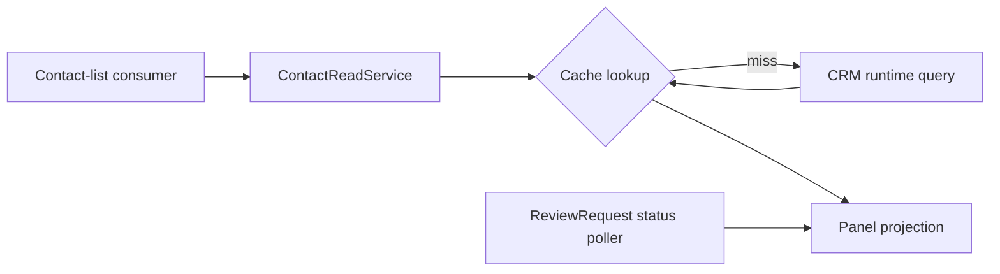

# Remote-discovery fresh-reader report



## Scope and baseline

This is an offline discovery handoff for the requested delta: add a pending-review
Contact field and improve repeated Contact-list read latency. I read only this
fixture and the packet-selected frozen guidance. No remote system, credentials,
account, callback, product file, dependency, or configuration was changed.

The starting baseline was run before proposing edits:

```text
cwd: /Users/dadleet/tmp/shiploop-service-implementation-objq14h9/semantic/cases/remote-discovery/workspace
command: python3 -B -m unittest discover -v
result: PASS — 1 test, 0 failures
```

This proves only the existing fixture assertion that the panel preserves `Name`
and `ComputedScore__c`; it does not execute the Contact read service, cache,
poller, remote schema, identity boundary, or a real consumer. The fixture's own
README labels this coverage deliberately narrow
([README.md — baseline command and narrow-fixture limit](/Users/dadleet/tmp/shiploop-service-implementation-objq14h9/semantic/cases/remote-discovery/workspace/README.md:3)).

## Concrete discoveries and decisions

The current list path already has a cache. `ContactReadService.list_contacts`
returns a cache hit for the supplied `query`; on a miss it calls
`runtime.query_contacts(query)` and stores the rows for 600 seconds
([contact_read_service.py — list_contacts cache-hit/miss path and TTL](/Users/dadleet/tmp/shiploop-service-implementation-objq14h9/semantic/cases/remote-discovery/workspace/src/contact_read_service.py:8)).
Therefore the first implementation choice is **reuse and characterize this
cache**, rather than add a second cache. Its present code proves a
caller-provided-query fast path, but it does not prove cache scope, query normalization, cache
implementation, measured latency, runtime quota, eviction, invalidation, or
safe behavior across principals/tenants. A `query`-only key in this adapter is
not by itself proof of unsafe sharing because the cache instance's scope is
unknown; it is a required verification question.

The current panel projects only `name` and `score`
([contact_panel.py — display_contact existing public projection](/Users/dadleet/tmp/shiploop-service-implementation-objq14h9/semantic/cases/remote-discovery/workspace/src/contact_panel.py:1)).
No source establishes an API name, type, display rule, false/unknown behavior,
or authorization rule for a pending-review Contact field. The provided metadata
snapshot explicitly says it is incomplete and covers fields approved for the old
panel; its omission cannot establish that a remote field is absent
([contact-metadata.partial.json — incomplete old-panel-only schema coverage](/Users/dadleet/tmp/shiploop-service-implementation-objq14h9/semantic/cases/remote-discovery/workspace/remote/contact-metadata.partial.json:2)).
The synthetic record shape is likewise only fixture data
([contact-record-shape.json — synthetic Contact example](/Users/dadleet/tmp/shiploop-service-implementation-objq14h9/semantic/cases/remote-discovery/workspace/remote/contact-record-shape.json:1)).

The nearest observed durable status owner is `ReviewRequest.status`: the worker
polls it and returns the reread statuses
([review_status_poller.py — ReviewRequest status polling boundary](/Users/dadleet/tmp/shiploop-service-implementation-objq14h9/semantic/cases/remote-discovery/workspace/workers/review_status_poller.py:1)).
The existing operational note says a notification is only a cue to reread that
durable record, while login events belong to the identity provider and
application-owned events can use `app.audit`
([async-and-observability.md — durable status and existing event ownership](/Users/dadleet/tmp/shiploop-service-implementation-objq14h9/semantic/cases/remote-discovery/workspace/docs/async-and-observability.md:3)).

Accordingly, do not assume that “pending-review Contact field” means a new
stored Contact column. It may instead be a read-time projection of related
ReviewRequest state. The next decision must choose one of these contracts:

1. **Stored Contact field:** confirm its exact remote schema/API name, writers,
   default/backfill, state-transition update rule, and reconciliation path.
2. **Derived projection:** define which ReviewRequest states qualify, the
   Contact-to-request relation, query shape/cardinality, and the freshness rule
   when a review transition occurs.

Either route needs an explicit user/maintained requirement for the observable
meaning of “pending,” including missing/unauthorized data and display behavior.
The workspace knowledge index contains only a generic instruction and no
maintained requirements or API contract
([SHIPLOOP.md — no product requirement locator beyond generic guidance](/Users/dadleet/tmp/shiploop-service-implementation-objq14h9/semantic/cases/remote-discovery/workspace/SHIPLOOP.md:1)).
This is an unresolved prerequisite, not authority to invent semantics or a
performance target.

## Remote, cache, and observability handoff

The runtime adapter says it always uses the application CRM service account;
the fixture separately declares `crm-describe-reader` for read-only metadata
and `crm-schema-writer` for schema writes that require target and approval
([identity-manifest.json — distinct runtime, metadata-read, and schema-write identities](/Users/dadleet/tmp/shiploop-service-implementation-objq14h9/semantic/cases/remote-discovery/workspace/tools/identity-manifest.json:2)).
No live target, role effectiveness, API/SDK operation, schema, relation, or
record result was observed here. A future authorized discovery step should use
only the describe-reader against the named target, capture the as-of time and
coverage, and verify the minimum needed Contact/ReviewRequest fields and read
permissions. A schema write remains outside this exercise and requires the
separate writer, approval, revalidated target, and read-back.

For latency, define whether “repeated” means the same normalized query for the
same authorized consumer and establish a measurable target (for example,
remote-call count plus p50/p95 under a stated fixture/load). Before retaining
the 600-second TTL, specify data freshness and authorization freshness,
read-after-write/outage behavior, cache retention, and cache key dimensions.
If a review-state delta changes the displayed field, the policy must cover
Contact/ReviewRequest updates, access-policy changes, logout/account switch,
and a slow pre-invalidation fill completing late. Reuse the existing poller and
durable read-back unless a measured requirement exposes a gap; do not add a
broker or notification mechanism merely for this field. Service guidance calls
for a runtime path, separate remote identity, and explicit cache/invalidation
contract ([service-discovery.md — scope, remote boundary, and cache contract](/Users/dadleet/tmp/shiploop-service-implementation-objq14h9/semantic/source-snapshot/skills/shiploop/references/service-discovery.md:12)).

`app.audit` already emits a contact-change event to the application sink
([app_audit.py — application-owned contact change event](/Users/dadleet/tmp/shiploop-service-implementation-objq14h9/semantic/cases/remote-discovery/workspace/src/app_audit.py:6)).
After ownership is selected, consider only useful application-owned outcomes:
field-update success/failure, cache invalidation/recovery, and query timing or
failure with safe correlation identifiers. Do not duplicate identity-provider
login events or log Contact payloads. Whether those events are required,
retrievable, and retained is still unknown.

## Affected-file and check handoff

Future work should treat these file roles as the current map: `src/contact_panel.py`
is the display projection; `src/contact_read_service.py` is the list-query/cache
adapter; `workers/review_status_poller.py` is the existing status reread path;
`docs/async-and-observability.md` records current ownership; and the two
`remote/` JSON files are partial/synthetic evidence, not remote truth. No edit
is proposed until the field contract and remote read resolve the dependencies.

The next authorized plan should carry these checks:

- unit tests for first miss/second hit, scoped cache-key behavior, TTL/bypass,
  and invalidation or revalidation after a review-state change;
- panel tests for pending, not-pending, unavailable, and unauthorized states
  after exact semantics are accepted;
- target-compatible integration checks for metadata/read permissions, query
  shape, state transition/read-back, cache freshness, and real latency/quotas;
- consumer and observability checks that the panel presents confirmed durable
  state and any selected audit event reaches its existing sink safely.

Until the required contract, target read, cache behavior, and measurable
performance criterion are available, implementation and remote validation remain
blocked by information rather than by a product failure. The green fixture
baseline remains a prerequisite observation only.
