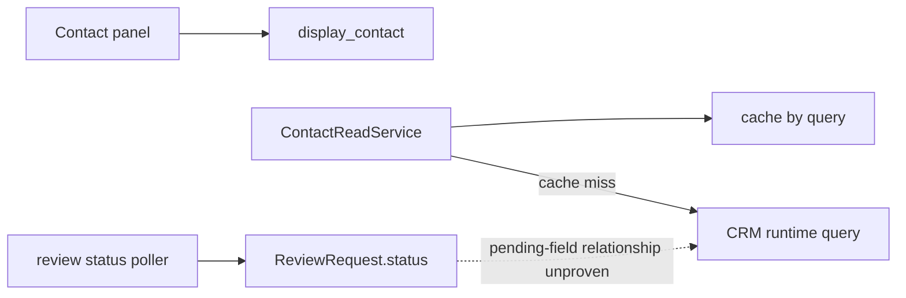

# Remote discovery report: pending-review Contact field and repeat-list latency

## Scope and baseline

This is a read-only, offline fixture assessment. No remote account, endpoint, credentials, callback, product file, dependency, or run state was touched. The workspace is not a Git repository, so there is no revision or source-return route to identify here. Before this report was created, the SHA-256 of the sorted tracked fixture-file manifest was `7befd86192de8c3415e06b88a14c0b69b842b366175b5efa76bb826206931057`.

The declared baseline command from [README.md - baseline command: required pre-edit smoke route](/Users/dadleet/tmp/shiploop-service-implementation-objq14h9/semantic-refined/cases/remote-discovery/workspace/README.md:3) was run unchanged in this workspace:

`python3 -B -m unittest discover -v` — **PASS**, 1 test in 0.000s.

That test proves only that `display_contact` continues to return the existing `name` and `score` fields for its synthetic input [test_fixture.py - FixtureSmokeTest.test_panel_keeps_existing_display_fields: narrow current coverage](/Users/dadleet/tmp/shiploop-service-implementation-objq14h9/semantic-refined/cases/remote-discovery/workspace/test_fixture.py:9). It does not exercise the list-read service, a cache implementation, authorization, a CRM schema, polling, latency, or a real consumer.

## Observed flow and discovery

The panel formatter currently exposes only `Name` and optional `ComputedScore__c` [contact_panel.py - display_contact: current panel projection](/Users/dadleet/tmp/shiploop-service-implementation-objq14h9/semantic-refined/cases/remote-discovery/workspace/src/contact_panel.py:1). Its call site is absent from the fixture, so the diagram deliberately does not claim that it invokes `ContactReadService`.

`ContactReadService.list_contacts` already has a repeat-read optimization: it returns a cache hit keyed solely by `query`; on a miss it calls `runtime.query_contacts(query)`, then stores the returned rows for 600 seconds [contact_read_service.py - ContactReadService.list_contacts: observed cache/read path](/Users/dadleet/tmp/shiploop-service-implementation-objq14h9/semantic-refined/cases/remote-discovery/workspace/src/contact_read_service.py:8). Neither the cache implementation nor the runtime query contract is present, so hit latency, miss latency, cache capacity, pagination, query normalization, and policy enforcement are unknown. The observed TTL is implementation behavior, not an accepted freshness requirement.

The only Contact shape is a synthetic record with `Id`, `Name`, `Consent__c`, `ComputedScore__c`, and `Lifecycle__c` [contact-record-shape.json - synthetic sample: limited field example](/Users/dadleet/tmp/shiploop-service-implementation-objq14h9/semantic-refined/cases/remote-discovery/workspace/remote/contact-record-shape.json:1). The metadata file explicitly says it is incomplete and covers only fields approved for the old panel; its omitted pending-review field is therefore **unknown**, not absent [contact-metadata.partial.json - incomplete old-panel coverage: cannot establish schema absence](/Users/dadleet/tmp/shiploop-service-implementation-objq14h9/semantic-refined/cases/remote-discovery/workspace/remote/contact-metadata.partial.json:1).

The identity manifest distinguishes the product runtime’s `crm-app-service` query identity, the read-only `crm-describe-reader`, and a schema writer that requires an approved target [identity-manifest.json - runtime and metadata identities: separate authority boundaries](/Users/dadleet/tmp/shiploop-service-implementation-objq14h9/semantic-refined/cases/remote-discovery/workspace/tools/identity-manifest.json:1). No live observation was authorized, so these are fixture declarations rather than evidence of a reachable target or effective permissions.

There is a separate `ReviewRequest.status` poller; the file calls that remote status durable and says the worker only polls it [review_status_poller.py - refresh_pending_reviews: status-read behavior](/Users/dadleet/tmp/shiploop-service-implementation-objq14h9/semantic-refined/cases/remote-discovery/workspace/workers/review_status_poller.py:1). Existing operations say a notification merely prompts an authoritative reread [async-and-observability.md - ReviewRequest status ownership: polling/read-back contract](/Users/dadleet/tmp/shiploop-service-implementation-objq14h9/semantic-refined/cases/remote-discovery/workspace/docs/async-and-observability.md:3). This is evidence for reusing polling if the new field is derived from review status; it is not evidence that the requested Contact field is such a projection.

## Recommended handoff decisions

Classify the Contact-field schema and semantics as **unresolved**, and the existing list cache as **reuse candidate pending contract and measurement**. The next discovery owner should make one bounded, read-only describe using `crm-describe-reader` against the named non-production target, after confirming target and role. It should establish the exact API name and label, data type and allowed values, null/default/backfill rules, field-level visibility, existing producers and consumers, schema revision, and whether a Contact value already exists. Record only the necessary sanitized result and as-of time. This is the smallest probe that decides whether a schema change is needed.

If the field is absent and a durable Contact field is approved, plan a target-bound metadata change through `crm-schema-writer` only after the required approval. Its plan must preserve unrelated schema, define default/backfill and rollout/repair behavior, and require metadata plus record read-back before any UI claim. Then extend the runtime query projection and the panel’s explicit display mapping using the confirmed API name and business representation, while preserving current `name` and `score` behavior. If the business meaning is instead “there is a non-terminal ReviewRequest,” do not invent or duplicate a Contact schema field: document the relationship, join/key, freshness rule, and present it from the authoritative review-status read path. The existing poller can remain the revalidation trigger; it does not own review processing.

For latency, first collect representative authorized measurements for cache hit and miss, page size/query shape, traffic/concurrency, CRM quota, and the required p95/read-freshness objective. Keeping the present cache without these data cannot prove the request is met. Before any optimization, establish the cache’s retention location and whether `runtime.query_contacts` returns a representation already filtered for the current user. A key of only `query` is not enough to prove tenant, principal, row/field authorization, purpose, locale, or schema isolation. The final cache contract should use trusted server-derived scope or reapply current policy at response time; specify max age, read-after-write, outage/bypass, permission-change/logout, schema change, Contact updates, and—if derived—ReviewRequest-status invalidation. If that contract cannot be established, use the normal policy-enforcing read path rather than a privileged direct CRM fallback.

`app.audit` already provides an application event sink for owned changes [app_audit.py - record_contact_change: existing application audit hook](/Users/dadleet/tmp/shiploop-service-implementation-objq14h9/semantic-refined/cases/remote-discovery/workspace/src/app_audit.py:6), while the identity provider owns login events [async-and-observability.md - existing operations: identity-provider login ownership](/Users/dadleet/tmp/shiploop-service-implementation-objq14h9/semantic-refined/cases/remote-discovery/workspace/docs/async-and-observability.md:5). Do not add login duplicates. If operations need latency/caching evidence, extend the existing owned sink only after confirming its retrieval and retention route; log aggregate timing, hit/miss, invalidation, and failure outcomes without raw Contact records, queries, or credentials.

## Unknowns, affected roles, and revalidation checks

The decision blockers are field semantics and owner; actual CRM schema, target, field permissions, and runtime authorization; cache storage and invalidation capabilities; consumer identity and row/field filtering; latency/SLO and quota; the Contact-to-ReviewRequest relationship; and deployment/consumer verification route. The fixture has no real UI composition or design guidance beyond a dictionary formatter, so a future user-facing change also needs its actual component, loading/error/accessibility states, and presentation conventions rechecked.

Expected conditional file roles are: `remote/contact-metadata.partial.json` as a deliberately insufficient fixture; `tools/identity-manifest.json` as authority mapping; `src/contact_read_service.py` for query/cache behavior; `src/contact_panel.py` for the visible projection; `workers/review_status_poller.py` only if confirmed status-derived semantics require reread; `src/app_audit.py` only for a demonstrated owned telemetry gap; and `test_fixture.py` as the seed for expanded local tests. No such edits are authorized in this exercise.

After the contracts are accepted, add isolated fake-runtime/cache tests for field projection, old-field preservation, cache miss/hit/expiry, scoped keys or policy recheck, update/schema/permission invalidation, late fills, outage bypass, and polling-driven reread where applicable. Rerun the baseline and the expanded local suite. Separately, an authorized target check must prove the selected describe/query route and identity, schema read-back, filtered consumer behavior, cache safety, and measured latency; fixture tests cannot supply that evidence.
