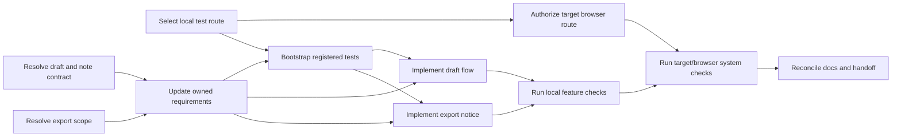

# Conditional global delivery plan — Field Notes draft recovery and export-change notice

## Status, authority, and design basis

This is a run-local dependency plan for the requested Field Notes delta. It is
not a product change, a selected storage/API/notification architecture, a test
pass, or deployment authorization. The current fixture remains static,
same-origin request/response only, with no client persistent storage, draft API,
server process, WebSocket, remote target access, or repository test suite.

**Accepted baseline and delta.** Preserve the native account selector, note
list, stable textarea, save/cancel/back journey, focus, keyboard/touch, narrow
layout, reading position, draft text, navy #15324f, amber #c08722, white cards,
system body, Georgia display type, and pending-versus-confirmed distinction from
product/docs/design.md § UI identity. Add conditional account-safe draft recovery
and truthful in-app export-change feedback as defined by spec.md R-1 through
R-8, F-1 through F-3, T-1 through T-7, and FN-TC-1 through FN-TC-7 plus
FN-NFR-1 in test-strategy.md.

**Interaction and skin premise.** The human edits and navigates the existing
native surface; the host establishes effective identity; a future authorized
carrier may restore only current-account draft state; and the existing export
service supplies revisioned facts through authorized reads. The planned UI uses
the existing components and skin, keeps pending input/focus/reading position
through asynchronous refresh, and uses a persistent accessible textual
loading/error/change status with an available recovery action. Static status is
the current planned reduced-motion choice; no animation is required or claimed.

**Guidance and mode.** The selected nonbinding frontend-design card digest is
1608ea77fbb6fc30d13a97d12cfa8ebf31358d40f0dd97beed24829d6b3f45dd at
../../evidence/research-design-card-sha256.txt; the user request and accepted
repository documents control. Embedded ShipLoop Backchain reasoning is
intentionally selected under frozen backchain-planning.md § Navigator planning.
No run note selects source-aware-native, so no standalone Backchain card/caller
was read or invoked.

**Maintained record boundary.** product/docs/design.md and product/docs/api.md
are the current applicable repository-owned records. The run-local spec, test
strategy, and this plan cannot replace them. A later authorized documentation
owner must make the narrow durable update in the existing appropriate home after
the unresolved contract decisions are supplied; do not silently create a second
requirements document or claim that update occurred here.

## Current readiness gates

| Gate | Missing producer / owner | Required evidence before dependent work | Blocks |
| --- | --- | --- | --- |
| G-1, Q-R1 | Named host/target and API owner decide the durable draft carrier, account/note key, authorization, retention, clear-on-identity behavior, read failure, and recovery scope. | Current target/owner decision and authorized carrier contract; no selector value substitutes for authorization. | P-4, P-6, P-8, P-9. |
| G-2, Q-R3 | Named note API owner documents read/save/revision/conflict/error/idempotency behavior. | Repository/owner contract with current-account/note scope and response/failure semantics. | P-4, P-5, P-6, P-8, P-9. |
| G-3, Q-R2a | Product/spec owner defines active effective-account/collection and temporary comparison/cursor reset rules for export notices. | Accepted current-scope/cursor decision; old account/lifecycle comparison must be discarded. | P-4, P-7, P-8, P-9. |
| G-4, Q-R4 | Target owner supplies real target/build identity, authorized access, and isolated two-account test-data procedure. | Fresh target-compatible policy/probe and authorized test fixture/cleanup route. | P-9 and any carrier/API/browser verification. |
| G-5, Q-R5 | Test owner establishes a repository-registered local test seam/runner, then selects a browser route only after G-4 supplies the target/session boundary. | Local test files/selectors and focused/smoke/full registration; later browser command/session scope and fixture lifecycle. | P-5, P-8, P-9. |
| G-6 | Product documentation owner updates the accepted repository-owned design/API requirements home. | Durable narrow requirement/contract update with planned test locators and pending verification. | P-5, P-6, P-7, final handoff. |

G-1 through G-6 are unresolved today. They are not implementation choices for
this planning run, and their missing evidence is not N/A.

## Dependency order

The visual order is conditional. P-1, P-2, and P-3a are independent supplier
work with different owners. P-3b deliberately waits for the local route choice
and G-4 target/session identity, while P-5 can bootstrap local tests without
waiting for external target access. No node authorizes deployment.

## Ordered work items

| ID | Claim and scoped work | Ready condition | Done evidence and mapped outcomes | Dependencies / limits |
| --- | --- | --- | --- | --- |
| **P-1 Contract readiness for draft and note behavior** | Obtain G-1/G-2 decisions for a carrier and note API without choosing them in advance. Define effective identity, account/note scope, authorized read/write, retention/clear behavior, confirmed revision, conflict, idempotency, error, late response, and recovery failure semantics. | Named host/target and API owners are available to supply an authorized contract. | Durable owner/contract evidence answers Q-R1/Q-R3 and lets R-2/R-3/R-4, F-1/F-2, T-3/T-5, and FN-TC-3 through FN-TC-5 use an independent oracle. | No consumer code, fake contract, carrier, API call, credential, or deployment before this evidence. |
| **P-2 Export notice scope decision** | Resolve G-3: define active effective-account/collection, temporary baseline/cursor, comparison semantics, identity/foreground reset, and stale/out-of-order behavior for the existing GET /api/exports fact. | Product/spec owner can decide current-scope semantics from the existing export contract. | Accepted decision answers Q-R2a and makes R-5/R-6, F-3, T-6/T-7, and FN-TC-6/FN-TC-7 testable. | Reuse visible/foreground authoritative reads only; do not add WebSocket, OS/background notification, persistent history, or a new API merely to close the decision. |
| **P-3a Local behavioral-test route** | Resolve the local portion of G-5: select the repository-native test seam, registration, paths/selectors, focused/smoke/full membership, and local fixture lifecycle. Revalidate Node support without treating its presence as a pass. | Test owner can work against the known repository baseline and pending durable requirements destination. | Local test-route decision establishes what P-5 must author and how P-8 will execute it. | It does not need a remote target and cannot select the browser command or prove browser behavior. No installation or test authoring occurs in this experiment. |
| **P-3b Target/browser route readiness** | Resolve G-4 and the browser portion of G-5: name target/build/access, authorized browser/session, isolated A/B fixture/cleanup, and browser invocation that will observe rendered behavior. | P-3a local test-route decision and target/test owners are available. | Target/browser route makes P-9 executable with an actual target/build, account/tenant, command, and cleanup boundary. | No deployment is implied. It remains independent of local bootstrap except for compatible test IDs and does not block P-5. |
| **P-4 Durable requirements and test-record update** | Authorized documentation owner updates the applicable existing product homes: preserve the UI baseline in docs/design.md, record accepted draft/export behavior and open verification status, and record an owner-approved note contract in docs/api.md when applicable. Record planned case IDs and intended repository test destinations without linking transient run notes; P-10 adds final selectors after P-5/P-9 evidence exists. | P-1 and P-2 decisions are available; documentation destination/owner is confirmed. | Durable repository-owned requirement/API update retains preserve/add rationale, R/F/T intent, privacy/recovery/compatibility/testability criteria, and planned test destinations. | The current fixture is read-only. Do not treat this run-local plan as the update; do not create a competing requirements home. |
| **P-5 Test bootstrap and baseline characterization** | Create the smallest justified repository-native local test seam and registration. Keep syntax diagnostic separate from behavior. Characterize unchanged native UI/state behavior first; retain expected RED cases after their contract oracle exists. Record the FN-NFR-1 browser assertion and intended full-suite membership without claiming a browser command or registration before P-3b supplies that route. | P-3a selects the local test route; P-4 supplies durable intent; P-1/P-2 supply needed oracle detail for carrier/export cases. | Registered local FN-TC selectors with per-case setup/test/teardown and focused/smoke membership, clean rerun evidence, and retained expected-RED evidence where pre-feature behavior lacks the requested feature. Retain FN-NFR-1 target selector/intended membership for P-3b/P-9; its browser result is not a local outcome. | Candidate local commands are node --test and node --check only until the actual files/registration exist. A fake covers client ordering, never real authorization. |
| **P-6 Implement conditional draft lifecycle** | Implement R-2/R-3/R-4 and F-1/F-2/T-1 through T-5 using only the approved P-1 carrier/note contract. Keep pending separate from confirmed; gate recovery by effective identity; clear old UI identity; retain truthful Recovery Unavailable. | P-1, P-4, and P-5 are done with current contracts/tests. | Scoped product diff plus local checks establish controlled pending/confirmed, cancel, current-save, failure, identity-race, and reload draft/absence/failure behavior. FN-NFR-1’s rendered journey, focus/input/reading position, and visual baseline remain for P-9 browser confirmation. | No unscoped client persistence, no selector-as-authorization, no framework migration, no unapproved carrier/API. |
| **P-7 Implement truthful export reconciliation** | Implement R-5/R-6/F-3/T-6/T-7 with authorized visible/foreground reads, same-scope temporary comparison, truthful loading/error/change state, and stale response discard. | P-2, P-4, and P-5 are done with current scope and tests. | Scoped product diff plus local checks establish controlled changed/unchanged authoritative status/revision comparison, no completion claim from POST/hint, and current-scope re-read after lifecycle/identity. P-9 browser evidence must show pending input, focus, and reading position survive the rendered asynchronous update. | No instant-delivery promise, WebSocket, background receiver, or persistent notification store. |
| **P-8 Local test refinement and verification** | Author/refine all locally executable FN-TC-1 through FN-TC-7 checks from the final source/contract, run focused and smoke routes, and retain failures/expected RED before valid fixes. Prepare FN-NFR-1 as the browser-only assertion retained for P-3b/P-9; do not execute or label it as a local result. | P-5/P-6/P-7 are complete; local dependencies and exact commands are current. | Actual output ties selector, accepted criterion, product revision, setup/teardown, and observed result to each local case. FN-NFR-1 has a retained target assertion/selector and no observed result until P-9. Syntax, focused, and smoke outcomes remain separately labeled; full route remains unrun if it contains target/browser work. | Do not weaken an oracle or treat a green local fake as target/browser proof. |
| **P-9 Authorized target, browser, and system verification** | Exercise the assembled target with isolated A/B accounts across reload, logout/identity change, browser UI/accessibility, visible/foreground export reconciliation, and source/target identity. | P-1, P-2, P-3b, and P-4 through P-8 are complete; target/build/session/fixture cleanup are authorized. | Real target receipts for FN-TC-1 through FN-TC-7 and FN-NFR-1 identify target/build, account/tenant, command, observed result, cleanup, and any blocked/failed boundary. | Local pass cannot replace this. No publication/deployment is authorized by this plan. |
| **P-10 Documentation reconciliation and truthful handoff** | Reconcile final product requirements/API/test documentation with actual implemented and verified behavior; preserve unresolved limits, changed target facts, and any release/promotion authority gap. | P-9 result and repository return scope are available. | Durable links resolve in the returned repository; handoff distinguishes local, target, deployed, and unrun evidence. | A release/publish action remains outside this experiment and must have its own authority/target route. |

## Outcome and check traceability

| Requirement/outcome | Establishing producer(s) | Planned check boundary |
| --- | --- | --- |
| R-1 and FN-NFR-1 preserved journey, components, skin, focus/input/reading position | P-4, P-5, P-6, P-7 | Browser FN-NFR-1 plus relevant local assertions; target/browser required. |
| R-2/R-3 account-safe reload and logout isolation | P-1, P-4, P-5, P-6 | FN-TC-4/FN-TC-5 local controlled fakes plus isolated A/B target/browser verification. |
| R-4 pending versus confirmed, cancel/save/failure | P-1, P-4, P-5, P-6 | FN-TC-1 through FN-TC-4 local and target checks. |
| R-5/R-6 truthful export notice and lifecycle | P-2, P-4, P-5, P-7 | FN-TC-6/FN-TC-7 local controlled responses plus visible/foreground target/browser check. |
| R-7 static same-origin compatibility | P-1, P-3b, P-6, P-7 | Target policy/source review before and after implementation; no current proof. |
| R-8 testability and operability | P-3a, P-3b, P-5, P-8, P-9, P-10 | Registered focused/smoke/full routes, target/browser system receipts, and durable documentation links. |

## Embedded dependency audit

| Required outcome | Claim | Needs and current supply | Consumer pull and resolution |
| --- | --- | --- | --- |
| Account-safe recovery | A current account can recover its own pending draft without cross-account display. | Needs G-1/G-2 carrier/note authorization and G-5 local test seam. Current product supplies only in-memory edit state. | P-6 consumes P-1/P-5; P-9 also consumes P-3b target evidence. **Unresolved today; ordered before consumers.** |
| Truthful export change | A current-scope UI presents only an authoritative changed revision/status. | Existing API supplies revisioned reads; G-3 scope/cursor and G-5 local test route are absent. | P-7 consumes P-2/P-5; P-9 also consumes P-3b target evidence. **Partially supplied; no notification transport selected.** |
| Preserved usable UI | The existing journey and visual/interaction premises survive new async states. | Existing docs/design supplies baseline; P-4 retains it durably and P-5 creates a stable test route. | P-6/P-7 use baseline; P-9 observes rendered outcome. **Plan-level supplier exists; execution remains unrun.** |
| Durable delivery evidence | A future recipient can recover accepted intent and actual boundaries without run-only notes. | Needs G-6, test selectors, target receipts, and repository link validation. Current run notes are disposable evidence only. | P-10 consumes P-4/P-8/P-9. **Unresolved today; documentation work retained.** |

Forward traversal confirms that P-6/P-7 do not start until their decision,
documentation, and test suppliers are present, and P-9 does not treat a local
fake or syntax check as a target/browser receipt.

## Revalidation and correction route

Revisit P-1 through P-3b when the named owner contract, target policy/probe,
browser route, Node support, API version, or source seam changes. Revisit P-4
through P-10 when that evidence changes an R/F/T/FN outcome. A new material
contract, target, or failure routes through the current plan correction/review
path; it does not silently rewrite accepted requirements, run a remote probe, or
start a consumer early. The current experiment stops before prepare and performs
none of these work items.
