# Conditional behavior specification — Field Notes recoverable drafts and export-change notice

```mermaid
stateDiagram-v2
  [*] --> RecoveryCheck: open or reload
  RecoveryCheck --> Restored: authorized carrier returns current pending draft
  RecoveryCheck --> Confirmed: authorized carrier returns no pending draft
  RecoveryCheck --> RecoveryUnavailable: carrier read unavailable or fails
  RecoveryUnavailable --> Confirmed: continue without a claimed restore
  Confirmed --> Pending: edit text
  Pending --> Confirmed: cancel or confirmed save
  Pending --> Pending: save failure preserves text
  Restored --> Pending: resume editing
  Pending --> [*]: identity changes; clear local view
```

## Status, authority, and scope

This is a run-local conditional spec, not a product-document amendment or implementation approval. It reconciles the current user request with the accepted `<study>/existing/product/docs/design.md` § UI identity and the current fixture contracts. The spec is **not ready for a dependent draft implementation** until Q-R1/Q-R3 establish an authorized carrier and note contract; it remains useful for independent planning because those gates and their consumers are explicit.

Inputs and source status:

- User request: this run’s saved prompt in `<study>/existing/run/state.md`.
- Accepted UI baseline: `<study>/existing/product/docs/design.md` § UI identity; preserve existing controls, focus/keyboard/touch/narrow layout/reading position/draft text, navy/amber/white/system/Georgia identity, and local-versus-confirmed separation.
- Current runtime: `<study>/existing/product/docs/platform.md` § Deployment target and current controlled observation `../../evidence/discovery-environment-probe.stdout`; static same-origin request/response only, self-only assets, no server process/WebSocket/client persistent storage/draft API, and no remote deployment access in this experiment.
- Export contract: `<study>/existing/product/docs/api.md` § Existing API; status/revision reads are authoritative, visible polling/foreground reconciliation are supported, and notification cues are invalidation hints only.
- Research frontier: `<study>/existing/run/notes/research.md` Q-R1 through Q-R6. Selected nonbinding UI guidance identity remains SHA-256 `1608ea77fbb6fc30d13a97d12cfa8ebf31358d40f0dd97beed24829d6b3f45dd` at `../../evidence/research-design-card-sha256.txt`; repository/user requirements control.
- Backchain mode: **embedded** ShipLoop planning guidance at `<study>/frozen/shiploop/references/backchain-planning.md` § Navigator planning. No run note selects source-aware-native, so no standalone Backchain card/caller was read or invoked.

## Requirement index

| ID | Disposition and source | Required outcome / current readiness |
| --- | --- | --- |
| R-1 | Preserve — accepted UI baseline and user request | Keep account selector, list/detail/edit/save/cancel/back journey, stable textarea, focus/keyboard/touch, narrow layout and reading position. No framework migration or visual-system replacement. **Checkable after implementation.** |
| R-2 | Add — user request; Q-R1 | For an authorized account and note, unsaved pending text must be recoverable after reload. The carrier, account key, retention/clearing, authorization, and recovery contract are absent. **Blocked for implementation by Q-R1/Q-R3.** |
| R-3 | Add — user request; Q-R1/Q-R3 | On logout or any host identity change, a previous account’s draft must not be readable under the next account. Clear transient pending view at identity change and require the future carrier/service to enforce effective-account scope; a selector value is not proof of authorization. **Blocked for implementation by Q-R1/Q-R3.** |
| R-4 | Add/preserve — user request and design baseline | Keep pending local text distinct from server-confirmed note content. A visible status must not label pending text as saved/confirmed. Cancel restores confirmed text; save failure retains pending text with an actionable error. **Partly specified; persistence/conflict details depend on Q-R3.** |
| R-5 | Add — user request and existing export contract | While the surface is visible, and again on foreground, read authorized export status/revision and present an in-app change only after a relevant authoritative difference. A POST acceptance or invalidation hint cannot be displayed as completion. **Feasible on existing export read contract; no instant/background/OS delivery promise.** |
| R-6 | Add — Q-R2a | Define active effective-account/collection and temporary comparison/cursor semantics for export notices. After identity/lifecycle boundaries, an old comparison must not be presented as a new current-account change; take an authoritative read. **Open specification decision before export UI implementation.** |
| R-7 | Preserve — platform/design contracts | Use only deployed static/same-origin/self-compatible mechanisms; do not add a server process, persistent WebSocket, external CDN, or unverified storage capability. **Checkable against target-compatible evidence later.** |
| R-8 | Add — requirements/testability guidance | Behavioral acceptance must be tested through an environment-compatible route; the current `node --check app.js` smoke is syntax-only. **Open test-route prerequisite Q-R5.** |

## Actors, ownership, and boundaries

| Entity/state | Owner and current source | Required invariant / unresolved boundary |
| --- | --- | --- |
| Effective account identity | Host; `docs/platform.md` | UI must use the effective host identity rather than trust a carried account value. Current selector switching is an observed UI mechanism only. |
| Confirmed note and revision | Note service is implied by `app.js`; no owned API contract | Displayed confirmed text is separate from pending text. Read/save revision, conflict, error, and idempotency semantics remain Q-R3. |
| Pending draft | UI now owns in-memory text only | Must never be represented as confirmed. Durable owner/carrier/account scope/retention are Q-R1; no persistence is assumed. |
| Reload recovery check | Future client/carrier interaction | After effective identity is known, distinguish an authorized pending draft, an authorized absence, and carrier read failure. The current target has no carrier, so this is a conditional future flow rather than current behavior. |
| Export job/status/revision | Existing export service; `docs/api.md` | Service status is authoritative; UI reads/reconciles only. The active account/collection/cursor comparison is Q-R2a. |
| Notice/status presentation | Static UI | It reflects a successful authoritative read, remains accessible and non-destructive, and must not claim unsupported real-time delivery. |

## Flows and transition rules

### F-1 — Edit, save, cancel, and reload recovery (R-1–R-4)

Precondition: an effective host account and a confirmed note are available through the future note contract.

1. Editing changes only pending UI text; confirmed content and revision remain the last confirmed record.
2. Cancel replaces pending text with confirmed text and returns to the non-editing journey without mutating remote state.
3. Save sends only the future contract’s authorized request. Durable acceptance/confirmation and conflict handling must follow Q-R3; until then no implementation may claim a saved draft.
4. If save fails or the request is superseded by identity/note change, retain pending text only for the still-effective UI identity and show a truthful recovery action. Do not overwrite newer pending text with a late acknowledgement.
5. On reload, recovery is conditional on Q-R1: obtain the effective account first, then read only authorized draft state for that account/note. An authorized pending draft becomes **Restored Pending**; an authorized absence leaves the confirmed note without a recovery claim; a carrier read failure enters **Recovery Unavailable** and must not be presented as absence or a restored draft. The current target has no authorized carrier, so it cannot implement this flow or silently emulate it with unscoped storage.

### F-2 — Identity change/logout (R-2–R-4)

1. Host identity changes or logout occurs.
2. Abort/ignore late account-specific UI work; clear the previous pending/confirmed UI view before exposing the next account’s content.
3. Any future carrier read/write uses the new effective identity and must be authorized by its future contract.
4. A read, response, or draft from the old identity must be ignored and must not become visible under the new one. The future contract must define clearing/retention and authorization; current code’s aborts do not prove this invariant.

### F-3 — Export status reconciliation and notice (R-5–R-6)

1. While visible or after foreground, the UI performs an authorized `GET /api/exports` read for the relevant current scope defined by R-6.
2. The response’s authoritative status/revision is compared only with temporary comparison state for the same effective account/collection.
3. A relevant changed revision/status updates the in-app status/notice without discarding pending edit text, focus, or reading position.
4. A failed/unavailable read shows a truthful retriable state and does not claim that the export changed or completed.
5. Identity change, foreground recovery, or a stale/out-of-order response discards the old comparison and obtains a new authoritative current-scope read. Notification hints can trigger a read but do not themselves satisfy this flow.

## Transition and case map

| Transition | Before → trigger → after | Guard / observable result | Planned case(s) and status |
| --- | --- | --- | --- |
| T-1 | Confirmed → edit → Pending | Effective account/note unchanged; confirmed text/revision stay visible as confirmed. | TC-1 pending versus confirmed UI; **planned, blocked by Q-R5 test route.** |
| T-2 | Pending → cancel → Confirmed | No remote mutation; pending text is replaced with last confirmed text. | TC-2 cancel preserves confirmed state; **planned.** |
| T-3 | Pending → successful future save → Confirmed | Only an authorized, current-account/note confirmation can replace confirmed state. | TC-3 save confirmation and late-response guard; **blocked by Q-R3/Q-R5.** |
| T-4 | Pending → failed/superseded save → Pending or cleared-by-identity | Failure retains text only for current identity; identity change clears current view and ignores old response. | TC-4 failure/identity race; **blocked by Q-R1/Q-R3/Q-R5.** |
| T-5 | Reload check → Restored Pending, Confirmed, or Recovery Unavailable | Future authorized carrier distinguishes pending draft, authorized absence, and read failure; restored text is pending, never confirmed, and failure never impersonates absence. | TC-5 reload draft/absence/failure branches and isolation; **blocked by Q-R1/Q-R3/Q-R5.** |
| T-6 | Export baseline → authoritative changed read → Notice | Same effective account/collection, R-6 cursor semantics; notice is in-app and truthful. | TC-6 visible poll changed revision; **planned.** |
| T-7 | Any export UI state → identity/foreground/stale response → authoritative re-read | Old comparison cannot create a current-account notice; no misleading completion state. | TC-7 lifecycle/stale response; **planned, Q-R2a/Q-R5 dependent.** |

## Non-functional and acceptance boundaries

- **Privacy and authorization (R-2/R-3):** a stale or unauthorized identity must not read/write/display another account’s pending draft. Verification requires a real authorized contract and target-compatible test; current source is not proof.
- **Reliability and recovery (R-2/R-4/R-5):** pending and confirmed remain distinguishable through failure, cancellation, late response, reload, and foreground transitions. No latency, retention, retry count, or SLA is set because no source supplies one.
- **Usability and accessibility (R-1/R-4/R-5):** preserve focus, keyboard/touch, narrow layout, reading position and pending input; expose loading/error/change state in the established surface with understandable text and an available recovery action. Browser/assistive-technology verification is planned, not run.
- **Compatibility (R-7):** new code must remain a static self-only same-origin client. Target policy and selected carrier compatibility require revalidation before implementation.
- **Testability/operability (R-8):** a future plan must establish a behavioral test route and distinguish its focused/smoke/full coverage from the existing syntax smoke. Real target/API/browser checks remain unrun until Q-R3/Q-R4/Q-R5 are supplied.

## Embedded Backchain prerequisite audit

The embedded audit is used only to surface prerequisites at spec stage; it is not a standalone Backchain invocation or a delivery receipt.

| Outcome | CLAIM | NEEDS / SUPPLY / PULL | RESOLVE disposition |
| --- | --- | --- | --- |
| Account-safe reload recovery (R-2/R-3) | A same-account pending draft can be recovered without becoming visible to another account. | Needs a carrier, effective identity binding, authorization, retention/clear semantics, note conflict contract, and an integration/browser check. Existing product supplies only in-memory edit UI; no draft carrier/API supplies the need. | **Unresolved Q-R1/Q-R3.** Put owner contract/authorization work before any draft consumer. |
| Truthful export-change notice (R-5/R-6) | A current-scope UI shows a meaningful change after an authoritative read. | Existing API supplies authorized status/revision reads and visible/foreground lifecycle. It does not supply current client collection/cursor semantics; current client has no export UI. | **Partially supplied; Q-R2a remains open.** Define scope/cursor before UI/test consumer. |
| Preserved usable static UI (R-1/R-4/R-7) | Existing journey and visual/interaction premises remain intact while new states are introduced. | Accepted design/platform docs supply baseline/constraints; implementation must preserve them and a behavioral/browser route must observe them. | **Independent planned consumer**, with Q-R5 test-route prerequisite. |

### Done sentence and revalidation

The feature is ready to enter a conditional plan only when the plan makes Q-R1/Q-R3/Q-R2a/Q-R5 explicit producers or gates before their dependent implementation and verification consumers. No work is ready to claim reload recovery, cross-account isolation, real-target compatibility, or behavioral pass evidence today. Re-run the controlled target probe after policy changes; obtain named owner/target/API evidence before the first dependent carrier/API/browser/delivery action; and revisit the spec if that evidence changes a stated invariant or flow.
