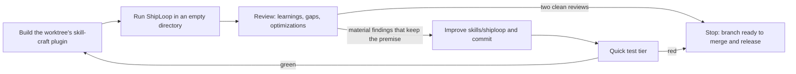

# ShipLoop E2E harness

The simplest end-to-end check of ShipLoop, and a loop that uses it to improve
the skill. A request goes into a brand-new empty directory, ShipLoop runs it
headlessly, the result is graded, a reviewer asks what the skill should learn,
and an improver applies what keeps the core premise. Then the edited skill is
rebuilt and run again. The heavier Grok campaign lives in
`skills/shiploop-e2e-audit`.



All three stages default to **Grok (`grok-4.7`) at medium reasoning effort**;
`--host claude` switches to Claude (Sonnet). Every stage launches a real model
and costs money; none of it runs in default CI.

## One run

```sh
bash test/run-integration.sh shiploop-e2e --case battleship
bash test/run-integration.sh shiploop-e2e --case hello --host claude
bash test/run-integration.sh shiploop-e2e --prompt "Create fizzbuzz.py with tests" --check "python3 -m unittest -q"
```

`run.py` creates a new output directory (default `$TMPDIR/shiploop-e2e/<case>-<time>-<rand>`)
with an empty `work/`, builds this checkout's plugin (or takes `--plugin-dir`),
and starts one host process in `work/`, printing each message and tool call as it
happens. It refuses to launch if `work/` is not empty; nothing, not even `.git`, is
pre-created. It grades five verdicts into `result.json`:

- **invoked**: the host registered the ShipLoop command it was given (Grok
  `/shiploop`, since Grok does not namespace plugin skills; Claude
  `/skill-craft:shiploop`, since a bare `/shiploop` is not registered there);
- **plugin**: exactly one skill-craft plugin loaded, and it is the build under test;
- **process**: the host exited 0 in time (defaults: 600 turns, 3 hours);
- **shiploop**: a ShipLoop `state.md` under the output directory (in `work/.shiploop` or
  an external workspace root the agent chose beside `work/`) has status `done`, with
  its `report.html`;
- **checks**: each case check command exits 0 in `work/`.

The output directory keeps the prompt, argv, raw events, a readable
`transcript.md`, stderr and the result. Nothing is retried or resumed.

### Isolation

- **Grok** runs with a throwaway `HOME`. Its `.grok` holds only a symlink to
  your `~/.grok/auth.json` and the plugin under test, so your Grok plugins, the
  running Grok leader and everything Grok inherits from `~/.claude` stay out.
  Nothing is installed into your real Grok profile (setting `GROK_CONFIG_DIR`
  alone is not enough: plugin installs still reach the real profile through the
  shared leader). Git commits use a stub identity.
- **Claude** runs with `--setting-sources project,local` and `--plugin-dir`, so
  your plugins and hooks stay out; `~/.claude/CLAUDE.md` still loads.
- Grok has no spend cap; its runs are bounded by `--max-turns` and the timeout.
  Claude runs also get `--max-budget-usd` (default 10).

## Review one run

```sh
bash test/run-integration.sh shiploop-e2e-review /tmp/shiploop-e2e/battleship-...
```

`review.py` gives the reviewer the run's transcript, result, product and
`.shiploop` state plus the skill source, and asks:

1. What were the key learnings about the skill that we could improve?
2. Which considerations should the skill take into account but does not?
3. What could be optimized without removing key functionality?

Every finding states whether it preserves the core premise: **the script is the
orchestrator**. It keeps navigation state, walks the SDLC graph and returns
each step's prompt and callback; the model performs the step and never chooses
a successor. Findings that would move navigation, successor choice or prompt
selection into the model are recorded as rejected and never applied. The
review is written to `review.md` and `review.json` in the run directory.

## Iterate

```sh
bash test/run-integration.sh shiploop-e2e-iterate --case battleship --iterations 3
```

`iterate.py` creates a worktree `.claude/worktrees/auto-shiploop-e2e-<rand>` on
branch `auto/auto-shiploop-e2e-<rand>` from the current `HEAD` (commit what you
want tested first), then per iteration: builds that worktree's plugin, runs the
case, reviews it, and hands the **material, premise-preserving** findings to an
improver agent. The improver may change only `skills/shiploop/`,
`changes/shiploop/` and `test/`, and commits with explicit paths. The harness
then checks the commit's scope itself and runs the quick test tier.

It stops at `--iterations` (at most 10), after two consecutive clean reviews of
passing runs, when the improver commits nothing twice in a row, when a run never
reached the skill under test, when the improver strays outside its scope, or on
a red suite (nothing is reverted). `LEARNINGS.md` in the output directory records
every iteration: verdicts, cost, findings applied and rejected, commits and tests.

Nothing is published. When the branch is worth shipping, review it, merge it,
then publish with `scripts/release.py` and `scripts/release-push.py`, and update
each host's `skill-craft@whichguy` plugin.

## Cases and self-test

Cases live in `cases.json` (`prompt` plus shell `checks`): `hello` (Python
hello-world with a unittest) and `battleship` (a dependency-free Node HTTP
server, graded by its own `node --test` suite and by live requests to `/`,
`/api/new` and `/api/fire`). Add a case there to make another request repeatable.

`test/shiploop-e2e.test.py` checks the harness with fake `grok` and `claude`
executables. It runs in normal CI; the live stages never do.
