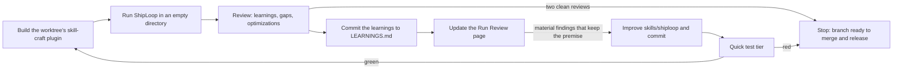

# ShipLoop E2E harness

The simplest end-to-end check of ShipLoop, and a loop that uses it to improve
the skill. A request goes into a brand-new empty directory, ShipLoop runs it
headlessly, the result is graded, a reviewer asks what the skill should learn,
and an improver applies what keeps the core premise. Then the edited skill is
rebuilt and run again. The heavier Grok campaign lives in
`skills/shiploop-e2e-audit`.


```mermaid
flowchart LR
    B[Build the worktree's skill-craft plugin] --> R[Run ShipLoop in an empty directory]
    R --> V[Review: learnings, gaps, optimizations]
    V --> L[Commit the learnings to LEARNINGS.md]
    L --> P[Update the Run Review page]
    P -->|material findings that keep the premise| I[Improve skills/shiploop and commit]
    I --> T[Quick test tier]
    T -->|green| B
    V -->|two clean reviews| S[Stop: branch ready to merge and release]
    T -->|red| S
```

All three stages default to **Claude Sonnet 5.5 (`claude-sonnet-5-5`)**.
`--host grok` switches to Grok (`grok-4.7`, medium effort), and `--host codex` to Codex
(GPT-6 Luna, `gpt-6-luna`, at max effort). `--model` and `--effort` override either one, so
switching model or effort is a flag, for example
`--host codex --model gpt-6-sol --effort xhigh`. Every stage launches a real
model and costs money; none of it runs in default CI.

Each host is one class in `hosts.py` (`HOSTS`); nothing else branches on the
host name. A host builds its argv, its isolated profile (Grok and Codex get a
throwaway HOME whose profile links only the user's `auth.json`), its plugin
install, how a prompt invokes the skill (`/skill-craft:shiploop` or Codex's
`$skill-craft:shiploop`), and a translator. Codex's `codex exec --json` stream is
translated into Grok's event shape as it is captured, so metrics, the transcript
and the reviewer read one format. Codex reports no dollar cost, so its cost is
unknown, and it has no turn cap. Adding a host means adding one class.

To check orchestration alone, without ShipLoop's SDLC or a product, run the
fan-out/fan-in check. A host drives the published `plan-dispatcher` skill on
dummy steps: A and B are independent, and J comes after both. Each step only
records its start, sleeps 30 s and records its end. A script, not the model,
grades whether the dispatcher completed, whether J started after both A and B
ended, and whether A and B overlapped as native workers. It takes about 10
minutes:

```sh
python3 test/shiploop_e2e/fanout.py --host codex --model gpt-6-luna --effort medium
```

A run that stops while ShipLoop is still active, for example because a host ran
out of credits, can continue in place on any host:

```sh
bash test/run-integration.sh shiploop-e2e --resume-run <that run's output directory> --host codex --effort xhigh
```

It keeps the same work directory, run state and event stream, and prompts with
the ShipLoop CLI of the host that started the run, so the run's version does not
change. The case and checks come from the earlier run, and the result is graded
as usual. The original `invocation.json` is kept, and each resume is recorded
beside it as `invocation-resume-<host>-<time>.json`.


**Start with [SPEC.md](SPEC.md).** It is the standing specification every run,
review and fix is judged against: the purpose of this loop (verify ShipLoop, not
the probe product) and the design clauses S-1..S-15 (scripts own the graph and
state, packets stand alone and stay small, prompts stay technology-agnostic,
one implementation per mechanism, unattended by default, the user follows the
run through script-rendered status, ...). `review.py` and `iterate.py` load it as
their premise; learnings entries cite its clause IDs.

## One run

```sh
bash test/run-integration.sh shiploop-e2e --case battleship
bash test/run-integration.sh shiploop-e2e --case hello --host claude
bash test/run-integration.sh shiploop-e2e --case hello --host codex --effort xhigh
bash test/run-integration.sh shiploop-e2e --prompt "Create fizzbuzz.py with tests" --check "python3 -m unittest -q"
```

`run.py` creates a new output directory (default `$TMPDIR/shiploop-e2e/<case>-<time>-<rand>`)
with an empty `work/`, installs the published plugin (or builds this checkout),
and starts one host process in `work/`, printing each message and tool call as it
happens. It refuses to launch if `work/` is not empty; nothing, not even `.git`, is
pre-created. It grades five verdicts into `result.json`:

- **invoked**: the host registered the ShipLoop command it was given (Grok
  `/shiploop`, since Grok does not namespace plugin skills; Claude
  `/skill-craft:shiploop`, since a bare `/shiploop` is not registered there);
- **plugin**: exactly one skill-craft plugin loaded, and it is the build under test;
- **process**: the host exited 0 in time (defaults: 10,000 turns, 3 hours);
- **shiploop**: a ShipLoop `state.md` under the output directory (in `work/.shiploop` or
  an external workspace root the agent chose beside `work/`) has status `done`, with
  its `report.html`;
- **committed**: the source checkout ends committed: HEAD moved past where the
  run started, and no product path is left modified or untracked (`*.log` aside);
- **checks**: each case check command exits 0 in `work/`.

The output directory keeps the prompt, argv, raw events, a readable
`transcript.md` (built from the text the model actually saw), stderr and the
result. `result.json` also lists tool outputs the host truncated before the
model saw them (Grok cuts shell output at about 20 KB). When ShipLoop has not
yet returned its candidate to `work/`, the result names ShipLoop's worktree and
reports, for information only, how many checks already pass there. A Grok
session that ends while the run is still active is resumed (`--max-resumes`).

### What ShipLoop did

Every run also writes `metrics.json`, derived from the event stream, the
arrival times the runner stamps on each non-streaming event (`timeline.jsonl`;
Grok events carry no time) and ShipLoop's run directory:

- per accepted stage (`stages`): the stage, its outcome, seconds, host turns and tool
  calls. Stages come from ShipLoop's own records, never from
  file times: `state.md` history joined to the run's `timeline.json` by action id,
  so a stage is bounded by the engine's acceptance stamps. A stage the engine did
  not stamp, and the stage right after it, report `timing: "unavailable"` instead
  of a zero. A run that stopped before accepting its current stage gets a last
  `incomplete` row for it. No cost and no token count is split per stage; cost stays
  whole-run. "Reading per-stage figures" below says what these numbers can and
  cannot tell you;
- sessions and how each ended (`sessions`: its stop, turns, cost and the host's own
  `usage`, kept as the host wrote it and never summed), turns, peak context (null when
  no call reported its context), cost (unknown, null, unless every session that ended
  reported one), `unreported_sessions` (sessions that began and never reported an end,
  such as one killed with the task: any above 0 makes turns and cost a lower bound, and
  the printed cost says so; it is a field of `metrics.json` and `result.json`, not a
  baseline key), auto-compactions, host-truncated outputs, test runs and Improve
  children (the directories ShipLoop made, not their `-bind.md` receipts);
- every `shiploop` command that exited non-zero, with its failing line;
- which `docs/shiploop/` files the model read.

`result.json` also reports how the run left the source checkout
(`shiploop.knowledge`): whether `docs/shiploop/spec.md` exists and is committed,
its requirement IDs, the commits on HEAD, untracked files and branches.

`result.json` and each baseline row also carry `termination`: why the run is not
still going, recorded by the harness that owns the host process. It holds the
process status and return code, each session's own stop reason, why the driver
stopped resuming (`host is not resumable`, `ShipLoop run is <status>`, `no host
session id to resume`, `run deadline spent`, `resume budget spent (N)`), the
engine's status and the stage it never accepted. `unknown` is kept rather than a
guess, a ShipLoop refusal is never reported as the cause, and the printed report
has a `stopped` line. A harness killed together with its host writes none of
it (the observer is gone); only the engine's own state survives, and a later
`--resume-run` records what that resume observed.

While a run is going, `python3 test/shiploop_e2e/progress.py <output>` prints
what changed since its last call (new accepted stages with turns and minutes,
failed ShipLoop commands, truncations, compactions, ended sessions). It never
prints packet text or run markers, so a ShipLoop keepalive in the watching
session cannot bind to the run.

### Suites and baselines

```sh
bash test/run-integration.sh shiploop-e2e --suite web-service   # focused: one style, in depth
bash test/run-integration.sh shiploop-e2e --suite breadth       # one case per style: the generality gate
```

Each case in `cases.json` has a `style`; `suites.json` groups them into focused
suites (one style) and the `breadth` suite (one case per style). `--suite`
runs the cases into one directory, each in its own folder; independent chains
(a case with its follow-ons) run concurrently, up to `--max-parallel` (default
3), quietly; `--serial` runs one at a time. A follow-on case starts from its
predecessor's output and is skipped when that predecessor failed. With
`--source marketplace`, a suite first runs the marketplace preflight once
(`--preflight-only` runs just that): it installs skill-craft the host's way
and prints what origin/main publishes and what the host got. Every run
(suite or `--case`) appends one summary row to `baselines.jsonl` (case, style,
suite, host, model, effort, source, plugin and ShipLoop versions, verdicts, checks,
turns, cost, sessions, cancellations, model glue, ShipLoop failures, the per-stage
rows and the termination record) and prints the change against the previous row
for the same case, source, host, model and effort (SPEC: a baseline compares only
with rows from the same driver). Model and effort are recorded as passed, null when
the flag was not given, so a run without `--effort` compares only with other runs
without it. A row written before those fields existed names no host, model or
effort and is never compared: every row through the 1.19.0 hello rows of
2026-10-04 is in that state, so the first run per case, host, model and effort has
nothing to compare with and becomes that identity's first row. A resumed or seeded
run writes no row. When rows do compare, the stage lines show where a whole-run
difference landed; they gate nothing. Commit the new rows with the run's learnings
entry. See SPEC.md, "E2E suites" and "Parallel work".

`metrics.json` also reports `script_verifications` (the checks ShipLoop itself
ran and recorded, from its `*-verify*.md` records) and `model_glue`: shell
commands that did a step ShipLoop owns (`git commit`/`add`, shell writes into
the run directory or Improve receipts, hand-built loop contracts), listed with
the reason so a reviewer can confirm them. Both are defined by ShipLoop's own
paths and verbs, never by a case's tools. `script_verifications` also counts
`could_not_run`: attempts where no command reached a verdict about the product (a
timeout, a command that could not be spawned, or one skipped when the invocation's
budget ran out). They refuse their stage without counting as product failures. A
non-zero count means the run could not tell, because of an environment problem or a
product hang; it does not say the product is wrong.

### Reading per-stage figures

- Stage boundaries are the engine's acceptance stamps, which are whole seconds,
  truncated. The turn that submits a stage's result can land just after its own
  stamp and be counted in the next stage, so read stage turns as plus or minus one;
  two identical runs can differ by a turn in a stage.
- Seconds are wall clock between two stamps. A `--resume-run` gap, a credit stop or
  a pause inside a stage is counted as that stage's time.
- Turns count assistant content-block events, between 1.6 and 2 times the host's own
  turn count (`result.num_turns`) on recorded Claude runs.
- A host reports what it reports. Codex emits no per-call usage, so per-stage turns
  are not available for it: they are null in `metrics.json` and named in `unmeasured`,
  never 0.
- No output-token figure is built from events: a Claude message's output count is a
  streaming snapshot (it summed to about 1/17 of the session's own total on a recorded
  run), and Codex has none per call. A session's tokens are the host's own `usage` in
  `sessions`. Cost and turns add up across the sessions that reported; a session killed
  before it reported is counted in `unreported_sessions`, not estimated.
- The Run Review page's stage minutes come from the exporter's own accept-to-accept
  computation (`skills/shiploop-e2e-audit/run-review/export.py`), not from
  `metrics.json`. The first stage differs: the exporter starts at the engine's
  `started` stamp, the harness at the first host event.
- A recreated `timeline.json` (the engine stamps every historical action with the
  current time) looks like real stamps and gives zero-length stages.

The review of these limits and what was fixed is in
[docs/shiploop-graph-engineering-comparison-2026-10-04.md](../../docs/shiploop-graph-engineering-comparison-2026-10-04.md),
section 10.

### A second feature in the same repository

```sh
bash test/run-integration.sh shiploop-e2e --case battleship-scoring --continue-from <battleship output>
```

A case with `follows` runs in a copy of an earlier run's source checkout, as
that run left it (`.git` and untracked files included; stale worktree records
dropped; the earlier output is never changed). It asks whether ShipLoop builds
on what the first run decided. Its checks are the followed case's checks
(regression), its own feature checks, and retention checks that see the earlier
checkout as `$PRIOR_WORK`: every earlier file still exists, no dependency was
added, the passing test count grew, and the living spec keeps every earlier
requirement ID and adds at least one. The report compares turns and cost with
the earlier run, and the reviewer judges whether the earlier spec, environment
notes and modules were used.

### What version is tested

By default (`--source marketplace`) a run tests exactly what the `whichguy`
marketplace publishes now. Grok runs add `whichguy/skill-craft` and install
`skill-craft` inside the isolated profile, the way a user does; Claude runs use
an exact export of `origin/main`'s `plugins/skill-craft`, the payload the
marketplace serves. Before launching, the harness fetches `origin` and refuses
to run unless this checkout's `HEAD` is `origin/main`, the installed plugin
version equals the catalog's, and the installed ShipLoop version equals the
released one. `result.json` records all of them under `versions`.

`--source checkout` (implied by `--plugin-dir`) builds this checkout instead, to
test unreleased changes; it records versions but does not gate. `iterate.py`
uses it on purpose. Publish (`scripts/release.py`, then
`scripts/release-push.py`) before a marketplace run should include a change.

### Isolation

- **Keepalive and resume (Grok).** Headless Grok never runs plugin hooks and reads
  `~/.grok/hooks` only when a session starts, so the harness installs ShipLoop's own
  keepalive hook into the isolated profile before launch (`shiploop-hook install --host
  grok`) and reports the keepalive's decisions in `result.json`. A headless session
  also ends whenever the model ends its turn; when that happens while ShipLoop's run is
  still `active`, the harness resumes the same session (`grok --resume`, default 20
  times, `--max-resumes`) with a prompt to run `shiploop next`, within the timeout.
  Turns and cost add up across the sessions that reported (`unreported_sessions`
  counts those that did not).
- **Grok** runs with a throwaway `HOME`. Its `.grok` holds only a symlink to
  your `~/.grok/auth.json` and the plugin under test, so your Grok plugins, the
  running Grok leader and everything Grok inherits from `~/.claude` stay out.
  Nothing is installed into your real Grok profile (setting `GROK_CONFIG_DIR`
  alone is not enough: plugin installs still reach the real profile through the
  shared leader). Git commits use a stub identity.
- **Claude** runs with `--setting-sources project,local`, `--strict-mcp-config` and
  `--plugin-dir`, so your plugins and hooks stay out and none of your account's
  claude.ai connectors load (a plain launch loaded 15 of them and 174 tools,
  some connected, into an unattended run); `~/.claude/CLAUDE.md` still loads.
- Grok has no spend cap; its runs are bounded by `--max-turns` and the timeout.
  Claude runs also get `--max-budget-usd` (default 40; a chained case such as battleship-scoring can cost
  more than 10 across its resumes).

### Launching long runs

Launch a run as a Claude Desktop background task (`run_in_background`) so it can be tracked; a background task is
killed after 18-30 minutes, taking the host with it, so relaunch with `--resume-run <output directory>` and the
run continues in place (the output directory is reused; `--output` is ignored on a resume). A resume refuses to
start while `origin/main`'s CI has failed, and a Codex resume across a release is refused. A multi-hour host such
as Codex at max effort is the one case where a detached `nohup` launch is a deliberate, stated exception; watch it
with a periodic status snapshot of its output directory.

## Review one run

```sh
bash test/run-integration.sh shiploop-e2e-review /tmp/shiploop-e2e/battleship-...
```

`review.py` gives the reviewer the run's transcript, result, product and
`.shiploop` state, the skill source and the last three commit messages of the
checkout (the learnings recorded so far), and asks:

1. What were the key learnings about the skill that we could improve?
2. Which considerations should the skill take into account but does not?
3. What could be optimized without removing key functionality?

Every finding states whether it preserves the core premise: **the script is the
orchestrator**. It keeps navigation state, walks the SDLC graph and returns
each step's prompt and callback; the model performs the step and never chooses
a successor. Findings that would move navigation, successor choice or prompt
selection into the model are recorded as rejected and never applied. The
review is written to `review.md` and `review.json` in the run directory.

## Iterate

```sh
bash test/run-integration.sh shiploop-e2e-iterate --case battleship --iterations 3
```

`iterate.py` creates a worktree `.claude/worktrees/auto-shiploop-e2e-<rand>` on
branch `auto/auto-shiploop-e2e-<rand>` from the current `HEAD` (commit what you
want tested first), then per iteration: builds that worktree's plugin, runs the
case, reviews it, and hands the **material, premise-preserving** findings to an
improver agent. Before the improver starts, the iteration appends its outcome
and every finding to `test/shiploop_e2e/LEARNINGS.md` and commits it with a
detailed message (outcome, evidence, proposals, rejected findings, what to
apply next). Reviewer and improver both read the last three commit messages, so
each iteration builds on the learnings of the ones before. The improver may
change only `skills/shiploop/`,
`changes/shiploop/` and `test/`, and commits with explicit paths. The harness
then checks the commit's scope itself and runs the quick test tier.

It stops at `--iterations` (at most 10), after two consecutive clean reviews of
passing runs, when the improver commits nothing twice in a row, when a run never
reached the skill under test, when the improver strays outside its scope, or on
a red suite (nothing is reverted). `LEARNINGS.md` in the output directory records
every iteration: verdicts, cost, findings applied and rejected, commits and tests.

Nothing is published. When the branch is worth shipping, review it, merge it,
then publish with `scripts/release.py` and `scripts/release-push.py`, and update
each host's `skill-craft@whichguy` plugin.

## The Run Review page

Every run writes `review-export/` into its output directory: the run's documents
for the owner's Run Review page (stage minutes from ShipLoop's accept times,
phases, Improve, failures, planning-document sizes, Backchain loop ledgers) and
`facts.md`, plain numbers for the reviewer. An export problem is printed and
never changes a verdict. `iterate.py` commits the compact `review-export.json` as
`evidence/<run key>.json` with the learnings entry. After that commit, update the
page as [run-review/README.md](../../skills/shiploop-e2e-audit/run-review/README.md)
describes.

## Cases and self-test

Cases live in `cases.json` (`prompt` plus shell `checks`): `hello` (Python
hello-world with a unittest) and `battleship` (a dependency-free Node HTTP
server, graded by its own `node --test` suite with at least one passing test,
by live requests to `/`, `/api/new` and `/api/fire`, and by a full game played
through the API until `gameOver`, then a repeat shot that must still report
`gameOver: true`). `battleship-scoring` follows `battleship`: it adds the
sunk ship's name, shot and hit counts and an accuracy display. Add a case there
to make another request repeatable.

`test/shiploop-e2e.test.py` checks the harness with fake `grok` and `claude`
executables. It runs in normal CI; the live stages never do.

## Learnings history

`LEARNINGS.md` holds one entry per live run or iteration, each committed on its
own with a detailed message. Before starting another run or changing the skill
or harness, read the last three commit messages
(`git log -3 --format='%h %s%n%b'`) and carry their learnings forward.
