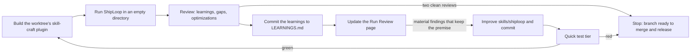

# ShipLoop E2E harness

The simplest end-to-end check of ShipLoop, and a loop that uses it to improve
the skill. A request goes into a brand-new empty directory, ShipLoop runs it
headlessly, the result is graded, a reviewer asks what the skill should learn,
and an improver applies what keeps the core premise. Then the edited skill is
rebuilt and run again. The heavier Grok campaign lives in
`skills/shiploop-e2e-audit`.


```mermaid
flowchart LR
    B[Build the worktree's skill-craft plugin] --> R[Run ShipLoop in an empty directory]
    R --> V[Review: learnings, gaps, optimizations]
    V --> L[Commit the learnings to LEARNINGS.md]
    L --> P[Update the Run Review page]
    P -->|material findings that keep the premise| I[Improve skills/shiploop and commit]
    I --> T[Quick test tier]
    T -->|green| B
    V -->|two clean reviews| S[Stop: branch ready to merge and release]
    T -->|red| S
```

All three stages default to **Claude Sonnet 5.5 (`claude-sonnet-5-5`)**.
`--host grok` switches to Grok (`grok-4.7`, medium effort), and `--host codex` to Codex
(GPT-6 Luna, `gpt-6-luna`, at xhigh effort). `--model` and `--effort` override either one, so
switching model or effort is a flag, for example
`--host codex --model gpt-6-sol --effort max`. Every stage launches a real
model and costs money; none of it runs in default CI.

Each host is one class in `hosts.py` (`HOSTS`); nothing else branches on the
host name. A host builds its argv, its isolated profile (Grok and Codex get a
throwaway HOME whose profile links only the user's `auth.json`), its plugin
install, how a prompt invokes the skill (`/skill-craft:shiploop` or Codex's
`$skill-craft:shiploop`), and a translator. Codex's `codex exec --json` stream is
translated into Grok's event shape as it is captured, so metrics, the transcript
and the reviewer read one format. Codex reports no dollar cost, so its cost is
unknown, and it has no turn cap. Adding a host means adding one class.

To check orchestration alone, without ShipLoop's SDLC or a product, run the
fan-out/fan-in check. A host drives the published `plan-dispatcher` skill on
dummy steps: A and B are independent, and J comes after both. Each step only
records its start, sleeps 30 s and records its end. A script, not the model,
grades whether the dispatcher completed, whether J started after both A and B
ended, and whether A and B overlapped as native workers. It takes about 10
minutes:

```sh
python3 test/shiploop_e2e/fanout.py --host codex --model gpt-6-luna --effort medium
```

A run that stops while ShipLoop is still active, for example because a host ran
out of credits, can continue in place on any host:

```sh
bash test/run-integration.sh shiploop-e2e --resume-run <that run's output directory> --host codex --effort xhigh
```

It keeps the same work directory, run state and event stream, and prompts with
the ShipLoop CLI of the host that started the run, so the run's version does not
change. The case and checks come from the earlier run, and the result is graded
as usual. The original `invocation.json` is kept, and each resume is recorded
beside it as `invocation-resume-<host>-<time>.json`.

The prompt of a resume names the ShipLoop CLI of the plugin the run started on
(`<plugin dir>/skills/shiploop/scripts/shiploop`, whichever host or source built it)
as `python3 "<cli>" next --run-dir "<dir>"`. There is no bare-command form: a resume
whose CLI file is gone is refused before a host starts. The harness prints the exact
command that continues the run, harness flags included (`--timeout`, `--max-resumes`,
`--max-budget-usd`, `--permission-mode`, `--effort`, and `--plugin-dir` for a checkout
build), when a run starts and again when it ends with ShipLoop still active, so a later
session that finds only the task log has it even if the harness was killed.
`invocation.json` keeps the host's argv and not those flags, so a resume without them
would run with the default `--timeout` (10800 s). For that reason a regrade (`--grade-only`)
prints no command at its end, only a pointer to the one printed when the run started (its own
flags are the grader's), and a run that wrote no ShipLoop state prints the start line only
(`--resume-run` refuses it).


**Start with [SPEC.md](SPEC.md).** It is the standing specification every run,
review and fix is judged against: the purpose of this loop (verify ShipLoop, not
the probe product) and the design clauses S-1..S-15 (scripts own the graph and
state, packets stand alone and stay small, prompts stay technology-agnostic,
one implementation per mechanism, unattended by default, the user follows the
run through script-rendered status, ...). `review.py` and `iterate.py` load it as
their premise; learnings entries cite its clause IDs.

## One run

```sh
bash test/run-integration.sh shiploop-e2e --case battleship
bash test/run-integration.sh shiploop-e2e --case hello --host claude
bash test/run-integration.sh shiploop-e2e --case hello --host codex --effort xhigh
bash test/run-integration.sh shiploop-e2e --prompt "Create fizzbuzz.py with tests" --check "python3 -m unittest -q"
```

`run.py` creates a new output directory (default `$TMPDIR/shiploop-e2e/<case>-<time>-<rand>`)
with an empty `work/`, installs the published plugin (or builds this checkout),
and starts one host process in `work/`, printing each message and tool call as it
happens. It refuses to launch if `work/` is not empty; nothing, not even `.git`, is
pre-created. It grades five verdicts into `result.json`:

- **invoked**: the host registered the ShipLoop command it was given (Grok
  `/shiploop`, since Grok does not namespace plugin skills; Claude
  `/skill-craft:shiploop`, since a bare `/shiploop` is not registered there);
- **plugin**: exactly one skill-craft plugin loaded, and it is the build under test (a
  resumed or regraded Grok or Codex run keeps the verdict made when it was launched,
  which `invocation.json` records and a regrade restates from the run's own
  `result.json`, because those streams cannot show what loaded; Claude's init event
  shows it on every launch, and an `invocation.json` written before the verdict was
  kept grades as it always did, with no evidence and so a fail);
- **process**: the host exited 0 in time (defaults: 10,000 turns, 3 hours);
- **shiploop**: a ShipLoop `state.md` under the output directory (in `work/.shiploop` or
  an external workspace root the agent chose beside `work/`) has status `done`, with
  its `report.html`;
- **committed**: the source checkout ends committed: HEAD moved past where the
  run started, holds at least one file (ShipLoop's own empty baseline commit is not
  product; any file counts, so this is a floor, not a check of what the product is),
  and no product path is left modified or untracked (`*.log` aside);
- **checks**: each case check command exits 0 in `work/`.

The output directory keeps the prompt, argv, raw events, a readable
`transcript.md` (built from the text the model actually saw), stderr and the
result. `result.json` also lists tool outputs the host truncated before the
model saw them (Grok cuts shell output at about 20 KB). When ShipLoop has not
yet returned its candidate to `work/`, the result names ShipLoop's worktree and
reports, for information only, how many checks already pass there. A Grok
session that ends while the run is still active is resumed (`--max-resumes`).

### What ShipLoop did

Every run also writes `metrics.json`, derived from the event stream, the
arrival times the runner stamps on each non-streaming event (`timeline.jsonl`;
Grok events carry no time) and ShipLoop's run directory:

- per accepted stage (`stages`): the stage, its outcome, seconds, host turns and tool
  calls. Stages come from ShipLoop's own records, never from
  file times: `state.md` history joined to the run's `timeline.json` by action id,
  so a stage is bounded by the engine's acceptance stamps. A stage the engine did
  not stamp, and the stage right after it, report `timing: "unavailable"` instead
  of a zero. A run that stopped before accepting its current stage gets a last
  `incomplete` row for it. No cost and no token count is split per stage; cost stays
  whole-run. "Reading per-stage figures" below says what these numbers can and
  cannot tell you;
- the planning window (`planning`, SPEC's S-10 carve-out of 2026-10-05: planning takes no more than 30
  minutes): intake to the first accepted `test-spec` with outcome done (a `revise` row does not close it), on two
  labelled clocks, the engine's (`window.seconds`, from `timeline.json` `started`) and the host's
  (`window.host_seconds`, from the runner's first event; `before_engine_seconds` is the difference, 92.8 s on the
  Grok `none` run of 1.22.0). `stages` lists each accepted visit in the window with its seconds and
  `improve_seconds`, which runs from the Improve child's bind file (`improve/<action>-bind.md`, so it needs the
  run directory's file times) to the accept stamp; 0.0 means the engine ran no child for that action, an action with
  a child but no readable bind file is null with its reason. `improve` totals the children and their seconds and
  `producer_seconds` is the window minus them, so the two add up to the window. The exporter's `improveMin` runs
  bind to receipt and the Run Review page's stage minutes stay the exporter's; this block is the harness's own
  figure for the owner's rule, and a regrade of a copied run directory reads wrong Improve seconds (file times).
  An open window reports `through` (the last stamped stage) and is never 0; a seeded run, a recreated
  `timeline.json` (one stamp for every action, or a window whose end does not move past the start, even with a
  single accepted row) and a timeline with no start are unmeasured as a whole. `tokens` is the
  window's output and reasoning tokens on the host clock where the host's per-call counts are exact: Grok's usage
  events, and Codex's rollout `token_usage_record`s (a compaction request counts, a repeated response id counts
  once, sub-agent output is `subagent_output` beside the main figure); Claude's are unmeasured. The reasons for
  anything missing sit inside the block, not in the top-level `unmeasured` map. A window that spans host kills
  (Luna xhigh: three resumes inside its 375-minute window, four in the 588-minute run) is wall clock and includes
  the gaps;
- sessions and how each ended (`sessions`: its stop, turns, cost and the host's own
  `usage`, kept as the host wrote it and never summed), turns, peak context (a call's
  input, cache reads and cache writes; null when no call reported its context), cost
  (unknown, null, unless every session that ended
  reported one), `unreported_sessions` (sessions that began and never reported an end,
  such as one killed with the task: any above 0 makes turns and cost a lower bound, and
  the printed cost says so; it is a field of `metrics.json` and `result.json`, not a
  baseline key), auto-compactions, host-truncated outputs, test runs and Improve
  children (the directories ShipLoop made, not their `-bind.md` receipts);
- the host CLI build the sessions ran on (`claude_code_version`, from Claude's init event; sessions on two
  builds name both, null where the host's events do not carry it; also in `result.json`'s `metrics`). Two runs of
  one prompt on different builds are not a controlled pair: the Sonnet runs of 2026-10-06 and 2026-10-07 ran on
  2.1.291 and 2.1.292, which no record named before;
- every `shiploop` command that exited non-zero, with its failing line;
- which `docs/shiploop/` files the model read.

`result.json` also reports how the run left the source checkout
(`shiploop.knowledge`): whether `docs/shiploop/spec.md` exists and is committed,
its requirement IDs, the commits on HEAD, untracked files and branches.

`result.json` and each baseline row also carry `termination`: why the run is not
still going, recorded by the harness that owns the host process. It holds the
process status and return code, each session's own stop reason, why the driver
stopped resuming (`host is not resumable`, `ShipLoop run is <status>`, `no host
session id to resume`, `run deadline spent`, `resume budget spent (N)`), the
engine's status and the stage it never accepted. `unknown` is kept rather than a
guess, a ShipLoop refusal is never reported as the cause, and the printed report
has a `stopped` line. A harness killed together with its host writes none of
it (the observer is gone); only the engine's own state survives, and a later
`--resume-run` records what that resume observed. `--resume-run <output directory>
--grade-only` writes metrics.json, result.json and the Run Review export from what is
on disk, starting no host, for a run in any status that has a ShipLoop state (`process`
says `not observed` and `termination` says no host ran). Stop the host first, or confirm
none is alive: against a live host it records a mid-run snapshot and replaces result.json.
It never continues or answers a run (SPEC S-14), and it writes no baseline row.

To end a run on purpose, create the file `<output directory>/stop`. The harness kills the
host (its whole process group), never relaunches it, consumes the file, records
`process.status: stopped` with no process verdict (the host did not fail) and
`resume_stop: stopped by <output>/stop`, writes the records and the export, writes no baseline
row, and exits non-zero (a suite reads exit 0 as a pass). The run reads as stopped however the
file is found: killing a running session, or found as a session ended on its own or between two
sessions (the host exited 0, yet `process.status` is `stopped`; that session's own status stays in
`process.sessions`). A host that is never resumed (Claude) does not look for the file after its
only session ended; the next `--resume-run` removes it. A stale file is removed at the start of
every `--resume-run`, and a stop never answers a blocked or awaiting run. A stop that names a
stage (`--stop-at`) is deferred until planning probes are routine (the pending plan's RC2 and
RC3); an external watcher that creates the file when a stage's row appears covers it meanwhile (the
recipe is under "A fresh context (S-6)" below; recording a fresh context did not change this deferral).

A baseline row is written only for a run that starts from the beginning and ends with ShipLoop
no longer active. A resumed or seeded run, a run left active (a deadline, a stop, a spent
resume budget) and a run whose host the deadline or a stop killed before ShipLoop wrote any state
write none: their turns, cost and stages are a fragment. A host that ends on its own, even with no
ShipLoop state, still writes its row.

While a run is going, `python3 test/shiploop_e2e/progress.py <output>` prints
what changed since its last call (new accepted stages with turns and minutes,
failed ShipLoop commands, truncations, compactions, ended sessions). It never
prints packet text or run markers, so a ShipLoop keepalive in the watching
session cannot bind to the run.

### A fresh context (S-6)

SPEC S-6 asks what a model does with a cleared context. The harness records it and scores nothing (SPEC "A fresh context
is recorded, not scored"). `<output>/sessions.jsonl` is the harness's own append-only record of every host launch: a `start`
row before the host runs (`kind` first, fresh or continued; `reason`; `events_line`, the number of the session's first event
in `events.jsonl`; `told`, the CLI and run directory the resume prompt named, as values; `engine`, the ledger as the session
inherits it) and an `end` row after it (status, last events line, `engine` at that moment). `metrics.json` `fresh_starts`
lists one block for every fresh session (`--resume-run`, the session after `--interrupt-at`) and every compaction (Grok's
`auto_compact_completed`; Codex's from its rollouts; Claude's are not detected), each over the events from that start to the
tool call that got the next accepted action accepted. That action is the first one the ledger accepted after the start, and the
call is the last `complete` or `improve-complete` that names it, did not fail and returned at or after the accept stamp (the
stamp is whole-second truncated, so the window ends at the call, not at the stamp, and an Improve park's parent `complete`, which
returns long before the accept, is not the call): `tool_calls`, `seconds` (to the call) and `seconds_to_accept_stamp`,
`first_grounding` (the first call that goes to ShipLoop's scripts or reads a packet: `next`, `improve-next` (the Improve
runtime's own recovery command), `packet`, or `other` for another ShipLoop verb such as `complete` or `lint`) with
`calls_before_grounding`, `recovery` (was the first `next` as told: `cli` and `run_dir` are exact, equivalent after normpath and
realpath, different or unreadable; `revision_seen`), `failures` and `rewrote` (both lower bounds: `rewrote` sees file-edit tools
only, not a file a shell command wrote, and says `none seen by file-edit tools`), `asked_user`. A window the records cannot place
(the action was accepted by something that left no event, only a call that parked it was seen, the session ended before it, or
in a run with no `sessions.jsonl` another host session began or ended inside the window) is `measured: false` with its reason
and no count, never extended to a later action; it keeps `first_grounding` and `recovery`. A `continued` session (a Grok or
Codex resume of the same context) does not cut a window; the next fresh session does. A fresh start also has `after_kill` (the
engine revision in the killed session's end row, in this session's start row and in its first `next` result; `moved` is true when
they differ). `fresh_starts_unmeasured` says what the list lacks: `not recorded` where the run has no `sessions.jsonl` (before
2026-10-09; the list then holds compactions only), `partial` where the first recorded session is not the run's first, the host
whose compactions are not detected (Claude's, a Codex run without rollouts), or `failed`.

The probe tests the production recovery path (the resume prompt, which names the `next` command, plus the packet it prints),
not "a model holding only the next packet". The old session's servers are reaped, Claude's auto-memory and the user's global
`CLAUDE.md` load into both sessions, and the extracts of the 2026-10 runs that first measured it are not clean samples (SPEC).

The S-6 pair, a stage boundary and the inside of a stage, with no trigger in the harness: a watcher creates the stop file, then
`--resume-run` gives the fresh session. One run at a time (SPEC: runs compared on wall time run one after the other). The case
is hello, restated with `--prompt` and `--check` because `--case hello` cannot be combined with `--prompt`; `--planning-review
none` is a ShipLoop `init` flag that ShipLoop refuses without `--improve-skill <absolute path of the Improve SKILL.md>`, so the
prompt carries both. Under `none` the planning stages (intake to test-spec) have no Improve park, the longest context windows
of a default run, so a probe at one of them never sits inside one; the later Improve children still run (the saved v1220 `none`
run parked at system-test-author, release-plan and carry-forward), so a probe past planning can:

```sh
OUT=/Users/dadleet/e2e-runs/$(date +%Y%m%d)/s6-after-spec        # the prompt names a path under it; a new folder
python3 test/shiploop_e2e/run.py --source checkout --output "$OUT" --timeout 3000 --check "python3 -m unittest -q" \
  --check "test \"\$(python3 hello.py)\" = 'Hello, world!'" --prompt "Create hello.py that prints exactly \"Hello, world!\" \
when run, plus a unittest test in test_hello.py that verifies that output. Start ShipLoop with the run option \
--planning-review none and --improve-skill $OUT/build/plugins/skill-craft/skills/improve/SKILL.md." &
python3 stop-watcher.py "$OUT" after spec          # the watcher below; "inside spec" for the inside of a stage
wait                                               # run.py prints STOPPED and exits non-zero: the stop is the plan
python3 test/shiploop_e2e/run.py --resume-run "$OUT" --plugin-dir "$OUT/build/plugins/skill-craft" --timeout 3000
```

```python
# stop-watcher.py: run from the repository root as `python3 stop-watcher.py <output> after|inside <stage>`
import pathlib, sys, time
sys.path.insert(0, "test/shiploop_e2e")
import metrics
out, where, stage = pathlib.Path(sys.argv[1]), sys.argv[2], sys.argv[3]
while True:
    run = next(iter(out.glob(".shiploop-runs/*/run")), None)          # exists once ShipLoop has started the run
    state = metrics.engine_state(run) if run else {}
    history = state.get("history", [])
    waiting = [p.stem for p in (run / "inbox").glob("*.md") if p.stem not in {h.get("action") for h in history}] if run else []
    if (where == "after" and stage in [h.get("stage") for h in history]) or \
       (where == "inside" and metrics.current_stage(state) == stage and waiting):
        (out / "stop").write_text("")
        break
    time.sleep(0.5)
```

The example builds this checkout (`--source checkout`), which is why the Improve card's path is known before the run starts; with
`--source marketplace` it is `$OUT/marketplace/plugins/skill-craft/skills/improve/SKILL.md` for Claude and carries a hash or
version under `$OUT/home` for Grok and Codex, so a Grok probe uses a checkout build (the r3 run did). Pass the first launch's
`--host`, `--model` and `--effort` to both commands. The watcher polls every 0.5 s and the harness checks the stop file
every 2 s (`run.POLL_SECONDS`), so the host runs up to about 2.5 s past the boundary, and a `complete` already started in a
Claude Bash call (its own process group) can finish after the kill: the engine can move between the kill and the fresh session.
`after_kill` compares revisions and does not wait; `moved` means the engine moved between the kill and the fresh session's first
`next`, which a command of the killed session that was still running can do, and so can an orphan host or the fresh session's own
ShipLoop calls before that `next` (an `improve-bind` increments the revision): a difference is not a failed probe. The keepalive
owner binding a Grok host keeps under `home/.local/state/shiploop/keepalive` (stale after `OWNER_STALE_SECONDS`, 1800 s) survives the
stop, and a fresh Grok session started seconds after the kill is not the owner, which can inflate early session ends and `continued`
resumes in a probe; it is not recorded. The result file and `complete` are often one shell command, so the `inside` boundary can race the submission:
`fresh_starts[].stage_in_flight` says which stage the clear landed in. A probed run is a resumed run and writes no baseline row.
The watcher matches a stage by name, so it is for the stages that happen once (intake to step-plan): a stage that repeats per work item
matches its first row. Read `$OUT/metrics.json` `fresh_starts`: the block with `reason: resume-run`. Phase 2 (`--clear-at`, a trigger and kill in the
harness) is built only if these probes show the overshoot or the two-invocation procedure inadequate.

### Suites and baselines

```sh
bash test/run-integration.sh shiploop-e2e --suite web-service   # focused: one style, in depth
bash test/run-integration.sh shiploop-e2e --suite breadth       # one case per style: the generality gate
```

Each case in `cases.json` has a `style`; `suites.json` groups them into focused
suites (one style) and the `breadth` suite (one case per style). `--suite`
runs the cases into one directory, each in its own folder; independent chains
(a case with its follow-ons) run concurrently, up to `--max-parallel` (default
3), quietly; `--serial` runs one at a time. A follow-on case starts from its
predecessor's output and is skipped when that predecessor failed. With
`--source marketplace`, a suite first runs the marketplace preflight once
(`--preflight-only` runs just that): it installs skill-craft the host's way
and prints what origin/main publishes and what the host got. Every run
(suite or `--case`) appends one summary row to `baselines.jsonl` (case, style,
suite, host, model, effort, source, plugin and ShipLoop versions, the run's
`planning_review` mode, verdicts, checks,
turns, cost, sessions, cancellations, model glue, ShipLoop failures, the per-stage
rows and the termination record) and prints the change against the previous row
for the same case, source, host, model and effort (SPEC: a baseline compares only
with rows from the same driver). Model and effort are recorded as passed, null when
the flag was not given, so a run without `--effort` compares only with other runs
without it. A row written before those fields existed names no host, model or
effort and is never compared: every row through the 1.19.0 hello rows of
2026-10-04 is in that state, so the first run per case, host, model and effort has
nothing to compare with and becomes that identity's first row. A resumed or seeded
run writes no row. When rows do compare, the stage lines show where a whole-run
difference landed; they gate nothing. Commit the new rows with the run's learnings
entry. See SPEC.md, "E2E suites" and "Parallel work".

Run the runs you compare one after the other. Concurrent runs share the CPU, the host's rate limit and the machine's loopback
ports, so two runs whose wall time or per-call cost are set side by side (a before/after pair, a host or model comparison)
are started the second after the first has ended: `--serial` for a suite, or launch the second once the first has ended.
The suite default of 3 parallel chains stays, because a suite is for finding failures and not for timing them. Nothing
records an overlap: a baseline row has no overlap field, and each run's `timeline.jsonl` start stamp is the only trace, so
this is a discipline and not a guarantee (SPEC, "Parallel work"). The two round-2 Sonnet runs were started within 0.1 s of
each other.

The row's `planning_review` is the run option ShipLoop 1.22.0 records in `state.md`
(`stage`: an Improve child after each of spec, test-strategy, plan, step-plan and
test-spec; `none`: after none of them), read as written from the run's own state, and
`not recorded` when the key is absent: a mode is never defaulted. Planning minutes,
Improve passes and turns are not the same quantity in the two modes, so a run is
compared with the last row of its own mode: the last row of the same case, source, host,
model and effort that stands for the run's mode, found past any rows of the other mode
(the report names that row by its date and ShipLoop version). When no earlier row of
that driver has the run's mode, the report prints `baseline  not compared across
planning_review modes (<this> vs <previous>); no earlier row of mode <this>` (<previous>
is the mode of the driver's last row) and compares no turns, cost or stage; a run whose
own mode is `not recorded` matches no row and the report says it records no mode. A row written before the field existed has no mode: it
stands for `stage` only when its recorded `plugin_version` is below 1.22.0 (the first
release with the option, so every planning stage of that run started an Improve child,
which is what `stage` does) and the report says so; a row with no usable
`plugin_version`, or with 1.22.0 or later and no field, reads `not recorded` and is
compared with no run.

`metrics.json` also reports `script_verifications` (the checks ShipLoop itself
ran and recorded, from its `*-verify*.md` records) and `model_glue`: shell
commands that did a step ShipLoop owns (`git commit`/`add`, shell writes into
the run directory or Improve receipts, hand-built loop contracts), listed with
the reason so a reviewer can confirm them. Both are defined by ShipLoop's own
paths and verbs, never by a case's tools. `script_verifications` also counts
`could_not_run`: attempts where no command reached a verdict about the product (a
timeout, a command that could not be spawned, or one skipped when the invocation's
budget ran out). They refuse their stage without counting as product failures. A
non-zero count means the run could not tell, because of an environment problem or a
product hang; it does not say the product is wrong. It also counts `red`: the records in
which a command ran red (a run whose own status is `red`). A test-red record, or the
test-author probe, passes because red is what it accepts, so `passed` includes it ("10/10
passed" on r1 Battleship holds 2 such records, and the report says "2 ran red"). What ran
is counted and not what the record expected: the probe accepts red or passed, and one that
ran green is a green pass.

### Reading per-stage figures

- Stage boundaries are the engine's acceptance stamps, which are whole seconds,
  truncated. The turn that submits a stage's result can land just after its own
  stamp and be counted in the next stage, so read stage turns as plus or minus one;
  two identical runs can differ by a turn in a stage.
- Seconds are wall clock between two stamps. A `--resume-run` gap, a credit stop or
  a pause inside a stage is counted as that stage's time.
- Turns count assistant content-block events, between 1.6 and 2 times the host's own
  turn count (`result.num_turns`) on recorded Claude runs. That definition stays: the
  baseline rows store it and are compared across runs. `model_calls` is the number of
  model calls: a Claude message counted once at its first event (unique `message.id`; an
  event with no id counts one) and a Grok `usage` event each (recorded Claude hello runs:
  149 calls for 254 turns, 113 for 194, 94 for 167, 84 for 143). `window_tokens` is the
  context window the result events' `modelUsage` report (Claude: 1,000,000). Both are in
  `metrics.json` and `result.json`'s metrics, and neither is a baseline key. A host that
  reports nothing leaves the field null and names it, with the reason, in `unmeasured`
  (Grok reports no window; a Codex run has no call count in its events).
- A host reports what it reports. A counter its events cannot show is null in
  `metrics.json`, `result.json` and the baseline row and is named, with the
  reason, in `unmeasured`, so a later run compares it as not measured and never as
  0 -> 0. Codex emits no per-call usage in its events, so per-stage turns are unmeasured
  for it; its calls, context window and compactions are read from its rollout files
  (next bullet). Neither Codex nor Claude writes Grok's truncation, permission-refusal
  or file-read events, so truncated outputs, cancelled tool calls and knowledge reads
  are unmeasured on both, and compactions are unmeasured on Claude and on a Codex run
  whose rollouts are gone (Codex prints "cancelled 0" in a failing `node --test` summary
  and its file changes are writes: the Grok-only detectors used to count those as
  refusals and reads). Whole-run turns are null when no call and
  no ended session reported a count (a Codex session killed before its end event), and
  a lower bound when a session never reported (`unreported_sessions`).
- Every host's tool calls go through one classifier (`metrics.ToolLog`): Grok's `tool_call`
  events, Codex's after the translator, and Claude's `tool_use` and `tool_result` blocks.
  It gives `shiploop_failures`, `model_glue`, `tmp_writes`, `asked_user` and each stage's
  `tool_calls` on all three. Until 2026-10-08 it read only Grok's shape, so Claude's four
  were unmeasured; a Claude baseline row from before then holds null and names them in
  `unmeasured`, so the next row prints "not measured -> N" and never "0 -> N". The counts
  are heuristic, not exact: read the listed commands. `shiploop_failures` can over-count a
  compound command (the exit of the whole command is the ShipLoop call's) and under-count a
  loop, a result the host saved to a file or a variable it could not expand; `model_glue` and
  the script run counts are lower bounds.
  - A ShipLoop failure is one tool result, counted once. Either its text has a line that
    begins `ShipLoop navigator: `, `ShipLoop blocked: ` or `ShipLoop workspace blocked: `
    (whatever exit the host showed: the model pipes the CLI through `head`, `grep` or `sed`,
    which hides it, so all 5 refusals of the round-1 Sonnet Battleship run had exit 0), or
    the host showed a nonzero exit and the command names a ShipLoop verb, directly or
    through a script the model wrote earlier in a heredoc whose body does. Claude shows an
    exit only as a leading `Exit code N`, so a refusal behind a pipe has `exit` null (printed
    "exit not shown"). The verb comes from the command, else it is `unknown` (a script's
    verb is not guessed). An `Exit code 127` of a bare `shiploop` (not on the PATH) counts as
    a failure of verb `next` with no line: a setup failure, not a refusal. The recorded `line` starts at the refusal's own line. A document
    line that begins with a prefix would count; the same words inside a line do not.
    The rule is the same on every host. Grok sends running updates with a placeholder exit 0
    and the output so far, so only its completed update is read. A failure is counted once
    per call: Codex numbers its calls again in each session (the recorded v1210 Luna run has
    1,542 `tool_call` events and 486 distinct ids), so a reused id is a new call. Before
    2026-10-08 Grok and Codex counted only the nonzero-exit arm on commands that named the CLI
    literally. On the four recorded Grok runs the two rules give the same list, except one more
    failure in v1220 (a compound command whose `$CLI workspace` verb shows once variables are
    expanded). On the recorded Codex runs they differ in two: v1161 Luna records the refusal
    line where it recorded the first line matching an error word in the model's output
    (`AssertionError`), and v1210 Luna gains one anchored refusal whose command names no
    verb (verb `unknown`, 10 failures against 9).
  - Shell variables are expanded per command first (`RUN=...; ... $RUN/scratch/x.sh`;
    Claude's tool calls did not share variables), so the glue and `/tmp` detectors see the
    paths. An assignment whose value is still unresolved (`R=$?` inside a quoted `sh -c`) is
    not recorded and cannot replace the real one. A `/segment/..` the expansion leaves is
    resolved (`$RUN/../worktree` is the product worktree beside the run directory, not a path
    inside it), and a path that goes out of the run directory and back in is the run directory.
  - `model_glue` counts commands (SPEC S-4, S-5). A script the model wrote that wraps the
    CLI hides the ShipLoop calls inside it from every count here: the verb, the glue write and
    often the failure's verb. 14 of the 15 recorded Claude runs wrote and ran one
    (`tool_use.scratch_scripts`, below, lists them). A glue of 0 on Claude is a lower bound.
  - `tool_use` is a record of what the model ran, Claude only (it is None on Grok and Codex and
    is not named in `unmeasured`: those hosts never had this block). `calls`, `by_tool` and
    `result_chars` count the tool_use blocks and what their results returned.
    `scratch_scripts` lists the scripts the model wrote with a heredoc (`cat > PATH <<'EOF'`)
    that live in the run's `scratch/` folder or call the ShipLoop CLI and were then run, each
    with its `bytes`, `wraps_shiploop` and `runs`: the number of tool calls that run it (two
    lines in one call are one run; a path used as an argument is none), a lower bound, since a
    `cd` into the folder, a loop or an indirect call is missed (r1 Checkers: sub.sh 29 runs by
    this rule against 30 by hand). `packets` says how the model met the packets: `on_disk`
    ({files, bytes} of the run's packets folder, None when it has none), `printed` (results
    that show a packet head, `ShipLoop navigator | stage |`, from calls that do not name a
    packet file: the model ran the CLI and its reply carried the packet), and `read`, with
    `read_tool` (each Read of a packet file: its name, `whole` when it had no offset or limit,
    and the characters returned) and `shell` (calls that name a packet file, and the characters
    they returned). r1 Battleship: 44 packet files, 1,707,162 bytes on disk; 44 printed
    replies, 37,367 characters; 4 packet Reads, 2 whole (28,595 and 21,636 characters); 23 shell
    commands on packets, 64,249 characters. `summary_lines` prints one line when it is present.
  - Only the main thread is read: a sub-agent's tool calls, if a run used one, are absent
    (none of the 15 recorded Claude runs did), and a result the host saved to a file shows
    only its preview.
- A Codex run's per-call context comes from `rollouts.py`, which streams the run-owned
  `home/.codex/sessions/**/rollout-*.jsonl` one line at a time (a half-written last line
  of a live run is skipped). A call is a `token_usage_record` that is not a compaction
  request: the record a `compacted` record's `compaction_response_id` names holds the whole
  context to summarise it, so it is neither a call nor the peak. A compaction is a
  `compacted` record whose request is in the same file (a sub-agent's file opens with a copy
  of its parent's last one, which is inherited history). The headline is the main thread's
  (thread_id equal to session_id; a resumed run is another root thread and adds up);
  sub-agent threads are summed once under `subagents` and belong to no stage. From it
  `metrics.collect` fills `model_calls`, `window_tokens` (a `token_count` record's
  `model_context_window`), `tokens.input_peak` (the heaviest call's `total_tokens`: its
  input plus its own output, so it reads higher than the input-side peak Claude reports,
  and 97.5% against 94.7% on the Luna run) and `compactions`, and gives each stage row a
  `context` {calls, peak, peakPct, compactions} over the stage's window (the one
  `stage_windows` also gives `per_stage`; a call after the last acceptance is in no stage).
  Without rollouts the figures are null and `unmeasured` names them with that reason.
  Recorded Luna 1.16.1 run (168 MB, read in 0.6 s): 2,565 main-thread calls, peak 251,867
  of 258,400, 34 compactions, and 314 sub-agent calls.
- A Claude run's stage rows carry `context` {calls, peak, peakPct} too, the shape the Codex
  rollouts give (without compactions, which Claude leaves unmeasured). `calls` are the
  messages (unique `message.id`) whose first event falls in the stage's window, `peak` is the
  largest input side (input, cache reads and cache writes) of any event in it, and `peakPct`
  is that as a percentage of the context window the result events report. `turns` still
  counts events, so the two differ (r1 Battleship: 120 calls, 206 stage turns). A call after
  the last accepted stage is in no row: the rows hold 119 of the 120 calls of r1 Battleship
  and 104 of the 105 of r1 Checkers. A stage the script recorded itself (skill-assess, say)
  has 0 calls and no peak. It is a record; no verdict reads it.
- No output-token figure is built per stage, and none from Claude's events: a Claude
  message's output count is a streaming snapshot (it summed to about 1/17 of the session's own
  total on a recorded run), and Codex has none per call in its event stream. The planning window's
  tokens (above) are the exception for Grok and Codex, whose per-call counts equal the host's own
  totals (Grok: the usage events of a whole run equal the `end` events' sums; Codex: the per-call
  sums of the rollouts equal each thread's last cumulative total, compaction requests included).
  A session's tokens are the host's own `usage` in `sessions`. Cost and turns add up across the
  sessions that reported; a session killed before it reported is counted in
  `unreported_sessions`, not estimated.
- The Run Review page's stage minutes come from the exporter's own accept-to-accept
  computation (`skills/shiploop-run-review/scripts/export.py`), not from
  `metrics.json`. The first stage differs: the exporter starts at the engine's
  `started` stamp, the harness at the first host event.
- A recreated `timeline.json` (the engine stamps every historical action with the
  current time) looks like real stamps and gives zero-length stages.

The review of these limits and what was fixed is in
[docs/shiploop-graph-engineering-comparison-2026-10-04.md](../../docs/shiploop-graph-engineering-comparison-2026-10-04.md),
section 10.

### A second feature in the same repository

```sh
bash test/run-integration.sh shiploop-e2e --case battleship-scoring --continue-from <battleship output>
```

A case with `follows` runs in a copy of an earlier run's source checkout, as
that run left it (`.git` and untracked files included; stale worktree records
dropped; the earlier output is never changed). It asks whether ShipLoop builds
on what the first run decided. Its checks are the followed case's checks
(regression), its own feature checks, and retention checks that see the earlier
checkout as `$PRIOR_WORK`: every earlier file still exists, no dependency was
added, the passing test count grew, and the living spec keeps every earlier
requirement ID and adds at least one. The report compares turns and cost with
the earlier run, and the reviewer judges whether the earlier spec, environment
notes and modules were used.

### What version is tested

By default (`--source marketplace`) a run tests exactly what the `whichguy`
marketplace publishes now. Grok runs add `whichguy/skill-craft` and install
`skill-craft` inside the isolated profile, the way a user does; Claude runs use
an exact export of `origin/main`'s `plugins/skill-craft`, the payload the
marketplace serves. Before launching, the harness fetches `origin` and refuses
to run unless this checkout's `HEAD` is `origin/main`, the installed plugin
version equals the catalog's, and the installed ShipLoop version equals the
released one. `result.json` records all of them under `versions`.

`--source checkout` (implied by `--plugin-dir`) builds this checkout instead, to
test unreleased changes; it records versions but does not gate. `iterate.py`
uses it on purpose. Publish (`scripts/release.py`, then
`scripts/release-push.py`) before a marketplace run should include a change.

### Isolation

- **Keepalive and resume (Grok).** Headless Grok never runs plugin hooks and reads
  `~/.grok/hooks` only when a session starts, so the harness installs ShipLoop's own
  keepalive hook into the isolated profile before launch (`shiploop-hook install --host
  grok`) and reports the keepalive's decisions in `result.json`. A headless session
  also ends whenever the model ends its turn; when that happens while ShipLoop's run is
  still `active`, the harness resumes the same session (`grok --resume`, default 20
  times, `--max-resumes`) with a prompt to run `shiploop next`, within the timeout.
  Turns and cost add up across the sessions that reported (`unreported_sessions`
  counts those that did not).
- **Grok** runs with a throwaway `HOME`. Its `.grok` holds only a symlink to
  your `~/.grok/auth.json` and the plugin under test, so your Grok plugins, the
  running Grok leader and everything Grok inherits from `~/.claude` stay out.
  Nothing is installed into your real Grok profile (setting `GROK_CONFIG_DIR`
  alone is not enough: plugin installs still reach the real profile through the
  shared leader). Git commits use a stub identity.
- **Claude** runs with `--setting-sources project,local`, `--strict-mcp-config` and
  `--plugin-dir`, so your plugins and hooks stay out and none of your account's
  claude.ai connectors load (a plain launch loaded 15 of them and 174 tools,
  some connected, into an unattended run); `~/.claude/CLAUDE.md` still loads.
- Grok has no spend cap; its runs are bounded by `--max-turns` and the timeout.
  Claude runs also get `--max-budget-usd` (default 40; a chained case such as battleship-scoring can cost
  more than 10 across its resumes).

### Launching long runs

Launch a run as a Claude Desktop background task (`run_in_background`) so it can be tracked. A task is killed at the
timeout it was given and the harness is signalled (see below; its host is a separate process group), so the limit is
whatever the launcher set and not a platform constant: the dated observations are 10 minutes (2026-10-03, the tool's 600000 ms maximum), a 30-minute
kill at 1798 s (2026-10-03) and 120.3 minutes (2026-10-05). Pass `--timeout` (seconds) below it, with margin: the
deadline starts after preflight and install, and when it is spent the harness still runs the product checks (180 s
each, again against an unreturned worktree) and the review export before it exits. A spent deadline is a clean
ending: the harness writes metrics.json, result.json and the export, writes no baseline row, and prints the command
that continues the run (once ShipLoop has written its state; a host killed before that cannot be resumed, so start the
case again). Run that command as the next task: `--resume-run <output directory>` continues the run in
place (the output directory is reused; `--output` is ignored on a resume). A resume refuses to start while
`origin/main`'s CI has failed, and a Codex resume across a release is refused, so do not run `scripts/release.py`
while a Codex run is live (Codex replaces the plugin at session start). A multi-hour host such as Codex at max effort
is the one case where a detached `nohup` launch is a deliberate, stated exception; watch it with a periodic status
snapshot of its output directory.

On macOS each host session runs under `caffeinate -d -i`, which keeps the display on and the machine from
idle-sleeping for the whole session; elsewhere nothing is wrapped. The display hold removes one variable from the
runs where a model-driven headless Chrome never loaded a page (see LEARNINGS, 2026-10-08).

A SIGTERM or SIGHUP to the harness ends every live host at once, and the harness then writes the records of any other
ending: `result.json`, `metrics.json` and the review export, `process.status` `stopped` with no process verdict, the reason
`terminated by SIGTERM` (or `SIGHUP`) in `termination.resume_stop`, no baseline row and no relaunch; the exit code is 1, and
a suite starts no further case. A second signal ends the harness at once. A SIGHUP that the launch ignored stays ignored,
so a detached `nohup` launch ignores the hangup and keeps its run. A Ctrl-C on a suite is handled as a SIGTERM (the hosts end at
once and the records are written; the chains finish their case checks first, and a second Ctrl-C is not handled specially),
while a Ctrl-C on a single case ends the hosts as the harness exits and writes no records. This covers
`run.py` started as a program, not `iterate.py`, which calls it in its own process (a Ctrl-C there still ends the hosts; a
SIGTERM does not), and not the review and fan-out agents (`hosts.run_agent`). Which signal a task runner sends at its time limit is not known, so this is proven for SIGTERM only.
Only a SIGKILL gives the harness no chance to run anything: nothing is written afterwards (no termination record, no
`result.json`, no baseline row) and the host can outlive the harness, because it starts in a session of its own (the Grok
host of a round-2 run went on writing for about 28 minutes after the harness died of `exit 241`, a SIGTERM, before this
handler). Stop any orphan host first (the lsof recipe below finds what still has its working directory under the output
directory; nothing looks for an orphan host yet), then give the run its records with
`--resume-run <output directory> --grade-only`.

The harness stops what a host leaves listening. A model's background server can outlive its run by far more than
the task limit: two (`python server.py` and `node server.js`) were found alive about 27 hours after their runs,
parent pid 1, listening on all interfaces, and were stopped by hand; on 2026-10-08 one such `node server.js` held port
3457 while two later runs chose the same port, and one of them committed a false lesson about it. Claude Code gives
each Bash call its own process group; the harness's kill is a group kill of the host's own session (`os.killpg`, on a
timeout or an interrupt), which does not reach those groups. So when a host session ends, and again after the case
checks, the harness stops every TCP listener of your user whose working directory or command line lies under the
case's output folder (SIGTERM, then SIGKILL after 3 s; a path that only shares a name prefix with the folder does not
count, and neither the harness nor what launched it is ever stopped). It records what it stopped, and what it could
not stop, as `left_behind` in `result.json` and prints one `left` line when there is something to say. Where `lsof`
or `ps` cannot be read the record says `observed: false` and why: unmeasured never reads as none. A leftover is a
record and not a verdict. A regrade (`--grade-only`) reaps nothing, because the run it grades may have a live host.
So do not serve a case folder by hand while its run ends (say with `python3 -m http.server` inside it): the harness
stops that too.

A launch is refused while a listener sits under another case's output folder and that case's harness is not running
(`--preflight-only` fails the same way, and a suite is refused once, before any case starts). A harness is running while it
holds an exclusive lock on `<output>/.harness-lock`; the kernel drops that lock on any death, SIGKILL included, so parallel
runs and pairs started by hand never refuse each other. The run's own folder is never refused (a resume stops its
leftovers first), and a regrade starts nothing so it is never refused. The refusal names the pid, the port and the case
folder and has no override: stop it by pid with `kill <pid>`. A finished case folder you serve by hand blocks later
launches the same way until you stop that process. A harness started before the lock existed holds none, so a launch refuses its
listeners as stale while it is still running: wait for it to end, or stop the server by pid. A `--resume-run` of a case whose
harness is running is refused too (nothing is started or stopped, and its stop request is left for that harness); a regrade is
not. Where `lsof` cannot be read the check is skipped with a printed note.

Not covered: a process that does not listen (a file watcher, `npm --watch`), a UDP or unix-socket server, a server
whose working directory and command line are both outside the folder, and anything left by a harness that was
killed without a chance to run (SIGKILL). For those, list what still has its working directory under the run's
output directory, check each one, and kill it by pid:

```sh
OUT=/Users/dadleet/e2e-runs/<day>/<suite>/<case>     # the run's output directory, no trailing slash
lsof -nP -a -d cwd -Fpn | awk -v out="$OUT" '/^p/ {pid = substr($0, 2)} /^n/ {p = substr($0, 2); if (p == out || index(p, out "/") == 1) print pid, p}'
ps -o pid,ppid,etime,command -p <pid>                # is it this run's server? ppid 1 and a long etime say a leftover
lsof -nP -a -p <pid> -iTCP -sTCP:LISTEN              # what it listens on
kill <pid>
```

Match on a path boundary (the directory itself, or a path under `$OUT/`), never on a bare prefix: sibling cases
share a suite directory, and `.../batch-sonnet/battleship` is also a prefix of `.../batch-sonnet/battleship-scoring`.

## Review one run

```sh
bash test/run-integration.sh shiploop-e2e-review /tmp/shiploop-e2e/battleship-...
```

`review.py` gives the reviewer the run's transcript, result, product and
`.shiploop` state, the skill source and the last three commit messages of the
checkout (the learnings recorded so far), and asks:

1. What were the key learnings about the skill that we could improve?
2. Which considerations should the skill take into account but does not?
3. What could be optimized without removing key functionality?

Every finding states whether it preserves the core premise: **the script is the
orchestrator**. It keeps navigation state, walks the SDLC graph and returns
each step's prompt and callback; the model performs the step and never chooses
a successor. Findings that would move navigation, successor choice or prompt
selection into the model are recorded as rejected and never applied. The
review is written to `review.md` and `review.json` in the run directory.

## Iterate

```sh
bash test/run-integration.sh shiploop-e2e-iterate --case battleship --iterations 3
```

`iterate.py` creates a worktree `.claude/worktrees/auto-shiploop-e2e-<rand>` on
branch `auto/auto-shiploop-e2e-<rand>` from the current `HEAD` (commit what you
want tested first), then per iteration: builds that worktree's plugin, runs the
case, reviews it, and hands the **material, premise-preserving** findings to an
improver agent. Before the improver starts, the iteration appends its outcome
and every finding to `test/shiploop_e2e/LEARNINGS.md` and commits it with a
detailed message (outcome, evidence, proposals, rejected findings, what to
apply next). Reviewer and improver both read the last three commit messages, so
each iteration builds on the learnings of the ones before. The improver may
change only `skills/shiploop/`,
`changes/shiploop/` and `test/`, and commits with explicit paths. The harness
then checks the commit's scope itself and runs the quick test tier.

It stops at `--iterations` (at most 10), after two consecutive clean reviews of
passing runs, when the improver commits nothing twice in a row, when a run never
reached the skill under test, when the improver strays outside its scope, or on
a red suite (nothing is reverted). `LEARNINGS.md` in the output directory records
every iteration: verdicts, cost, findings applied and rejected, commits and tests.

Nothing is published. When the branch is worth shipping, review it, merge it,
then publish with `scripts/release.py` and `scripts/release-push.py`, and update
each host's `skill-craft@whichguy` plugin.

## The Run Review page

Every run writes `review-export/` into its output directory: the run's documents
for the owner's Run Review page (stage minutes from ShipLoop's accept times,
phases, Improve, failures, planning-document sizes, Backchain loop ledgers) and
`facts.md`, plain numbers for the reviewer. An export problem is printed and
never changes a verdict. `iterate.py` commits the compact `review-export.json` as
`evidence/<run key>.json` with the learnings entry. After that commit, update the
page as the [shiploop-run-review skill](../../skills/shiploop-run-review/SKILL.md)
describes.

## Cases and self-test

Cases live in `cases.json` (`prompt` plus shell `checks`): `hello` (Python
hello-world with a unittest) and `battleship` (a dependency-free Node HTTP
server, graded by its own `node --test` suite with at least one passing test,
by live requests to `/`, `/api/new` and `/api/fire`, and by a full game played
through the API until `gameOver`, then a repeat shot that must still report
`gameOver: true`). `battleship-scoring` follows `battleship`: it adds the
sunk ship's name, shot and hit counts and an accuracy display. Add a case there
to make another request repeatable.

`test/shiploop-e2e.test.py` checks the harness with fake `grok` and `claude`
executables. It runs in normal CI; the live stages never do.

## Learnings history

`LEARNINGS.md` holds one entry per live run or iteration, each committed on its
own with a detailed message. Before starting another run or changing the skill
or harness, read the last three commit messages
(`git log -3 --format='%h %s%n%b'`) and carry their learnings forward.
